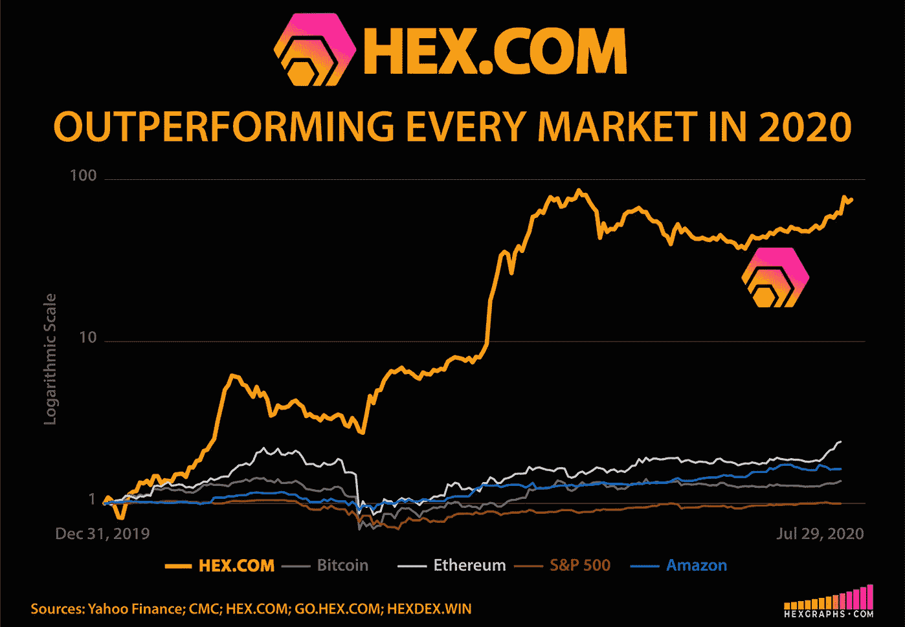
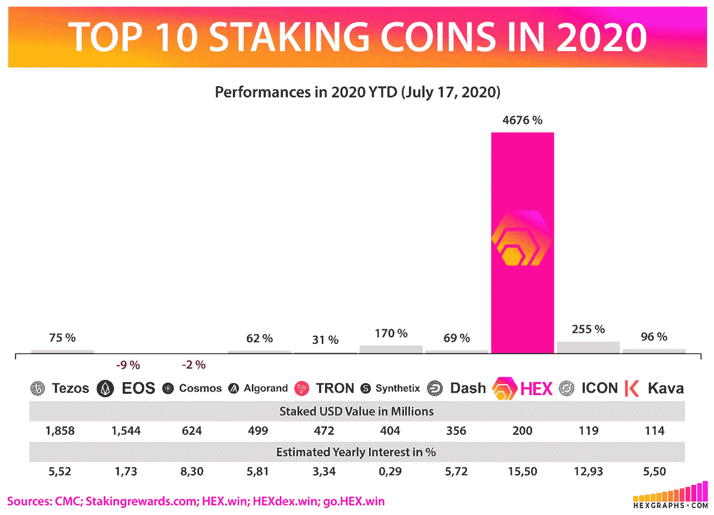

# 如果你在 2019 年 12 月 1 日持有比特币

> 原文：<https://medium.datadriveninvestor.com/if-you-held-bitcoin-on-december-1st-2019-75d05004c22b?source=collection_archive---------14----------------------->

## [第一笔高息区块链定期存款](https://www.youtube.com/watch?v=LHbGPfhn3D8) [HEX](https://hex.com/) 的创造者免费赠送给所有比特币持有者

# 【2019 年 12 月 1 日，一个非常特别的快照发生了，只留给比特币(BTC)持有者。

该快照使任何对其钱包进行数字签名的人都有一次免费申领 HEX 的机会，这是区块链第一张高息存款单。数字签名用于证明您拥有公共钱包的私钥，而无需暴露您的私钥。

> 大约 29 亿美元——246，528 BTC——在撰写本文时已经免费获得了他们的 HEX，可在 chain 上验证(见下面的参考资料)。

## 如何: [5 分钟步行视频。](https://www.youtube.com/watch?v=LHbGPfhn3D8)

> **更多免费增值:就像亚马逊或特斯拉一样，HEX 有一个简单的 1 层推荐系统。**

在这篇文章中没有引用链接，但是建议你使用别人的链接，因为你将会在你的免费申请中获得 10%的额外奖励。

# 这个免费的索赔工具和推荐系统仅在 2020 年 11 月 19 日之前有效。在 HEX.com 了解更多信息

参考

[https://hex.vision/goto/9c441a8b842f9240d623375f719c59e2](https://hex.vision/goto/9c441a8b842f9240d623375f719c59e2)

[https://hexgraphs.com/](https://hexgraphs.com/)

[https://learnmeabitcoin.com/beginners/digital_signatures](https://learnmeabitcoin.com/beginners/digital_signatures)

# 赌注十六进制&看它倍增

[桩工。App](https://staker.app/invite/PQn8) 让您安全可靠地在链上积累 100%的财富，并实时观察其增长:

