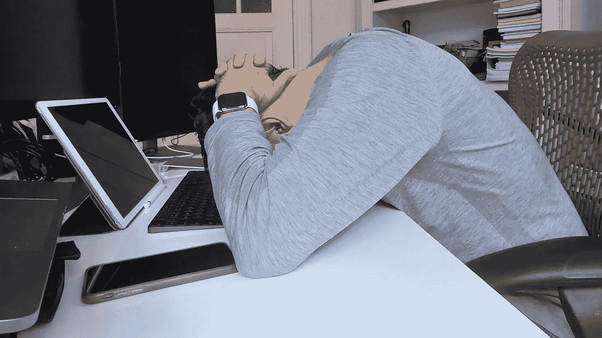

# 如果你想变得富有，就要学会处理那些无聊的事情

> 原文：<https://medium.datadriveninvestor.com/if-you-want-to-be-rich-learn-to-deal-with-the-boring-stuff-c8f42ecc2a93?source=collection_archive---------4----------------------->

## ***对我有效的三种策略***

Photo courtesy of author

成功人士和其他人的一个很大区别是成功人士知道如何处理“无聊的事情”

毫无疑问，每个人都必须处理枯燥的日常任务。无论一种生活方式从外表看起来多么迷人，总会有平凡的工作要做。

最近，我在 YouTube 上查看动作相机的评论，无意中发现了杰米·奥布莱恩的视频。杰米是一名“自由冲浪者”，追逐完美的海浪。以任何标准来衡量，他都成功了——在瓦胡岛北岸拥有一栋房子，一生都在冒险，拥有一个受欢迎的 YouTube 频道，令人兴奋的赞助商，拥有自己的商品。令人惊叹的 GoPro 图像展示了他生活中的成功和乐趣。

但让我难忘的是一个富有的、著名的世界级运动员在给他的冲浪板上蜡。这不是你马上会想到的图像的一部分。

这样的日常工作并不鼓舞人心。它经常会分散你的注意力，耗尽你的精力。

关键外卖？如果你想变得富有，你需要制定策略来处理无聊和例行公事。

 [## 数据分析如何为房地产金融提供信息|数据驱动的投资者

### 数据是 21 世纪的热门商品。因为它能够推动和通知几乎所有行业…

www.datadriveninvestor.com](https://www.datadriveninvestor.com/2020/07/02/how-data-analytics-can-inform-real-estate-finance/) 

# **照做，放弃，或者寻求帮助**

我看到太多的人用无聊的事情作为拖延的借口，而不是做更多的事情。

“要是我不必这么做就好了，我可以的。。."

或者，他们忙于寻找不做无聊事情的方法。这会分散他们的注意力。

那么，答案是什么？这里有三个对我有用的策略，“去做，放弃，或者寻求帮助。”

首先，不要浪费时间去想那些无聊的事情，或者让它太困扰你。快点结束吧。我经常发现做日常工作要容易得多。

但是，我不允许日常工作“吃掉”我一整天。所以，我为这样的任务预留时间。我通常在一天结束或会议间隙(或会议期间)感到疲劳时做这些事情。这就是我喜欢今天的在线会议的原因——你可以关掉相机，听对话，同时处理电子邮件和其他不令人兴奋的任务。

遵循这种方法，你会赢得很多。你将有更多的时间专注于富有成效和令人兴奋的事情。此外，你在处理日常任务时会变得更快。你变成了一个魔术师，一个时间大师。

第二个策略是放弃无聊的任务。你可以通过学会说“不”来做到这一点。这听起来比它简单——至少我必须学会它(而且我还在学习)。我倾向于对每件事都说好，然后再想办法处理。

这一策略在旧常态下运行良好。但在在家工作、少出差的新常态下，这似乎不再管用了。好像人变得越来越没有耐心，要求越来越高。因此，我正在重新学习如何对那些涉及大量日常工作的任务说不。

我做一个简单的成本收益分析，如果回报不占优势，我就说不。

当你有更多的时间，你可以建立新的收入来源:写作、创作、教学、积极投资、辅导等。然后你可以把一些额外的收入花在个人助理或者个人助理工具上。

寻求帮助——第三个策略——将再次带来更多的时间、更多做其他事情的自由和更多的收入来源。

# **它如何帮助我**

当我们想到成功和赚钱时，我们倾向于关注令人兴奋的事情。但我明白了，关键主要在于我们如何处理无聊的事情。

现在，我找到了解决日常事务的方法，我赚了更多的钱，更重要的是，我感到更加健康和快乐。

**访问专家视图—** [**订阅 DDI 英特尔**](https://datadriveninvestor.com/ddi-intel)