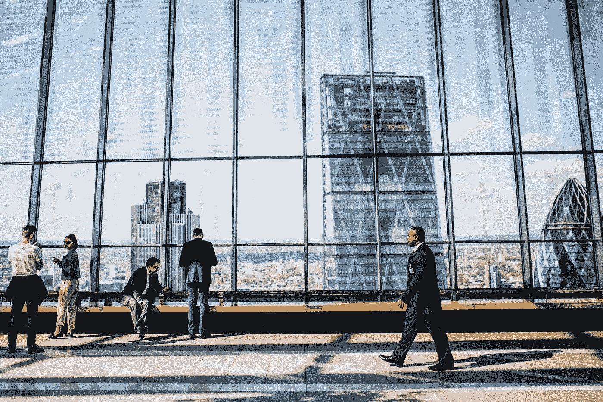

# 如果你想变得富有，就不要想着贫穷。

> 原文：<https://medium.datadriveninvestor.com/if-you-want-to-be-rich-stop-thinking-poor-5b8b1d210473?source=collection_archive---------7----------------------->

## 有钱人是如何看待金钱的？

From Pexel

你可能听过一个词，但是这个词没有任何意义。如果你一直告诉自己变富是不可能的，你就会留下来或者变穷。如果你把“不可能”这个词换成“我会”就更好了心态丰富的人从不认为一个想法或行动是不可能的，这就是他们富有的原因。如果你改变你的心态，为自己设定目标，你就可以变得富有。思考富有需要练习和时间，但最终，你会明白为什么它是值得的。

为什么给自己设定目标如此重要？假设你想设定一个目标，到年底存 1 万美元。你认为你会用糟糕的心态实现那个目标吗？想着你永远也赚不到一万美元。如果你觉得穷，你永远达不到这个目标。但是，如果你认为有钱，并且相信你能存下 10，000 美元，这就会发生。这是为什么呢？关键在于用好那两个字，“我会的。”如果你反复告诉自己，你将实现 10，000 美元的储蓄，那将是最好的。这样做，你就为一生的财务自由做好了准备。如果你相信自己，对自己的目标有信心，这将会有所帮助。

当你躺在床上的时候你在想什么？你会考虑歌词或者明天晚餐吃什么吗？不要那样做。每天晚上睡觉前。躺下来，在你的头脑中思考如何以及为什么你应该变得富有。记住你在想什么，每天晚上都重复，直到你在经济上实现了你想要的。这是你在财务上自我提升的另一个技巧。

你需要对自己有信心，相信信念是真实存在的。信仰是致富的主要原则之一。对你的目标和你想要达到的目标有信心。当你躺在床上思考你想要实现的目标时，确保你对此有信心。

最后，为了变得富有，你需要坚持不懈。你需要有那种动力和持续的动力。不要一个月存 400 美元，然后另一个月存 100 美元，这是不可持续的。坚持不懈就是不断地想要某样东西，并确保每天都能实现。我无法解释坚持到底有多重要。

使用这些技巧，我相信你可以变得富有和自由。但是，你需要每天遵循这些建议，并且完美地遵循它们。都在心态上，一旦你有了丰富的心态。你会变得富有。