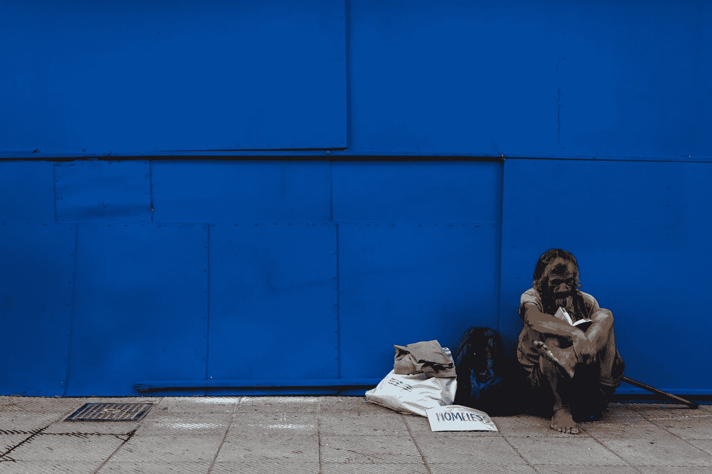
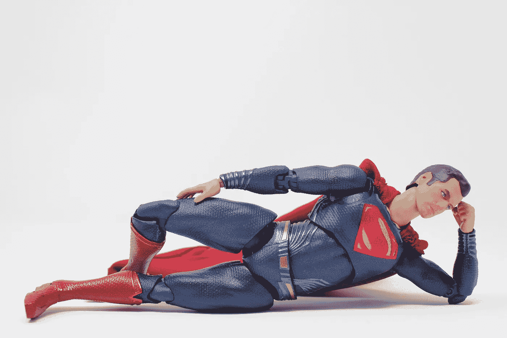
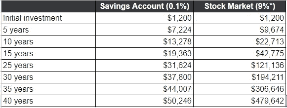

# 如果你想变得富有，你需要停止像穷人一样思考

> 原文：<https://medium.datadriveninvestor.com/if-you-want-to-be-rich-you-need-to-stop-thinking-like-a-poor-person-e4ee7c668682?source=collection_archive---------1----------------------->

Photo by [Jonathan Kho](https://unsplash.com/@halfbakedphotos?utm_source=unsplash&utm_medium=referral&utm_content=creditCopyText) on [Unsplash](https://unsplash.com/s/photos/homeless?utm_source=unsplash&utm_medium=referral&utm_content=creditCopyText)

## 大多数人从未学过的金钱课程

无论你认为是金钱让世界运转，还是它是万恶之源，很少有东西能像金钱那样激励人类。但是，在一个我们大多数人都渴望变得富有的世界里，大多数人的一生都停留在穷人的思维模式中，因为这是社会以及过时的教育体系教给他们的。

如果你买彩票中了 100 万美元，你最先买的三样东西会是什么？对大多数人来说，他们首先要买的东西是:

*   一栋房子
*   一辆汽车
*   假期

现在，想要好东西没有错。我梦想有一天拥有一辆 T2 T3。但是根据你购物的奢侈程度，你会很快发现你的 100 万美元很快就化为乌有。关于[彩票中奖者最终破产](https://finance.yahoo.com/news/23-lottery-winners-lost-millions-193539538.html?guccounter=1&guce_referrer=aHR0cHM6Ly93d3cuZ29vZ2xlLmNvbS8&guce_referrer_sig=AQAAADPAQVUPGAq6k-glyIx7rVdoqZqLO-KSgVYHfkfowP8WdRONClJbpo1zC2yi0_OELGwdqEOZTAPknk0ktAnulRoSeSYIsPiuIOkHq7Bc15nBRAWm8jaUuzJphC_n4Y-Q2POepJe7KfVMRjbGWA8ii7G-s3akjSu2CzJSlXFe8ZGm)或[职业运动员申请破产](https://vault.si.com/vault/2009/03/23/how-and-why-athletes-go-broke)的故事如此普遍，因为人们无法控制告诉他们*花钱、花钱、花钱的冲动*

# 拙劣的思维方式

我们被告知在学校取得好成绩的重要性，所以你可以得到一份好工作和高薪，这样你就可以在郊区买一栋漂亮的房子。这就是梦，或者说我们被告知如此。*努力工作，挣钱，花钱。*

Photo by [Morning Brew](https://unsplash.com/@morningbrew?utm_source=unsplash&utm_medium=referral&utm_content=creditCopyText) on [Unsplash](https://unsplash.com/s/photos/shopping?utm_source=unsplash&utm_medium=referral&utm_content=creditCopyText)

我们生活在一个消费主义的时代，你几乎可以用信用卡购买任何东西，80%的美国人都有某种形式的债务。我们被教导要工作来支付你的账单，然后试着存点钱，如果你能的话。但是随着越来越多的美国人无力支付 1000 美元的紧急费用，有些事情需要改变。

错误在于社会和教育系统。当我们离开学校的时候，我们知道了毕达哥拉斯定理、三角学，以及如何用土豆制作电池，但是我们对如何处理金钱却一点概念都没有。

Photo by [King Lip](https://unsplash.com/@king_lip?utm_source=unsplash&utm_medium=referral&utm_content=creditCopyText) on [Unsplash](https://unsplash.com/s/photos/superhero?utm_source=unsplash&utm_medium=referral&utm_content=creditCopyText)

但是不要害怕，超级乔恩就在这里，他带来了大多数人永远学不到的四个理财课程。

# 1)首先支付自己

这违背了这个世界教给你的一切。大多数人都是先花掉薪水，然后*再*存起来，如果月底还有剩余，那么通往财务自由的道路就不同了。

 [## 取贫济富的政策转变|数据驱动的投资者

### 我记得当我在乔治敦攻读经济学博士学位时，我的一个同学叫保罗·沃尔克…

www.datadriveninvestor.com](https://www.datadriveninvestor.com/2020/09/02/a-policy-shift-that-takes-from-the-poor-and-gives-to-the-rich/) 

就像如果你停止还款，你的抵押贷款公司就会开始敲门一样，你需要**把自己当成最重要的债权人。你和你家人的财务前景应该是你最重要的责任，但除非你首先支付自己，否则永远不会。**

算出你每月的收入和支出，然后算出你能存多少钱，同时还能支付你的账单。**然后坚持下去**。发薪日设置自动转账，你就连看都没看到。即使只有 25 或 50 美元，你首先支付给自己的事实意味着在月底你的口袋里有 25 或 50 美元。如果你不得不牺牲你每天 5 美元的拿铁咖啡或每月 60 美元的健身房会员资格，你从来没有用过吗？就这样吧。

**先给自己发工资**，然后把剩下的花掉。

# 2)不在于赚多少，而在于留多少

如果你问人们为什么努力存钱，大多数答案会是，“因为我挣得不够多。”但是从来没有人说过，“我花了太多的钱”，是吗？对我们大多数人来说，这是诚实的答案，也是问题的根源。

想象两个人，让我们称他们为迈克和詹姆斯:

*   迈克一年挣 25 万美元。詹姆斯一年挣 10 万美元。
*   迈克享受生活中的美好事物，每年他几乎花掉他全部 25 万美元的年薪。他一年最多存 5000 美元。
*   詹姆斯设法控制他的开支，他每年把他 10 万美元薪水的三分之一存起来。

假设他们的情况保持不变，五年后两人谁更富有？

不在于赚多少，而在于留多少。

# 3)早期投资，经常投资

我写了很多关于投资的文章，并且花了更多的时间研究它。我十六岁开始工作；如果我对投资有着和今天一样的理解，我现在早就退休了。不相信我？那我给你介绍一下[复利的神奇。](https://www.fool.com/knowledge-center/compound-interest.aspx)

 [## 股票市场投资的简单事实

### 你能做的最好的投资可能是最无聊的投资

medium.com](https://medium.com/datadriveninvestor/the-simple-truth-about-stock-market-investing-7ce6d1c12bad) 

复利是你的钱产生利息的过程，*也是*产生利息。听起来很无聊，对吧？让我们把它变得更有趣一点*。*

想象一下，你手头有 1200 美元，但不知道该怎么花。你听说你可以在股票市场获得不错的回报，但是你的邻居告诉你他曾经在投资上损失了钱，并建议你避开。你把钱存入储蓄账户，利息为 0.1%。你每月额外存入 100 美元，一年总计 1200 美元。让我们看看四十年后发生了什么。

Screenshot property of the author.

**基于股票市场的历史回报率*

印象深刻吧。达到这个数目所需要的只是一笔相对较小的初始投资，然后是每月 100 美元的存款。这听起来很简单，因为它*就是*那么简单。

时间是你最宝贵的资产之一。好好利用它，你就能为自己的财务自由做好准备。玩玩这个[计算器](http://www.calcxml.com/calculators/interest-calculator?skn=606&r=1)，看看你需要什么才能让一个百万富翁退休。如果你开始得足够早，这是很有可能实现的。

**早投资，勤投资**

# 4)了解你拥有什么——资产和负债的区别

罗伯特·t·清崎在他的畅销书《富爸爸，穷爸爸》中讨论了富人、穷人和中产阶级之间的差异。他写道:

> “富人获得资产。穷人和中产阶级获得了他们认为是资产的负债。“一个资产把钱放进我的口袋。一项负债从我的口袋里掏出了钱**罗伯特·t·清崎**

**你经常听到人们说他们的房子是他们最大的资产。现实恰恰相反。除非你已经完全还清了抵押贷款，否则你的房子每个月都会从你的口袋里掏钱，使它成为一种负债，而不是资产。如果你购买第二处房产，通过它你可以获得租金收入，这将是一项资产，因为它把钱放进了你的口袋。**

**类似地，购买全新汽车的人经常把它们称为资产，但我们都知道，如果你花 50，000 美元买了一辆车，当你把它开回家时，它的价值会减少，当你拥有它一年时，它的价值会减少大约 40%。**

****知道你拥有什么**，记住:资产把钱**放进**你的口袋，负债再把它**拿出**。**

# **心态的转变**

**获得财富的途径不仅仅是把钱存入银行或投资账户，并希望变得富有。这需要思维方式的重大转变。这需要你抛弃穷人的“挣钱，花钱”的思维定势，我们都被灌输了这种思维定势。它要求你透过一个镜头来看待你赚的每一美元，并想象它能提供的可能性。请记住:**

*   **首先支付你自己**
*   **不在于你挣多少，而在于你留多少**
*   **早期投资，经常投资**
*   **了解你拥有什么——资产和负债的区别**

**真正掌握金钱的力量所需要的课程比我在一篇博文中所能描述的要多得多。但是记住这四条经验并付诸实践，你就已经在通往财务自由的漫长道路上迈出了第一步。**

**如果您喜欢这篇文章，您可能也会喜欢:**

** [## 一个简单的五步无债策略

### 隧道的尽头有一盏灯

medium.com](https://medium.com/the-post-grad-survival-guide/a-simple-5-step-strategy-to-becoming-debt-free-f78c42e08b62)  [## 这是你没有存款的真正原因

### 没人愿意面对的丑陋事实

jonpeterswrites.medium.com](https://jonpeterswrites.medium.com/heres-the-real-reason-you-have-no-savings-88cb3fc3e59e) 

[*注册我的邮件列表，直接接收我的内容——前 100 名订阅者将免费收到一本我即将推出的电子书！*](http://eepurl.com/hFYCnf)

**访问专家视图—** [**订阅 DDI 英特尔**](https://datadriveninvestor.com/ddi-intel)**