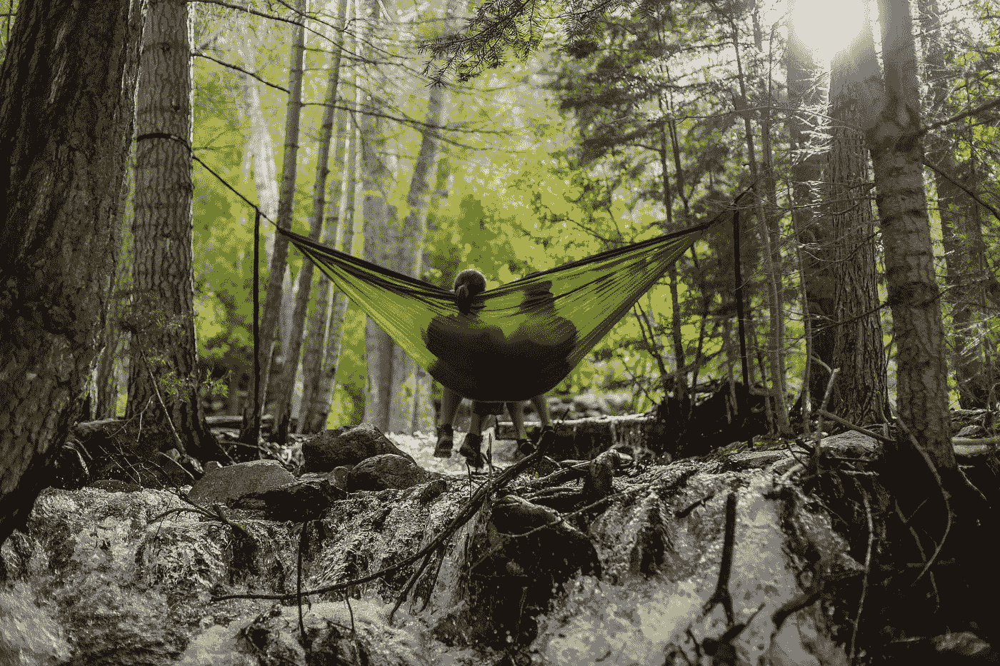

# 如果你想感觉活着，就要学会多休息

> 原文：<https://medium.datadriveninvestor.com/if-you-want-to-feel-alive-you-need-to-learn-to-rest-more-f19adcff239?source=collection_archive---------34----------------------->

## 每天做一些纯粹为了乐趣的事情

Photo by [Spring Fed Images](https://unsplash.com/@spring_fed_images?utm_source=medium&utm_medium=referral) on [Unsplash](https://unsplash.com?utm_source=medium&utm_medium=referral)

记得好玩吗？

没有吗？我不怪你。

毕竟，一旦我们成年，没有什么告诉我们要放松，或者玩得更多。没人告诉我们去*找点乐子*。

相反，所有迹象都指向工作时间更长，做得“更多”，达到更高的目标，并更努力地鞭策自己。

随着年龄的增长，我们倾向于承担更多的责任，每天要“处理”的事情也越来越多。每个人和他们的狗对我们都有期望，我们一直尽力满足每一个要求，这样我们就不会让任何人失望，这样每个人都喜欢我们，这样我们就不会被解雇。

我们一直试图将*挤出更多的*到我们的一天中，这通常意味着*减少*其他的事情——比如真正重要的事情。

# 你忙碌的生活方式最终会影响到你

在我的成长过程中，我看着父亲不断尝试做更多的事情。

他似乎总是在试图打败时钟，陷入一场永无止境的时间赛跑中。他会带着杂货在暴风雨中穿过门，在创纪录的时间内狼吞虎咽地吃晚饭，匆忙去他的房间做好准备，然后冲出门外，这一切在我看来好像只有五分钟的时间。就好像如果他做每件事都足够快，他会被授予某种奖章。

他的生活经常看起来像一部名为“*再来一次”*的电视剧:晚上或在车上再打一个电话，再去一个约会，再写一份邀约，再归档一份文件，再有一个陌生人打电话问他什么时候回家。

从各方面来看，我的父亲是大家所说的“成功人士”在他的房地产办公室里，他经常是最棒的经纪人和最赚钱的人，赢得多个奖项，甚至在他的职业生涯中拥有自己的办公室。似乎他总是其他特工寻求帮助和建议的人。他们尊敬他，因此他是一个非常忙碌的人。

但随着时间的推移，我亲眼目睹了持续压力和忙碌的生活方式会给一个人带来什么，这可能是一条非常危险的旅行之路。

# **很容易在别人的要求中迷失自己**

老实说，我想我继承了这种做更多、更多、更多事情的动力，但这是我多年来一直在努力解决的问题。

经常不知道什么时候该退出，容易陷入加班加点，在这个过程中对自己和自己的需求失去了所有的感觉。我把所有的注意力都放在工作上，并且相信工作应该是第一位的，而且是最重要的。

我发现自己在不应该有人工作的荒谬时间发送电子邮件，也推迟了对我来说重要的个人项目，转而去检查我的工作清单上的更多项目。

但是过去的一年让我明白，这不是幸福生活的方式，我永远不会在这种生活方式中找到满足感。

把工作和其他人的需求放在第一位一直是我身体和精神健康的噩梦，我终于开始意识到塔玛拉·莱维特的话的真实性:

> “在这个快节奏的世界中，我们希望变得活跃和富有成效，但要实现生产力，更不用说平衡和满足，我们需要从现代生活的压力中解脱出来。慢性压力会导致一系列严重的健康问题，所以为了应对它的影响，我们必须腾出时间参加纯粹有趣、放松和有益的活动。”

# 压力可以成为优秀的老师

对许多人来说，2020 年是压力极大的一年。我们中的一些人直接受到了疫情的影响，生病、失业或遭受经济损失，但我认为我们都在某种程度上受到了不太明显的影响，比如我们的心理健康。

突然的(看似持续的)变化导致了不确定性和恐惧，以及巨大的压力。

我一直在说，尽管世界因为新冠肺炎[而“慢了下来”，但我感到比我生命中任何时候都更不舒服。我的压力水平飙升，我的大脑成了恐惧、消极、厄运和悲观思想循环的大中枢站，我的整体健康受到了巨大的打击。](https://allison-burney.medium.com/what-ive-learned-from-one-of-the-busiest-years-of-my-life-937a6242104f)

我感觉完全被这种不确定的状态困住了，就像被困在一个冰冻的冰块里。

这是痛苦和压倒性的，但也是一个很好的教训，告诉我照顾自己的重要性，并为那些带给我好感觉和帮助我恢复精力的事情腾出时间。

> **我终于明白了休息和工作一样重要——如果不是更重要的话。**

# 为你的一天安排纯粹的享受

考虑到这一点，新的一年到目前为止，我一直在学习优先考虑那些让我感觉完整、快乐、充满活力、对生活充满激情的事情。

我一直专注于每天首先为自己做的事情，比如我的晨间例行公事(冥想、阅读等)。)和写作。我也在学习在工作中为自己设定更好的界限，并像对待一份真正的工作一样对待我的工作(即使我没有具体的工作时间或典型的时间表)。

我和我的伴侣一直在做一些小的调整，以建立一个我们都喜欢的、实际上对我们都有效的晚间惯例。我们又开始一起做饭，尝试新的食谱，每晚散步，分享我们的一天，睡觉前看一两集我们当前的网飞系列。

> “我们经常忽视这些活动，因为我们带着内疚和自我判断看待自我培养，但是当我们不花时间恢复活力时，我们的能量水平就会下降。所以确保在你忙碌的一天中安排纯粹的享受。”
> —塔玛拉·莱维特

我见过当给自己腾出时间放松不是首要任务时会发生什么，我不喜欢这种感觉，也不喜欢我成为的那种人。

# **给自己休息的礼物**

所以，我要改变这一切。

当 Aaron 下班回家时，我正在学习关闭我的电脑，这标志着我自己工作日的结束，因为即使我主要在家工作，我仍然可以从日常工作中受益。我在训练我的大脑进入“工作模式”,反复向它显示我的电脑在我的办公室里，我在那个房间里做我所有的工作，而不是在房子的任何地方，无论白天还是晚上。

围绕着*确定*在哪里和*什么时候*我可以工作已经改变了我的生活，尽管只有几个星期，安排“我”的时间从工作中解脱出来，享受简单的事情，比如一场表演或在大自然中散步。

> 有时候，一整天中最重要的事情是我们在两次深呼吸之间的休息— Etty Hillesum

给自己休息的礼物。

这可能是你能做的最有成效的事情。