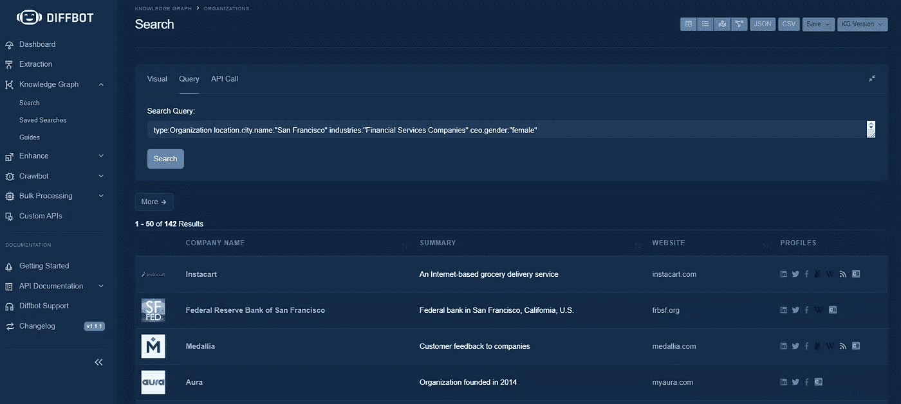

# 如果你在这 8 种环境下工作，你需要了解知识图表

> 原文：<https://medium.datadriveninvestor.com/if-you-work-in-these-8-settings-you-need-to-know-about-knowledge-graphs-c72872b882f4?source=collection_archive---------10----------------------->

知识图表开始获得一些关注。2020 年，Gartner 将知识图表[置于其炒作周期的顶峰](https://allegrograph.com/gartner-hype-cycle-for-ai-knowledge-graphs/)。虽然应该避免对每一种被炒作的技术都采取行动，但知识即服务行业已经从达斯和 IAAS 那里学到了一些东西。也就是说，与其构建一个单一的数据结构，不如将知识图表构建到[知识工作流](https://blog.diffbot.com/from-knowledge-graphs-to-knowledge-workflows/)中，帮助为特定行业中的特定角色提供数据和上下文。针对特定个人的单调和知识收集的自动化是一个足够好的目标。并且可以共同改变我们的工作生活。

完全披露:我在 [Diffbot](https://www.diffbot.com) 工作，它是世界上最大的知识图谱的开发者。也就是说，这让我对创新知识图在一系列行业中的应用有了深入的了解，我将在下面分享。

**不确定什么是知识图？知识图表就像关系优先的数据库。它们由节点(通常称为实体)和边(基本上是关系)组成。根据实体的类型，可以附加不同类型的事实和关系。例如，文章实体可以具有主题标签、情感、作者和出版商。同时，一个组织实体可能有雇员、子公司、行业、新闻报道等等。实体类型之间的这种相互联系允许公司地理、人口统计、产品和以新闻为中心的信息的丰富的可查询景观。**

A Diffbot knowledge graph query returning all organization entities located in San Francisco within financial services that have a CEO who is female

知识图表可能来源于内部数据。但是最大的知识图表利用外部数据源，比如新闻，或者——在 Diffbot 的情况下——整个公共网络。

使用领域专业知识(对于较小的 kg)或 NLP、机器视觉和 AI(对于较大的知识图)，知识图将非结构化数据转化为信息+上下文(知识)。

# 8 种工作环境，KGs 在其中大开杀戒

**电子商务**通过两种方式得到知识图的帮助**。**当您想到电子商务时，可能不会想到非结构化数据。有大量来自主要卖家的信息。如果你是一个电子商务品牌，你应该有很多关于个人在你的网站上做什么的信号。但是电子商务不仅仅是关于内部数据。知识图表有助于弥补这一点。

历史上完全不同的数据网可以用 KG 带入上下文中。这包括公众认知数据(评论数据和情绪)、品牌提及、新闻监测和竞争对手的市场情报，以及全球定价和可用性数据。

以知识为中心的工作流在电子商务中扼杀 it 的第二种方式是通过在线构建特定的非结构化数据存储的形式。例如，您可能想要一个几乎实时的 50 个竞争域名的 web 摘录。或者，您可能希望在自己的网站上构建数据，以确定重复产品、欺诈产品，或者以可用的上下文链接格式获取评论数据。

在金融领域，我们开始看到知识图表变得越来越普遍。这有几个原因。组织实体的结构化性质允许金融公司和投资者查询而不是“搜索”公共 web 数据。对于具有广泛层面、数据来源和长尾组织覆盖的知识图来说，这是一个游戏改变者。

知识图可以链接多种数据类型的事实可以允许类似于“显示 X 行业中所有在 z 城市有办公室的市值大于 Y 的公司”或“显示加拿大所有员工少于 100 人且发展迅速的家庭承包商”的查询或者，“给我看一下福特员工的技能分类……然后和特斯拉的做比较。”

第二个用例是新闻数据的形式，这些数据被预先标记为给定的主题或带有某种情绪，并附加到某个组织或个人。无论是在人工市场研究中，还是在以编程方式消费的新闻报道中，都没有像最大的知识图表那样全面的新闻提要。

**销售**是一个直接构建到工作流程中的有效数据丰富和探索性分析的绝佳环境。我们经常看到知识图数据在销售中用于两个目的。首先，查找一个组织(或一组组织)的工作流程，然后挖掘以确定它们是否适合推广。虽然销售专业人员需要的大部分信息都可以在网上公开获得，但手动获取这些信息是不可伸缩的。具有长尾结构化组织数据的知识图可以让您快速调查整个行业或位置，然后挖掘到单个组织的概况。

例如，使用知识图表，您可以获得一个组织内职位的汇总视图。你可以看看技能组合或者技术组合。你也可以看看融资的速度、正面的新闻提及或其他许多信号。同样，虽然您可以手动执行这些任务，但也可以自己解析非结构化数据。乏味程度的降低和潜在客户发现速度的提高让销售团队能够专注于他们应该关注的事情。

其次，一旦你的 CRM 中已经有了个人，通过知识图表丰富数据可以快速充实你的个人资料，包括技能，教育，新闻报道和联系信息。随着时间的推移，重新激活 CRM 数据可以节省无数的手动时间、错误的线索、重复的数据，并提供可重复操作的信息。

**公关**专业人士有一系列媒体监控工具可供选择。但是，大多数新闻聚合或跟踪工具在将组织或个人链接到某个提及时，都不会超出字符串匹配的范围。采用 NLP 或机器视觉的知识图可以有计划地将组织或人与新闻提及配对。在 Diffbot 或 GDELT 的知识图表的情况下，新闻监测数据也涵盖了每一种主要语言的文章。这避免了大多数搜索引擎强加的一种语言一种语言的筒仓。此外，以前结构化数据格式的非结构化文章允许对情感、发言者进行解析，并提取重要的事实或实体。

**营销**知识图表的用例适合销售和公共关系之间的某个地方。基于账户的营销与丰富的公司数据配合得很好。知识图表可以提供行业代码、对组织发展中的关键事件的访问以及对员工档案的链接，这些知识图表可以导致质量细分、个性化以及验证您正在与正确的受众交谈。

在 Martech 内部，不断增长的无代码或低代码运动使营销人员能够将知识图数据直接与他们每天用于外联、自动发送电子邮件和广告支出的工具联系起来。

**数据科学**在为各种应用构建公共网络数据(通过网络抓取)方面有着悠久的历史。通过 API 提供信息的网络来源知识图的一种方式是，知识图基本上可以是每个没有 API 的站点的 API。

由于数据的规模和结构，知识图对数据科学团队特别有用。毕竟，大部分数据科学生命周期都是由简单的寻找和争论数据组成的。此外，虽然知识图可以在非结构化数据的基础上提供一些额外的处理(例如，向文章添加情感评分)，但它们也可以提供数据来源和对事实来源的一瞥。这对于挖掘有趣的趋势或者“检查”你的分析是非常有用的。

**制造业**依赖于一系列复杂的监管、供应链和人才招聘问题，这些问题都可以通过知识图数据得到帮助。我们看到的与制造相关的知识图的用例包括监控长尾监管机构的公告，以及监控与关键材料生产或供应链问题相关的新闻提及。将情绪与围绕材料、市场或竞争对手的文章配对，可以为制造业中的许多潜在问题撒下一张大网。

对于包含地缘政治事件、组织和/或个人的知识图，这些类型之间的关联数据可用于跟踪竞争或合作伙伴。

**人力资源**可以像销售一样利用知识图表，找到他们可能试图招募的关键人物。此外，在竞争行业的技能分布中保持领先地位可能有助于人力资源专业人员抢先应对人才短缺。对于包含个人教育数据的知识图表，可以跟踪来自著名项目的群组，并可以识别新的潜在人才管道。