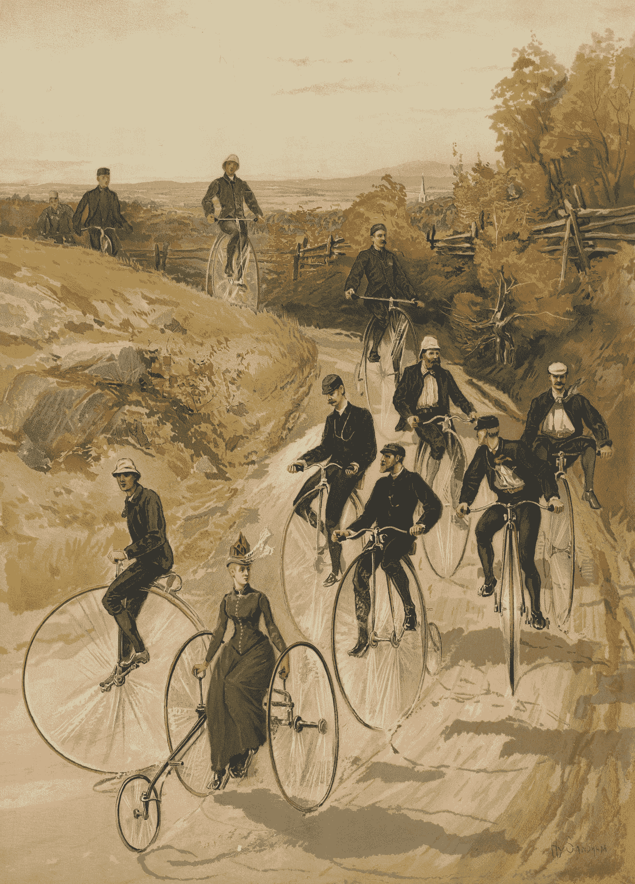

# 如果你的公司破产了，不要责怪新冠肺炎。

> 原文：<https://medium.datadriveninvestor.com/if-your-company-goes-bankrupt-dont-blame-covid-19-35e735af2c74?source=collection_archive---------12----------------------->

Photo by [Micheile Henderson](https://unsplash.com/@micheile?utm_source=medium&utm_medium=referral) on [Unsplash](https://unsplash.com?utm_source=medium&utm_medium=referral)

## 可能是你很愚蠢，做了错误的决定。或者不是。

*警告，咆哮来临。但我要带着它去一个深思熟虑的地方。嗯，算是吧。我想。*

“由于新冠肺炎…”

该死的。如果我再一次被搁置的时候听到这种空洞的、无脑的、愚蠢的、无休止的开场白，我就犯了*哈里·基瑞。*

就好像我们不知道一样，首先(*虽然政府等人肯定不知道，但愿他们咳出一条通往地狱的路*)。然后，真正成熟的是，现在地球上服务差、培训差、商业行为差的每一个原因似乎都归咎于 Covid。

不，是毒品。在很多情况下，Covid 剥去了你的假木鞋柜的清漆，现在我们可以看到它的刨花板。最重要的是它正在腐烂。

从当地医疗机构强加给人们的磕磕绊绊、笨手笨脚、尴尬可笑的流程(这些医疗机构很少或根本没有施加社交距离)到这个星球上最糟糕的等待时间，我们这些顾客看到了服务是多么平庸。可能一直都是。因为那些一开始就不知道自己在做什么的人不可能靠着椅子去找鲍勃，而鲍勃*知道他在做什么，他过去常常整天坐在你旁边，做你的工作和他自己的工作。*

没有鲍勃吗？现在我们知道你是个白痴。

另一方面，你的明星员工，那些你没有毫不客气地解雇的人，因为看，Covid，完全不知所措，因为他们中的许多人都在做四个人的工作，因为你解雇了这么多人，因为，嗯，Covid。

作为对我今天做的一篇文章的回应，

 [## 如何真正惹恼你的顾客的逐步指南

### 并在此过程中伤害你最好的员工

medium.com](https://medium.com/datadriveninvestor/the-step-by-step-guide-to-really-annoying-your-customers-4dd4067ddba4) 

吉姆·罗伊写了一个非常能说明这一点的故事，我得到了他的允许，可以全文分享。我做了一些非常小的编辑，但没有改变故事:

...我昨天刚刚经历了类似的事情。

我孙子自行车的后轮胎瘪了。需要一根新管子。应该没什么大不了的。

大波士顿地区最大的自行车店恰好位于两个城镇之外，离家不到五英里。所以我查了他们的网站。他们说我可以在网上购物，然后在路边买。完美！

但是他们的网站上没有列出任何管道。网站上确实写着“我们的商店里有上千种网站上没有的商品！没看到需要的就打电话给我们！”

所以我打电话。我得到了一个关于他们对 COVID 的反应的可爱的五分钟纲要，以及在他们的网站上购买他们提供的数千种商品中的任何一种是多么容易。然后系统终于切换过来，把我连接到当地的商店。我得到另一条消息说，虽然商店是开放的， ***他们太忙了，他们不能在这个时候接电话。当我挂断电话时，它以一句“您可以随时使用我们的网站在线购物…”结束。***

那好吧。第二击！

反正下午晚些时候我也要走那条路。我会顺路去拿该死的管子。果然，昨天下午两点我把车停在了他们的停车场。我从卡车里出来，戴上面具，走向门口。

门上有一个标志，上面写着由于 COVID，它们不对公众开放，如果我需要什么，我可以随时通过他们的网站订购…

*我最终去了附近的一家拖拉机用品店，买了一套管道补丁包，回家后从亚马逊订购了一个管道。我猜当地的自行车店不想要我的生意。他们将来不会得到它。(作者加粗)*

 [## 金融犯罪、合规和新冠肺炎|数据驱动型投资者

### 非法行为者利用全球经济紧张的脆弱性和供应链中断造成的…

www.datadriveninvestor.com](https://www.datadriveninvestor.com/2020/08/20/financial-crimes-compliance-and-covid-19/) 

## 伙计们，如果你对你的顾客这么不关心，那么你就不需要经营一家企业。你需要找一份收发室的工作。

Photo by [Bernard Hermant](https://unsplash.com/@bernardhermant?utm_source=medium&utm_medium=referral) on [Unsplash](https://unsplash.com?utm_source=medium&utm_medium=referral)

如果我向我所有的读者要一个这样的故事，我的电脑会崩溃。

我们正处于一个分水岭时刻，要找出到底有多少人在经营着不应该存在于商业中的机构。当人们在没有头盔的情况下遭受了太多的脑震荡时，他们在掌舵。

这是《福布斯》的一篇文章，指出了谁从 Covid 中受益:

 [## 哪些公司在冠状病毒疫情期间表现良好？

### 总的来说，新冠肺炎疫情对美国经济产生了毁灭性的影响，打击了小企业…

www.forbes.com](https://www.forbes.com/sites/rohitarora/2020/06/30/which-companies-did-well-during-the-coronavirus-pandemic/#1e3f61f27409) 

这些是显而易见的。然而，你不必为了避免破产而从事啤酒行业。

# 你只需要考虑人们需要什么，如何让他们容易得到它，并安全方便地支付。

最重要的是，还没有人这样做，请考虑一下这样一个事实，整个国家已经厌倦了等待一个小时或更长时间来与一个无能，无聊，愤怒的代表说话，他的孩子在尖叫，他的狗在吠叫，她不知道山姆·希尔给了一只蝾螈来帮助你解决你的问题。

"T20 您的来电对我们很重要"

以下是我们的集体回应:

**去你的长时间等待，去你的训练不足、过度劳累、筋疲力尽、嚼着泡泡糖的销售代表**

雇佣 3000 多万需要工作的人。训练他们。付给他们体面的工资。缩短等待时间。因为我们会记住谁失败了，当我们在某个时候重新强大起来时，我们会用我们的脚和大大缩水的钱包说话。

最后，要有简单的常识，设身处地为客户着想。

*像吉姆的故事，如上。*

怎么会？简单地问自己，*如果我是自己公司的客户，我会有什么样的体验*？

这是和你的公司玩 [*卧底老板*](https://en.wikipedia.org/wiki/Undercover_Boss_(American_TV_series)) 的最佳时机。优秀的人通过参加那个节目学到了至关重要的、拯救生命和公司的课程。他们发现他们雇佣了谁(谢谢)以及谁在向他们购买(谢谢)。你不会避开可怕的事实而得到那种信息。

对于很多人来说，Covid 是一个正确的绵羊蘸在可怕的真相。

Photo by [Judith Prins](https://unsplash.com/@judithprins?utm_source=medium&utm_medium=referral) on [Unsplash](https://unsplash.com?utm_source=medium&utm_medium=referral)

因此，伙计们，不管你是拥有一家自行车店、一家啤酒店还是波音公司，现在就去了解一下作为一名顾客是什么样的吧。并找出什么是被围攻的客户服务代表。我不是没有怜悯，而是没有耐心。对于那些不投资帮助这些人建立某种合理的时间表、专业设备、体面的工作时间和足够的代表以便他们可以在换尿布的间隙呼吸的公司来说，善意地说，他们是白痴。

我可以说亚马逊，但我不会说。随便说说。*白痴*。(好心的他确实想出了如何让人们得到他们想要的东西，只要你不把他的一线员工算在内，但那是另一篇文章了)。

*克汀病。*

我刚才说了吗？

试着打电话进来。试着联系某人。在你的手臂进入睡眠状态后，试着给那个人一个典型的问题。看看会发生什么。如果你害怕了，亲爱的，起来解决它。随便说说。因为隔离是一个很好的时间来找出你的公司基础的裂缝，或大或小，宏观或微观。

你不能要求更好的反馈。

吉姆的故事很经典。只是，经典。我不知道谁没有发生过这种事情。想谈谈新常态吗？这是它看起来的一部分。

当你停止将人们货币化，开始将他们作为员工和顾客的体验人性化时，你可能会学到一些东西，就像那些更好的卧底老板一样。他们得到了英雄般的待遇。为什么我们要给那些做了我们应该做的事情的人颁发英雄勋章呢？

但这只是我。

就我而言，我正在看那些关于谁保护了工作的故事(例如，VF 公司在全球有 5 万名员工，没有解雇任何人。亲切地。你能说领导力吗？)在 Covid 成为说时机未到的借口的时候，谁在继续推动 D&I 目标。(VF 也在这么做。)

# 没错。

我正在看那些大大小小的公司重新调整产品线以帮助拯救生命的故事。有人同情吗？是的，他们当然在赚钱。为了继续做生意，你不得不这么做，但是当你考虑到在空中重新装备的巨大成本时，这个论点对我来说就站不住脚了。但这只是我的看法。

我看到那些公司公开发表愚蠢的 BLM 支持声明来获得公关，但却没有勇气将公关付诸行动。有太多的方法可以做到这一点，我没有空间一一列举。

从定义上来说，过渡是一个最好的时间，一个完全混乱的时间，让我们认真审视什么是行不通的，什么是血腥的。好吧。*开始修理它。*

想要一些想法吗？请看这个:

 [## 这就是新冠肺炎如何能永远改变工作世界的方法

### 沃顿商学院教授亚当·格兰特谈论新冠肺炎·疫情对职场的影响…

www.weforum.or](https://www.weforum.org/agenda/2020/04/here-s-how-coronavirus-has-changed-the-world-of-work-covid19-adam-grant/) 

所以我看这个，我寻找那些致力于做好工作的人，关心他们的员工，专注于修复他们公司和社会中的问题，尽最大努力倾听和回应他们的客户。

他们赢得了我的生意。

其余的人，吉姆和我，我想还有很多其他人，正在散步去别的地方修理我们的自行车。

Photo by [Library of Congress](https://unsplash.com/@libraryofcongress?utm_source=medium&utm_medium=referral) on [Unsplash](https://unsplash.com?utm_source=medium&utm_medium=referral)

**访问专家视图—** [**订阅 DDI 英特尔**](https://datadriveninvestor.com/ddi-intel)