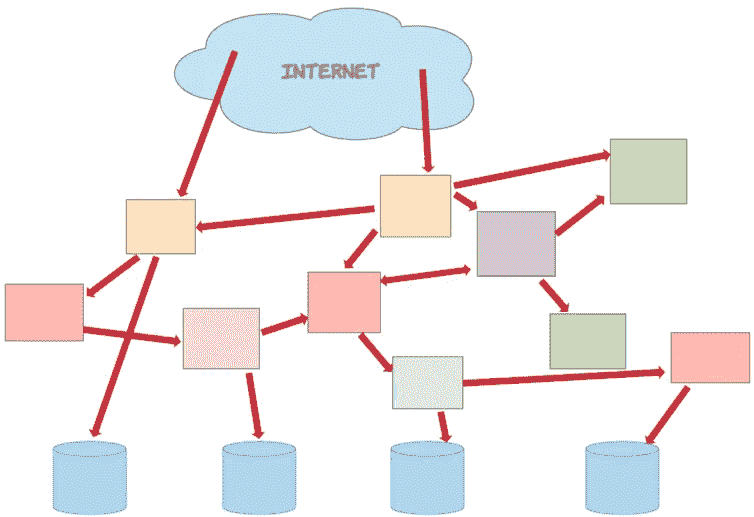
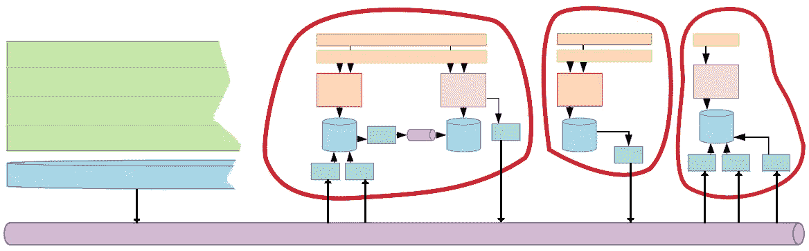

# 如果您正在构建微服务，您需要理解什么是有界上下文

> 原文：<https://medium.datadriveninvestor.com/if-youre-building-microservices-you-need-to-understand-what-a-bounded-context-is-30cbe51d5085?source=collection_archive---------0----------------------->

# 这种设计模式与组织团队和软件架构一样重要

Photo by [National Cancer Institute](https://unsplash.com/@nci?utm_source=medium&utm_medium=referral) on [Unsplash](https://unsplash.com?utm_source=medium&utm_medium=referral)

微服务采用的增长导致一些以前被忽视的软件设计模式重新流行起来。许多这些模式都是从 Eric Evans 的 [*领域驱动设计*](https://domainlanguage.com/ddd/) 中挖掘出来的，这本书不仅讲述了软件架构，也讲述了团队结构。

在这些模式中，*有界上下文*可能是理解起来最重要的。作为工程师，我们已经开始将有界上下文视为一种软件架构设计模式。但那是因为我们从它最初的用法中吸收了一点。正如 Evans 所使用的，有界环境既是一种技术模式，也是一种组织模式。

这就是为什么我开始将有界上下文模式视为理解微服务的关键。不仅仅是如何构建它们，而是我们最初为什么要构建它们，以及它们如何使我们的组织更加成功。如果我们理解什么是有界上下文——如果我们在技术上和组织上都采用有界上下文思维方式——那么我们就能真正成功地构建我们的微服务架构。

# 为什么要转向微服务？

首先，让我们做一个小练习。问自己这个问题:*我们当初为什么要建立微服务？*

花点时间想一想。首先想到的好处是什么？我们应该希望解决的主要问题是什么？记下一些答案，只是为了让自己保持诚实。

…

你有你的答案吗？很好。读给你自己听。达到标准技术效益了吗？持续交付、可伸缩性、多语言环境、容器和云，以及所有这些好东西？太好了。

 [## 数据科学和软件工程哪个更有前途？数据驱动的投资者

### 大约一个月前，当我坐在咖啡馆里为一个客户开发网站时，我发现了这个女人…

www.datadriveninvestor.com](https://www.datadriveninvestor.com/2019/01/23/which-is-more-promising-data-science-or-software-engineering/) 

但是，您的首要回答中是否包括了让您的组织更高效地运营的任何内容？应该的。因为构建微服务不是为了实现技术优势。实际上，这是为了获得组织利益。其他的都是实现细节。

# 单片=耦合代码和耦合团队

随着我们的巨石变得越来越大，生产率开始下降。至少有两个主要原因。

## 给我们的速度踩刹车

首先，每个工程团队都在为一个巨大的代码库做贡献。因此，团队面临着他们的代码与其他人的代码发生冲突的可能性越来越大。为了帮助减轻这可能导致的潜在问题，我们制定了程序——代码冻结、QA 测试周期、发布序列等。——*字面上设计*来*降低我们的生产力*。

当然，这些过程阻碍了特性和改进的及时部署。它们还严重破坏了工程师专注于团队优先事项的能力。如果在测试期间发现了一个 bug，负责的团队必须转换上下文并专注于解决这个 bug。如果在产品中发现了一个严重的 bug，团队不仅要修复这个 bug，还要克服重重困难，让它在下一个发布系列中部署。

随叫随到变成了无用功。如果我们的庞然大物出了问题，需要有人——无论白天黑夜——来解决问题。但是谁呢？拥有大型独石的大型组织通常面临两种选择:

*   一个事件管理团队，其在组织内唯一的、可悲的、令人遗憾的工作是对其他工程师的代码引起的问题做出响应，并找出如何解决它们。
*   一个轮流待命的时间表，每周某个任意的工程师被分配去负责解决问题，这些问题很可能是由其他工程团队中的其他工程师编写的代码引起的。

## (错误)组织我们的团队

巨石以另一种方式扰乱了我们的组织。我们整个组织都在开发同一个大型产品。但是我们仍然需要将组织分成易于管理的团队。因此，我们倾向于通过职能角色来寻找团队边界:

不幸的是，这种组织结构限制了协同工作。而不是一起工作来解决手头的真正问题(例如*我们如何设计、构建和维护特性 X？*)不同职能领域的成员只是专注于他们自己的部分，比喻当他们完成工作时，将工作扔出围栏。协作和协同的潜力——团队努力的综合质量远远超过单个团队成员的总和——丧失了。

它也充满了瓶颈。当我们按职能领域组织我们的团队时，我们自然会在优先级上有偏差。假设产品管理团队决定我们的 monolith 的结账流程需要改进。他们将安排时间与设计团队一起制作一些模型。在某个时候，模拟将被完成并交给前端团队来实现。当然，前端团队将需要 API 由后端团队实现，所以它们将被阻塞，直到完成。一旦后端团队确定了新的结账服务的工作优先级，就会发现需要数据库管理(DBA)团队的帮助。当然，它有自己的优先权。因此后端团队将被阻塞，直到一个 DBA 被释放。

在某种程度上，这种组织结构看起来有点像设计糟糕、过度耦合的软件架构……不是吗？

# 微服务=分离的代码，分离的团队

相比之下，微服务架构支持团队自治。组建一个独立的团队变得容易多了，这个团队可以有效地一起工作，并且不会因为依赖其他团队而经常受阻。

团队可以完全掌控他们的工作，从设计到开发再到部署。每个成员都分担实现团队目标的责任，因此他们会受到激励而不仅仅是参与“他们的部分”。我曾与产品经理、设计师、前端、后端和移动工程师一起设计产品功能的团队合作，产生了比一个人更好的结果。

一旦他们被部署到生产中，团队就获得了对他们自己的工件的责任。这通常会产生更高质量的代码，更容易排除故障。这是为什么呢？与 monolith 不同，团队倾向于对他们拥有的微服务有一个整体的看法。因此，团队可以更容易地预测问题，在问题出现时添加良好的日志记录和度量来解决问题，并正确使用弹性模式(例如重试、断路器和回退等)来帮助避免问题。

此外，由于团队对他们的工作拥有完全的所有权，保持他们的服务健康并在生产中运行就变得不那么像噩梦般的发布时间表，而更像是培育他们的创造。

最后，团队在相同的时间表上朝着相同的目标努力。这意味着，当一个人在等待另一个职能部门的人腾出位置时，他们不再受到阻碍。

## 我们需要有意识地对待自治

但是，我们不能简单地通过将我们的整体分成微服务来免费获得这些好处。让我们来看看我们对微服务架构的第一个天真的看法:

如果我们像大多数工程师一样，我们对微服务架构的最初想法是，嗯，一堆微服务。每一个都公开了某种 API(也许是 ReST ),以允许任何其他服务从中读取和写入。

随着经验的积累，我们了解到并非所有的微服务都服务于相同的目的，或者至少它们不应该服务于相同的目的。因此，就像我们的整体结构是分层排列的一样，我们也排列我们的微服务:

至此，我们已经定义了我们想要构建的不同类型的微服务和应用。太好了。但是在团队自治方面我们还是没有太大的进步。每个微服务都需要归某个团队所有。所以问题来了:*哪些*团队将拥有*哪些*微服务？

# 跨职能团队

我们第一个天真的方法可能是通过模仿我们的 monolith 组织结构来组织我们的团队:

在这里，我们看到按职能组织的团队(紫色):UX 设计、前端工程、后端工程、数据工程师、数据库管理员、质量保证等。

这可能感觉是对的，至少最初是这样。但是，让我们后退一步，看看我们试图向客户提供的价值。我们的目标是为客户打造如下产品吗？

*   一堆数据库模式
*   一堆用户界面模型
*   一堆能和一个 MySQL 数据库对话的微服务？

不完全是。这些只是我们用来为客户创造价值的工具。我们为客户/用户提供的实际价值体现在特性和功能上，例如:

*   要搜索的产品目录
*   将商品放入购物车并随后购买的机制
*   提醒顾客购买状态的通知系统

同样，我们也不想按职能领域来组织我们的团队。相反，我们应该根据团队为客户创造的价值来定义我们的团队；也就是跨职能，在 [*跨职能团队*](https://en.wikipedia.org/wiki/Cross-functional_team) 中。

在跨职能团队中，每个人从头到尾都在一起工作来构建一个特定的产品或功能。团队中的每个人都有相同的目标和优先级，所以没有一个功能区域被另一个功能区域所阻碍。新的后端 API 服务需要一些数据库设计工作吗？罚款；团队的后端工程师和 DBA 可以一起确定工作的优先级。

最好的情况是，跨职能团队鼓励成员在项目的每个阶段进行协作。每个团队成员都对功能的整体设计做出贡献。前端、后端和移动工程师共同定义 API 契约。每个人都测试。每个人都开始精通自己特定的领域。

因此，我们的团队结构可能看起来像这样:

那更好。但还是感觉有些不对劲。

当然，我们已经组建了团队，可能会更有效地拥有产品。但是我们仍然采用自上而下的方法来确定我们组织打算构建的微服务的拓扑结构。我们只剩下一大堆相互依赖的微服务，其中大部分是耦合在一起的。我们只是简单地把他们分配到不同的团队去建造。

这导致了如下问题:

*   我们如何创建能够满足任何客户当前和未来需求的 API？当我们的任何服务可能被任何其他团队的服务调用时，我们能封装我们的数据吗？
*   我们会浪费多少时间去等待*其他*团队实现*我们的*依赖项？
*   我们系统的哪些故障可能是由其他系统的故障引起的(级联故障)？
*   我们能控制我们的服务可能涉及的呼叫数量吗？我们能确保我们的组织不会在服务之间创建无限的同步调用，导致天文数字的响应时间，或者更糟(是的，我见过这种情况)的跨服务的无限递归调用吗？
*   如果我们团队的特定功能或问题空间不太适合预先规划的微服务拓扑，该怎么办？

我们还需要一种不同的思维方式。也许已经有一种模式可供我们遵循？

# 进入有界上下文

有界上下文是源于领域驱动设计(DDD)的关键设计模式。理解有界的上下文有助于我们组成自治的团队，并通过扩展，形成自治的微服务架构。

DDD 本身描述了一种软件开发的方法，在这种方法中，组织内的个人一起工作来定义一种通用语言。在他的书[领域驱动设计](https://domainlanguage.com/ddd/)中，Eric Evans 经常描述工程师与产品所有者一起工作，建立一个一致同意的词汇来描述诸如*产品*、产品的*组件*、产品可以执行的*动作*、部分*工作流*等。这个词汇表包含了组织的*领域*。

然而，在许多大型组织中，定义单一、一致的词汇表变得不可行。在这些情况下，我们将我们的域分成*子域*。子域的例子可能包括:

*   存货管理
*   产品发现
*   订单管理
*   购物车和收银台

当设计师、工程师、产品经理等聚集在一起构建一个子域时，他们形成了自己思考和谈论子域及其组件的方式。

这就是 DDD 遇到跨职能团队结构的地方。虽然团队成员来自不同的职能领域，但他们负责自己的子领域，最终成为常驻专家。此外，该团队负责确定需要哪些构件(微服务、web 应用程序、移动应用程序、数据库和相关基础设施)来为组织的客户带来生机。

我们可以认为团队及其工件组成了一个*有界的上下文*。

## 定义有界上下文

虽然 Evans 在他的书中经常讨论有界上下文，但他并没有明确定义这种模式。所以我试着在这里做:

> ***有界语境:***
> 
> 一个**内部一致的系统**，具有精心设计的**边界**，调解什么可以**进入**系统，什么可以**退出**系统。

换句话说，有界上下文代表一个*上下文*——本质上是一个封装了协作组件的系统——具有明确定义的*边界*,控制什么可以进入系统，什么可以退出系统。

细胞(那些共同构成所有生物的小东西)提供了一个很好的类比。细胞内有各种各样的成分(细胞核、核糖体、细胞质、细胞骨架等)，它们都被包裹在细胞内。然而，每个细胞周围都有一层膜，作为细胞内部和机体其他部分之间的屏障。细胞膜保护细胞免受环境影响，允许特定的营养物质进入细胞，并允许各种副产品离开。

同样，有界上下文包含各种组件(微服务、web 应用、移动应用、数据库、消息队列等)。它还充当封装这些组件的逻辑屏障。*在内部*，组件可以耦合，并可以自由地相互传递数据。但是有界上下文有助于在外部实施松散耦合，定义明确的点:

*   *外部*数据可以*进入*(可能通过消费者订阅一个卡夫卡主题)
*   *内部*数据可以*退出*(可能通过另一个 Kafka 主题，或者通过精心设计的 GET API，以隐藏任何内部系统细节)

有界的上下文也代表了它的跨职能团队。该团队由各种团队成员组成(设计师、前端/后端/移动工程师、产品经理、数据工程师和 QA 工程师等)。在内部，这些成员为了相同的一致目标而合作。此外，这些团队成员是(或者应该是)封装的，因此他们对其他团队的依赖最小。

因此，我们不是从*组织级别*开始，定义我们期望构建的所有应用和微服务，而是围绕我们的*子域*构建团队，允许这些团队发展他们的子域，并定义需要构建的内容。如果处理得当，我们倾向于将组织中的各种有界环境视为有机增长，而不是僵化的、预定义的结构。

# 打破整体的影响

[康威定律](https://en.wikipedia.org/wiki/Conway%27s_law)告诉我们，组织设计模仿他们组织的通信结构的软件系统。这通常被证明是正确的，所以当我们开始构建微服务时，我们应该考虑如何构建我们的组织。

事实上，到现在为止，一幅画面应该已经浮现在你的脑海中。当我们从 monolith 转向微服务时，我们应该开始纵向思考(按子域划分 monolith)而不是横向思考(按功能层划分 monolith)。

We should be dividing things not like we do on the left, but as we do on the right

换句话说，我们不应该从用数据微服务替换 monolith 的数据访问层开始。相反，我们应该从分离出一个完整的功能开始(比如结帐过程，或者产品搜索)。每个特征将代表一个有界的上下文。每一项都将由一个专门的跨职能团队来完成。

此外，团队应该专注于他们手头任务，也就是:

*   忠实地复制现有的功能，
*   或者(更好地)为客户建立全新的、改进的体验。

作为过程的一部分，团队应该设计最适合这项工作的系统。

例如，我们可能决定将我们的*产品搜索*功能从我们的 monolith 中剥离出来。产品搜索团队最终可能会设计一个包括以下内容的系统:

*   卡夫卡的消费者即收听若干*外部*卡夫卡的话题来更新它自己的内部记录系统(SoR)的产品。
*   一个卡夫卡出版商，他将 SoR 的变化推送到*内部*卡夫卡主题上
*   另一个 Kafka 消费者收听内部话题并更新弹性搜索索引
*   查询弹性搜索的自由形式搜索的 GraphQL 端点
*   通过 ID 检索单个产品的 ReST 端点
*   重新设计的 web 应用程序，使用这些端点允许客户搜索产品和浏览产品详细信息
*   我们的移动应用中使用这些端点的一组类似的屏幕
*   一个 Kafka 发布者，它将代表客户执行的不同查询的消息推送到外部 Kafka 主题，以供任何其他可能感兴趣的有界上下文(比如，分析)使用

What the design of our Product-Search Bounded Context, encapsulated in red, might look like

当我们开始剥离我们整体上越来越多的垂直部分时，其他团队构建了他们自己的有界上下文。这些有界的上下文可能最终看起来彼此非常不同。

Each team determines how to best build solve its task at hand

注意，给定有界上下文中的组件*可能是紧密耦合的；然而，我们保持我们的有界上下文*彼此分离*。在我们的例子中，有界上下文之间的任何通信都是通过 Kafka 消息队列传递消息来实现的。重要的是，我们避免了有界上下文之间的同步请求/响应调用。*

这也适用于残存的巨石。我们当然不希望我们的新微服务和我们的传统整体服务之间紧密耦合。因此，当我们剥离整块石头的一部分时，我们利用消息传递来允许剩余部分与我们新的有界上下文进行通信。

# 对所有这些脱钩的现实检查

在这一点上，我们可能会问自己是否真的有可能保持我们的有界上下文解耦。

在现实世界中，我们真的能保护我们的团队免受外部依赖吗？永远不会出现一个团队必须被另一个团队阻止才能完成工作的情况吗？

我们真的可以为我们的子域创建与其他子域完全解耦的服务架构吗？一个有界上下文中的应用程序真的不需要同步调用另一个上下文中的服务吗？

实际上，保持我们的有界上下文 100%解耦是不可能的。但是我们可以接近，比我们大多数人想象的要接近得多。

# 现实生活中的建筑

让我们从了解去耦架构开始。我们经常陷入这样一种谬论，即任何给定类型的数据都应该存在于一个位置，任何其他系统都必须直接调用那个位置来访问数据。

我们称之为给我们的数据分配一个*单一来源的真相* ( *SSoT* )。但是正如在这篇剖析 SSoTs 的文章中所描述的，这个概念基本上是反模式的。相反，大多数有界上下文应该存储它们需要使用的任何数据的本地副本。

这可以通过上一节中我们的产品搜索有界上下文来说明。当然，这种有限的上下文很大程度上依赖于我们组织的产品目录数据。但是很有可能，数据是在不同的有界上下文中生成的(我们称之为 *Product-Entry* 有界上下文)。

我们的第一种(幼稚的)方法可能是从产品条目绑定的上下文中公开一个 ReST API，并强制产品搜索绑定的上下文中的服务调用该 API。但是我们可以做得更好。相反，我们可以通过将产品入口服务所做的更改发布到 Kafka 上来保持系统的解耦。然后，我们的产品搜索 Kafka 消费者会收到这些信息，并更新产品搜索数据库。

注意，这两个有界的上下文是[最终一致的](https://en.wikipedia.org/wiki/Eventual_consistency)。这意味着在短暂的时间内，产品输入和产品搜索之间的给定数据可能不一致。例如，如果白色袋熊小部件的价格从 1.99 美元提高到 2.49 美元，那么在两个有界上下文中，白色袋熊小部件的价格将会有一个短暂的时间间隔(如果不是毫秒的话，通常是几秒钟的时间间隔)相差 50 美元。

这导致了现实世界中的情况，我们别无选择，只能耦合有界的上下文。在某些情况下，最终的一致性是不可接受的。例如，在顾客完成他们的在线购买之前，我们可能需要确保他们购物车中的每一件商品在那一刻都是可用的。即使这样，我们通常也可以最小化两个有界上下文之间的耦合。

我们的交互可能看起来像这样:

*   当客户使用产品搜索 UI 查找产品时，产品搜索数据库用于检索信息(如款式、客户评论、价格等)。)关于产品
*   即使顾客开始结账，我们*仍然使用产品搜索数据库*来检索需要显示的信息。
*   最后，当客户点击最后的“完成购买”按钮时，我们对产品条目绑定的上下文进行一个*单次同步调用*，以在完成购买之前验证商品的可用性。

另一个需要即时一致性的常见例子与授权有关。在许多系统中，每个请求都必须检索或验证安全令牌。在这些情况下，我们可能需要允许我们的有界上下文调用另一个面向安全的有界上下文。

# 真实的组织结构

独立的、跨职能的团队怎么样？他们在现实世界中的可能性有多大？

事实上，这是一个不断走向完全自力更生的团队的过程。我们的团队很少能达到 100%的自主性。但是，如果我们开始明智地组织我们的团队，并识别和响应出现的瓶颈，我们就可以接近。

首先，我们应该最大化垂直的、跨职能的团队，最小化水平的、单一职能的团队。这意味着抵制组建所谓“核心”团队的冲动——其任务是构建由其他面向产品的团队消费的公共数据服务——而是围绕他们将提供的商业价值组建我们的团队。

许多组织悄悄地向这个目标前进，首先组建面向领域的产品经理团队，以及前端和后端工程师。这是一个开始。但是这些团队还应该包括谁呢？对于不同需求的不同团队，确切的成员可能会有所不同。但是我们应该考虑这样的事情:

*   如果我们的团队有前端工程师，那么他们应该和致力于该领域的图形设计师密切合作。
*   移动工程师——通常被隔离在组织中他们自己的区域——应该被包含在具有移动组件的域中。
*   在她发人深省的[关于数据网格](https://martinfowler.com/articles/data-monolith-to-mesh.html)的文章中，扎马克·德格哈尼哀叹道[的数据工程师经常被排除在跨职能团队](https://martinfowler.com/articles/data-monolith-to-mesh.html#DomainDataCross-functionalTeams)之外——这对数据工程师和跨职能团队本身都不利。

一旦我们确定了团队的成员，我们就应该注意瓶颈。有没有其他团队习惯性地阻碍我们跨职能团队的生产力？

例如，许多组织都有专门的安全团队。这当然是一个好的做法；组织需要一个有凝聚力的安全策略，以及一种确保对该策略进行治理的方法。然而，对于团队来说，在不同的阶段停止他们的工作以允许对他们的工作进行安全审查也是很常见的。即使在最好的情况下，这也为我们的团队设置了障碍，这是一种常规的商业惯例。此外，这通常会导致团队不得不放弃全部或部分工作并重新开始，因为他们发现了尚未满足的安全需求。

这显然是一种难闻的气味。但是，我们如何在允许团队保持自治和高效的同时，加强我们组织的安全标准呢？

我们可以通过在跨职能团队中增加安全工程师来做到这一点。我们可以采取三种方法:

*   如果我们足够幸运，拥有一个相对较大的安全团队，我们可以为每个跨职能团队分配一名全职安全工程师。
*   对于较小的安全团队，每个 SE 可以以兼职方式**分配到多个跨职能团队**。这仍然允许 se 理解团队的目标和设计，并与团队一起在整个过程中遵守组织的安全标准。
*   如果我们没有足够的安全资源，我们可以反其道而行之。我们可以**将跨职能团队*的成员带到*安全团队**，而不是将安全团队*的成员带到*我们的跨职能团队。每个跨职能团队将指定一名或两名安全代表。这些代表将定期会见安保人员，并随时了解本组织的安保要求和标准。他们自己可能不是安全专家。但是他们将能够充当安全工程师的角色，确保他们的团队遵守组织的安全实践。

## 行会

这与另一种越来越流行的组织模式相吻合: [*行会*](https://medium.com/webcom-engineering-and-product/agile-guilds-the-yodle-way-47dc00f6cd3a) 。公会模式是从跨职能团队模式中诞生的。就其本质而言，这些团队由擅长不同职能的成员组成。然而，专门从事某项工作的人聚在一起通常也是有意义的；例如，要:

*   磨练他们的技能，互相学习
*   发现并建立针对其特定职能的最佳实践
*   根据职能，制定公司标准和要求

我们上一个安全解决方案有效地形成了一个“安全公会”。团队成员主要与他们的垂直团队一起工作；但是，他们中的一些人会定期与安全“协会”会面，讨论组织的安全实践和标准。

公会模型在软件架构方面也表现得特别好。特别是对于微服务架构，需要某种级别的组织范围的技术治理。然而，让一群架构师坐在隐喻的象牙塔中，向团队分发规则，通常会适得其反。相反，来自我们跨职能团队的高级/首席工程师可以定期在一个架构公会中会面。在那里，他们可以从他们的团队中提出问题，制定解决方案，并建立模式和标准。

Examples of vertical cross-functional teams, supplemented by horizontal guilds

公会也可以扩展到几乎所有其他功能。毕竟，我们希望我们的设计师开发一个通用的 UI 风格指南，并以此为基础工作。我们希望我们的前端工程师使用相同的 UI 元素。QA 工程师应该与我们组织中的测试方式保持一致。产品经理应该与组织的整体产品路线图保持同步。

# 把所有的东西放在一起

转向微服务可以显著提高我们团队的生产力。但我们需要了解如何利用微服务架构来实现这一目标。在所有与微服务相关的设计模式和概念中，有界上下文可以说是给我们这种理解的最重要的一个。

通过对有界环境的牢固掌握，我们理解:

*   我们的组织结构和技术架构密切相关
*   我们面向产品的团队应该对其他团队有最小的依赖，就像他们构建的系统应该与其他系统分离一样

总的来说，接受有限的环境会让我们有一种心态，即我们需要成功地使用我们的微服务架构。在开始您的微服务之旅之前，请确保您了解这一重要模式！

# 参考

*   [有界上下文](https://martinfowler.com/bliki/BoundedContext.html)
*   [如何从单一数据湖转移到分布式数据网](https://martinfowler.com/articles/data-monolith-to-mesh.html)
*   [一种新的敏捷行会模式](https://medium.com/webcom-engineering-and-product/agile-guilds-the-yodle-way-47dc00f6cd3a)
*   [康威定律](https://en.wikipedia.org/wiki/Conway%27s_law)

觉得这个故事有用？想多读点？只需[在此订阅](https://dt-23597.medium.com/subscribe)即可将我的最新故事直接发送到您的收件箱。

你也可以支持我和我的写作——并获得无限数量的故事——通过今天[成为媒体会员](https://dt-23597.medium.com/membership)。