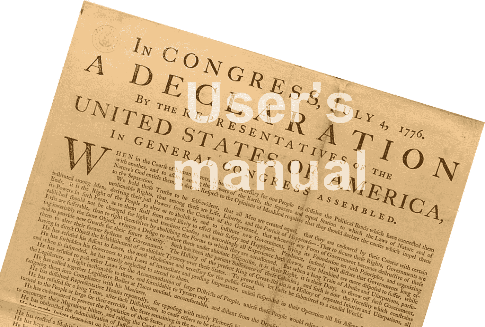

# 忽略特朗普

> 原文：<https://medium.datadriveninvestor.com/ignore-trump-dc57f2d4ae1f?source=collection_archive---------12----------------------->

通常，7 月 4 日是烧烤或逃离城市的日子。随着第一轮新冠肺炎摇摆尾巴，我们现在在聚会或去海滩之前会三思而行。随着社交活动的减少，我们有时间反思当前的政治状况。巧合的是，我们国家需要它。

我职业生涯的一部分是解决技术问题。很多次，技术人员带着他们无法解决的挑战从现场打电话给我。他们告诉我，突然之间，电子设备开始表现不稳定。物理学的基本规则，如欧姆定律，似乎不再起作用了。在打电话给我之前，这些技术人员已经尝试了一些不起作用的魔术。我的第一个建议总是一样的:阅读手册。在尝试任何修复之前，首先需要了解事物应该如何工作。需要什么条件？我们很少发现设备有缺陷；最常见的解释是使用时的人为错误。

我们可以用同样的方法来看待美国今天面临的问题。244 年前启动的政治体系，尽管存在结构性缺陷，如奴隶制和有限的投票权，但在那个时期的前半期运行良好。美国从第一次世界大战中脱颖而出，成为无可争议的世界领袖。当时，禁酒令是一个大错误。随之而来的是大萧条。直到今天，科学家和专家们对它是否可以避免仍有分歧。就在最近，我们无法避免 2008 年的衰退。我们只是变得更加富有同情心，慷慨地赊账，以减轻它对美国人的毁灭性影响。当新冠肺炎发现我们对一场不可避免但可预见的灾难准备不足时，我们现在也在做同样的事情。

大约一百年前发生了什么让美国失去了动力？最初是什么让美国变得伟大？我所说的伟大，并不是指以今天的标准来看接近完美。我说的伟大，是指比当时世界上任何人都成功。

政治家和媒体人士有快速的答案，但如果他们的想法是正确的，事情就会井井有条，也就不需要这个专栏了。我写这篇文章是因为悲观情绪来自媒体和个人对话。俗话说，在美国一切皆有可能。新的口号似乎是，在美国再也没有什么事情是正确的了。发生了什么事？

如果我们想采取故障排除者的方法，我们需要先查看手册。我们需要看看 1776 年的想法，以找出为什么事情不像它们应该的那样运作。

在 1776 年之前，对大多数人来说，政治权力来自自上而下是不言而喻的。掌握权力的是国王、贵族或神职人员。他们制定了法律。他们告诉其余的人做什么和怎么做。没有他们，群众就像没有父母指导和保护的孩子。《独立宣言》颠覆了这种思维的逻辑。它说，这是“不言而喻的，人人生而平等，造物主赋予他们某些不可剥夺的权利，其中包括生命权、自由权和追求幸福的权利。”这个想法的新颖之处在于，政府“从被统治者的同意中获得正当的权力。”准确地说，这个概念并不全新。这类似于古希腊城邦的民主，而波兰人已经不完善地实践了大约四个世纪。

如果我们能把 1776 年革命的领导人之一带入我们当前的政治动荡，他们会说什么？我猜他们会批评我们对唐纳德·特朗普的关注。他们会告诉我们，他们给了我们一个政治制度，在这个制度下，我们有个人自由，可以按照我们喜欢的方式处理我们的事务，而不用政府官员告诉我们该做什么。他们会对我们对特朗普的执着感到惊讶。在媒体和个人谈话中，每个人都在谈论特朗普没有资格当总统。

Photo by [Jose M.](https://unsplash.com/@vote4jose) from [Unsplush](https://unsplash.com/photos/w0eMOcfV2MQ)

具有 1776 年思维模式的人会告诉我们，他们引入了制衡制度，以防特朗普这样的人成为总统。他们会对我们说，在过去，臣民们虔诚地看着统治者，认为他们代表了国家的精华。现在，我们有了一位代表了半个国家的总统——那些投票支持他的人。另一半人哀叹我们没有一个好国王，一个从 1776 年来的人会带着傻笑告诉我们。

他们会告诉我们忽略特朗普，专注于美利坚合众国。当记者再次泄露特朗普的推文或荒谬的声明时，他们会要求我们关掉新闻。里面没有新闻。他们会向我们指出，那些经常被特朗普贬低的 CNN 记者除了他们的受虐狂之外，没有什么可报道的。他们会建议我们不要读约翰博尔顿(John Bolton)的书，因为可笑的是，一个华盛顿内部人士可能需要在白宫呆上 17 个月才能意识到情况有多糟糕。他们会希望我们在史蒂芬·科拜尔与特朗普较量时关掉电视，因为对特朗普开玩笑不是喜剧；这是虐待狂。

他们会要求我们克服对特朗普的施虐受虐狂困扰，专注于重要的事情，比如美利坚合众国。他们会斥责我们，说我们太专注于我们反对的东西，却不互相交流，寻找可以团结我们的目标。

他们会提醒我们“共和国”这个词来自拉丁语 [*res publica*](https://en.wikipedia.org/wiki/Republic) ，意思是我们的东西。他们会质问我们，为什么我们不采取行动，而几十年来，我们显然一直处于精英之间的僵局。他们会问我们为什么要追随那些告诉我们另一方是错的专家。渴望通过攫取更多政治权力来战胜对手，却不愿意通过辩论的力量击败对手的权威人士。他们会提醒我们，媒体本应是政府的非正式第四部门，但它却成了巨大鸿沟的延伸和放大。我们看不到它，也不采取行动，这将超出他们的理解。

最后，一位 1776 年革命的领导人会不相信地听着，当他被告知今天当面临困难时，美国人的第一反应是寻求政府的帮助。对他们来说，美国的伟大不在于政府做了什么，而在于美国人在没有政府参与的情况下做了什么。他们会注意到，就在大约 60 年前，美国总统可能会说，“不要问你的国家能为你做些什么，而要问你能为你的国家做些什么。”今天，没有一个政治家能在这种平台上当选。

不幸的是，在 1776 年写的手册中没有一个政府随心所欲地给它的臣民提供好吃的东西。它是为思想自由的人而写的，而不是为没有政府持续支持和指导就无能为力的农奴而写的。一个从 1776 年的美国来的人会告诉我们，我们所有问题的共同点是我们采取了农奴的心态。美国没有发挥其应有的作用，因为 1776 年撰写的用户指南认为美国永远不会有农奴。

*原载于 2020 年 7 月 2 日 https://www.datadriveninvestor.com***。**