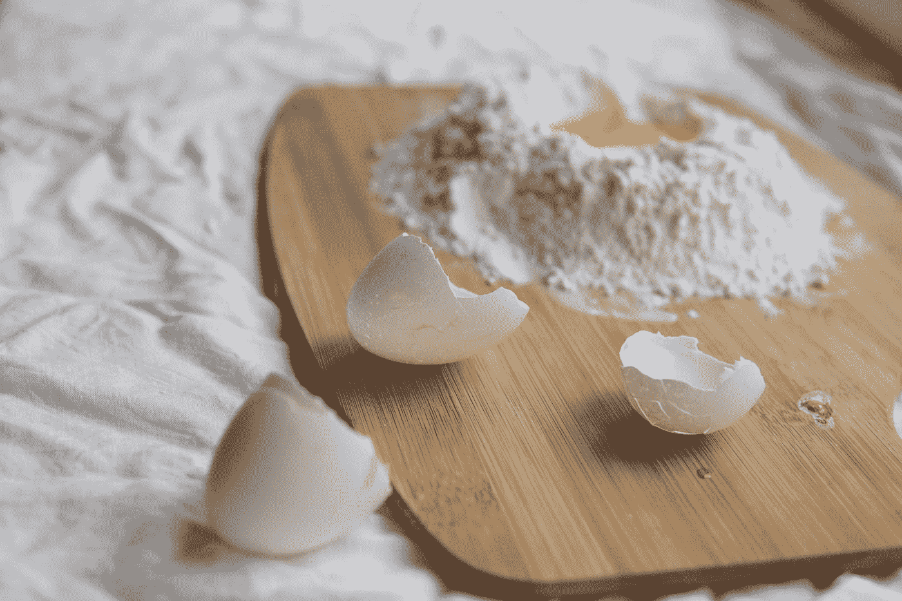

# 宜家和速溶蛋糕粉:为什么我们应该重视努力而不是方便

> 原文：<https://medium.datadriveninvestor.com/ikea-instant-cake-mix-why-we-should-value-effort-over-convenience-4b35f066f771?source=collection_archive---------2----------------------->

## 宜家和速溶蛋糕粉如何证明便利并非一切。

Photo by [Oleg Laptev](https://unsplash.com/@snowshade?utm_source=medium&utm_medium=referral) on [Unsplash](https://unsplash.com?utm_source=medium&utm_medium=referral)

关于美国食品公司通用磨坊(General Mills)有一则轶事，大概是这样的:

据说，在 1950 年，通用磨坊认定其品牌速食蛋糕粉(贝蒂·克罗克)表现不佳。为了提高销售额，通用磨坊公司寻求心理学家迪希特的帮助，这位消费者行为专家被誉为“动机研究之父”。

Dichter 在进行了深入的市场调查后(也许这并不奇怪，因为他在 1983 年被提名为市场调查委员会的年度风云人物)，得出的结论是蛋糕混合配方必须改变。他建议通用磨坊将鸡蛋粉从混合物中移除，代之以添加新鲜鸡蛋的说明。

这条简单的建议看起来一定非常矛盾——破坏了速食蛋糕的主要目标。然而，Dichter(如果他真的是这个奇怪建议的来源)似乎是对的:创造一个真正的*即时*蛋糕混合使烘焙过程变得太容易。

Photo by [Elle Hughes](https://unsplash.com/@eatdrinksiesta?utm_source=medium&utm_medium=referral) on [Unsplash](https://unsplash.com?utm_source=medium&utm_medium=referral)

狄克特认为，通过增加面包师的工作量，通用磨坊会让面包师拥有更大的所有权，并对他/她的劳动成果有更大的自豪感。半个多世纪后，迪希特最简单的建议似乎仍然是正确的。

如果这个故事看起来好得令人难以置信，那可能是因为[它是](https://www.snopes.com/fact-check/something-eggstra/)。然而，一个更现代的例子也证明了基本原则——个人劳动和技能的价值(而不仅仅是最终结果)很重要。

[2011 年《消费者心理学杂志》发表的一项研究](https://onlinelibrary.wiley.com/doi/abs/10.1016/j.jcps.2011.08.002)发现，仅仅组装一个宜家盒子就能让参与者更喜欢自己的作品。这种价值提升的感觉也转化为更大的购买意愿，以保留该物品(在一定程度上)。

这种效应可以归因于一种被称为“努力正当化”的现象。当一个人牺牲时间和努力去实现一个目标时，他会比不需要太多努力的人更看重这个成就。

Photo by [Semen Borisov](https://unsplash.com/@devsnice?utm_source=medium&utm_medium=referral) on [Unsplash](https://unsplash.com?utm_source=medium&utm_medium=referral)

努力的合理性与“禀赋效应”密切相关，后者认为简单地拥有一件物品就能增加其感知价值。因此，可以想象，仅仅花时间制作一件宜家家具就能产生对产品的个人依恋，从而让我们更加珍视它。

速溶蛋糕粉和宜家家具可以给公司和个人上关于价值本身的宝贵一课——与快餐等行业的广告相反，便利并不代表一切。

减少生产中的工作量(通过增加消费者需要投入的工作)可以同时降低成本和促进销售。对个人而言，努力的合理性(或众所周知的“宜家效应”)应该强化一个基本原则，即简单的路线并不总是最好的。下一次，当你在快速而轻松的方法和更复杂的动手方法之间做出选择时，请记住第二个选择可能更有回报。

请考虑成为一个媒体成员来支持我和其他人的写作。成为会员后，你每月只需支付 5 美元就可以接触到媒体上的所有报道。如果你注册使用我的链接，我会赚一小笔佣金。**谢谢你！**

 [## 通过我的推荐链接加入 Medium-Theo Sheppard

### 作为一个媒体会员，你的会员费的一部分会给你阅读的作家，你可以完全接触到每一个故事…

medium.com](https://medium.com/@theo.sheppard/membership)