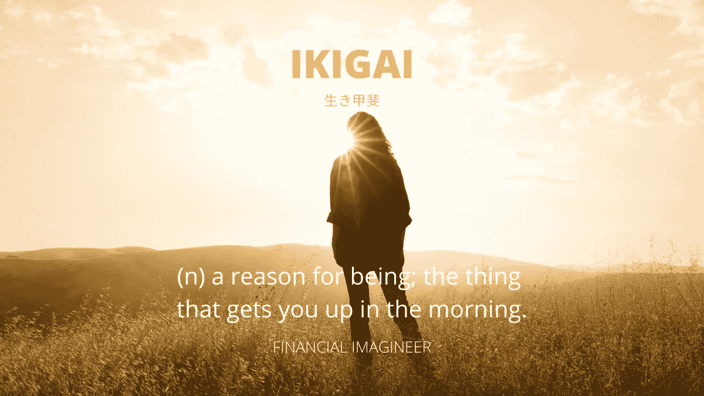
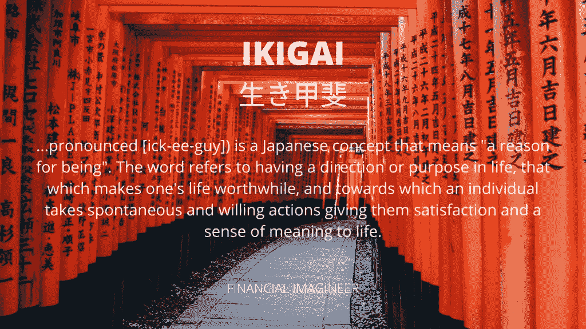
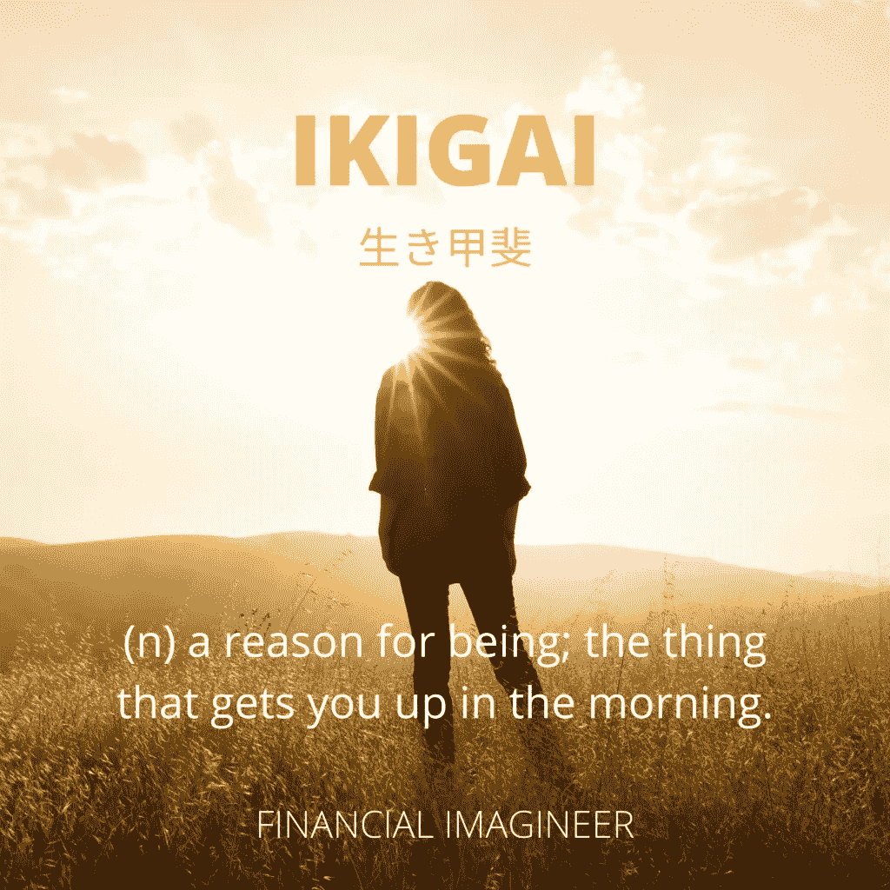

# iki Gai——日本人长寿快乐的秘诀

> 原文：<https://medium.datadriveninvestor.com/ikigai-the-japanese-secret-for-a-long-and-happy-life-a80588b08a35?source=collection_archive---------8----------------------->

在日本，人们已经学会了更长寿、更健康和更快乐的生活。那是因为他们和他们的 ikigai 结盟了！让我们探索这个 ikigai 背后的东西，看看我们能学到什么来改善我们的生活。

日本的冲绳岛恰好是百岁老人最多的地方之一。他们获得了非凡的长寿。即使以日本的标准来看。研究人员发现这一惊人成就背后的原因是因为人们过着他们的生活。

幸福不是目的地，而是一种生活方式。

冲绳人没有退休这个词。相反，他们一直用 ikigai 或“起床的理由”来定义他们的生活目的。你也可以通过调整心态做到这一点。不要把你的人生目标仅仅与你的工作或赚钱能力联系在一起。一旦你停止工作，你的生活就不会停止“有目标”。

你有没有意识到，当你结识新朋友时，从职业或工作的角度被介绍是很常见的。有研究表明(提前)退休可能是早死的一个原因。

# 蓝色区域

《国家地理》研究员、《纽约时报》畅销书作家、探险家和研究员丹·比特纳写了[“蓝色地带:长寿者的长寿经验”](https://amzn.to/3eWlvMA)，他发现世界上只有五个所谓的“蓝色地带”拥有非凡的长寿。

蓝色区域的居民通常都有一个特定的“如何生活”的概念，这就是他们确实比平均寿命更长的原因。

ikigai 的概念是其中最有冲击力的。

你也可以在生活中复制它！

# 什么是 Ikigai？

请参见下图来说明“Ikigai”。Ikigai 一边是你擅长的和你喜欢做的事情的交集——这也可以称为你的“激情”——另一边是这个世界需要的和你可以得到的报酬。

在他的书[“iki Gai:日本人长寿和幸福的秘诀”](https://amzn.to/3eWlvMA)中，埃克托·加西亚写道，追逐金钱而没有真正的目的，而是专注于增加社会价值和幸福是不健康的。

你知道没有真正的生活是死亡的头号遗憾吗？

> *我希望我有勇气过真实的生活，而不是别人期望我过的生活。*
> 
> *铜器*

# 如何找到并活出你的“Ikigai”？

# 1.你喜欢什么？

如果不是为了钱，你一般怎么打发时间？你最喜欢什么活动？当你通常从事这些活动时，时间是否会过得很快？大多数人都知道这些问题的答案。很容易知道自己喜欢什么。

第一步:写下你喜欢做的活动清单。

> *为一些我们不在乎的事情努力工作，叫做压力；为自己热爱的事情努力，这叫激情。*

# 2.世界需要什么？

从问题角度开始思考。这个世界有哪些问题需要解决？试着从识别让你感兴趣的问题的角度去思考，再次勾起你的激情。问题越大，你能找到的机会就越多。

**第二步:列出这个世界上你关心的问题。**

> 人们付钱给你不是因为你追随你的激情，而是为了满足你的需求。

这前两个问题是寻找 Ikigai 的核心:把你热爱的和需要的匹配起来。它们为接下来的两个问题奠定了基础。

# 3.你擅长什么？

如果你问你的朋友和家人，他们会如何代表你回答这个问题？你特别擅长什么？你能比别人做得更好的是什么？

每个人都有自己擅长的技能。了解你的优势和劣势。虽然利用现有的才能更容易，但不要绝望:投入时间和努力，你可以获得许多技能。

第三步:列出你的才能，如果需要，向你的朋友和家人寻求帮助！

> *未来属于那些学习更多技能并以创造性的方式结合起来的人。*

# 4.你能得到什么报酬？

取决于你能提供什么，几乎任何东西都有可能获得报酬。推广服务、产品或工作并获得报酬从未如此简单。借助互联网、社交媒体和其他工具，找到愿意花钱的客户是关键的一步。

虽然这听起来容易，但可能是最困难的一步。要有创意，不断尝试。推广他们热情服务和产品的人比企业和其他人有明显和可持续的优势！

人们不会从公司购买产品；他们从人们那里购买。

> 财富和幸福一样，直接追求是永远得不到的。它是提供有用服务的副产品。

# 5.最后一步

这项工作的最后一步是以一种有意义的方式将上述发现放在一起，并得出一个结论。通过上面的四个步骤和思路，你应该对你想要前进的方向有更清晰的认识。

所有四个区域的交叉点就是你达到 Ikigai 的地方。

如果你在做上面的练习时有问题，我强烈推荐你一些[按摩浴缸改造](https://www.financial-imagineer.com/2020/07/21/the-art-of-jacuzzi-beerstorming/)来提升你的创造力和想象力。

# 想象你的生活

生活不是寻找自我。生活就是创造你自己。

如果你不设计你的生活[计划]，你很可能会落入别人的计划中。如果你有伴侣，我强烈推荐[和](https://www.getrichslowly.org/couple-goals/#more-237050)结婚。

> *没有行动的愿景是白日梦。没有远见的行动是一场噩梦。*
> 
> *日本谚语*

活出你的 ikigai 不是一件容易实现的事情。这需要时间。关键的部分是开始这个过程，并不断向正确的方向前进。你会在途中学到很多，继续学习。

一旦你停止学习，你就开始死亡。

这个世界需要更多真正活着的人。大多数人的问题在于，在某个时间点上，他们会停止好奇。他们不再关心新的想法、经验和解决方案，因为他们承担了责任。然后他们建立并陷入日常事务中。不要像他们一样。

保持好奇心和创造力。

你会成长，可以在旅途中微调和调整你的道路。找到并活出你的 Ikigai 很难，但非常值得！

敢于在你的生活中为一个令人满意的职业腾出时间，为社会做出有意义的贡献，为你的家庭和爱好腾出时间。

> “我的未来从我每天早上醒来开始……每天我都找到一些有创意的事情去做。”
> 
> *米勒·戴维斯*

是时候开始了！想象你梦想中的生活！

现在我要问你的是，明天醒来你兴奋吗？

马特(男子名ˌ等于 Matthew)

如果你喜欢这篇文章，并想了解更多关于生活窍门、财务独立等等，请不要忘记关注脸书或推特。

免责声明:请注意，上面使用的一些链接可能是附属链接，Financial Imagineer 可能会收到补偿。

*原载于 2020 年 7 月 24 日*[*https://www.financial-imagineer.com*](https://www.financial-imagineer.com/2020/07/24/ikigai/)T22。