# iki Gai——日本人长寿快乐的秘诀

> 原文：<https://medium.datadriveninvestor.com/ikigai-the-japanese-secret-to-a-long-and-happy-life-471a2efa3e47?source=collection_archive---------3----------------------->

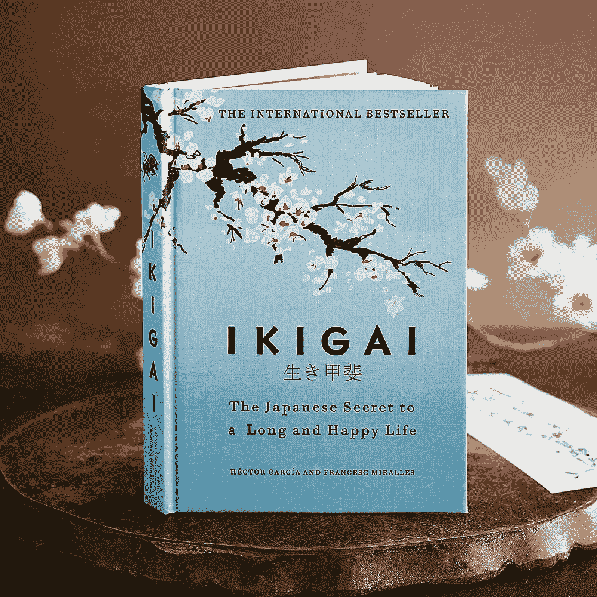

IKIGAI

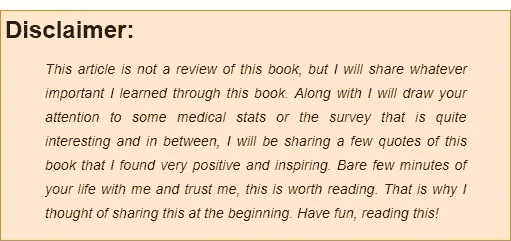

disclaimer

我读过的最快乐、最积极的书之一。这本书会让你驻足片刻，让你思考**“你是世卫组织吗？”**如果你认为你是“*某个学位持有者*或“*当前头衔*”是这个问题的本意，那么你错了。而这本书会让你找到正确的答案或者找到解决问题的正确方法。

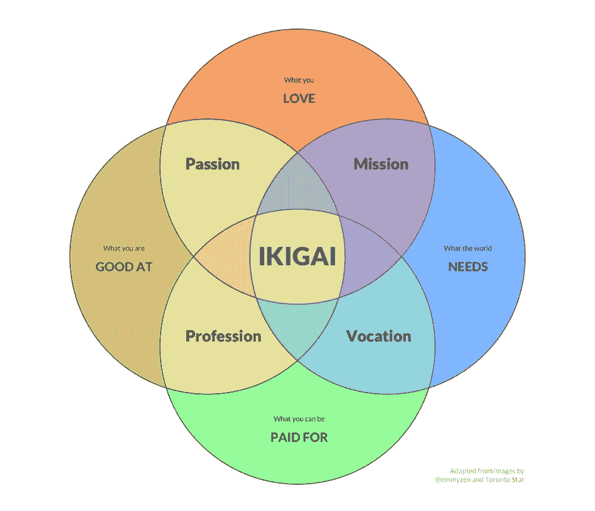

IKIGAI

首先，“[***iki Gai***](https://www.youtube.com/watch?v=pk-PcJS2QaU)*(读作****Ick-ee-guy****)*是日语单词，意思是“ ***成为*** 的原因”。我们需要找到我们自己的 *IKIGAI* 而这本书就是专门为寻找你内心的 *IKIGAI* 而写的。 [*埃克托·加西亚*](https://www.penguin.co.uk/authors/1080583/hector-garcia.html) 和 [*弗朗切斯克·米拉列斯*](https://www.penguin.co.uk/authors/1080583/hector-garcia.html) 是这本书的作者。这本书就像是对百岁老人的谈话和对这些人以及其他日本人和他们的文化的科学调查的记录采访，这使得他们在这个平均寿命从 70 岁到 72 岁的星球上活了 100 多岁。

这本书以一句日本谚语开头:

proverb

日本冲绳岛每 10 万名居民中就有 68 名百岁老人(T42)。这个岛上有一个村庄“ *Ogimi* ”，人口 **3000** ，号称人均寿命最高，官方称这个地方为“ [***长寿村***](https://en.wikipedia.org/wiki/%C5%8Cgimi)*。*

* [## 数据驱动始于数据素养|数据驱动的投资者

### 光是听到“数据”这个词就令人生畏。老实说，只有 21%的全球员工对自己的工作充满信心

www.datadriveninvestor.com](https://www.datadriveninvestor.com/2020/03/22/data-driven-starts-with-data-literacy/) 

这本书涵盖了这些百岁老人和当地人的原则，他们相信传播快乐和爱，而不是过物质生活，因为这样我们才能满足自己和他人的生活。这本书围绕着*“冲绳人”(居住在“冲绳”岛上的人)*。* 

*这些人相信一件事:*

***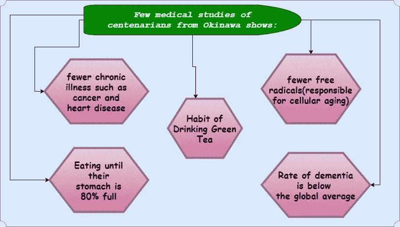*

*medical studies*

*在日本，人们在饭前饭后会唱“ [***【原八部】***](https://www.bluezones.com/2017/12/hara-hachi-bu-enjoy-food-and-lose-weight-with-this-simple-phrase/) ”，意思是“**填饱肚子八成**”。他们认为我们不应该填饱肚子，他们也不相信在用餐结束时添加甜点的概念。
*(嗯，我们 90%的人口都吃这顿饭，从某种程度上说，这将是他们一生中的最后一餐，我不应该提到吃甜点，我们都知道！:P)**

*在当今的生活中，压力和孤独是衰老的根本原因。*

*其中一段写道:*

*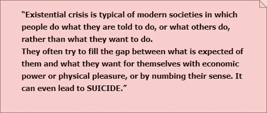*

*crisis*

*作者介绍了 [*意义疗法*](https://www.goodtherapy.org/learn-about-therapy/types/logotherapy) 的概念和 [*森田疗法*](http://www.moritaschool.com/read-me) (森田正人*发现)*。这些疗法都是为了找到你的人生目标。Shoma Morita 用下面的寓言解释了放下负面情绪的想法:*

*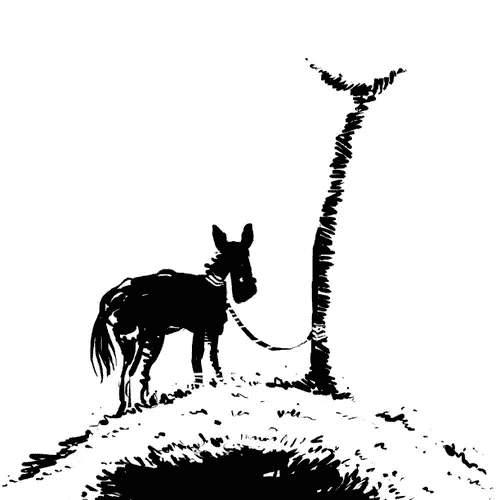*

*donkey*

*一头被绳子拴在柱子上的驴子会绕着柱子走来走去，试图挣脱，结果却越来越粘在柱子上，动弹不得。同样的事情也适用于那些有强迫思维的人，当他们试图逃离恐惧和不适时，他们变得更加深陷于自己的痛苦之中。*

*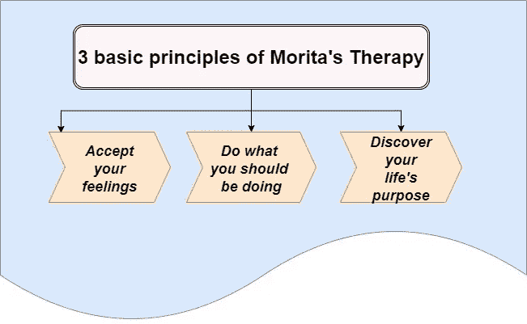*

*Morita’s Therapy*

*这些基本原则可以用简单的话来阐述，比如:*

*   *不要试图控制强迫性的想法，因为，最终，它会变得更加强烈。*
*   ***我们没有创造我们的感觉，它们只是来找我们，我们必须接受它们，诀窍是*欢迎它们****
*   *我们无法控制自己的情绪，但我们可以通过明确自己的目标来掌控自己每天的行为。*

*之后，作者解释了森田疗法的四个阶段，这需要 15-21 天:*

*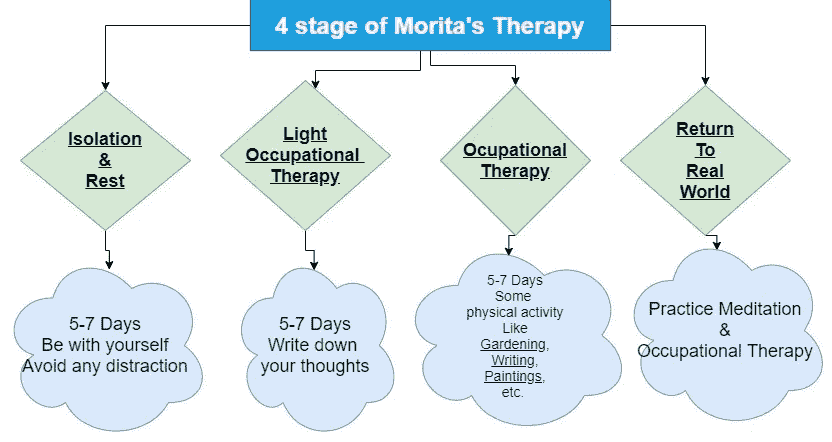*

*这种疗法的整体理念是让患者带着新的思维和目标感重返社会。*

*在这次治疗后，作者分享了一些关于“**”内观冥想的想法，它围绕着个人必须问自己的三个问题:***

***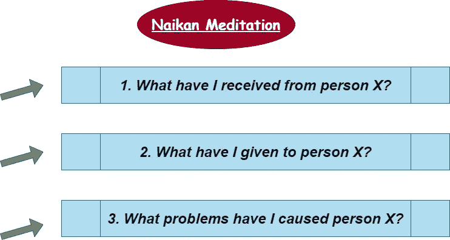***

***Naikan Meditation***

***这种沉思有一个关键的根源:***

> ***通过内观冥想和对自己提出上述问题，我们不再将他人视为我们问题的基础，并加深了我们的责任感。如果你生气了，想打架，在动手前考虑三天。三天后，强烈的战斗欲望会自行消失。***

***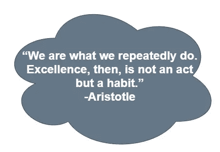***

***aristotle***

***然后，还有关于*滑雪*的美好学习。当我们在斜坡上滑雪时，我们完全专注于尽可能好地滑雪。没有未来，没有过去，只有*现在*。我们完全沉浸在体验中，一点也没有分心。我们的自我消失了，你成为你正在做的事情的一部分。***

***在“在你所做的一切中找到心流”这一章中，作者传达了一个非常美好的信息，他说没有找到幸福的神奇秘方，关键是无论你做什么都要有一种心流状态。***

***在所有年龄和文化的个体中，心流是相同的。在纽约和冲绳，我们都以同样的方式达到心流状态。***

*****实现心流的七个条件(欧文·谢弗研究员):*****

***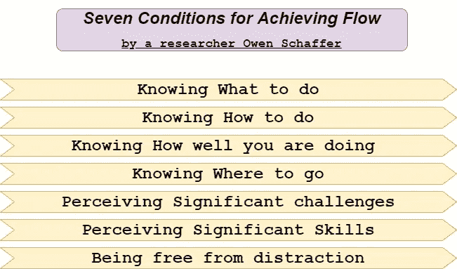*********

***Bertrand***

***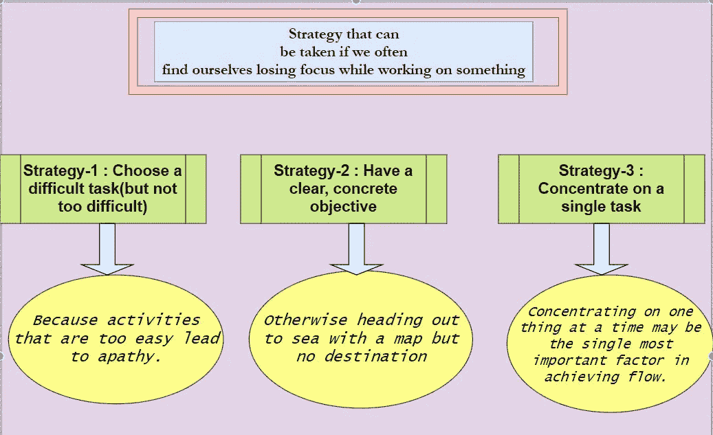******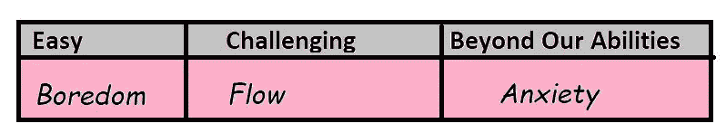***

***然后作者讨论了两组(一组执行多任务，另一组一次专注于一件事)的一些实验观察。他们被分配了一些活动来关注，结果是第二组更受欢迎。该报告指出:在第一组中，大脑被训练去关注每一个刺激，不管其重要性如何，而在第二组中，大脑被训练去关注一个单一的任务。***

***日本的工作流程， [*takumis*](https://en.wikipedia.org/wiki/Takumi) (工匠)，专注于一件事如此之深的工程师，以至于他们是新人或任何技术或小工具无法替代的。***

***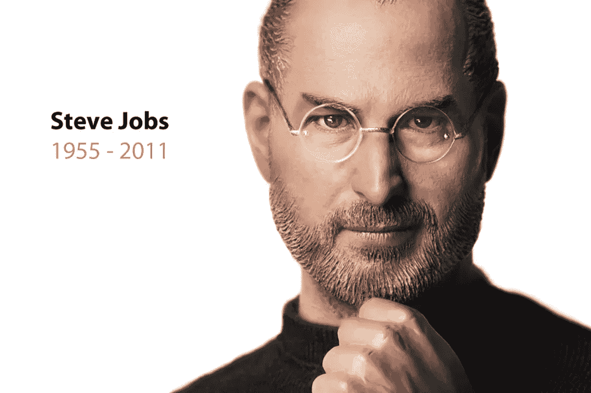***

***steve jobs***

***书中提到**史蒂夫·乔布斯**是日本及其工作文化的忠实粉丝。他采用了他们的许多方法，并且被京都的日本瓷器的简单和质量所吸引。史蒂夫·乔布斯是富山名为 [*的 Yukio Shakunaga*](http://speedyartgallery.com/news/220) 的 takumi (工匠)的崇拜者之一，他也被其他工匠、工程师和烹饪所吸引和启发。***

> ***“简单和对细节的关注”***

***我们都知道，日本人擅长将自然和技术结合在一起，不是人与自然的对立，而是两者的结合。***

***作者向读者提出了一个关于退休的问题:***

***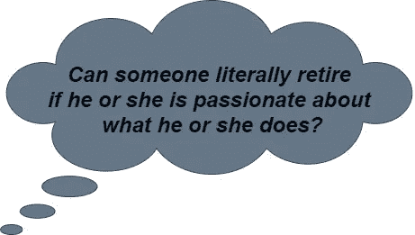***

***Author’s thought***

***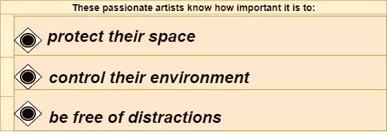***

****(if they want to flow with their IKIGAI)****

> ***百岁老人——年龄达到 100 岁的人。
> 超级百岁老人——年龄达到 110 岁的人。***

***作者对少数超百岁老人进行了 100 次采访，询问他们长寿的原因。***

***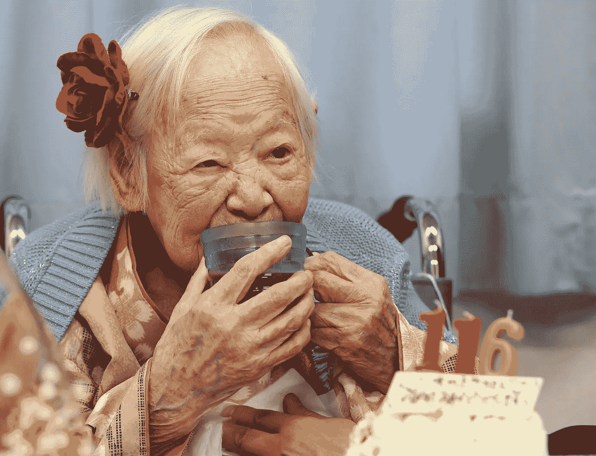***

***Misao Okawa(116 yrs old) [2015- oldest living person]***

******

***Maria Capovilla(116)***

***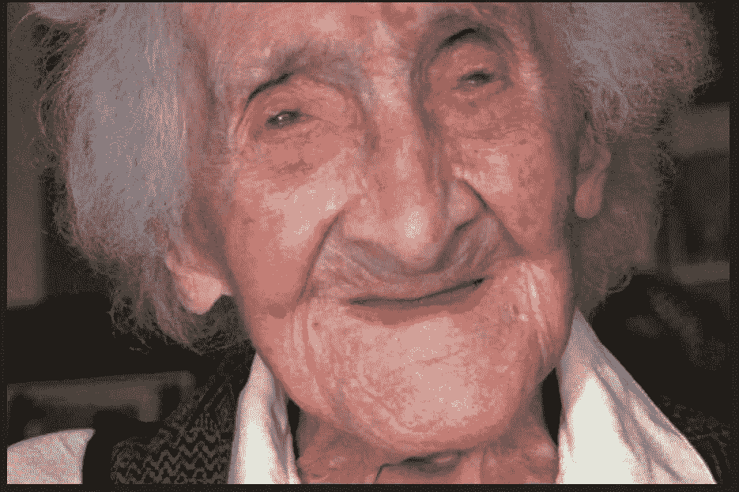***

***Jeanne Calment(122) [Oldest person of verified age]***

***所有这些超百岁老人都引用了一些常见的词，比如:***

******

***quotes***

***采访摘要:***

****1。他们有菜园和茶园
2。他们一直在庆祝。强烈的* [***汤丸***](https://www.alongerhealthylife.com/tag/yuimaaru/)*——认识到人与人之间的联系
4。每个人都在做一些事情，而不仅仅是坐着无所事事****

## ***尽管冲绳是日本受第二次世界大战影响最严重的地区之一，但它仍然超过了全国平均预期寿命，而且它是日本唯一没有火车的省份，人们更喜欢步行。 ***还有，这里的心血管疾病死亡率是全日本最低的*。*****

***日本太重视绿茶了，他们的膳食中包括:***

******

***food***

***(*都含有高抗氧化剂，有助于降低血液胆固醇水平* )
除此之外，他们还食用[***Shikuwasa***](http://www.jpn-okinawa.com/en/products/shiikwaasaa/)——一种酸性极强的柑橘类水果，含有大量的*川陈皮素，富含抗氧化剂，事实证明 *Shikuwasa* 可以预防 [**动脉硬化**](https://www.mayoclinic.org/diseases-conditions/arteriosclerosis-atherosclerosis/symptoms-causes/syc-20350569)****

****奥吉米人经常步行，在其中一章中，作者提醒我们注意当我们坐下来做些事情时会发生什么。静坐 30 分钟后，新陈代谢会减慢 90%,酶会减慢，连续静坐 2 小时后，有益胆固醇会下降 20%。****

****在一章中，作者提供了日本文化中促进健康和长寿的不同类型的做法的信息:****

****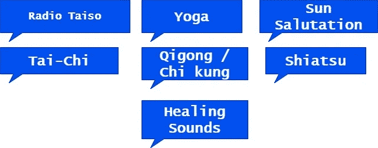****

****activities****

****所有这些实践都有一些共同点:****

*   *******通过静止控制运动*******

*   ********身心俱好********
*   *******锻炼对气息的感知*******

****在最后一章中，作者谈到了术语“弹性”以及拥有这种品质的重要性。韧性不仅仅是坚持不懈的能力，而是专注于生活中重要的事情而不是紧急的事情。****

****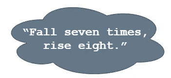****

****resilience****

****日本人在自身内部培养了*[*佛教*](https://en.wikipedia.org/wiki/Buddhism)[*犬儒主义*](https://en.wikipedia.org/wiki/Cynicism_(philosophy))[*斯多葛主义*](https://en.wikipedia.org/wiki/Stoicism) 。结论是——快乐和欲望不是问题，除非它们不控制我们，因为人们总是贪得无厌。
通过做*斯多葛主义*，我们达到一种**宁静** ( [无欲无求](https://en.wikipedia.org/wiki/Apatheia))的状态，也就是没有负面感受，只有正面感受。这本书涵盖了通过想象可能发生在你身上的最糟糕的事情，为失去做准备的心态。这可以通过问我们自己来实现:
**“可能发生的最糟糕的事情是什么？”**
斯多葛主义的基本宗旨是:*“知道我们能控制什么，不能控制什么”******

****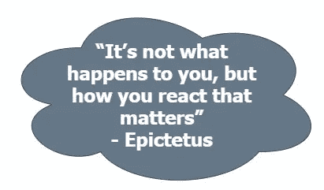****

****Epictetus****

****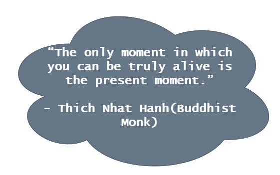****

****Thich Nhat Hanh****

****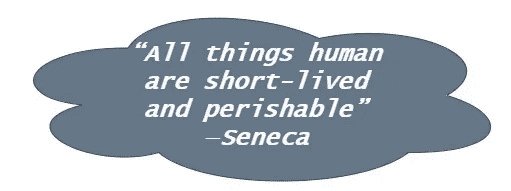****

****Seneca****

****除了上面提到的所有事情，我们应该有以下的理解(从作者的角度):-
**第一步:创造更多的选择**
从你的爱好中找到赚钱的方法，在其他工作中，或者通过开始自己的生意赚钱
**第二步:在某些领域保守地下注，在其他领域冒许多小风险**
关于金融知识的知识
**第三步:摆脱那些让你******

****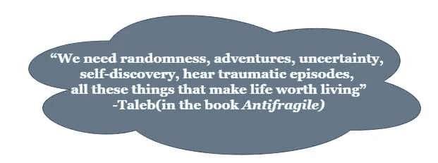****

****Taleb****

****这本书也包含了后记，在那几个我想在这里隐藏的知识中:****

****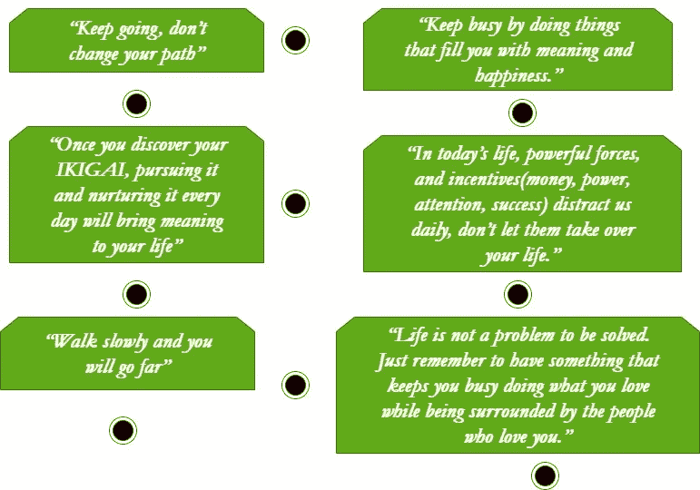****

****以下是 IKIGAI 的 10 条规则:****

****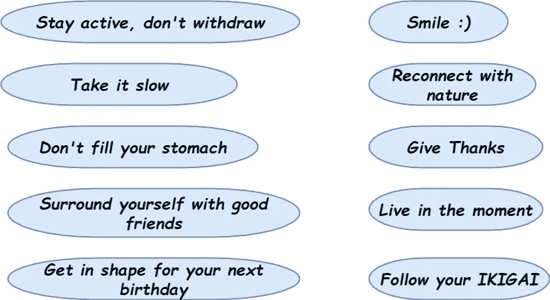****

****10 rules of IKIGAI****

******结束******

****我希望你喜欢这篇文章，并从中学到一些东西。评论你的想法，你的批评，你的欣赏，任何事情。谢谢你的时间，请鼓掌鼓励我写更多。
不断学习，不断成长。****

****如果你已经达到了这一点，你可以访问我的 [***简介***](https://medium.com/@asishraz) 看看我的其他文章，让我知道，你觉得怎么样。最近在评论《有史以来最粗鲁的书》，点击 [***这里***](https://medium.com/datadriveninvestor/the-rudest-book-ever-shwetabh-gangwar-4180a458efbf) 阅读。
{如果你对阅读 IKIGAI 感到兴奋，你可以在这里点。}
快乐阅读！！！****

****再次感谢你，请继续阅读，因为这是让你的生活充实的最终方式。****

****永远不要放弃，永远不要放弃！！！
☺
-加雷博编码器****

******获取专家观点—** [**订阅 DDI 英特尔**](https://datadriveninvestor.com/ddi-intel)****