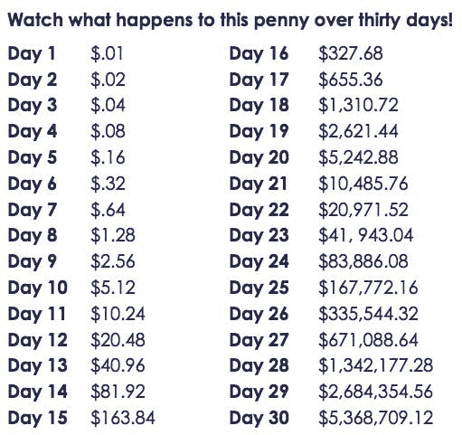
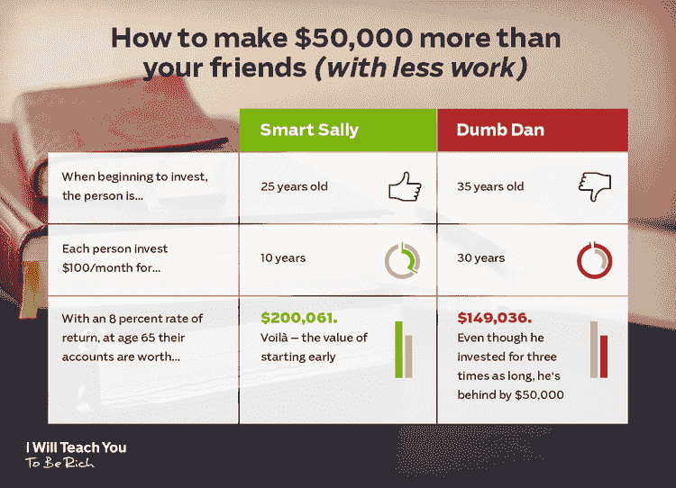
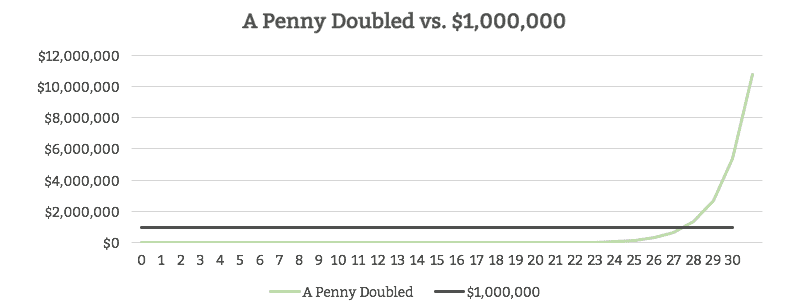
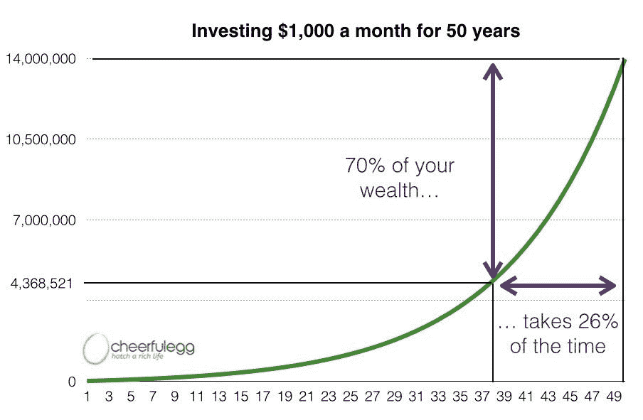

# 30 年后我会成为百万富翁，即使我不再存钱

> 原文：<https://medium.datadriveninvestor.com/ill-be-a-millionaire-in-30-years-even-if-i-never-save-again-458ea8662426?source=collection_archive---------24----------------------->

## 而我才 24 岁。

Photo by [freestocks](https://unsplash.com/@freestocks?utm_source=medium&utm_medium=referral) on [Unsplash](https://unsplash.com?utm_source=medium&utm_medium=referral)

如果你问大多数年轻人他们最大的开销是什么，你可能会听到是房租、外出就餐或饮酒。

不是我。

我最大的“支出”一直是储蓄。

自从我拿到第一份薪水后，我就把将近 60%的收入用于储蓄和投资。

 [## 去年我是如何在没有预算的情况下节省了 4 万美元

### 你不需要成为一个理财专家。

medium.com](https://medium.com/the-ascent/how-i-saved-40-000-last-year-without-a-budget-31a3d8bddb22) 

就这样过了几年，我可以说我已经成功地积累了超过 10 万美元的积蓄。

最精彩的部分？

我现在可以完全停止储蓄*，30 年后我还是百万富翁。*

*这怎么可能呢？*

*让我给你看看…*

# *神奇的一便士对一百万美元*

*问自己这样一个问题:“你愿意现在就有一百万美元，还是愿意一个月内每天翻倍？”*

*如果你和大多数人一样，你可能会被诱惑接受那一百万。*

*但如果你做了，你会落后的。实际上，落后几百万。*

*结果是，30 天内每天翻一倍等于 5，368，709.12 美元。没错，就是 500 多万美元！*

**

*Source: [New Trader U](https://www.newtraderu.com/2013/08/19/how-much-does-a-penny-doubled-every-day-for-month-end-up-being/?utm_content=buffer0ccef&utm_medium=social&utm_source=pinterest.com&utm_campaign=buffer)*

*仅仅一个月之后，仅仅几便士就可以累积到数百万。*

*那么，为什么会这样呢？*

*这是由于**复利的奇迹。***

*简单来说，复利就是你的钱赚了利息，然后你的利息也赚了利息。*

*例如:*

> *如果你开始时在银行账户上有 100 美元，支付 10%的利息，到年底，你将总共有 110 美元。这是因为你赚了 10 美元，或者 100 美元的 10%的利息。*
> 
> *现在，假设你把那 110 美元放在那里，一年都没碰过。第二年末，你会有 121 美元。这是因为，今年，你赚了 11 美元，或者 110 美元的 10%的利息。加上你今年开始时的 110 美元，你还剩 121 美元。*
> 
> *现在，您已经从最初的 100 美元和第一年的 10 美元利息中获得了利息。*

*即使你什么也没做，你挣的钱也每年都在增加。*

*难怪阿尔伯特·爱因斯坦曾经说过:*

> *复利是世界第八大奇迹。理解它的人，赢得它；谁不付钱，谁就付钱。*

*但是爱因斯坦到底是什么意思呢？*

* [## 人工智能帮助你聪明理财|数据驱动的投资者

### 自动化和人工智能为创新平台提供动力，简化双方的财务流程…

www.datadriveninvestor.com](https://www.datadriveninvestor.com/2020/09/02/artificial-intelligence-helps-you-be-smart-with-money/)* 

# *对拖延者的惩罚*

*许多年轻人认为你可以推迟退休储蓄，但这与事实相去甚远。*

*当你到了“应该”开始存钱的年龄时，你已经失去了几万美元的潜力。*

*为什么？*

*因为复利在你起步早的时候效果最大。*

*这就是为什么很早就开始投资的人实际上可以投入更少的钱并取得成功的原因。*

*拉米特·塞西(Ramit Sethi)在他的《我会教你变得富有》一书中完美地解释了这一点，他比较了“聪明的莎莉”和“愚蠢的丹”两个朋友。*

*   *“聪明的莎莉”25 岁开始投资。*
*   *“哑丹”10 年后开始投资，当时他 35 岁。*

> *“两个朋友每月投资 100 美元，但丹投资了 30 年，而萨莉只投资了 10 年。然而，Sally 多出了 50，000 美元，这都是因为她比 Dan 更早开始投资。莎莉受益于复利。”*

**

*Source: [Ramit Sethi](http://www.iwillteachyoutoberich.com)*

*如你所见，丹存钱的时间是莎莉的 3 倍，最后投入的钱是莎莉的 3 倍。然而，当他们都到了 65 岁的时候，他的钱还是比莎莉少。*

*这都是因为丹 10 年后开始，给他更少的时间复利，以帮助他增加他的钱。*

> *换句话说，你什么时候开始贡献比你贡献多少重要得多。*

*如果你开始晚了，你会一直努力赶上。*

*这就是为什么爱因斯坦说不懂复利的人会被它惩罚。*

*但是为什么*何时*开始投资似乎很重要呢？*

# *原因是“快而早”胜过“慢而稳”*

*如果你回到便士和百万美元的例子，你可能会注意到一些奇怪的事情。*

*早期的复利只增加了几便士，而最近的复利增加了数百万。*

**

*Source: [Modern Dollar](https://www.modern-dollar.com/blog-index/2017/6/1/a-penny-doubled-or-1000000)*

*这是为什么呢？*

*事实证明，复利经历了“滚雪球效应”。*

*基本上复利需要足够的时间来获得动力，然后才能开始产生重大影响。*

*一旦达到某一点，你的利息会让你赚到比实际存款更多的钱。*

*在下图中，你会看到你 70%的财富只花了 26%的时间。最重要的是，它发生在 ***持续*** 的 26%的时间里。*

**

*Source: [Cheerful Egg](https://www.cheerfulegg.com/2015/09/20/the-8020-rule-of-compound-interest/)*

*几乎所有复利的好处都只发生在尾端。*

*这就是为什么你现在需要开始存钱。你必须给自己足够的时间在市场上实际受益于复利。*

> *你的钱增长的时间越长，复利就越能为你所用。*

*这就是为什么我今天能够完全停止投资，30 年后仍然是百万富翁。*

*因为我开始得早，我已经把复利的“雪球”滚动起来了。这给了复利足够的时间为我工作。*

*虽然我计划继续储蓄和投资，但很高兴知道我可以在未来 40 年什么都不做，仍然为退休做准备。*

*这也是你可以做到的！*

# *让今天成为你的一万美元日*

*如你所见，从长远来看，你不投资的每一天都会让你损失数千美元。*

*好消息是，如果你还年轻，你投入多少并不重要，因为你还有时间。早期，少量的钱可以带来巨大的收益。*

*正因为如此，你能做的最重要的事情就是从现在开始。*

*那么，你能做些什么来开始存钱呢？*

*你应该从寻找生活中可以削减开支的领域开始:*

*   *如果你在食物上花费太多，在家做饭*
*   *如果你在住房上花费太多，找一个室友，住在镇上不那么令人兴奋的地方*
*   *如果你在交通上花费太多，放弃汽车，乘坐公共交通工具。*

*更好的是，通过采取一些一次性的行动让你保持富有，从而最大限度地增加你的储蓄！*

* [## 如何“设定并忘记”你最重要的金钱决策

### 5 个你今天可以做的一次性行动，让你一生都富有

medium.com](https://medium.com/the-post-grad-survival-guide/how-to-set-and-forget-your-most-important-money-decisions-6415a850c597) 

记住，你等待开始的时间越长，你就必须投入越多的钱来为退休做足够的储蓄。每一天都很重要。* 

**本文仅供参考。不应将其视为财务或法律建议。并非所有信息都是准确的。在做任何重大财务决定之前，先咨询财务专家。**

*如果你喜欢这篇文章，看看我关于金融的其他文章:*

* [## 我如何能每年在 Chipotle 上花 2000 美元，而在 35 岁退休

### 你不必为了你的积蓄而放弃你所热爱的东西。

medium.com](https://medium.com/the-ascent/how-i-can-spend-2-000-year-on-chipotle-and-still-retire-by-35-3489c5959eb8)  [## 去年我是如何在没有预算的情况下节省了 4 万美元

### 你不需要成为一个理财专家。

medium.com](https://medium.com/the-ascent/how-i-saved-40-000-last-year-without-a-budget-31a3d8bddb22) 

**访问专家视图—** [**订阅 DDI 英特尔**](https://datadriveninvestor.com/ddi-intel)*