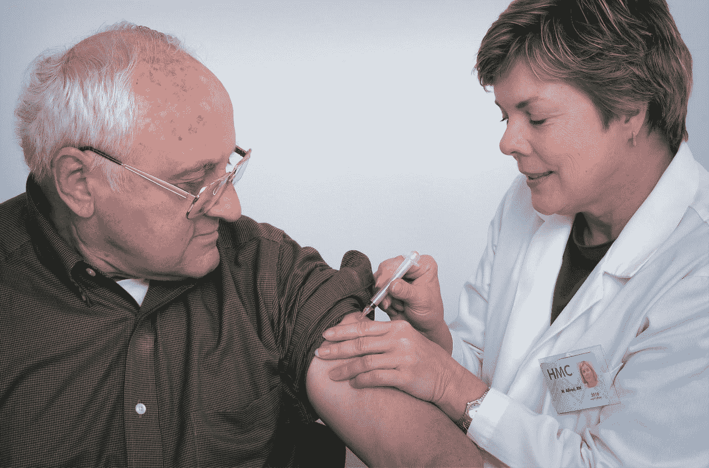

# 我并不热衷于接种新冠肺炎疫苗。原因如下。

> 原文：<https://medium.datadriveninvestor.com/im-not-really-keen-on-getting-a-covid-19-vaccine-here-s-why-9f7d93469c2f?source=collection_archive---------11----------------------->

## 我们如何理解正在开发的疫苗的进展？

Photo by [CDC](https://unsplash.com/@cdc?utm_source=medium&utm_medium=referral) on [Unsplash](https://unsplash.com?utm_source=medium&utm_medium=referral)

这里有很多关于正在准备的新冠肺炎疫苗的宣传。不管他们来自何方，至少有一个人有希望阻止或终结新冠肺炎疫情。随着越来越多的疫苗获得 T2 的批准，像 T4、新加坡和印尼这样的国家开始向他们的公民免费提供这些疫苗，尽管可能会有对疫苗产生过敏反应的风险。

疫苗背后的核心问题是，在所有的炒作都尘埃落定之后: ***疫苗到底是干什么的？***

## 疫苗包含什么

根据世界卫生组织的消息，

> 疫苗包含特定生物体(抗原)的弱化或失活部分，可在体内引发免疫反应。较新的疫苗包含产生抗原的蓝图，而不是抗原本身。无论疫苗是由抗原本身还是蓝图组成，以便身体产生抗原，这种弱化版本都不会在接受疫苗的人身上引起疾病，但它会促使他们的免疫系统做出反应，就像它对实际病原体的第一次反应一样。
> 
> 一些疫苗需要多次注射，间隔几周或几个月。这有时是需要的，以允许长期抗体的生产和记忆细胞的发展。通过这种方式，身体被训练来对抗特定的致病微生物，建立对病原体的记忆，以便在未来暴露于病原体时迅速与之对抗。

对于新冠肺炎冠状病毒颗粒，疫苗包含其信使核糖核酸( [mRNA](https://dhhr.wv.gov/COVID-19/Documents/COVID-19%20Vaccine%20FAQ.pdf) )标识符链的灭活片段:

> 疫苗包含合成 mRNA，这是用于制造新型冠状病毒刺突蛋白的遗传信息。刺突蛋白是病毒附着在人体细胞上的部分。单独的刺突蛋白不会导致新冠肺炎。一旦刺突蛋白产生，它就会导致免疫系统产生针对病毒的抗体。如果一个人接触到病毒，这些抗体可以提供保护。mRNA 疫苗是非感染性的，不会进入人类细胞核，因此不能插入人类 DNA。此外，mRNA 被迅速分解，这在理论上减少了长期副作用的机会。

这一系列事件背后的假设是，免疫系统可以产生抗体，这些抗体有望检测到产生刺突蛋白的病毒的实际 mRNA，这样免疫系统就能够做出充分的反应，并标记病毒以进行破坏。

这个假设的问题在于，它 ***假设*** 我们的免疫系统有能力快速破坏所有这些 RNA*。*

*因为让我们面对房间里的大象:所有这些关于疫苗的研究只关注免疫系统产生必要的抗体来标记病毒，然后我们 ***假设*** 破坏是迅速的。*

* [## 新冠肺炎期间股票交易的 9 个教训|数据驱动的投资者

### 在你浏览之前，让我告诉你一些关于我自己的情况。我是…

www.datadriveninvestor.com](https://www.datadriveninvestor.com/2020/12/09/9-lessons-learned-about-stock-trading-during-covid-19/)* 

## *但是如果毁灭比预期的要慢呢？*

*因为没有人推销(或宣传)破坏 RNA 的机制，这取决于免疫系统中的巨噬细胞如何根据标记病毒颗粒的抗体破坏 RNA。*

*在[应对病毒感染的 5 个考虑事项](https://medium.com/illumination/5-things-for-consideration-in-addressing-viral-infections-78c06d565d6e)中，我概述了病毒感染我们身体时发生的一系列事件:*

1.  *病毒进入了人体。*
2.  *病毒感染细胞并将其重新编程为 ***只有*** 产生病毒 RNA/DNA 链的副本。然后，这些病毒副本可以感染其他健康细胞，并以指数方式放大病毒繁殖的效果。*
3.  *受感染的细胞继续产生病毒拷贝，直到抗体将受感染的细胞标记为受感染，并通过编程让它们通过凋亡自杀。*
4.  *这些死亡细胞向吞噬细胞发出信号，以便吞噬细胞能够找到它们，吞噬它们并消化它们。这个过程被称为吞噬作用。被消化的 RNA/DNA 链被分解成它们的组成核酸，这样就可以合成新的细胞来取代死去的细胞。*
5.  *如果吞噬率低于感染率，也可以发出促炎细胞因子形式的信号，以强制杀死这些受感染的细胞。太多受感染或凋亡的细胞对我们的健康不利。*

*当我们错误地假设免疫系统可以快速消除所有这些 DNA/RNA 链*，那么当我们只关注抗体生成部分时，问题就开始出现了。**

**当然，我们确实需要抗体来标记入侵者…但这并不是全部。**

**我们也需要免疫系统能够通过自噬过程[将这些入侵者分解](https://medium.com/science-and-philosophy/a-look-into-the-cell-graveyard-bf8854483ff)为它们的组成核酸*……以便身体能够重新利用它们为新细胞合成新的 DNA 链。***

***不幸的是，许多人的清除/自噬机制受损，这减缓了这些入侵者的清除速度，导致这些生物在体内积累*，然后导致可怕的促炎细胞因子信号的产生，进一步转化为潜在的细胞因子风暴和死亡。****

***这些人包括患有神经退行性疾病、心脏病、二型糖尿病和肥胖症的人***

> ***现在那不是火箭科学吗？正是这些人群更有可能死于新冠肺炎感染引起的严重并发症。***

## ***不幸的是，我们不能那么容易地控制自噬***

***我们可以更好地控制体内抗体的产生水平，这就意味着大型制药公司可以更容易地购买疫苗。***

***我们可以更好地控制病毒复制率，这就意味着像雷地昔韦这样的大型制药公司可以更轻松地赚钱。***

***但是，如果我们能够刺激或引发免疫系统的自噬反应，甚至更好地检测和消除这些威胁，就像应该消除的威胁一样迅速地消除？***

***不幸的是，它赚不了那么多钱，因为很多钱都归结于生活方式的选择！***

***我们吃什么，我们的睡眠质量，我们的运动强度和频率，以及我们的压力管理，或者说[我们的生活方式影响我们免疫系统的四种方式](https://medium.com/illumination/four-ways-that-our-lifestyle-affects-our-immune-system-3a76ccfc202c)。***

***但是由于对新冠肺炎疫苗的大肆宣传…***

***请记住，疫苗的大量营销宣传对大型制药公司来说是一座金矿。***

***支持一个人的免疫系统功能是关键，正如我在[中强调的支持健康免疫系统的营养素](https://thethinkingscientist.substack.com/p/nutrients-that-support-a-healthy)。***

****乔尔·永博士是一名生化工程师/科学家、教育家和作家。他撰写了 5 本电子书(可在*[*Amazon.com*](https://www.amazon.com/Dr-Joel-Yong/e/B08LQ7K1KD)*上下载，格式为*[*Kindle*](https://amzn.to/2TfwGYe)*)，并在国际同行评审的科学期刊上合作撰写了 6 篇期刊文章。他的主要重点是找出医生没有教育外行人的体内生化机制的基础，然后为了你的理解而解构它们——就像一个教育者应该做的那样。****

*****尽可随时订阅我的*** [***邮件列表***](https://thethinkingscientist.substack.com/) ***获取更多独家内容！*****

*****你可能还想访问*** [***更深入地挖掘博士诊断***](https://thethinkingscientist.substack.com/p/digging-deeper-into-doctoral-diagnoses/comments) ***来查找相关问题或你可能很久都没有找到的问题的答案。*****

****访问专家视图—** [**订阅 DDI 英特尔**](https://datadriveninvestor.com/ddi-intel)**