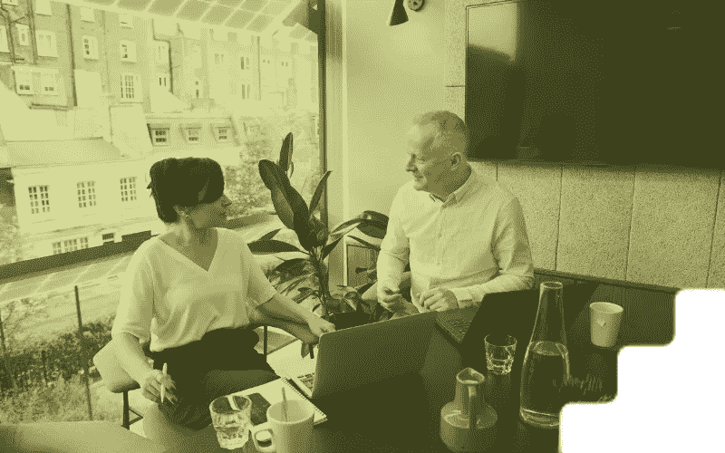

# 我害怕提价——我该怎么做？

> 原文：<https://medium.datadriveninvestor.com/im-scared-to-raise-my-prices-how-do-i-do-it-a3c40af80825?source=collection_archive---------43----------------------->

还记得上次有供应商给你发涨价信吗？你可能耸耸肩，没有多想就接受了，不是吗？

如果你是一名企业主，在考虑是否提价时，你可能会敏锐地意识到自己对价格上涨的反应。

如果你对价格上涨感到担忧或恼火，这可能会阻止你提高自己的价格，但这完全是错误的做法。

你[想要财务安全](https://the3fs.com/what-are-the3fs/#fsp)和满意的客户，对吗？嗯，如果你在需要的时候不提高价格，*你就不会有这两个*。

让我解释一下。

## 为什么你应该提高价格

定价时有大量的心理因素在起作用。

康奈尔大学 2009 年的一项研究发现，当一家餐馆决定不在价格前标上美元符号时，消费会增加 8%。

这让价格本身变得无关紧要了吗？人只是天生愚蠢吗？

当然不是！价格只是反映价值。如果你在菜单上看到一道你喜欢的菜，旁边有一个似乎合理的数字，你会点这道菜。

现在，餐馆老板偶尔会提高价格，因为如果她不这样做，这些菜的价值就会开始下降。

这也表明了对该企业向客户提供的产品的信心。

基本事实仍然是，虽然你的服务是为客户服务的，但你的业务是为你服务的。

如果你不提高价格，你将会工作更长时间而收入更少，这降低了你获得和利用三个 f 的能力:

*   金融安全
*   自由
*   F 违约

## 你应该什么时候提价？

“当潜在客户询问为什么你的价格与竞争对手相比如此之低时，你知道是时候提高价格了。”

这是品牌公司 Fem Founder 的克里斯汀·金伯利·马克特在接受《福布斯》采访时所说的话。

不过，不要指望他们。虽然你可能偶尔会从客户那里收到这样的反馈，但在提价时，你通常必须更加主动。

以我的经验来看，当你客户的世界里发生一些事情时，是时候提高你的价格了。它可能是一个提升你产品价值的事件，或者是一个需要改变的故事。

甚至可能只是你每隔一段时间(例如，每 12 个月)提高一次价格，以涵盖通货膨胀、成本增加和不断变化的市场。

然而，你会知道什么时候该涨价了。感觉很好。例如,“事件”可能是一个新的合作伙伴关系，需要它来增强你的产品的功能，但这会增加你的开销。

没关系！

 [## 利用区块链构建可持续循环经济|数据驱动投资者

### 自从工业革命开始以来，全世界都关注产品的生产和消费。很少或…

www.datadriveninvestor.com](https://www.datadriveninvestor.com/2020/11/17/building-sustainable-circular-economy-with-blockchain/) 

## 你如何向顾客解释涨价？

首先，一些好消息——如果你在考虑潜在的新客户，没有所谓的“新”价格；他们看到的价格是他们将支付的第一个价格！

在这种情况下，他们不需要知道我们上面讨论的原因或故事。不要为了新客户而沉迷于此。

对于现有客户，你只需要自信地、毫不含糊地解释。

全力以赴，记住你不需要证明价格上涨是合理的。“为了确保您继续获得您习惯的优质服务，我们的新价格将从 XXX 日起为 XXX。”那就行了！

明确这只是一种‘改变’，而不是‘增加’——记住，这都是心理学。

无论你做什么，确保你在这件事上的沟通不是集中在价格上。链接到一些内容，解释客户将看到的结果和改进。确保他们看到[价值](https://the3fs.com/best-pricing-strategy/)和与你合作的持续收益。

## 你如何开始提价？

对于未来的价格上涨，你能做的最重要的事情之一就是从一开始就把它们写进你的协议和合同中。

这说明它们是不可避免的。这将使未来的价格上涨更加坚定，也不那么令人惊讶。这也进一步增强了你对企业及其产品的信心。

如果你打算每年定期提价，那就在你的合同中表现得非常明显。“每六个月会有 X%的增长”，对你来说比“我们将来会不时地调整你的价格”更有信心。

## 你害怕什么？

当你发现自己在考虑价格上涨时，通常还有其他原因在起作用。

你在担心什么？

客户可能会去寻找更便宜的替代品吗？也许你担心你太贪心了？

但是，如果客户真的挥手告别，并找到一个更便宜的替代品，这说明了什么呢？如果他们意识到自己错过了什么，将来又回来了怎么办？

你可以通过谈论客户想要什么和需要什么来克服这种[恐惧](https://the3fs.com/taking-the-risk/)，而不是价格。事实证明，为了得到他们想要的东西，他们需要多付出一点。

我留给你这样一个想法:如果你提高价格，*你会以新的价格购买自己的服务吗？*

**访问专家视图—** [**订阅 DDI 英特尔**](https://datadriveninvestor.com/ddi-intel)