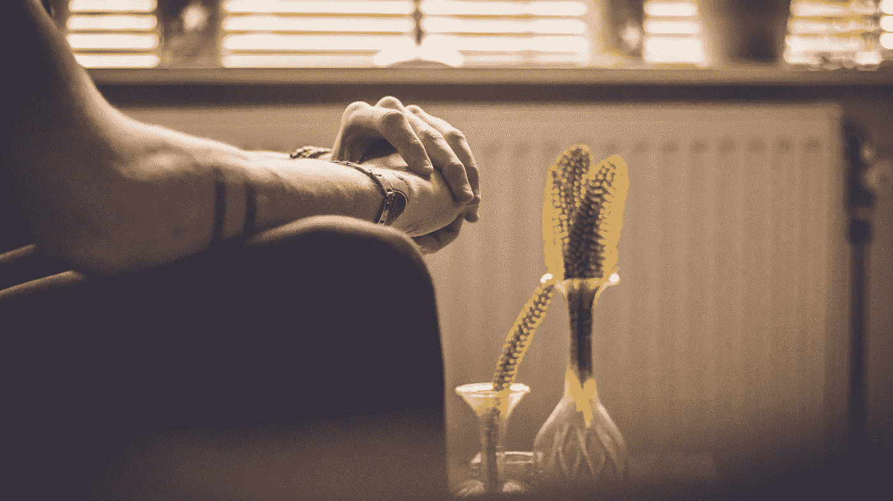

# 我在疫情中度过了 30 岁

> 原文：<https://medium.datadriveninvestor.com/im-turning-30-in-the-middle-of-a-pandemic-c71edcd5c568?source=collection_archive---------6----------------------->

Image: [Christopher Lemercier](https://unsplash.com/@elevantarts?utm_source=unsplash&utm_medium=referral&utm_content=creditCopyText) on [Unsplash](https://unsplash.com/s/photos/waiting?utm_source=unsplash&utm_medium=referral&utm_content=creditCopyText)

一个时代的终结即将来临。至少是这种感觉。但多亏了这个疫情，我不再急于追逐我的梦想。相反，我被困在家里，想知道我不存在的 30 岁生日派对会是什么样子。

但那不是我最害怕的…

这个世界一直在兜售这样一种观点，即你必须在 30 岁之前做好一切。如果你不这样做，你将永远不会这样做。我希望情况不是这样。

因为我还在从事我的写作生涯，我还没有去过欧洲，到目前为止我还没有找到真爱。在这些主要目标中，我脑子里有所有这些较小的目标，我对它们无能为力，因为这个世界已经关闭了。那不是一个婊子！

当然，我知道整个“在 30 岁之前什么都要做”的说法是不真实的。不管你多大，你仍然可以达到你的目标。[而且有很多名人可以证明这一点](https://www.boredpanda.com/famous-people-success-later-in-life/?utm_source=google&utm_medium=organic&utm_campaign=organic)。

但是不管我知道多少，我的不充分的感觉仍然弥漫。

## 我对此无能为力！

据说很多人[在接近 30 岁时会做出疯狂的决定。搬家，转行，像兔子一样乱搞。但对我来说呢？我在工作、写作和找工作之间进退两难。我每周唯一的乐趣就是去杂货店，享受定期散步，或者偶尔和朋友一起吃午饭。但是我必须小心外出，因为这可能会扰乱我的日常工作。](https://hellogiggles.com/lifestyle/6-thoughts-everyone-right-turn-30/)

 [## 健身房 10 年的 10 条人生经验|数据驱动的投资者

### 走错一步，他们就会掉下去。两位登山者优雅地回到了地面。他们在那里…

www.datadriveninvestor.com](https://www.datadriveninvestor.com/2020/02/03/10-life-lessons-from-10-years-in-the-gym/) 

老实说，我真的很想环游澳大利亚和世界，但这不会很快发生。我想举办一个疯狂的 30 岁生日聚会，但那似乎是不可能的。我也很想约会谈恋爱，但是最近预期市场缩水了。尤其是现在，我所在的澳大利亚地区的病例正在不断增加。

所以我真正能做的就是专注于我的事业——由于疫情，我也感觉很艰难——忘记我所有其他的希望和梦想。至少要到我 30 岁生日之后。

我只是不知道该如何面对…

*原载于 2020 年 8 月 10 日 http://thegaystraighttalker.com**[*。*](https://thegaystraighttalker.com/2020/08/10/im-turning-30-in-the-middle-of-a-pandemic/)*

***进入专家视角—** [**订阅 DDI 英特尔**](https://datadriveninvestor.com/ddi-intel)*