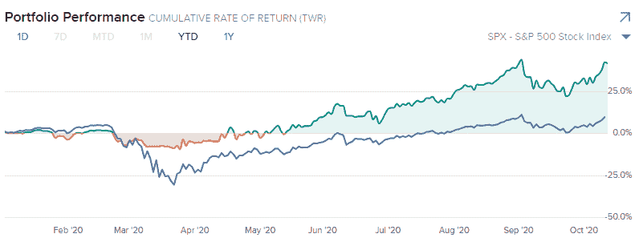
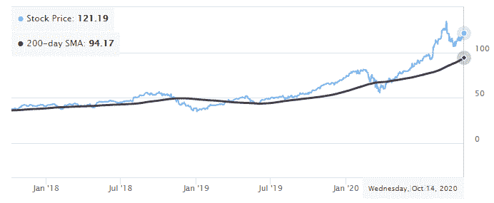
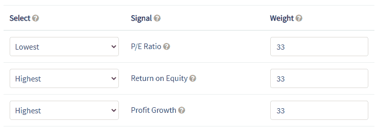
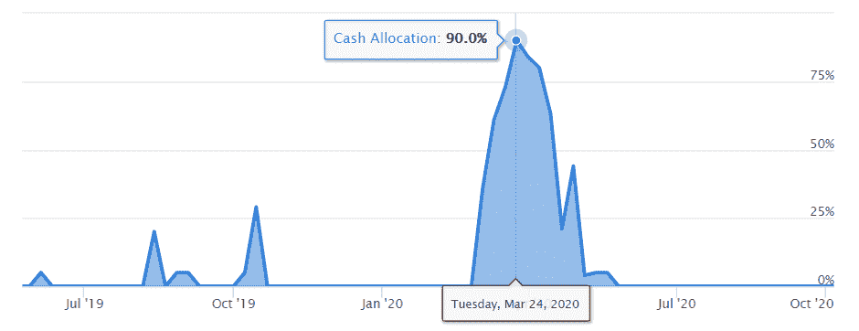
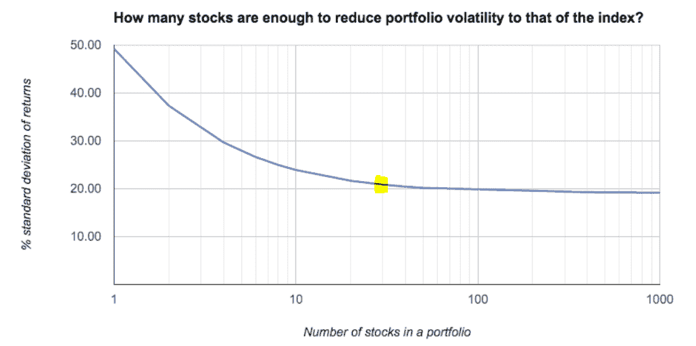
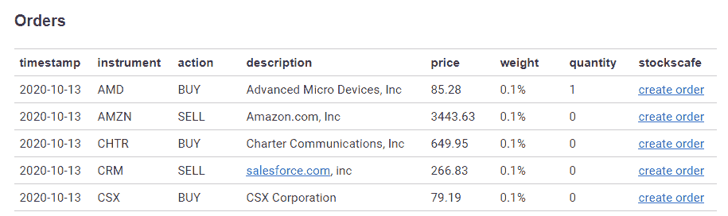

# 尽管有 Covid，我今年还是涨了 42%。我是这样做的。

> 原文：<https://medium.datadriveninvestor.com/im-up-42-this-year-despite-covid-here-s-how-i-did-it-2a3013b8bf4d?source=collection_archive---------5----------------------->

My Interactive Brokers account

是的，这是我的互动经纪人账户的快照。

如果你是股票市场的投资者，今年对你来说是相当不错的一年。今年 2 月至 3 月，仅一个月时间，股市就暴跌了 35%。不久之后，我们看到市场出现 V 型复苏，直接回到历史高点。随后，随着美国大选临近，从 9 月份开始，市场波动性加大。

尽管股市大幅波动，但我的投资组合今年表现不错，回报率为 42.1%，而标准普尔 500 股市上涨了 9.4%。此外，该投资组合的提款率明显较低，为 11%。

我是这样做的。

# 数据驱动投资

作为一个 DIY 投资者，当谈到投资时，我使用数据驱动的方法。没有出于恐惧或贪婪的情绪交易。对新闻标题没有反应。最确定的是，没有交易的决定，因为我“感觉”这只股票会上涨。

所有买卖股票的投资决定都是根据我的交易规则提前几个月做出的，所以我不需要在市场波动时手忙脚乱。我讨厌忙乱。使用在市场上有优势的交易规则，以冷静和不带感情的方式执行交易计划要容易得多。

我如何知道我的交易规则有效？你猜对了。我对我的投资策略进行了回溯测试，这让我有信心把辛苦赚来的钱投入股市。接下来，我在 PyInvesting 上创建了我的 robo-advisor，它执行我的策略，每天拉实时价格，并为我在我的交互式经纪人账户上交易生成订单。我需要做的就是打开我的邮箱，执行交易。

继续，我使用什么投资策略？

# 趋势跟踪

我是个简单的人。我买入一直上涨的股票，卖出一直下跌的股票。这叫做趋势跟踪。

趋势无处不在。我们有时尚趋势、社会趋势、天气趋势，在这个科技时代，我们甚至有谷歌搜索趋势。同样，**趋势存在于股票市场**。

统计数据显示，当一只股票已经上涨了 6 至 12 个月，它往往会继续上涨。这种效应有许多[行为原因](https://www.bellinvest.com/resource_center/white_papers/perspective-on-investor-behavior/),比如羊群效应，人们倾向于跟随大众的情绪，因为亏损带来的可怕感觉被每个人在投资中也遭受损失的事实所掩盖。

我用移动平均线来识别趋势。移动平均线是一段时间内价格的平均值(黑线)。当一只股票的价格高于其移动平均线时，这意味着这只股票正在上涨。相反，当它的价格低于其移动平均线时，股票趋势向下。

Apple’s 200 day moving average from pyinvesting.com

苹果公司的股价及其 200 天移动平均线(200 毫安)

我们用快速移动平均线(回望期通常少于 50 天)来衡量短期趋势，用慢速移动平均线(回望期超过 100 天)来衡量长期趋势。长期趋势更稳定，噪音更小。

因此，200 日均线(200 毫安)是我的底线。任何高于 200 天移动平均线的股票，我都会考虑纳入我的投资组合。任何低于 200 天移动平均线的股票，如果在我的投资组合中，我都会卖出。

# 基本面分析

在过滤了长期上涨趋势的股票后，我用基本面分析对股票进行了排序。这是通过根据基本面数据为每只股票创建一个信号来实现的。

我用三个因素来创造我的信号。

Moving average backtest at pyinvesting.com

第一个因素是**市盈率(PE ratio)** ，这是一个衡量公司估值的指标。市盈率越低，股票相对于其收益就越便宜，这对投资者来说是好事。毕竟，谁不喜欢优惠的折扣呢？

第二个因素是**净资产收益率(ROE)** ，即公司的净利润除以其股东权益。净资产收益率是衡量一家公司利用资源的效率的指标。高质量的公司往往有较高的净资产收益率。

第三个因素是**利润增长**，这是一个衡量公司利润增长速度的指标。你的股票价值与公司收益高度相关。能够快速增长收益的公司往往会在股价上产生巨额回报。

通过结合技术和基本面分析，我们能够筛选、排名和选择最佳股票纳入我们的投资组合。

 [## 为什么我们投资 Totient，也就是人工智能如何帮助我们生产抗癌药物和 Covid | Data…

### 9 月 10 日，一家人工智能驱动的药物研发公司宣布与……建立关键合作伙伴关系，从此悄然出现

www.datadriveninvestor.com](https://www.datadriveninvestor.com/2020/09/13/why-we-invested-in-totient-aka-how-ai-can-help-us-produce-drugs-against-cancer-and-covid/) 

# 主动风险管理

下一步是应用基于市场情绪的主动风险管理系统，在危机期间保护我们的投资组合。

这里的主要思想是，当市场情绪看涨时，我们希望承担更多风险，持有更多股票。这是因为在牛市时期，市场倾向于奖励投资者继续投资。

相比之下，当市场情绪看跌时，我们希望通过增加现金配置和持有较少股票来降低风险。这是为了保护我们的投资组合免受巨大的损失。

例如，在今年 3 月，由于市场情绪变得悲观，我的投资组合几乎全是现金。这让我将投资组合的资金减少到了 11%，尽管市场下跌了 35%。

Fear and Greed Index at pyinvesting.com

随后，我的机器人顾问逐渐开始购买股票，减少现金，以参与随后的 V 形市场复苏。

如果你对我如何决定这一现金分配感兴趣，请随意查看 PyInvesting 的[恐惧和贪婪指数](https://pyinvesting.com/fear-and-greed/)。

# 位置尺寸

拼图的最后一块是位置大小。我的投资组合中至少持有 30 只股票，每只股票的权重相等。

我为什么要这么做？**规避集中风险**。我没有水晶球，无法预测一只股票何时会因为令人惊讶的糟糕财报而暴跌，或者就特斯拉而言，首席执行官是否会发推特。

正因为如此，我保持每个仓位很小，这样我被任何一只股票套牢的风险就变得很小。

我的投资组合有 30 只股票，位于下图中黄色的最佳投资点。当投资组合的波动性接近市场的波动性时，我就获得了分散投资的大部分好处。持有超过 30 只股票对降低我投资组合的波动性没有太多额外的好处。

Image source: [Stockopedia](https://www.stockopedia.com/blog/how-many-stocks-should-you-own-in-your-portfolio-86323/)

在这样做的时候，我并没有把赌注压在任何一只股票上。我**在投资概念上下注**平均来说，一批高动能、低市盈率、高 ROE、高利润增长的股票表现优于 S & P 500。

反对在投资组合中持有 30 只股票的天真观点是，没有人有足够的时间研究这么多股票，投资组合中持有 10 只以上股票的人不知道他们在做什么。

我对持这种观点的人的反驳是，我们不是生活在恐龙时代。在技术的帮助下，使用像 PyInvesting 这样的机器人顾问来梳理数百家公司并在几秒钟内选择基本面最强、技术设置最好的 30 只股票并不困难。

# 把所有的放在一起

我们讨论了有助于我的整体投资组合策略的多个单独步骤。我们从识别处于长期上升趋势的股票开始。接下来，我们使用基本面分析对这些股票进行排名。随后我们应用了一个积极的风险管理系统。最后，我们确定了头寸规模，以降低集中风险。

每一步都有助于我的投资组合的整体表现，今年到目前为止，我的投资组合表现超过标准普尔 500 30%。

尽管有很多步骤。使用 PyInvesting 实施该策略轻而易举。我简单地填写了一张表格，详细说明了我的回溯测试，并在云上创建了我的 robo-advisor。从那以后，每当我收到我的机器人顾问发来的电子邮件，我就在交互式经纪人(IBKR)上执行我的交易。

Email portfolio update from pyinvesting.com

如果你喜欢这篇文章，并且想在云上创建你自己的机器人顾问，我邀请你去看看 PyInvesting 的[移动平均回溯测试](https://pyinvesting.com/backtest/moving-average/)，我用它来创建我的个人投资策略。希望在你走向财务自由的征途上，它能对你有所帮助。

祝你投资愉快，并祝你好运。

## 获得专家视图— [订阅 DDI 英特尔](https://datadriveninvestor.com/ddi-intel)