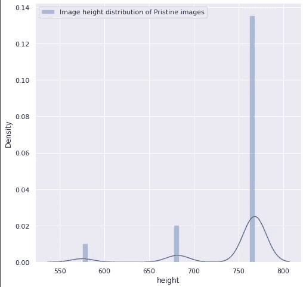

# 使用深度学习的图像操纵检测

> 原文：<https://medium.datadriveninvestor.com/image-manipulation-detection-using-deep-learning-dedcb7a84d06?source=collection_archive---------2----------------------->


# 我们试图解决的问题是什么？

在这个软件功能强大的时代，我们可以轻松地编辑任何图像。最强大的软件之一是 Adobe photoshop，使用它我们可以轻松地改变、裁剪、删除或对图像的任何部分做更多的事情。

这些图像可能是假新闻的一部分，这是当今各大社交媒体平台的一个主要问题。这个问题也存在于使用容易操作的文档的各种领域中。

IEEE 信息取证与安全技术委员会(IFS-TC)发起了检测和定位取证挑战赛，这是 2013 年第一个解决这一问题的图像取证挑战赛。

关于该问题的进一步信息:

[***研究论文 1***](https://openaccess.thecvf.com/content_cvpr_2018/papers/ Zhou_Learning_Rich_Features_CVPR_2018_paper.pdf)

[***研究论文 2***](https://arxiv.org/pdf/1903.02495.pdf)

[***IEEE 挑战赛***](https://signalprocessingsociety.org/newsletter/2013/06/ifs-tc-image-forensics-challenge)

# 介绍

为了解决这个问题，首先我们将建立一个模型来检测图像是真实的还是被篡改的。如果图像被操纵，那么我们将尝试预测图像的操纵区域。

*处理图像的不同方式:*

1.  图像拼接:从真实图像中复制区域并粘贴到其他图像中。
2.  复制-移动:在同一个图像中复制和粘贴区域。
3.  去除:从真实图像中去除区域，然后进行修复。

# 关于数据集

*   *对于分类任务，在 CASIA2 和 IEE IFS-TC 数据集上训练模型。*
*   *对于掩码预测，仅使用 IEEE IFS-TC 数据集来训练模型。*

**CASIA2** :包含 7408 张真实图像和 5123 张虚假图像。

IEEE IFS-TC 数据集:它包含 1050 个真实的 450 个处理过的图像以及它们的 450 个遮罩。

伪图像的遮罩是描述伪图像的拼接区域的黑白(非灰度)图像。蒙版中的黑色像素代表在源图像中执行操作以获得伪造图像的区域，具体来说，它代表拼接区域。


Fake image with corresponding mask

# 体系结构

我们将在分类和掩码预测任务中使用迁移学习，因为这种技术在我的实验中给出了最好的结果。

*分类模型*


*掩模预测模型*


> ***【UNET】***[***分割模型库***](https://segmentation-models.readthedocs.io/) ***与不同的骨干模型一起用于此任务***

# 关于遮罩预测模型中使用的过滤器

*SRM 滤波器:* SRM 特征收集基本噪声特征。SRM 对这些滤波器的输出进行量化和截断，并提取附近的同现信息作为最终特征。从该过程获得的特征可以被视为局部噪声描述符。我们直接使用噪声特征作为噪声流网络的输入。噪声流的骨干卷积网络架构与 RGB 流相同。


The three SRM filter kernels used to extract noise features.

*ELA 滤波器:误差等级分析(ELA)允许识别图像中处于不同压缩等级的区域。对于 JPEG 图像，整个画面应该处于大致相同的水平。如果图像的一部分处于显著不同的误差水平，那么它可能指示数字修改。*

*ELA 强调了 JPEG 压缩率的差异。与高对比度边缘相比，具有均匀颜色的区域(如纯蓝天空或白墙)可能具有较低的 ELA 结果(较暗的颜色)。*

查看图片，识别不同的高对比度边缘、低对比度边缘、表面和纹理。将这些区域与 ELA 的结果进行比较。如果有显著的差异，那么它识别可能已经被数字改变的可疑区域。


> 从实验中，我发现 ELA 滤波效果更好，所以它被用于最终的掩模预测模型

# 探索性数据分析

*   *关于 CASIA2 数据集*


Information about Authentic images in CASIA2 dataset


Information about Manipulated images in CASIA2 dataset

*   关于 *IEEE IFS-TC 图像取证挑战数据集*


Information about Authentic images in IEEE dataset


Information about Manipulated images in IEEE dataset


Information about Masks of manipulated images in IEEE dataset


Distribution of images in IEEE dataset


Distribution of channels in authentic images


Distribution of channels in fake images

*   我们可以看到一些 4 通道图像也存在于真实和伪造的图像中。



Image height distribution of Authentic images


Image height distribution of Fake images


Image width distribution of Authentic images


Image width distribution of Fake images

*   假图像比原始图像具有更多高度更大的图像。
*   几乎所有的原始图像都具有相同的宽度，而伪图像也具有接近类似范围的高密度。

> 我在两个不同的笔记本上做了不同的实验，在所有的实验之后，我从这两个笔记本中选择了最好的模型。这些实验可以在以下链接中找到:

*   [笔记本 1](https://github.com/sankalp-chawla/Image-manipulation-detection-using-Deep-Learning/blob/master/Experiment1_Project2.pdf)
*   [笔记本 2](https://github.com/sankalp-chawla/Image-manipulation-detection-using-Deep-Learning/blob/master/Experiment2_Project2.pdf)

> 我添加了图像放大以及假图像，因为图像的数量非常少，以训练一个神经网络。

```
#Resizing and augmenting imagesdef agument(aug,image,mask,ela):augmented = aug(image=image, mask=mask,ela=ela)return augmented['image'],augmented['mask'],augmented['ela']def resize(image,mask,ela):aug = Resize(height=256,width=256,p=1)return agument(aug,image,mask,ela)def horizontalFlip(image,mask,ela):aug = HorizontalFlip(p=1)return agument(aug,image,mask,ela)def verticalFlip(image,mask,ela):aug = VerticalFlip(p=1)return agument(aug,image,mask,ela)def transpose(image,mask,ela):aug = Transpose(p=1)return agument(aug,image,mask,ela)def hueSaturationValue(image,mask,ela):aug = HueSaturationValue(p=1,hue_shift_limit=100, sat_shift_limit=100, val_shift_limit=50)return agument(aug,image,mask,ela)def elasticTransform(image,mask,ela):aug = ElasticTransform(p=1)return agument(aug,image,mask,ela)def opticalDistortion(image,mask,ela):aug = OpticalDistortion(p=1, distort_limit=3, shift_limit=0.4)return agument(aug,image,mask,ela)def randomBrightnessContrast(image,mask,ela):aug =RandomBrightnessContrast(p=1,brightness_limit=0.5, contrast_limit=0.4)return agument(aug,image,mask,ela)
```

> 我还在蒙版上使用高斯模糊来平滑边缘。在图像处理中，高斯模糊是通过高斯函数模糊图像的结果。这是图形软件中广泛使用的效果，通常用于减少图像噪声和细节。

```
#Adding gaussian blur to masks to reduce noise and converting to single channelos.mkdir(base_path+'binary_masks')bin_masks =[]for mask in tqdm.tqdm(fake_names_intersection,position=0, leave=True):mask_img = cv2.imread(base_path+'fake'+'/'+mask+'.mask.png')[:,:,:1]blur = cv2.GaussianBlur(mask_img,(5,5),0) #Adding gaussian blurret,bin_mask = cv2.threshold(blur,0,255,cv2.THRESH_BINARY+cv2.THRESH_OTSU) #modifing the values to either 0 or 255cv2.imwrite(base_path+'binary_masks/'+mask+'.mask.png',bin_mask)bin_masks.append(bin_mask)
```


Manipulated image vs Image mask without Gaussian Blur vs Image mask with Gaussian Blur

***笔记本 1 中的分类型号***


Classification models in Notebook 1

***笔记本 1 中的掩码预测模型***


Mask prediction models in Notebook 1

***笔记本 2 中的分类型号***


***Classification models in Notebook 2***

***笔记本 2 中的掩码预测模型***


***Mask Prediction models in Notebook 2***

# **最佳模特**

> **用于分类:ResNet50 与 imagenet 权重一起使用，并在来自 CASIA2 数据集以及来自 IEEE IFS-TC 图像取证挑战的数据集的图像上进行训练。**
> 
> 对于掩模预测:具有图像网权重的 Resnet101 高斯模糊+来自两个流的串联输出+ ELA 滤波+在 IEEE IFS-TC 图像取证挑战数据集上训练的增强

# **使用的公制**

F 值(Dice 系数)可以解释为精确度和召回率的加权平均值，其中 F 值在 1 时达到最佳值，在 0 时达到最差值。`**precision**`和`**recall**`对 F1 分数的相对贡献相等。F 分数的公式是:


# 构建分类模型

```
#Method to generate ELA of imagesdef generate_ela(path,quality):temp_file = 'temp_file.jpg'image = Image.open(path).convert('RGB')image.save(temp_file, 'JPEG', quality = quality)temp_image = Image.open(temp_file)ela_img = ImageChops.difference(image, temp_image)extrema = ela_img.getextrema()max_diff = max([ex[1] for ex in extrema])if max_diff == 0:max_diff = 1scale = 255.0 / max_diffela_img = ImageEnhance.Brightness(ela_img).enhance(scale)return ela_imgmodel2 = Sequential()model2.add(ResNet50(include_top = False, pooling = 'avg', weights = 'imagenet'))model2.add(Dense(256, activation = 'relu'))model2.add(Dropout(0.1))model2.add(Dense(128, activation='relu'))model2.add(Dense(64, activation='relu'))model2.add(Dropout(0.2))model2.add(Dense(32, activation='relu'))model2.add(Dropout(0.3))model2.add(Dense(2, activation = 'softmax'))
```

结果:


Results for Classification model


Results for Classification model

# 建立掩模预测模型

```
path_img = Unet(backbone_name='resnet101', encoder_weights='imagenet', activation='sigmoid',classes=3,input_shape=(256,256,3),decoder_use_batchnorm=True)path_img._name = 'path_1'out1 = Conv2D(3,(1,1), activation='sigmoid')(path_img.output)path_filter = Unet(backbone_name='resnet101', encoder_weights='imagenet', activation='sigmoid',classes=3,input_shape=(256,256,3),decoder_use_batchnorm=True)path_filter._name = 'path_2'out2 = Conv2D(3,(1,1), activation='sigmoid')(path_filter.output) for layer in path_img.layers:layer._name = layer.name + str("_img")combined = concatenate([out1, out2])final = Conv2D(1,(1,1),activation='sigmoid')(combined)model3 = Model(inputs=[path_img.input,path_filter.input], outputs=[final])metrics = [metric]log_dir = "logs_mask3/fit/" + datetime.datetime.now().strftime("%Y%m%d-%H%M%S")tensorboard_callback = TensorBoard(log_dir=log_dir, histogram_freq=1)early_stop = tf.keras.callbacks.EarlyStopping(monitor='val_loss', patience=3)reduce_lr = ReduceLROnPlateau(monitor = 'val_loss', factor = 0.22, patience = 1, verbose = 1, min_delta = 0.0001)model3.compile(tf.keras.optimizers.Adam(0.0001), 'binary_crossentropy',metrics)model3.fit([X_train1,X_train2], [Y_train],validation_data=([X_val1,X_val2], [Y_val]),epochs=10, batch_size=1,callbacks=[reduce_lr,early_stop,tensorboard_callback],verbose=1)
```

结果:


Mask prediction results

# 未来作品

*   由于计算的限制，我不能添加更多的增强，我们可以添加更多的图像增强，以进一步改善。
*   也可以使用具有 3 个输入的更复杂的网络:伪图像+ ELA 滤波图像+ SRM 滤波图像。
*   许多新的研究论文也可以参考，以调整架构和进一步提高模型的准确性。

# 参考

*   [参考文献 1](https://gist.github.com/ewencp/3356622)
*   [参考 2](https://github.com/shurain/ela/blob/master/ela.py)
*   [参考文献 3](https://pypi.org/project/imageio/)
*   [参考文献 4](https://towardsdatascience.com/reshaping-numpy-arrays-in-python-a-step-by-step-pictorial-tutorial-aed5f471cf0b)
*   [参考文件 5](https://stackoverflow.com/questions/48991077/reshape-1d-array-to-3d-array-numpy)
*   [参考文献 6](https://github.com/Zulko/moviepy/issues/219)
*   [参考文献 7](https://towardsdatascience.com/metrics-to-evaluate-your-semantic-segmentation-model-6bcb99639aa2#:~:text=3.-,Dice%20Coefficient%20(F1%20Score),of%20union%20in%20section%202)
*   [参考文献 8](https://gist.github.com/cirocosta/33c758ad77e6e6531392)
*   [参考文献 9](https://www.kaggle.com/alexanderliao/image-augmentation-demo-with-albumentation)
*   [参考文献 10](https://towardsdatascience.com/image-forgery-detection-2ee6f1a65442)

我已经将我所有的笔记本上传到我的 [*Github 资源库*](https://github.com/sankalp-chawla/Image-manipulation-detection-using-Deep-Learning) 中，你可以在这些笔记本中找到很多关于所有方法的深入分析。

我已经尽力包含尽可能多的信息。请分享您的宝贵反馈。

也可以通过[*LinkedIn*](https://www.linkedin.com/in/sankalp-chawla-22996484/)*联系我。*

感谢阅读！！！