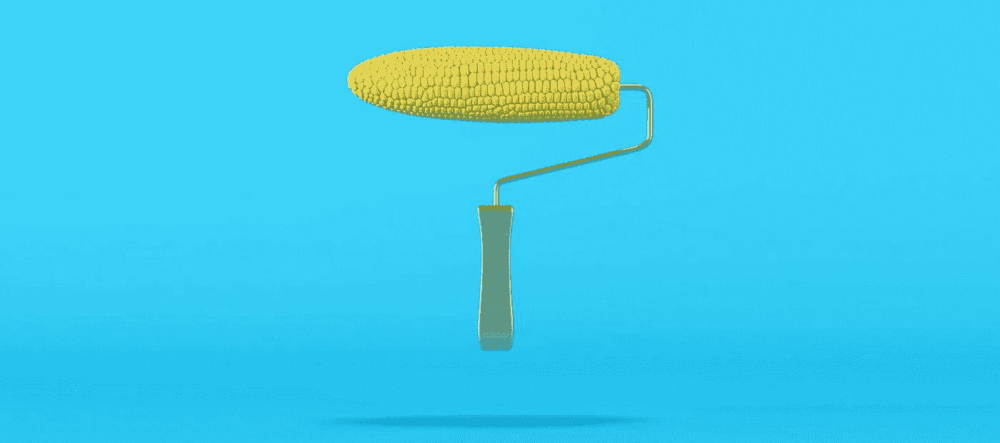
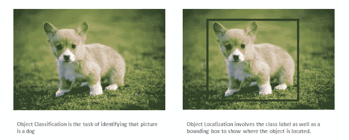
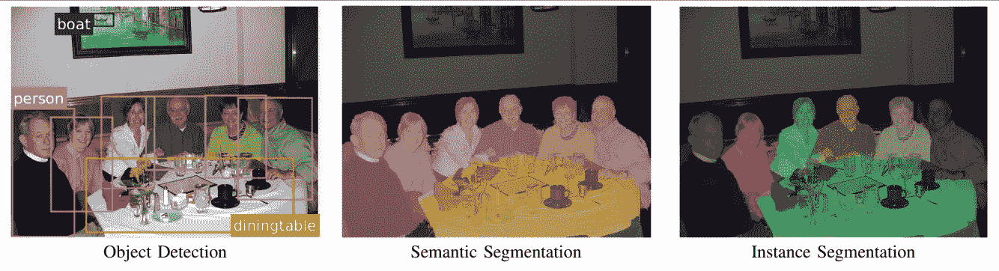
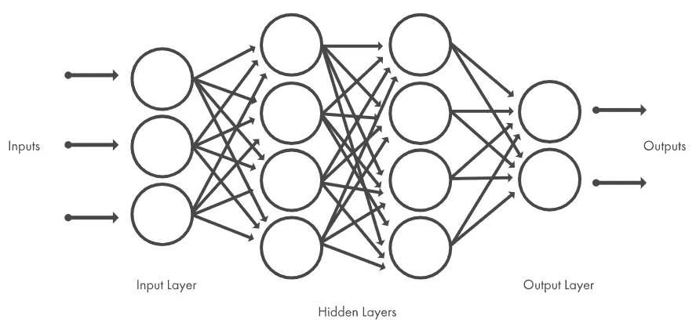
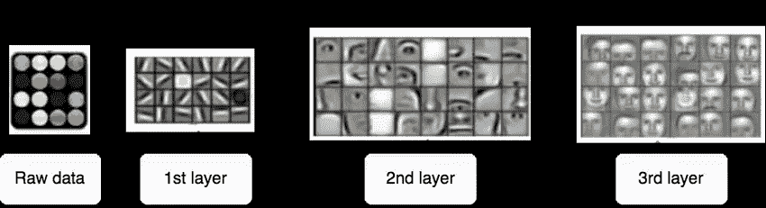
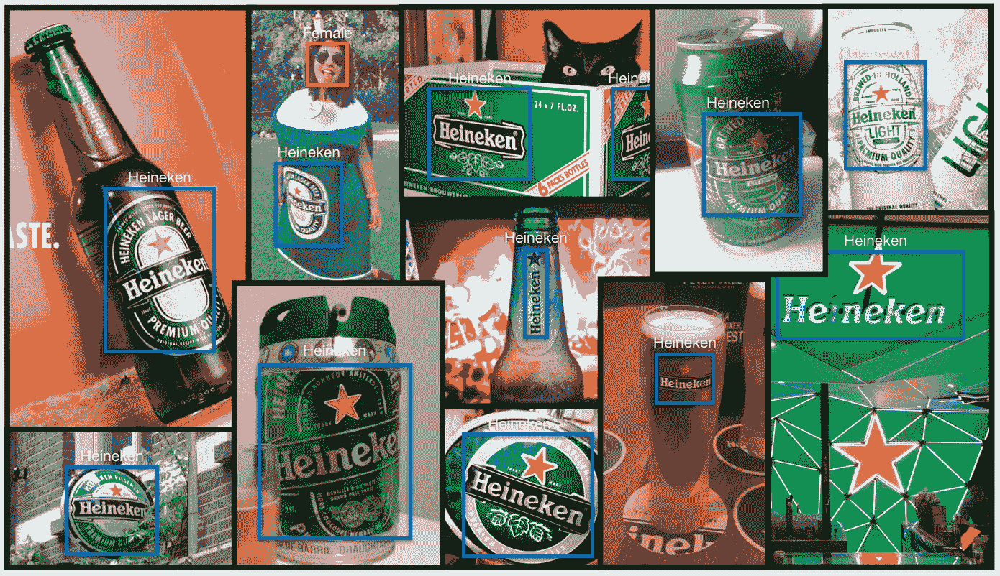

# 深度神经网络图像识别及其应用实例

> 原文：<https://medium.datadriveninvestor.com/image-recognition-with-deep-neural-networks-and-its-use-cases-5b11eddfcf43?source=collection_archive---------2----------------------->

很高兴意识到我们人类成功地用自己的自然技能启用了机器:通过实例学习和感知外部世界。唯一的问题是，我们需要更多的时间和精力来教会计算机如何像我们一样“看”。但是，如果我们考虑这种能力已经给组织和企业带来的实际目的，这种努力是值得的。

在本文中，您将了解什么是图像识别，以及它与计算机视觉的关系。您还将了解什么是神经网络，以及它们如何学习识别图像中描绘的内容。最后，我们将讨论这项技术在不同行业的一些用例。

# 什么是图像识别和计算机视觉？

**图像识别**(或图像分类)的任务是识别图像并将它们归类到几个预定义的不同类别之一。因此，图像识别软件和应用程序可以定义图片中描绘的内容，并将一个对象与另一个对象区分开来。

旨在使机器具备这种能力的研究领域被称为**计算机视觉**。作为计算机视觉(CV)任务之一，图像分类是解决不同 CV 问题的基础，包括:

**带定位的图像分类**——将一幅图像放入给定的类别中，并在一个对象周围绘制一个边界框，以显示它在图像中的位置。

*Image classification vs image classification with localization. Source:* [*KDnuggets*](https://www.kdnuggets.com/2016/09/beginners-guide-understanding-convolutional-neural-networks-part-2.html/2)

**对象检测** —对图像中的多个不同对象进行分类，并用边界框显示每个对象的位置。因此，它是图像分类的一种变体，具有针对众多对象的定位任务。

**对象(语义)分割**——识别图像中属于每个对象的特定像素，而不是像在对象检测中那样在每个对象周围绘制边界框。

**实例分割** —区分属于同一类(一个组中的每个人)的多个对象(实例)。

*The difference between object detection, semantic segmentation, and instance segmentation. Source:* [*Conditional Random Fields Meet Deep Neural Networks for Semantic Segmentation*](http://www.robots.ox.ac.uk/~tvg/publications/2017/CRFMeetCNN4SemanticSegmentation.pdf)

研究人员可以使用深度学习模型来解决计算机视觉任务。**深度学习**是一种机器学习技术，专注于通过实例教会机器学习。由于大多数深度学习方法使用神经网络架构，因此深度学习模型通常被称为深度神经网络。

 [## 金融中的机器学习|数据驱动的投资者

### 在我们讲述一些机器学习金融应用之前，我们先来了解一下什么是机器学习。机器…

www.datadriveninvestor.com](https://www.datadriveninvestor.com/2019/02/08/machine-learning-in-finance/) 

# 深度神经网络:图像识别和其他计算机视觉技术背后的“如何”

图像识别是**深度神经网络** (DNNs)擅长的任务之一。神经网络是设计用来识别模式的计算系统。他们的建筑灵感来源于人脑结构，因此得名。它们由三种类型的层组成:输入、隐藏层和输出。输入层接收信号，隐藏层处理信号，输出层对输入数据做出决策或预测。每个网络层由互连的进行计算的*节点(人工神经元*)组成。

是什么让神经网络变得有深度？隐藏层的数量:虽然传统的神经网络有多达三个隐藏层，但深度网络可能包含数百个隐藏层。

*The architecture of a neural network, each layer consists of nodes. The number of hidden layers is optional. Source:* [*MathWorks*](https://www.mathworks.com/discovery/deep-learning.html)

## 神经网络如何学习识别模式

我们如何理解街上路过的人是熟人还是陌生人(近视之类的并发症不包括在内)？我们看着他们，下意识地分析他们的外貌，如果一些固有特征——脸型、眼睛颜色、发型、体型、步态，甚至时尚选择——与我们认识的某个特定的人匹配，我们就认出了这个个体。这项脑力工作只需要一会儿。

因此，为了能够识别人脸，系统必须首先学习它们的特征。它必须经过训练才能预测一个对象是 X 还是 z，深度学习模型学习这些特征的方式与机器学习(ML)模型不同。这就是为什么模型训练方法也是不同的。

## 训练深度学习模型(如神经网络)

例如，为了建立一个可以[预测客户流失](https://www.altexsoft.com/blog/business/customer-churn-prediction-for-subscription-businesses-using-machine-learning-main-approaches-and-models/?utm_source=MediumCom&utm_medium=referral&utm_campaign=shared)的 ML 模型，数据科学家必须指定模型在预测结果时将考虑哪些输入特征(问题属性)。这可能是客户的教育程度、收入、生命周期阶段、产品功能或使用的模块、与客户支持的互动次数及其结果。使用领域知识构建特征的过程称为*特征工程。*

如果我们要训练一个深度学习模型，使用特征工程来看看狗和猫之间的区别……嗯，想象一下收集生活在这个星球上的数十亿只猫和狗的特征。考虑到视点相关的物体可变性、背景混乱、光照条件或图像变形等复杂因素，我们无法构建适用于每幅可能图像的精确特征。应该有另一种方法，它的存在要归功于神经网络的本质。

神经网络直接从训练它们的数据中学习特征，因此专家不需要手动提取特征。

神经网络的强大之处在于它能够学习你训练数据中的表示，以及如何最好地将它与你想要预测的输出变量联系起来。在这个意义上，神经网络学习映射。在数学上，它们能够学习任何映射函数，并被证明是通用的近似算法，”在关于多层感知器神经网络 的 [*速成班*](https://machinelearningmastery.com/neural-networks-crash-course/)*[杰森·布朗利](https://machinelearningmastery.com/author/jasonb/)中指出。*

在这种情况下，训练数据是包含每个图像类的许多示例的大型数据集。当我们说大型数据集时，我们是认真的。例如， [ImageNet](http://www.image-net.org/) 数据集包含超过 1400 万张人类注释的图像，代表 21841 个概念(根据 WordNet 层次结构的同义词集或同义词集)，平均每个概念有 1000 张图像。

每张图片都标注了它所属的类别——一只猫或一只狗。该算法探索这些例子，学习每个类别的视觉特征，并最终学习如何识别每个图像类别。这种模型训练风格被称为*监督学习*。

*The illustration of how a neural network recognizes a dog in an image. Source:* [*TowardsDataScience*](https://towardsdatascience.com/everything-you-need-to-know-about-neural-networks-and-backpropagation-machine-learning-made-easy-e5285bc2be3a)

每一层节点都基于前一层产生的输出(特征集)进行训练。因此，每个连续层中的节点可以识别更复杂、更详细的特征——图像所描绘内容的视觉表示。这样一个增加复杂性和抽象性的[层次](https://skymind.ai/wiki/neural-network)被称为 ***特征层次*** 。

*The Example of feature hierarchy learned by a deep learning model on faces from Lee et al. (2009). Source:* [*ResearchGate.net*](https://www.researchgate.net/figure/Example-of-feature-hierarchy-learned-by-a-deep-learning-model-on-faces-from-Lee-et-al_fig29_326412238)

因此，网络的层数越多，其预测能力就越强。

用于图像识别和检测任务的主要架构是卷积神经网络(CNN)。卷积神经网络由几层小神经元集合组成，每层感知图像的一小部分。图层中所有集合的结果以某种方式部分重叠，以创建整个图像表示。下面的层然后在新的图像表示上重复这个过程，允许系统学习图像组成。

深度 CNN 的历史可以追溯到 20 世纪 80 年代初。但直到 2010 年代，研究人员才设法利用深度卷积神经网络在解决图像识别任务方面实现了高精度。怎么会？他们开始使用图形处理单元(GPU)来训练和部署 CNN，这些图形处理单元极大地加速了基于复杂神经网络的系统。训练数据(照片或视频)的数量也增加了，因为手机相机和数码相机开始快速发展，变得可以负担得起。

# 图像识别的使用案例

现在，您已经了解了图像识别和其他计算机视觉任务，以及神经网络如何学习为图像或图像中的多个对象分配标签。让我们讨论一下这项技术的几个实际应用。

品牌监控社交媒体文字帖子及其品牌提及，以了解消费者如何感知、评估和互动他们的品牌，以及他们对品牌的看法和原因。这就是所谓的社交倾听。专注于监控基于视觉的对话的社交倾听类型被称为(请击鼓)…视觉倾听。

事实上，社交媒体上超过 80%的带有品牌标志的图片标题中没有公司名称，这使得视觉听觉变得复杂。如何洞察这个案例？带标志检测。

[猫鼬](http://www.meerkat.com.br/)初创公司[进行了一项实验](https://medium.com/@meerkat.cv/a-study-on-beer-logo-detection-and-analysis-on-social-media-9ab2dab0014c)来展示商标检测如何帮助视觉听觉。在六个月的时间里，startuppers 收集了与啤酒相关的常用词，例如*啤酒、cerveza、烧烤、酒吧*等。他们训练了一个系统来检测流行啤酒品牌的标志:喜力、百威、科罗纳、百威、健力士和斯黛拉·阿托伊斯。他们用它来分析包含品牌标志的推文中的图像。

*Heineken logo in different contexts. Source:* [*Meerkat’s Medium*](https://medium.com/@meerkat.cv/a-study-on-beer-logo-detection-and-analysis-on-social-media-9ab2dab0014c)

专家将推文元数据编入索引，以获得关于每个品牌的市场份额及其消费者的见解。

首先，他们比较了带有每个品牌标识的帖子数量和它们的市场份额，发现这两个参数并不相关。接下来，专家为近 73%的推特图片提取地理坐标，以评估各地区的品牌存在。然后他们绘制了数据集中前五个国家每种啤酒的百分比。例如，百威啤酒在美国最受欢迎，而喜力啤酒在许多国家都有粉丝，在美国和英国的份额最大。该团队还分析了包含人脸的图像，以检测啤酒饮用者的性别。差别很小:上传照片的男性多了 1.34%。

不仅仅是衡量品牌知名度。企业正在使用徽标检测来计算赞助体育赛事的投资回报率，或者确定他们的徽标是否被滥用。

## 医学图像分析

由深度学习模型支持的软件可以帮助放射科医生处理解释各种医学图像的巨大工作量:计算机断层扫描(CT)和超声波扫描，磁共振成像(MRI)或 x 射线。IBM 强调说，急诊室的放射科医生每天必须检查多达 200 个病例。除此之外，一些医学研究包含多达 3000 张图像。难怪医学图像占所有医学数据的近百分之九十。

基于人工智能的放射学工具不会取代临床医生，而是支持他们的决策。它们标记急性异常，识别高风险患者或需要紧急治疗的患者，以便放射科医生可以优先考虑他们的工作列表。

位于以色列海法的 IBM 研究部门正在研究用于医学图像分析的[认知放射学助手](http://www.research.ibm.com/haifa/dept/imt/mia.shtml)。该系统分析医学图像，然后将这种洞察力与来自患者病历的信息相结合，并提供放射科医生在计划治疗时可以考虑的发现。

*Demo for IBM’s Eyes of Watson breast cancer detection tool that uses computer vision and ML. Source:* [*IBM Research*](https://www.youtube.com/watch?v=XLb0xUe80uo&feature=emb_logo)

该部门的科学家还开发了一种专门的深度神经网络，以标记异常和潜在的癌性乳腺组织。

[Aidoc](https://www.aidoc.com/) 提供了另一种解决方案，它使用深度学习来扫描医学图像(特别是 CT 扫描)并对患者列表进行优先排序。该解决方案获得了美国美国食品药品监督管理局(FDA)、澳大利亚治疗用品公司(TGA)和欧盟 CE 标志的许可，标记了三种威胁生命的疾病:肺栓塞、颈椎骨折和颅内出血。

该公司的客户包括马萨诸塞州伍斯特的 UMass Memorial Medical Center、纽约州洛克兰县的 Montefiore Nyack 医院以及成像中心 Global Diagnostics Australia。

## 用于识别艺术品的应用程序

Magnus 是一款基于图像识别的应用程序，引导艺术爱好者和收藏家“穿越艺术丛林”一旦用户拍摄了一件艺术品的照片，该应用程序就会提供作者、标题、创作年份、尺寸、材料等细节，最重要的是，还有当前和历史价格。该应用程序还有一个地图，上面有画廊、博物馆、拍卖以及当前展示的艺术品。

Magnus 从一个包含超过[1000 万张艺术品图片](https://www.nytimes.com/2019/09/11/arts/design/smartphone-art-app.html)的数据库中获取信息；关于作品和价格的信息是众包的。有趣的事实:莱昂纳多·迪卡普里奥投资了这个应用程序，马格努斯[在其苹果商店页面上说](https://apps.apple.com/us/app/magnus-scan-and-discover-art/id1061967005)。

博物馆爱好者可以通过像 Smartify 这样的应用来满足他们对知识的渴望。Smartify 是一个博物馆指南，您可以在世界上几十个著名的艺术景点使用，如纽约的大都会艺术博物馆、华盛顿 DC 的史密森尼国家肖像画廊、巴黎的卢浮宫、阿姆斯特丹的国立博物馆、伦敦的皇家艺术学院、圣彼得堡的国立艾尔米塔什博物馆等。

*How Smartify works. Source:* [*Smartify*](https://www.youtube.com/watch?v=6u7NXSX9IPs&feature=emb_logo)

为了揭示一件艺术品的细节，该应用程序将扫描的艺术品与数据库中的数字图像进行匹配，截至 2017 年，该数据库包含近 5 万件艺术品。Smartify 联合创始人 Anna Lowe [解释了](https://www.dezeen.com/2017/10/08/new-app-smartify-hailed-shazam-art-world-technology/)该应用程序的工作方式:*“我们使用照片或数字图像扫描艺术品，然后创建艺术品的数字指纹，这意味着它被简化为一组数字点和线。”*

## 面部识别改善机场体验

面部识别正在成为航空公司的主流，它们利用面部识别来提高登机和办理登机手续的效率。这些升级有两个主要方向:跟随自助服务和生物识别技术的趋势，使机场体验更安全、更快捷。乘客和工作人员进行飞行前例行程序的步骤越少越好。

登机设备扫描旅客的面部，并将其与边境管制机构数据库(即美国海关和边境保护局)中存储的照片进行匹配，以验证其身份和航班数据。这些可能是身份证、签证或其他文件的照片。

例如，美国航空公司开始在德克萨斯州达拉斯/沃思堡国际机场 D 航站楼的登机口使用面部识别。旅客不使用登机牌，而是接受面部扫描。唯一没有改变的是，人们仍然必须有护照和机票才能通过安全检查。生物识别登机在选择加入的基础上工作。

*Biometric boarding for American Airlines passengers. Source:* [*The Dallas Morning News*](https://www.youtube.com/watch?time_continue=54&v=eGs-rPJYcYg&feature=emb_logo)

2018 年，美国航空公司在洛杉矶国际机场 4 号航站楼进行了 90 天的生物识别测试，如果试验进展顺利，他们的想法是扩大技术的使用。

许多航空公司也将面部识别作为额外的登机选项:捷蓝航空、英国航空、亚洲航空、汉莎航空或达美航空。最后一家于 2017 年在明尼阿波利斯-圣保罗国际机场安装了[自助落袋机](https://news.delta.com/delta-plans-biometric-based-self-service-bag-drop)。

## 视觉产品搜索

自从视觉搜索进入游戏以来，线上和线下购物的界限已经消失。例如，Urban Outfitters 应用程序具有扫描+购物功能，消费者可以扫描他们在实体店找到的或在杂志上印刷的商品，获得其详细描述，并立即订购。视觉搜索也增强了网上购物的体验。

具有这种能力的应用程序由神经网络驱动。NNs 处理用户上传的图像并生成图像描述(标签)，例如服装类型、面料、风格、颜色。图像描述与库存商品及其相应的标签相匹配。基于相似性得分呈现搜索结果。

在关于[零售商如何使用人工智能](https://www.altexsoft.com/blog/business/how-retailers-use-artificial-intelligence-to-innovate-customer-experience-and-enhance-operations/?utm_source=MediumCom&utm_medium=referral&utm_campaign=shared)的文章中，我们专门开辟了一个关于视觉搜索的部分。在那里，您还可以了解图像和面部识别技术如何将亚马逊这样的无收银商店变为现实，以及它们如何为监控系统提供动力或实现店内个性化。

# 工作仍在继续

在 20 世纪后半叶，研究人员估计解决一个计算机视觉问题需要相对较短的时间。1966 年，数学家、麻省理工学院计算机科学和人工智能实验室的前联合主任西蒙·派珀特正在协调[夏季视觉项目](https://dspace.mit.edu/handle/1721.1/6125)。研究人员有一个雄心勃勃的计划:[在一个夏天内建造](https://hackernoon.com/a-brief-history-of-computer-vision-and-convolutional-neural-networks-8fe8aacc79f3)一个具有计算机视觉功能的系统的重要组成部分，正如我们今天所知道的那样。*“这个项目的主要目标是构建一个程序系统，将一幅视频图像划分为多个区域，如可能的物体、可能的背景区域和混沌，”*项目描述称。

嗯，花了更长的时间。现代软件可以识别大量日常物品、人脸、图像中的打印和手写文本以及其他实体(查看我们关于[图像识别 API](https://www.altexsoft.com/blog/image-recognition-apis/?utm_source=MediumCom&utm_medium=referral&utm_campaign=shared)的文章)。)但工作仍在继续，我们将继续见证越来越多的企业和组织如何实施图像识别和其他计算机视觉任务，以从竞争对手中脱颖而出并优化运营。

*最初发表于 AltexSoft tech 博客“* [*深度神经网络图像识别及其用例*](https://www.altexsoft.com/blog/image-recognition-neural-networks-use-cases/?utm_source=MediumCom&utm_medium=referral&utm_campaign=shared)