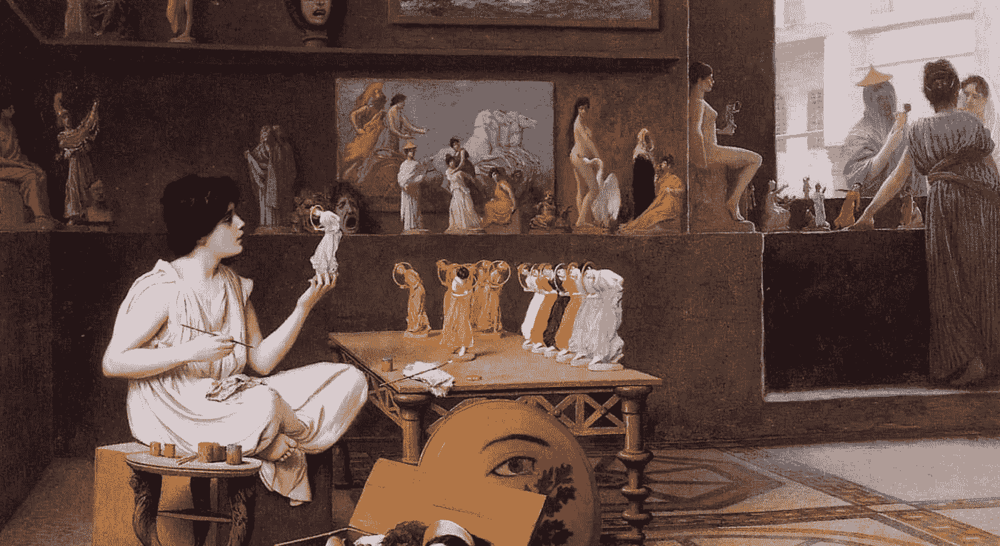
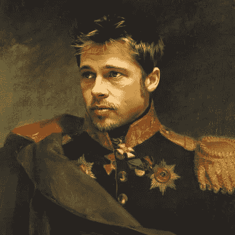
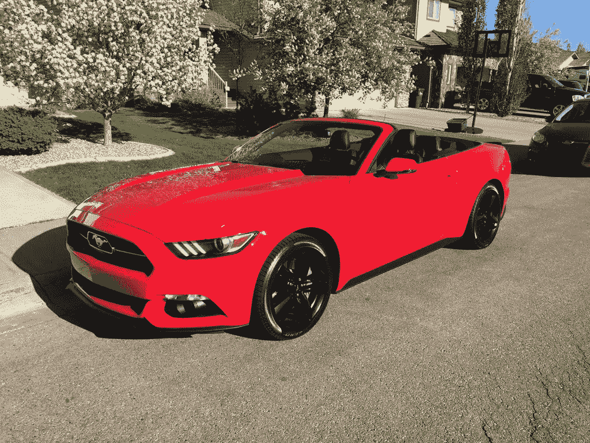
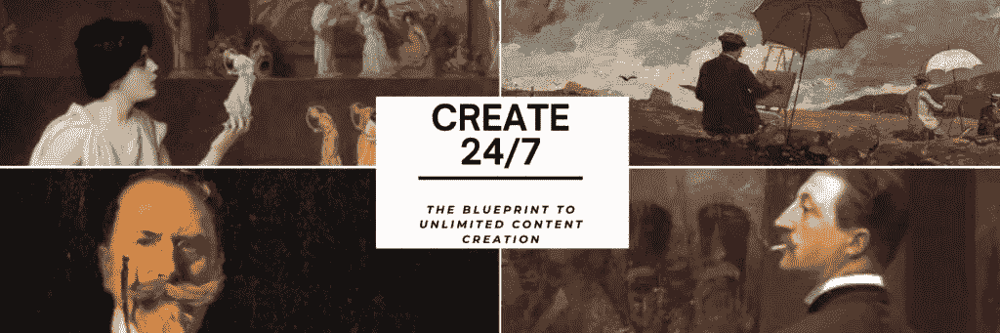
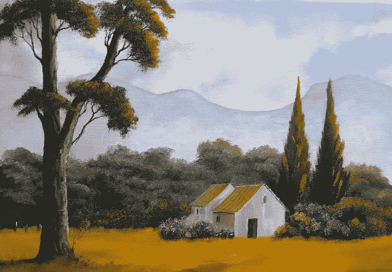
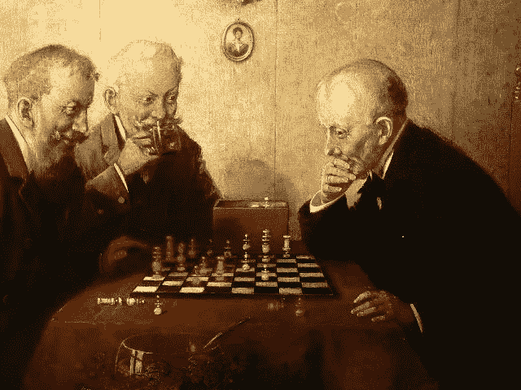

# 与特邀嘉宾“目的的艺术”一起畅想你的梦想生活

> 原文：<https://medium.datadriveninvestor.com/imagineering-your-dream-life-with-special-guest-the-art-of-purpose-1566fcc8d170?source=collection_archive---------6----------------------->

今天，我很高兴能邀请到《目的的艺术》中的“AOP”作为我博客的采访嘉宾。

如果你还不了解他，以下是我认为你应该尽快了解他的原因:

今年，他在“金钱推特”上掀起了一阵风暴。

AOP 将 Covid 危机作为一个机会来适应和使用他的技能来开始他生活中的一些新东西。从 Covid 在 2020 年 3 月第一次走红的那一刻起，他的 Twitter 账户 [@creation247](https://twitter.com/creation247) 就开始挑战“社交媒体引力”，并迅速超越许多其他人——以光速！

今天，我们将探索他的背景故事，我非常确定你可以从中获得灵感和有价值的见解，关于如何想象你自己的梦想生活向前发展！

不要只是生存，[在 2020 年的](https://www.financial-imagineer.com/2020/08/08/2020/)茁壮成长！

在您继续之前，请点击下面的“播放”并收听 AOP 的个人音乐推荐来阅读此帖子！

背景:勃拉姆斯一生只创作了 4 部交响曲:质量对他来说就是一切。

现在，事不宜迟，我们开始面试吧，好吗？

# 问:谁是“目的的艺术”？

点击这里:[关注@creation247](https://twitter.com/creation247?ref_src=twsrc%5Etfw)

我的 Twitter 名字是“目的的艺术”或简称 AOP。我曾经是一名歌剧演员，和世界上一些最著名的演员一起环游世界。在过去的 35 年里，我参与了各种形式的艺术。首先是作为学生，然后是创作者，现在是老师。到目前为止，我是一名有 20 多年工作经验的公立学校认证教师。

幸运的是，我在很小的时候就发现了自己学习、表演和教学的热情。

也是从很小的时候，我就看到许多优秀的艺术家创作出了美丽的作品，但他们仍然是“饥饿的艺术家”。

2020 年初，我开始在 Twitter 上做“AOP ”,目标是把 Twitter 变成我的个人艺术画廊。AOP Twitter 账户大约 90%是真实生活中的我。

没有闹钟，我通常在早上 5 点左右起床，花时间上网。这包括我的[推特账户](https://twitter.com/creation247)和我的[目的艺术网页](https://www.aestheticsareethics.com/)。一旦太阳升起，我将成为一名教师，并在休息时间继续与我的在线观众互动。

如果你做你喜欢的事情，你根本不会想工作。

它变得更像某种电脑游戏。

我们都知道游戏会变得多么容易上瘾——这就是为什么《创造 247》。

虽然我喜欢在网上创作和教授我学到的课程，但我直言不讳的目标是艺术家们有饭吃，我不想自己成为一个精疲力竭、饥肠辘辘的艺术家！

# 问:AOP，一个人找到目的后怎么走？

这是一个可悲的事实，但是太多的人在没有任何计划的情况下度过一生。他们醒来，去工作，去睡觉，在他们意识到之前，变老了。他们的生命将会飞逝——就是这样！？如果那是你，你会很合群，但你永远不会突出。对许多人来说，思考和反思生活太难了。

优先考虑花时间这样做！

*(金融幻想家:找到你的技术，有些人发誓徒步旅行，健身，练习冥想，对我来说*[*Jaccuzzi Beerstorming*](https://www.financial-imagineer.com/2020/07/21/the-art-of-jacuzzi-beerstorming/)*效果最好！)*

首先想象你想成为什么样的人，想实现什么样的目标。

写下你的想法。以此作为你的使命和愿景。这一定是你的指南针。不时重读一遍。坚持到底，但是，不要追求完美，让你自己和你未来的想法发展，也允许一定程度的灵活性。

不断问自己:你最好的生活是什么样的？你的目的是什么？

> 今天是你余生的第一天！

*金融幻想家评论:如果你想阅读更多关于寻找你的目标的内容，你可以阅读更多关于* [*AOPs“寻找你的目标”帖子*](https://www.aestheticsareethics.com/blog/the-art-of-purpose-1) *或我的*[*【Ikigai】帖子*](https://www.financial-imagineer.com/2020/07/24/ikigai/) *。*

# 问:你的人生有过“支点”吗？

到目前为止，我的生活中实际上有两个不同的转折点。

第一次是在我 20 出头的时候:我的净资产为负。一天早上我醒来，决定不再贫穷。我想变得富有！这里的关键教训是:这是一个思维模式的转变。一切从心态开始！从我决定不再贫穷而是变得富有的那一天起，我的头脑开始活跃起来:*我要让这件事发生*。

一旦我的思想统一了，我就必须采取行动。第一步是扔掉我那辆满载的 GT 野马敞篷车。如果你不是百万富翁，就不要表现得像个百万富翁！

我立即开着耗油量大的野马去了下一家汽车经销店，换了一辆尼桑 Leaf——一辆电动车。想象一下！

思路是:既然我将带着我的家人踏上致富之旅，我必须首先做出巨大的牺牲，让每个人都能看到这一点。起初，他们都以为我疯了。但是，嘿，七年后，我们真的成了百万富翁！

幕后真相:通过解决汽车成本问题，我设法减少了每年的通勤成本(仅从汽油方面来看)，从每加仑 20 英里的野马汽车的 7000 美元，到每千瓦 7 美分的电动解决方案。仅此一项就导致每年 150 美元的新通勤成本。这种交换产生了每年 6500 美元的循环储蓄机会，这些钱立即进入了避税账户的股票市场。嘣！

你算算。

这让我开始梦想致富。

第二个引爆点是在 2020 年初的电晕病毒危机期间。

一天晚上，我登录我的账户，发现一个双逗号数字出现了。

它已经发生了。39 岁:*百万富翁*！

起初，我期望生活中的这个点会有不同的感觉。但是没有什么特别的。我们庆祝，我们开心，我们的计划成功了，但是嘿:生活还在继续。*接下来的*是什么？

就在那时，我决定开始分享我的道路和故事，并帮助他人。我需要一个平台。我以前上过 Twitter，但更多的是作为一个读者，一个消费者。

现在，我决定要回馈社会，教别人如何成为新世界的创造者和影响者！这就是我开始我的推特账户 [@creation247](https://twitter.com/creation247) 的时间和原因。

*金融幻想家评论:如果你愿意，你可以在我的博客* [*“我成为百万富翁的那一天”*](https://www.aestheticsareethics.com/start-here) *中了解更多关于这些关键点的信息。* [关注@creation247](https://twitter.com/creation247?ref_src=twsrc%5Etfw)

# 问:你是如何准备的？你是怎么开始的？

如前所述，我被训练成为所有艺术领域的专业表演者。我以前也从斯科特·亚当斯那里读过很多关于说服技巧的书。你把所有这些加在一起，然后和我每天打 8-9 个小时的电子游戏混在一起。你可以说，我的生活导致了这一点，我完全有能力采取下一步，开始我的网上故事！

为了创建 AOP，我使用了我所有的知识，世界上最好的知识和洞察力，迈出这一步，成为一个有影响力的人。你可以称 AOP 账户为精心设计的说服黑客，它结合了布拉德·皮特的照片和美丽的画作，用强有力和令人信服的声音向观众说话。整体包装以这种精确的方式结合了你熟悉但从未听说过或见过的东西。

对我来说，进入社交媒体并成为一名有影响力的人就像提升我的电脑游戏技能，创造一些东西来激励其他人采取行动改善他们的生活。

# 问:你的学习曲线是怎样的？对于喜欢跟随你脚步的人，你有什么小技巧？

玩电脑游戏很有趣。但是，嘿，让我们面对它:这也是一个巨大的浪费很多时间！你再也回不去的时间。作为一名艺术家，无论是在网上还是在网外创作，都不像看起来那么容易。首先，也是最重要的，这是一个很大的工作量。

在 2020 年 5 月开始使用 AOP Twitter 账户后，我获得了 470 个关注，在 6 月份，我又设法增加了 100 个关注。后来，更多的后续来得更快。成长和成功从来不是线性的。在最初的几个月里，我发布了非常不错的东西，质量和现在一样，有超过 17，000 的关注。

有时行得通，有时行不通。

我的学习曲线是更专注于(在 Twitter 上)与他人交流和联系。我的目标是弄清楚如何“玩这个游戏”。我可以肯定，如果你真的想在 Twitter 上成长，你必须和别人联系。这样做的最大好处之一是你可以和你所在领域的一些最聪明的人建立联系。

他们实际上只是一个鼠标点击了！

最近，我开设了一门在线课程，教那些对探索这条道路感兴趣的人。

我的在线课程“每周 7 天每天 24 小时创造”从一本 Twitter 成长书籍开始，并附带额外的视频模块。将来会有更多的模块上传:这是一个真正无限的 Twitter 成长课程！

你可以在这里找到我的课程:[“24/7 创造:无限内容创造的蓝图”](https://gumroad.com/l/twitterunlocked)

# 问:“成功”对你意味着什么？

成功可以有多种定义。

不是每个人都能成为人生中“最富有”的人。

对我来说，成功意味着足够强大去帮助别人，首先是供养我的家庭。

在那之后，我能够走自己的路，同时避免艺术家饥饿综合症。

对我来说，成功意味着:实现你的目标。

# 问:你的成功公式是什么？

我的成功公式围绕着我的家庭价值观。有时候，我可能是一个非常好胜的人——但我想要的只是为我的家人创造更好的生活。这个“公式”可以分为三大支柱。

**第一:大学教育。**

多亏了奖学金，我才在没有学生债务的情况下接受了大学教育！

学术背景塑造了我不断深入研究我感兴趣的任何事物的想法。当进入一个新的主题时，我可以花很多时间去寻找和研究现有的最佳信息。优先向最优秀的人学习一切。

 [## 一个非常现实的禁忌:有毒文化威胁每个人|数据驱动的投资者

### 有毒文化是从它们接触到的任何东西中滋生的疾病，使生产性工作无法进行。如此有毒…

www.datadriveninvestor.com](https://www.datadriveninvestor.com/2019/08/09/a-very-real-taboo-toxic-culture-threatens-everyone/) 

**第二:采取行动**

一旦你开始获得相关信息，学会如何使用它并根据它采取行动。走向成功需要大量的实践学习。不要只是积累理论知识而从来不采取行动。开始行动，从错误中学习，继续前进。

**第三:永远不要被否定！**

如果你想要什么，就去争取。确定成本——可能是你的时间、努力和/或金钱——如果你认为值得的话:付出代价！

永远不要被否定。

以上是定义我个人成长轨迹的三个主要因素。

说到钱，你也应该做和上面提到的一样的事情，向最好的人学习，教育自己，采取行动，尽管有人反对，也要为你的目标努力。

尤其是钱，我额外的建议是尽量自动化。如果有兴趣，你可以在我的博客[“让你的生活自动化到一百万”](https://www.aestheticsareethics.com/blog/automate-your-life-to-a-million-the-five-step-process)中读到更多关于如何做到这一点的内容。

当心你周围的人。

你变成了你们相处时间最长的五个人的平均值。

同样，仔细阅读新闻或音乐。你的任何想法都会在某种程度上影响你。避免被编程。

控制你消费的质量！

你消费的东西的质量决定了你会成为什么样的人。

# 问:是什么启发了你去“构建”你的生活？

在我的一生中，我有幸从小就和最优秀的人一起成长和学习。我的灵感来自于我能找到的最好的老师，最好的艺术家，然后是最好的作家和网上资源。

对于表演和说服的艺术来说，最鼓舞人心的源泉在哪里呢？

对于上网，我主要受到健身人士和心态黑客博客的启发。

让我们记住这一点:无论你做什么，都要向最优秀的人学习，学习如何玩游戏！

> "当你打曲棍球时，你不是去冰球所在的地方，而是去冰球要去的地方。"韦恩·格雷茨基

记住上面的引用，“玩 Twitter”没什么不同。

截至目前，我已经准备了大约 1000 条推文，我正在观察“当天的情绪”，以相应地播放我最好的推文！

# 问:你是如何做决定的？

首先，也是最重要的，正如前面提到的，家庭对我来说永远是第一位的！

除此之外:要有计划。

知道你要去哪里。看大图。当陷入困境时，保持灵活性，灵活性是提高自己的关键。保持开放的心态，试着总是保留所有的选择。

这并不意味着我一直在改变我的方向。不。但是如果我碰巧遇到新的高级信息，我会更愿意抛弃旧的信念去适应。

在信息时代，这是做出正确决策的一个非常重要的方面。我们的世界正以几十年前难以想象的速度不断发展。

> 适应性最强的生存下来，而不是最强的。

*金融幻想家点评:点击阅读如何与伴侣制定* [*5 年计划，设计自己的人生*](https://www.getrichslowly.org/couple-goals/) *。*

# 问:未来 10 年，数字化将如何塑造我们的生活？

我是一个 20 世纪 80 年代的孩子，还记得当年，当互联网还处于婴儿期时，它的建设者们相信能够通过民主化信息访问来解决财富不平等问题！

几年后，我们知道:发生了完全相反的事情。

穷人不知道该做什么，也不知道如何处理信息。

富人利用信息并提高。

事实上，互联网不知何故使问题变得更糟！

现在，我们仍然可以说我们在某种程度上处于社交媒体的婴儿期。我们慢慢看到主流媒体是如何被淘汰的。最终它会被取代。用户更喜欢消费来自社交媒体的内容。他们的时间线是高度定制的，每个人在某种程度上都有自己的“通道”。

我们现在可以在全球范围内点播个性化新闻。

没有什么比来自博主、有影响力的人和有话要说的人的未经过滤的信息更好的了。

来自内心的未经过滤的信息是无与伦比的。

这就是为什么我相信数字化将为许多人创造建立自己品牌的巨大机会。从今天开始，开始你的品牌，并了解如何使用社交媒体，而不是从它那里消费。

我对 AOP 帐户的愿景是创建现有的关于内容创建的最佳课程！

*金融幻想家评论:在我的博客文章*[*“2020 美元——新十年的繁荣”*](https://www.financial-imagineer.com/2020/08/08/2020/) 中阅读更多关于如何在 2020 年繁荣的信息

# 问:要过上幸福的生活，你有什么建议？

这是一个惊人的事实:75%的人相信金钱可以买到幸福。但只有少数人知道，幸福不知何故会停滞在年收入 7 万美元左右。

研究还表明:如果你中了彩票或者失去了四肢，你一开始会欣喜若狂或者沮丧，但最终你的幸福水平会回归到均值，无论如何。

这就是所谓的享乐主义适应。

这就是为什么我对年轻人的建议是熟悉**斯多葛主义**。

它教导发展自我控制和毅力，作为克服破坏性情绪的一种手段。坚忍是冷静，有时不带任何感情。

当你坚忍的时候，你会接受任何正在发生的事情。这是你可以真正控制自己快乐程度的一部分！

> 幸福=期望-现实。

# 问:你个人的人生终极目标是什么？

我想象自己在世界上几个地方有房地产。最终，我的梦想是去海滩。我的大本营现在和将来都是德克萨斯州。

不管会发生什么，我仍然想在社交媒体上和你一起学习，一起成长！

# 最后的话

感谢您抽出时间与我的读者分享您的见解！

点击这里:[关注@creation247](https://twitter.com/creation247?ref_src=twsrc%5Etfw)

如果你有兴趣发展你的 Twitter 或者成为某种类型的创造者，请随时联系我们并保持联系！人类历史上从来没有像今天这样容易向全球观众传播你的想法。世界是开放的，渴望好的内容。

如果你喜欢这次采访，请分享它(社交媒体按钮在下面，评论，转发)或在下面留下评论，谈谈你认为了解 2020 年的生活想象会有什么有趣的事情！

向最优秀的人学习，

金融想象工程师马特

如果你想阅读更多来自 AOP 的内容，[点击这里加入“反叛”并把你自己添加到他的时事通讯](https://www.aestheticsareethics.com/newsletter)或[在 Twitter 上关注他](https://twitter.com/creation247)。

如果你还没有加入我的收件箱团队，请在下面的框中通过电子邮件订阅，如我的脸书页面，在 Twitter 上关注我。

*原载于 2020 年 11 月 29 日 http://www.financial-imagineer.com***。**

## *获得专家观点— [订阅 DDI 英特尔](https://datadriveninvestor.com/ddi-intel)*