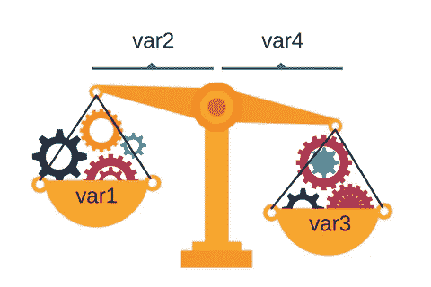
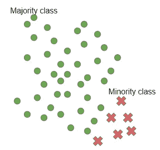
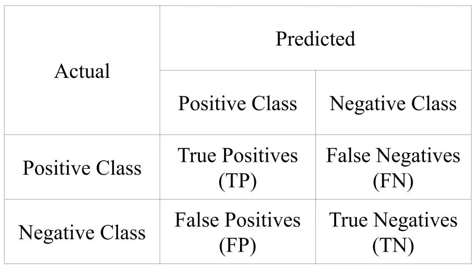
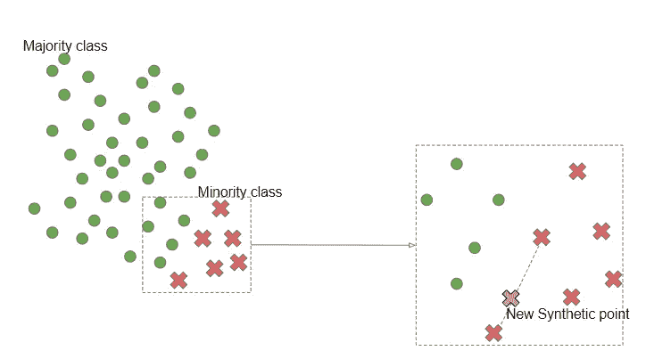
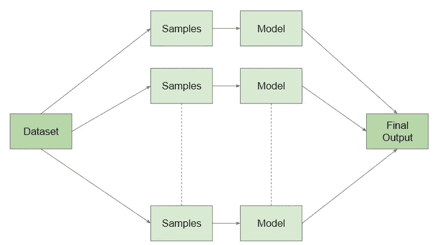
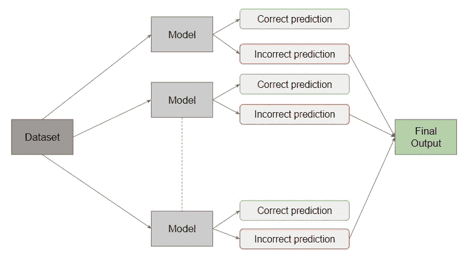

# 不平衡数据处理策略

> 原文：<https://medium.datadriveninvestor.com/imbalance-data-handling-strategies-d4711b18246f?source=collection_archive---------13----------------------->



# 介绍

如果你从事机器学习或数据科学，你应该听说过不平衡数据处理这个术语。当大部分数据样本属于一个类别而只有少数样本属于另一个类别时，就会出现这种情况。这个问题经常出现在一些场景中，如检测异常情况，如识别罕见疾病、银行欺诈交易等。



Distribution of majority and minority class

我们将看一个不平衡数据的例子。考虑这样一个场景，在医院里对 100 名病人进行体检。

总观察值= 100，检测为阳性的患者数= 20，检测为阴性的患者数= 80，不平衡比率= 1:4。

我们不能保证我们可以通过采取或改变上述实验的样本数量来获得一个平衡的比率。

# 数据不平衡的问题

传统的评价指标不能用来衡量分类不平衡数据的性能。传统的分类算法(如逻辑回归和决策树算法)偏向于数据集的偏斜度。因此，很有可能所有样本都被预测到具有多数样本的一个类别中。因为有时少数类样本可能被当作噪声忽略。混淆矩阵将清楚地显示实际标签和预测标签的样本分布情况。



Confusion Matrix

# 处理数据不平衡的策略

## 数据级策略(重采样)

重采样方法通过为少数类生成新的样本，在不平衡的数据集中创建一个平衡。这个过程必须在向模型提供数据之前的预处理阶段完成。这里我们可以通过减少多数类中的样本数或者增加少数类中的样本数来达到平衡。我们可以讨论许多可用于处理不平衡数据的重采样方法。

我们可以使用以下命令安装不平衡学习:

```
sudo pip install imbalanced-learn
```

此外，我们可以通过运行以下命令来检查安装的库的版本:

```
import imblearn
print(imblearn.__version__)
```

可以使用以下代码生成不平衡的虚拟数据集:

```
from sklearn.datasets import make_classification# defining the dataset
train_X, train_y = make_classification(n_samples=5000, weights=[0.98])
```

**随机欠采样**

在这种情况下，该算法从多数类中随机选择并消除样本，直到两个类达到平衡。因此，训练数据将减少到非常小的数量，这可能导致训练时间减少。丢失重要数据样本的可能性很高。因此，这将导致不适当的数据分布。

随机过采样的样本代码如下所示:

```
from imblearn.under_sampling import RandomUnderSampler# defining oversampling
oversample = RandomUnderSampler(sampling_strategy='minority')# fitting the dataset to the model
new_X, new_y = oversample.fit_resample(train_X, train_y)# summarizing
print(len(train_y), len(new_y))
```

**随机过采样**

随机过采样算法通过复制随机选择的少数样本来增加少数类中的样本数量。这种方法优于欠采样技术，因为没有丢失信息的可能性。但是过度拟合的可能性很高，因为我们要多次复制现有的少数样本。

```
from imblearn.over_sampling import RandomOverSampler# defining undersampling
undersample = RandomOverSampler(sampling_strategy='majority')# fit to the model
new_X, new_y = undersample.fit_resample(train_X, train_y)# summarizing
print(len(train_y), len(new_y))
```

**不平衡数据的综合少数过采样技术(SMOTE)**

该算法有助于减少过拟合的影响，因为它忽略了重复复制现有样本。它从现有的少数样本中合成新的样本。这些新创建的样本将被添加回原始数据集中。最后，新数据集将用于训练模型。



SMOTE Algorithm

SMOTE 算法随机选择两个少数点，并在连接两个所选样本的线上合成一个新点。因此，该算法克服了随机过采样的过拟合问题和随机欠采样的信息丢失问题。但是，SMOTE 不考虑相邻的类，而是创建可能与多个类重叠的样本。而且，如果我们处理高维数据，这种算法不会更有效和高效。

SMOTE 的示例代码如下所示:

```
from imblearn.over_sampling import SMOTE# defining SMOTE
smote = SMOTE()# fit the dataset to the model
new_X, new_y = smote.fit_resample(train_X, train_y)# summarizing
print(len(train_y), len(new_y))
```

**几何击杀**

几何 SMOTE 是 SMOTE 算法的推广。G-SMOTE 初始化随机选择的少数点周围的几何区域，并在初始化的空间中合成新的样本。并且 G-SMOTE 的表现优于 SMOTE。除了 SMOTE 之外，G-SMOTE 算法主要实现三个目标。

*   该算法试图定义一个安全区域并在定义的区域内合成点。这将有助于减少噪音点的产生。
*   增加各种类型或种类的点。因此，少数民族阶层地区可以进一步扩大。
*   使用几何方程并基于参数化来定义该空间。

## 算法集成技术

可以修改现有算法来处理 dat 不平衡，而不是改变数据。集成方法可以用来提高分类器的性能。这里，在两个阶段中找到分类器，并且将给出聚合预测。

**装袋**

该算法通过替换从不平衡数据中产生 n 个组。学习算法单独学习它们，我们可以结合预测得到一个最终的输出。这种方法有助于减少差异和过度拟合。



Bagging Approach

随机森林算法以类似的逻辑工作。尽管如此，这种算法在不平衡的数据集上并没有表现得更好。当我们选择替换样本时，该数据集的子集可能不包含数据样本，也不包含同一样本的一个或多个副本。

下面给出了使用 bagging classifier scikit-sk learn 类的示例代码:

```
from sklearn.ensemble import BaggingClassifier# defining classifier
classifier = BaggingClassifier()# fit the dataset to the model
classifier.fit_resample(train_X, train_y)
```

**增压**

Boosting 算法结合了弱学习模型，以产生强学习算法。用基础学习者初始化 Boosting 算法。基础学习者被认为是弱学习者。如果我们稍微改变数据集，得到的模型有很大偏差，那么就会被认为是弱学习者。在完成基础学习阶段后，下一个级别的学习者将主要关注预测错误的场景。



Boosting algorithm

最后，我们可以说，没有一种方法可以作为处理数据不平衡的一站式解决方案。为了取得更好的成绩，我们必须尝试各种方法。

**参考文献**

[1] N. V. Chawla、K. W .鲍耶、L. O. Hall 和 W. P. Kegelmeyer，“SMOTE:合成少数过采样技术”， *jair* ，第 16 卷，第 321-357 页，2002 年 6 月。

[2]G. Douzas 和 F. Bacao，“几何 SMOTE 对 SMOTE 的几何增强插入式替代”，*信息科学*，第 501 卷，第 118–135 页，2019 年 10 月。

**访问专家视图—** [**订阅 DDI 英特尔**](https://datadriveninvestor.com/ddi-intel)