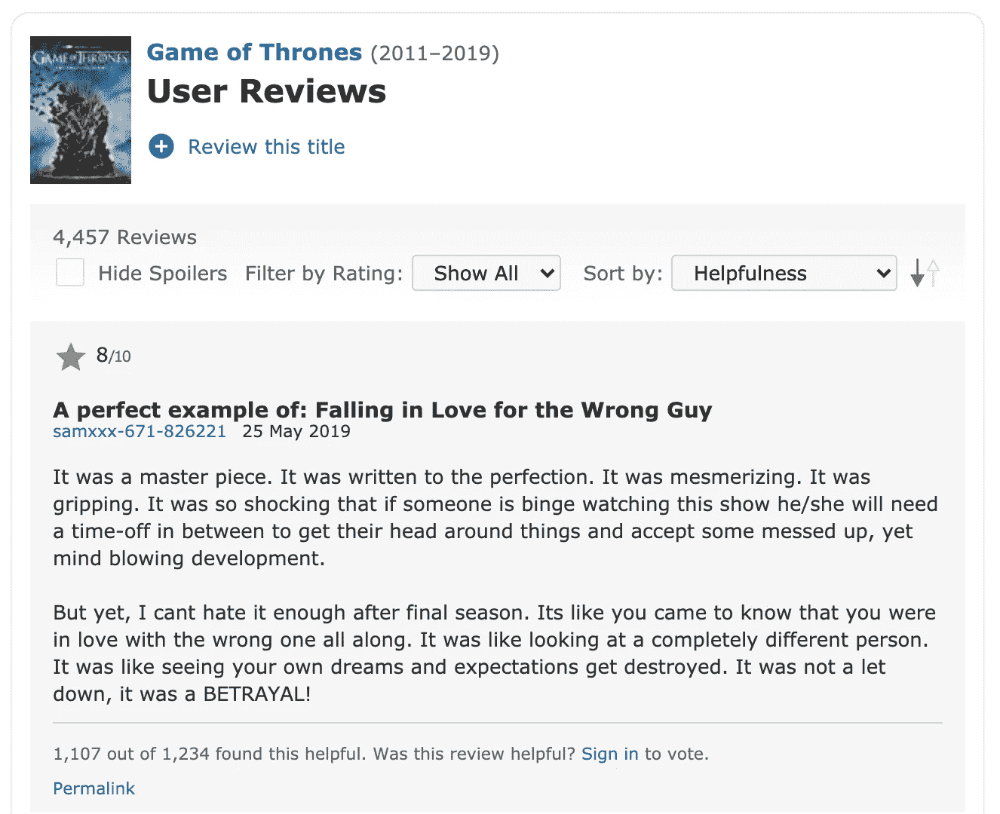
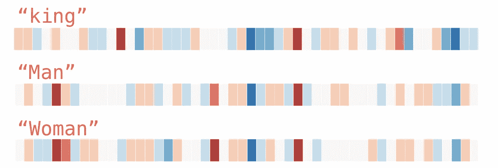

# IMDB 评论—二元分类问题[理论]

> 原文：<https://medium.datadriveninvestor.com/imdb-reviews-binary-classification-problem-theory-fbc95df0883d?source=collection_archive---------17----------------------->

这是我在深度学习方面的新系列，我将在这里写关于神经网络的现实生活应用。在这里，我们将详细了解它们中的每一个，并试图获得它们背后的直觉。我们将深入研究理论和实践概念。

如果你还没有看完我之前在 NN 后面的一系列数学直觉，我强烈建议你去看看。我们可能会在此基础上构建概念。

 [## 一瞬间学会数据科学！？数据驱动的投资者

### 在我之前的职业生涯中，我是一名训练有素的古典钢琴家。还记得那些声称你可以…

www.datadriveninvestor.com](https://www.datadriveninvestor.com/2020/07/23/learn-data-science-in-a-flash/) 

# 问题陈述

谁喜欢在这里看电影？！这里有谁在看电影前检查过 IMDB 的收视率？所以，增加对电影的评论是一种普遍的趋势。让我们从头开始建立一个神经网络，它可以确定电影评论的情绪。很酷吧。？

编码部分非常简单。更关键的是理解其背后的理论。所以，我们先从几个理论概念说起。

# 数据预处理

那么，评论通常是什么样的呢？一长串单词。对我们的计算机来说，理解它可能是最困难的工作。一个分段的文本可能会有太多的冗长和噪音——像标点符号、小型大写字母等，在寻找它的情感时可能不会增加多少价值。因此，文本清洗成为其中重要的一部分。

如果你是一名软件工程师，并且你从事过搜索引擎方面的工作——这会让你想起什么吗？！想想吧！！是的，是的，我们过去在弹性搜索中创建的映射文件。就在那条线上。

我们可以在文本上应用完全相同的概念—

*   ***记号化*** : *这只是将我们的文本分解成单独的单词(称为记号)。*
*   ***小写* ng** : *单词的意思是一样的，不考虑大小写。将所有内容转换成小写有助于一致性。*
*   ***去掉停用词* s:** *你能从像——the、a 等词中判断出任何情绪吗？这些只是制造噪音，这就是为什么那些应该被删除。*
*   ***词干*** : *“读”和“读”都是一个意思，对吧？所以，把单词转换成它的词根形式来减少我们的字典大小。*
*   ***引理:*** *其实和炮泥差不多。只是通过词干它可以想出一个单词，甚至可能不存在于英语词典中。因为 lemmatisation 确保它是一个正确的单词，所以它可能会慢一点，因为涉及到一个额外的查找过程。*

# 文本矢量化

快速问题——计算机处理整数或字符串容易吗？作为一名软件工程师，你可能会说，因为我们之前已经了解了 ASCII，所以所有的字符串最终都被转换成整数格式。因此，整数获胜。

> 文本矢量化是为了便于计算而将字符串转换为整数的过程。

让我们来学习一些流行的技术。让我们考虑一个例子，看看它在下面的每一个例子中是如何表现的。

***第一句:*** *他是个男生。* ***第二句:*** *她是个女孩。*

# 一袋单词

这很简单，让我告诉你怎么做。

*   在上面的例子中，我们的单词字典是什么:
    ***字典*** *:【“他”、“是”、“一个”、“她”、“男孩”、“女孩”】*
*   上面的字典用作一个特征集。如果一个单词出现在一个句子中，该特征被表示为 1 else 0。于是，矢量化:
    ***句子 1:****【1，1，1，0，1，0】* ***句子 2:****【0，1，1，1，0，1】*

***缺点*** :这种方法的问题在于，它赋予所有单词相似的重要性。因此，`is`和`girl`将被赋予同等的重要性。而且，它对它没有任何语义上的理解。即使`boy`和`girl`都是人类，我们也会丢失这些信息。

# TF-IDF

这基本上赋予了不常用词更多的重要性，在我们的例子中就是`boy`和`girl`。

*   ***【TF】***—给出一个词在文档中的频率的概念。
    `*TF(word)= Frequency in a sentence/Total words in a sentence*`
*   ***逆文档频率(ID* F)** —帮助识别单词的稀有度。
    `*IDF(word) = log(Total Sentences/Sentences having word in it)*`
*   我们举个例子:
    *TF(女孩)= 1/4
    IDF(女孩)= log(2/1) = 0.3
    TF-IDF(女孩)= 1/4 * 0.3 = 0.075*
*   所以，最终矢量化:
    ***句子 1:****【0，0，0.075】* ***句子 2:****【0，0，0，0.075】*

**因为，女孩和男孩在语义上是相关的，但是没有办法通过这个获得信息。**

# 单词嵌入

这是语义网取得的最了不起的进步之一。考虑一个图表，并根据它们的语义将上面所有的单词画出来。类似这张图的东西(复制自谷歌搜索)。

图表上单词的接近程度告诉我们这些单词的意思有多接近。

这是怎么做到的？创建一个二维矩阵，一边是各种特征，如物体、人、颜色等，并为每个特征赋予适当的值。好像每个单词都是由这些特征决定的。

[Source](http://jalammar.github.io/illustrated-word2vec/)

因此，有一个谷歌图书馆`word2vec`，通过它我们可以根据单词的语义得到它们的整数值。

这本身就是一个重大话题。以后一定会单独报道。但是，如果你想更深入地了解它，我强烈推荐— [第一条](http://jalammar.github.io/illustrated-word2vec/)、[第二条](https://www.distilled.net/word2vec-examples/)、[第三条](https://blog.christianperone.com/2013/09/machine-learning-cosine-similarity-for-vector-space-models-part-iii/)。

这就结束了对处理 IMDB reviews 数据的理论理解。耶！编码部分将在下一篇文章中讨论。敬请关注，继续学习:)

## 访问专家视图— [订阅 DDI 英特尔](https://datadriveninvestor.com/ddi-intel)