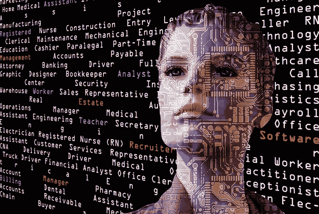

# 人工智能对就业的影响

> 原文：<https://medium.datadriveninvestor.com/impact-of-artificial-intelligence-on-employment-5e66c8d46b5c?source=collection_archive---------9----------------------->

尽管人工智能在许多方面极大地改善了我们的世界，但人工智能对就业和劳动力的即将到来的影响仍令人担忧。有预测称，未来几十年将有数百万人失业，主要原因是智能自动化和人工智能系统的影响。无论如何，整个社会经济体系正在进入加速转型阶段:*市场、企业、教育、政府*、*社会福利、*和*就业模式*都将受到严重冲击。

**面临风险的任务、角色和工作**

单调的任务，可以很容易地自动化；这可能会逐渐使某些角色过时。例如，与*客户服务/呼叫中心运营*、*文档分类*、*发现*和*检索、内容审核*相关的任务和活动越来越基于技术和自动化，而越来越少基于人工。与*操作*和*支持*生产线*和*工厂*相关的角色也是如此:人类正在被智能机器人取代，它们可以安全地在空间导航，寻找和移动物体(如产品、零件或工具)或执行复杂的组装操作。*

 [## 商业价值和人工智能的 5 个原则|数据驱动的投资者

### 提取商业价值很难。我是说真的很难...说到高级分析，这一过程甚至…

www.datadriveninvestor.com](https://www.datadriveninvestor.com/2020/07/07/5-principles-for-business-value-and-artificial-intelligence/) 

事实证明，人工智能在处理更复杂的活动时非常有效，这些活动需要处理*多个信号*、*个数据流、*和*个实时积累的知识*。一个典型的例子是能够捕捉和“理解”环境及其动态的自主车辆；他们可以*“看到”、决定*和*实时地对明确定义的优化对象采取行动*。

**将受到影响的部门**

交通已经处于转型模式——完全自动驾驶的汽车将很快成为现实——它们将更安全、更高效、更有效。职业司机(出租车、卡车等)将会看到对他们技能的需求迅速下降。

电子商务也将经历一场重大变革:履行中心将完全自动化，机器人在空间导航以收集产品和执行客户订单；然后用无人驾驶飞机和/或汽车自动发送或交付给客户。销售人员和实体店网络的重要性将会萎缩；我们接近于这样的场景，其中 [*消费者人工智能代理*与零售商*人工智能代理*](https://medium.com/innovation-machine/artificial-intelligence-negotiation-agents-49d666cd9952)——基于不同的目标、战术和战略。

甚至更多建立在牢固人际关系基础上的传统职业，如法律职业，也将受到显著影响:法律环境中的典型支持服务，必须与*文档处理* - *分类、发现、总结、比较*、*知识提取和管理*-人工智能代理已经可以很好地完成这些任务。

金融服务、保险和任何其他需要大量数据处理和内容处理的行业也将受益于人工智能，当然还有*国家、治理和社会机制*-人工智能可以在消除官僚主义、改善对公民的服务以及社会项目的设计和执行方面发挥重要作用。

**人工智能如何取代人类工作——一个例子**

想象一个典型的客户服务部门:几十个甚至几百个专门的员工在执行一个共同的任务:处理客户请求、投诉、询问等。以最好的方式。

“*以尽可能好的方式处理客户请求*的工作流程可以被分解为单独的作业，这些作业随着时间的推移和不同类型的请求而重复，例如:*客户识别*、*客户历史检索*、*请求理解*和*分类*、*问题识别*和*映射到解决方案空间*、*转发*或

*以上所有这些都可以通过人工智能算法提高的效率来覆盖——它们被证明比相应的人类团队更快、更准确、更可靠、更便宜。一个训练有素的人工智能系统可以理解自然语言中的客户请求，识别提到或暗示的实体(例如，请求所指的*产品*或*服务**)；它可以足够早地估计*客户的意图*(例如*激活服务*或*寻求帮助*)；它可以即时处理大量数据并应用公司政策，以便为特定案例确定*最佳行动/决策；然后，可以用自然语言将决策传达给客户。***

**系统也足够早地知道它是否能够有把握地处理请求*；在后一种情况下，它知道将请求作为异常重定向到哪里，以便人工团队处理它。所有这些，在几毫秒内，作为客户和公司代理之间聊天或语音会话的一部分。***

***这种技术解决方案只需要传统客户服务部门人员的一小部分。当这个混合系统在运行时，*人工智能组件从它转发给人类团队处理的异常中学习*，导致其性能的持续改进*。这种反馈循环最终将最大限度地减少对人工干预的需求，使人工智能系统实现自主。****

*****准备就绪*****

***从长远来看，我们将目睹某些角色和工作变得越来越不相关，最终被淘汰。但是，在大多数情况下，[人工智能](https://hackernoon.com/artificial-intelligence-fe713f283cfb)将对人类起到支持作用——让人类因素能够更好地处理复杂和关键的情况，这些情况需要判断力和创造性思维。与此同时，将会有许多新的角色和专业以技术和科学为重点。例如，将需要高技能专业人员*监督*或*管理*或*协调*复杂人工智能系统的*培训；为了保证*的完整性、*的安全性、*的客观性、*和*正确使用*。****

*在某些假设下，继最初因技术失业而造成的中断之后，人工智能革命将带来一个*繁荣、创造性、*和*福祉*的新时代。人类将不再需要从事常规的、价值有限的工作。劳动力和基本雇佣模式将从*长期*、*全职雇佣协议*，转变为*灵活*、*选择性高级服务产品*。*

*将会出现一系列新的商业机会，增强企业家精神、创造力和创新文化。*

*上述积极的场景需要对技术、机会和风险有共同的理解。社会需要*适应新的技术景观*，变得*更加灵活，*也要*继承一种终身学习的态度，* [*协作、创新、创业*](https://hackernoon.com/a-startup-ecosystem-by-unemployed-people-551a42399400) 。*

*各国需要以教育为重点的新战略；他们需要重新思考在智能自动化的新时代，市场、公司和雇佣协议应该如何运作；他们需要重新设计社会机制，以涵盖一系列新的场景和情况。*

***访问专家视图—** [**订阅 DDI 英特尔**](https://datadriveninvestor.com/ddi-intel)*