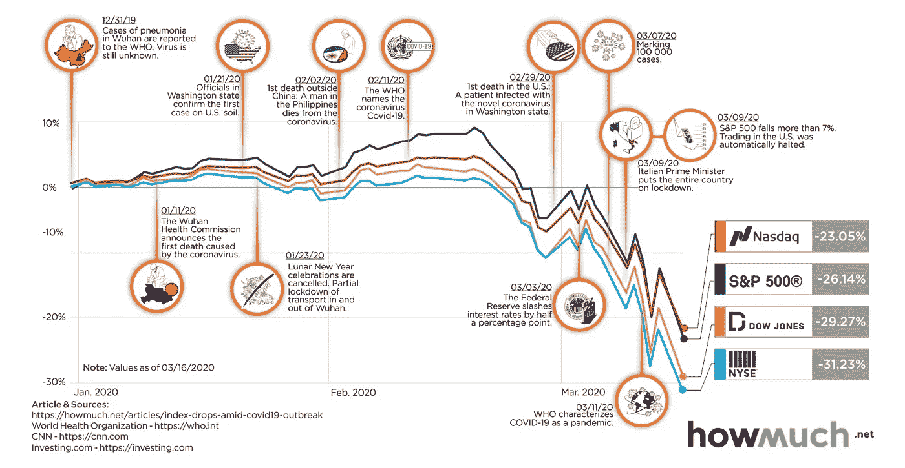

# Covid 19 对股票市场的影响。

> 原文：<https://medium.datadriveninvestor.com/impact-of-covid-19-on-stock-market-d9862059a207?source=collection_archive---------14----------------------->

我想阐明一些大家一直在思考的与新冠肺炎、股票市场和我们的未来相关的最基本的问题。

# **影响至今**

根据 Ramelli 和 Wagner 在瑞士金融研究所的研究论文，三个时期检查了影响。

## **孵化***(2020 年 1 月 2 日星期四至 1 月 17 日星期五)*

2019 年 12 月 31 日向世卫组织报告了在中国武汉检测到的病毒，2020 年 1 月 1 日，中国卫生当局在发现在武汉出售的野生动物可能是病毒来源后，关闭了华南海鲜批发市场。这些事件发生后的第一个交易日是 2020 年 1 月 2 日。到 1 月 10 日，世卫组织将其与其他冠状病毒如 SARS 联系起来。到下周初，病毒已经传播到泰国。这一天，股票市场根本没有受到新冠肺炎的影响。

 [## 现金为王，比我们想象的更强大|数据驱动的投资者

### 2020 年 3 月 12 日，在川普总统宣布新冠肺炎进入国家紧急状态的前夕，纽约时报报道…

www.datadriveninvestor.com](https://www.datadriveninvestor.com/2020/03/26/cash-is-king-more-potent-than-we-think/) 

## **爆发***(1 月 20 日星期一至 2 月 21 日星期五*)—

随后在 1 月 21 日，中国政府公布了新型冠状病毒检测试剂盒中使用的引物和探针，以帮助其他国家检测这种病毒。1 月 23 日召开了第一次紧急会议，但在此之前，病毒已经扩散到其他 4 个国家——韩国、日本、泰国和新加坡。2019 年 2 月 11 日，这种病毒被命名为“C-O-V-I-D 连字符一九——新冠肺炎”,第二天——危机管理小组(CMT)机制将世卫组织、 [OCHA、](https://www.unocha.org/)、[海事组织、](http://www.imo.org/en/Pages/Default.aspx)、[联合国儿童基金会、](https://www.unicef.org/)、[国际民航组织、](https://www.icao.int/Pages/default.aspx)、 [WFP、](https://www.wfp.org/)、[粮农组织、](http://www.fao.org/home/en/)、[世界银行、](https://www.worldbank.org/)以及联合国秘书处的几个部门召集在一起。到那个周末，世卫组织已经向 21 个国家运送了个人防护装备。2020 年 2 月 20 日标志着 2020 年股市崩盘的开始。2 月 20 日，全球股市收盘大多下跌，油价下跌 1%，10 年期和 30 年期美国国债收益率分别降至 1.51%和 1.96%。

## **发烧*(2 月 24 日星期一至至少 3 月 6 日星期五(目前))* -**

2 月 23 日星期日，意大利在伦巴第(欧洲人口最稠密和生产力最高的地区之一)严密封锁了近 50，000 人，以试图控制疫情。2 月 22 日星期六，意大利登记了首例来自新冠肺炎的死亡病例。从 2 月 24 日到今天(2020 年 3 月 29 日)——股市经历了自 2008 年以来最大的下跌，据一些人说，最糟糕的还在后面。道琼斯指数下跌了 **7766 点**，2 月 28 日，全球股市报道了自 2008 年金融危机以来最大的单周跌幅。2 月下旬的突然下降归因于对中国可能产生全球经济冲击的担忧，主要是由于国家为抗击新冠肺炎疫情 T9 而实施的隔离，这种疾病当时被列为流行病。

到三月初，有一个停滞期，大多数国家政府和大公司和银行出台了稳定市场的政策。然而，到第一周结束时，石油价格战开始了，石油价格在 3 月 7 日下跌了 25 %,当 Suadi Arabia 出人意料地宣布增产时，石油价格又下跌了 30%。

接着是黑色星期一，美国道琼斯工业平均指数下跌超过 2000 点，创下“盘中最大跌幅”。在许多亚洲市场——日本、新加坡、菲律宾和印度尼西亚——股票从最近的峰值下跌超过 20%,进入熊市。第二天，股市再次上涨，但在 3 月 11 日，亚太和欧洲股市收盘下跌，比 52 周高点低 20%以上。那一天，美国总统提出了针对欧洲为期 30 天的临时旅行禁令，以应对进一步导致市场下跌的冠状病毒疫情。

**黑色星期四-** 美国股市遭遇自 [1987 年股灾](https://en.wikipedia.org/wiki/Black_Monday_(1987))以来最大单日百分比跌幅。欧洲股市收盘下跌 11%，道琼斯工业平均指数收盘再跌 10%。加拿大 T4 标准普尔/TSX 综合指数下跌了 12%，这是自 1940 年以来最大的单日跌幅。到第二个星期一，道琼斯期货下跌超过 1000 点，标准普尔 500 期货下跌 5%，触发了熔断机制。亚太和欧洲股市收盘下跌。

接下来的某一天，市场稳定下来，但在 3 月 20 日之后，市场开始反弹。到 3 月 26 日，美国股市显示出一些底部可能正在形成的迹象。

> 那么现在是购买股票的好时机吗？尽管如此，问题仍然存在，因为冠状病毒仍然没有得到控制，有超过 825000 个病例。

# 以下是新冠肺炎一些最大投资者的想法

## 比尔·阿克曼

他一再呼吁美国全面关闭 30 天，以帮助抗击新冠肺炎病毒的传播。然而，根据这封信，阿克曼为保护潘兴广场 66 亿美元的投资组合免受病毒影响而建立的对冲基金获得了大约 100 倍的回报。阿克曼 3 月 18 日在美国消费者新闻与商业频道的一次采访中说，如果不采取严厉措施对抗病毒，“地狱即将来临”。一周后，他在接受彭博电视台采访时表示，在获得“总统和他的团队正朝着正确的方向前进”的信心后，他在反弹上下了 25 亿美元的“复苏赌注”

## 雷伊·达里奥

周二，Bridgewater Associates 的亿万富翁创始人达利奥在阿布扎比的一次会议上表示，投资者对疫情的担忧“可能对资产定价产生了一点夸大的影响，因为这是暂时性的，所以我预计会出现更多的反弹”。投资者雷伊·达里奥是世界上最大的对冲基金 Bridgewater Associates 的创始人，他在周四(3 月 19 日)告诉美国消费者新闻与商业频道记者，他估计疫情冠状病毒将给美国企业造成高达 4 万亿美元的损失。他还坚持认为，国际公司的财务损失将达到 12 万亿美元，“许多人将会破产。”

## 马克·拉斯利

“我没想到会发生这种事，我以为人们会冷静下来，”马克·拉斯利说，他是 105 亿美元投资公司 Avenue Capital Group 的联合创始人，也是密尔沃基雄鹿队的共同所有者。“大多数人都像我一样。他们会说，‘是啊，不管怎样，没什么大不了的。’拉斯里说，直到星期三，他“完全误解了这种病毒”。"

## 比尔·戴利

“我们从未经历过这样的事情，”富国银行负责政府关系的比尔·戴利说

## 乔治·索罗斯

有一种阴谋论认为“乔治·索罗斯拥有位于中国武汉的无锡医药实验室，新冠肺炎就是在武汉研发并成功爆发的。”