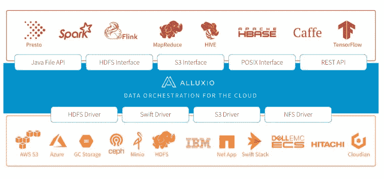
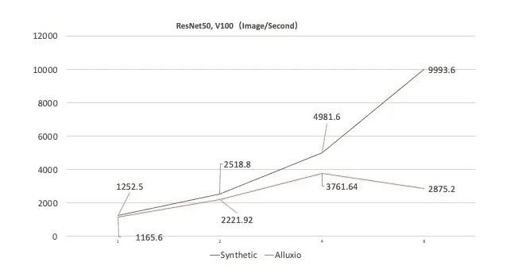
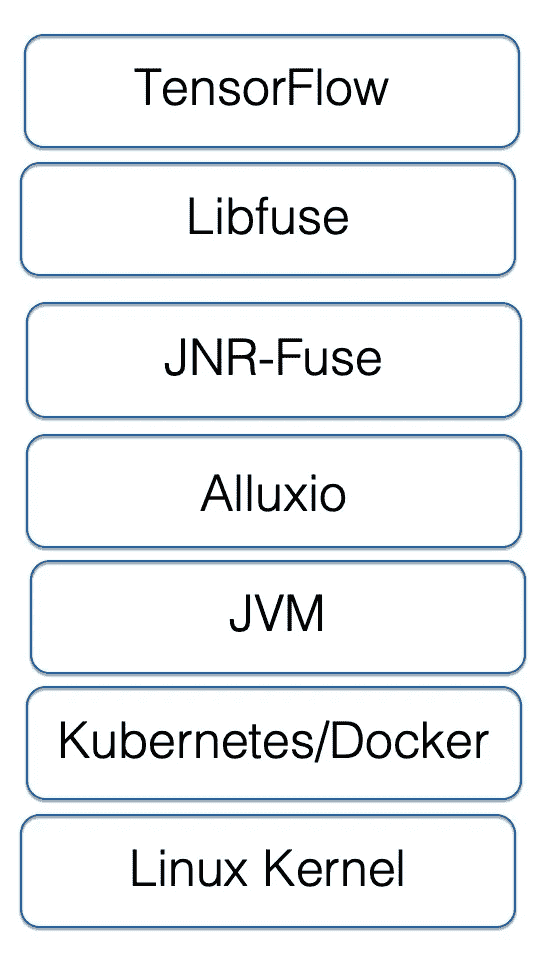

# Alluxio 优化对 Kubernetes 深度学习和训练的影响

> 原文：<https://medium.datadriveninvestor.com/impacts-of-alluxio-optimization-on-kubernetes-deep-learning-and-training-b3d46da263c6?source=collection_archive---------10----------------------->

*车阳(阿里云高级技术专家)和古戎(南京大学副研究员，Alluxio 核心开发者)*

# 人工智能培训的新趋势:场外 Kubernetes 深度学习

## 背景

近年来，[深度学习等人工智能](https://www.alibabacloud.com/product/machine-learning) (AI)技术发展迅速，正在广泛应用于各行各业。随着深度学习的广泛应用，越来越多的领域要求高效便捷的 AI 模型训练能力。此外，在云计算时代，容器和容器编排技术如 [Docker 和 Kubernetes](https://www.alibabacloud.com/product/kubernetes) 在软件开发和 O & M 期间应用服务的自动化部署方面取得了巨大的进步。Kubernetes 社区对加速计算设备资源如[图形处理单元](https://www.alibabacloud.com/product/gpu)(GPU)的支持正在增加。由于云环境在计算成本和可扩展性方面的优势以及容器化在优化部署和敏捷迭代方面的优势，基于容器化的弹性基础设施和基于云的 GPU 实例的分布式深度学习模型训练现在是业界主要的 AI 模型生成趋势。

为了确保资源扩展的灵活性，大多数云应用都采用将计算和存储分离的基本架构。[对象存储](https://www.alibabacloud.com/product/oss)常用于存储和管理海量训练数据，因为它大大降低了存储成本，提高了可扩展性。除了在云中存储数据，许多云平台用户出于安全合规性、数据所有权或遗留架构的考虑，还在私有数据中心存储大量数据。这类用户希望利用混合云构建 AI 训练平台，利用云平台的弹性计算能力进行 AI 商业模型训练。然而，本地存储和异地培训的结合加剧了计算-存储分离对远程数据访问性能的影响。基本的计算-存储分离架构使计算和存储资源的配置和扩展更加灵活。但是，就数据访问效率而言，如果在没有任何优化的情况下使用该体系结构，模型训练性能可能会由于有限的网络传输带宽而下降。

## 标准解决方案的数据访问挑战

目前，场外深度学习模型训练的标准解决方案是手动准备数据。具体来说，将数据复制并分发到非易失性快速内存(NVMe)固态硬盘(SSD)等外部独立存储设备，或者分发到 GlusterFS 云并行文件系统(CPFS)等分布式高性能存储设备。当您手动或使用脚本准备数据时，可能会遇到以下问题:

**1)更高的数据同步和管理成本:**数据的持续更新需要定期从底层存储进行数据同步，这会产生更高的管理成本。
**2)更高的云存储成本:**您需要为异地独立存储或分布式高性能存储支付额外费用。
**3)大规模扩展的复杂性更高:**随着数据量的增长，很难将所有数据复制到异地独立存储。将所有数据复制到 GlusterFS 等 CPFS 也需要很长时间。

# 基于容器和数据编排的模型训练体系结构

为了解决上述问题，我们设计并实现了一个基于容器和数据编排的模型训练架构。图 1 显示了系统架构。

## 系统架构中的核心组件

1) **Kubernetes** 是一个流行的用于深度神经网络训练的容器集群管理平台。它通过容器和敏捷的按需扩展，支持灵活使用不同的机器学习框架。阿里云[为 Kubernetes](https://www.alibabacloud.com/product/kubernetes) (ACK)提供的容器服务是阿里云提供的 Kubernetes 服务。使用它在阿里云的 CPU、GPU、神经网络处理单元(NPUs)(汉光 800 芯片)和 ECS 裸机实例上运行 Kubernetes 工作负载。
2) **Kubeflow** 是一个开源的基于 Kubernetes 的云原生人工智能平台，用于开发、编排、部署和运行可扩展和可移植的机器学习工作负载。Kubeflow 在两个 TensorFlow 框架中支持分布式训练:参数服务器和 AllReduce。基于阿里云容器服务团队开发的 [Arena](https://github.com/kubeflow/arena) ，使用这两个框架提交分布式训练工作负载。
3) **Alluxio** 是一个为混合云设计的开源数据编排和存储系统。在存储系统和计算框架之间添加了数据抽象层，以提供统一的挂载命名空间、分层缓存和各种数据访问接口。它支持在各种复杂环境中高效访问大规模数据，如私有云集群、混合云和公共云。

[Alluxio](https://www.alluxio.io/) 起源于大数据时代，创建于加州大学伯克利分校 Apache Spark 的 AMPLab。Alluxio 系统旨在解决大数据处理管道中不同计算框架通过 Hadoop 分布式文件系统(HDFS)等磁盘文件系统交换数据时的分析性能瓶颈和 I/O 操作问题。Alluxio 于 2013 年开源。经过七年的不断开发迭代，已经成为应用于大数据处理场景的成熟解决方案。随着近年来深度学习的兴起，Alluxio 的分布式缓存技术正在成为行业内异地 I/O 性能问题的主流解决方案。此外，Alluxio 推出了基于 FUSE 的 POSIX 文件系统接口，以便为异地人工智能模型培训提供高效的数据访问。

为了更好地将 Alluxio 整合到 Kubernetes 生态系统中，结合两者的优势，Alluxio 团队和阿里云容器服务团队合作开发了 [Helm Chart 解决方案](https://github.com/Alluxio/alluxio/tree/master/integration/kubernetes/helm-chart/alluxio)，极大地简化了 Alluxio 在 Kubernetes 中的部署和使用。

# 外部培训:Alluxio 分布式缓存简介

## 深度学习的实验环境

*   这里，我们使用 ResNet-50 模型和 ImageNet 数据集。数据集大小为 144 GB，其数据存储在 TFRecords 中，每个 TFRecord 大约 130 MB。每个 GPU 的 batch_size 设置为 256。
*   模型训练用 4 个 NVIDIA V100 GPUs(高配置 GPU ECS . gn6v-c10g 1.20 xlarge)，总共 32 个 GPU。
*   数据存储在阿里云[对象存储服务](https://www.alibabacloud.com/product/oss) (OSS)中。模型训练程序通过 Alluxio 读取数据，并将读取的数据自动缓存到 Alluxio。内存配置在 Alluxio 缓存层。每台机器提供 40 GB 的内存用于存储，总的分布式缓存卷是 160 GB。不使用预加载策略。

 [## 人工智能、深度学习和医疗实践|数据驱动的投资者

### 人工智能和深度神经学习的效用看起来可能是合法和有前途的，特别是…

www.datadriveninvestor.com](https://www.datadriveninvestor.com/2020/06/24/disclosure-and-resolution-program-wont-prevent-physicians-from-practicing-defensive-medicine/) 

## 性能瓶颈

根据我们的性能评估，GPU 从英伟达 P100 升级到英伟达 V100 后，单个 GPU 的训练速度提高了 300%以上。然而，计算性能的显著提高给数据存储和访问带来了更大的压力。这也对 Alluxio 的 I/O 性能提出了新的挑战。

下图比较了合成数据缓存和 Alluxio 缓存的性能。横轴表示 GPU 的数量，纵轴表示每秒处理的图像数量。合成数据是指由训练程序生成和读取的没有 I/O 开销的数据。这指定了模型训练性能的上限。Alluxio 缓存是指训练程序从 Alluxio 系统中读取的数据。当 GPU 的数量为 1 或 2 时，合成数据和 Alluxio 缓存之间的性能差异是可以容忍的。但是，当 GPU 的数量增加到 4 个时，它们的性能差异就很明显了。Alluxio 每秒处理的图像数量从 4981 幅下降到 3762 幅。当 GPU 数量为 8 时，Alluxio 上模型训练的性能不到合成数据的 30%。根据系统监测结果，系统的计算、内存和网络性能远远低于其极限，表明 Alluxio 无法高效地支持在单台主机上使用 8 个 NVIDIA V100 GPUs 进行训练。

为了深入理解影响性能的因素以及为什么需要优化，我们需要分析一下 Kubernetes 中支持 FUSE 的 Alluxio 技术栈，如下图所示。

## 原因分析

通过对技术堆栈和 Alluxio 内核的深入分析，我们将性能影响的原因总结如下:

1) Alluxio 在文件操作中引入了多个远程过程调用(RPC ),并在训练场景中产生了性能开销。

Alluxio 不仅仅是一个简单的缓存服务。它是一个分布式虚拟文件系统，提供全面的元数据管理、块数据管理、底层文件系统(UFS)管理和运行状况检查机制。它的元数据管理机制比很多 ufs 更强大。这些都是 Alluxio 的优势和特点，也构成了分布式系统产生的开销。例如，默认情况下，Alluxio 客户端用于读取文件。即使文件数据已经缓存在本地 Alluxio worker 节点中，客户端也会对主节点进行多次 RPC，以获取文件元数据并确保数据一致性。在传统的大数据场景中，完成整个读取操作的开销并不显著。然而，深度学习场景下的高吞吐量和低延迟要求很难满足。

**2) Alluxio 的数据缓存和驱逐策略频繁触发节点上的缓存抖动。**

在深度学习场景中，冷热数据没有明确区分。因此，每个 Alluxio worker 节点都需要读取所有数据。但是，默认情况下，Alluxio 首先在本地读取数据。即使数据存储在 Alluxio 集群中，Alluxio 也会从其他缓存节点中提取数据，并保留一个本地副本。在我们的场景中，这个特性会导致额外的开销:

*   异步数据缓存的额外开销。
*   由于本地空间不足，触发了自动数据驱逐的开销。

当一个节点的缓存快满时，性能开销是巨大的。

**3)基于 FUSE 的文件系统易于开发、部署和使用，但默认性能并不理想，原因如下:**

*   熔丝读取操作效率不高。每个读取操作最多只能读取 128 KB 的数据，因此必须调用 1000 次读取操作才能读取 128 MB 的文件。
*   FUSE 读操作是非阻塞行为，由 libfuse 非阻塞线程池处理。当并发请求的数量大于`max_idle_threads`指定的数量时，会频繁触发线程创建和删除操作，从而影响读取性能。在 FUSE 中，max_idle_threads 的默认值是 10。
*   频繁访问元数据会增加系统的压力，因为 FUSE 内核模块连接应用程序和 Alluxio 文件系统，并在每次读取文件或目录的 inode 和 dentry 时在 Alluxio 系统上运行。

**4)Alluxio 与 FUSE (AlluxioFUSE)的集成需要针对深度学习常见的多线程、高并发场景进行优化和深度定制。**

*   Alluxio 在 FUSE 中只支持`direct_io`模式，不能使用`kernel_cache`模式通过页面缓存进一步提高 I/O 效率。这是因为 Alluxio 要求每个线程在多线程场景中使用自己的文件输入句柄(`FileInputStream`)。但是，如果启用了页面缓存，AlluxioFUSE 可能会提前并发读取缓存，从而导致错误。
*   Alluxio 客户端读取的数据在进入 FUSE 之前会被复制多次。由于 AlluxioFUSE 使用的第三方 Java 库的 API 限制，数据被复制。
*   AlluxioFuse 实现中使用的第三方库 JNRFuse 只能适应早期版本的 FUSE，在高并发场景下会产生高性能负担。

**5) Kubernetes 影响 Alluxio 的线程池。**

Alluxio 是基于 Java 1.8 实现的，其中一些线程池是基于`Runtime.getRuntime().availableProcessors()`计算的。但在 Kubernetes 环境中，cpu_shares 的值默认为 2，Java 虚拟机(JVM)中的 cpu 核数根据`cpu_shares()/1024`计算为 1。这会影响容器中 Java 进程的并发性。

# 场外模型训练的性能优化

在分析了上述性能问题和因素后，我们设计了一系列性能优化策略来提高场外模型训练的性能。首先，很难同时确保数据访问的速度、质量和成本效益。相反，我们只关注在模型训练中加速对只读数据集的数据访问。优化的基本思想是以一些适应性为代价来确保高性能和数据一致性，例如同时读写和连续数据更新。

基于此，我们设计了符合以下核心原则的特定性能优化策略:

*   找到资源限制，包括容器中线程池和 JVM 的配置。
*   使用多层缓存，包括 FUSE 层的缓存和 Alluxio 元数据缓存。
*   避免额外的开销并减少不必要的跟踪。例如，避免不必要的元数据交互以及导致上下文切换的垃圾收集(GC)线程和编译器进程，并简化一些 Alluxio 操作。

我们将从每层组件优化的角度来描述这些优化策略。

# 保险丝优化

## 升级 Linux 内核版本

fuse 在两层实现:libfuse 运行在用户态，FUSE 内核运行在内核态。我们做了很多优化来融合最新版本的 Linux 内核。我们发现 Linux 内核 4.19 的读取性能比 Linux 内核 3.10 提升了 20%。

## 优化保险丝参数

**1)延长融合元数据的有效期。**

Linux 中的每个文件包含两种类型的元数据:`struct dentry`和`struct inode`。它们是内核中文件的基础。这两个结构必须在对文件进行所有操作之前获得。因此，每次获取文件或目录的 inode 和 dentry 时，FUSE 内核都会从 libfuse 和 Alluxio 文件系统执行一次完整的操作，这在高延迟、高并发数据访问的场景下对 Alluxio 主节点造成了很大的压力。`–o entry_timeout=T –o attr_timeout=T`可以进行优化设置。

**2)配置** `**max_idle_threads**` **避免频繁的线程创建和删除操作，产生 CPU 开销。**

这样做是因为 FUSE 开始在多线程场景中运行一个线程。当有两个以上的可用请求时，FUSE 会自动生成额外的线程。每个线程一次处理一个请求。处理完一个请求后，每个线程检查线程的数量是否超过了`max_idle_threads`指定的数量(默认为 10)。如果是这样，多余的线程将被回收。该字段与用户进程中生成的活动 I/O 线程的数量相关，可以设置为读取线程的数量。但是 max_idle_threads 只支持 libfuse3，而 AlluxioFUSE 只支持 libfuse2。所以我们修改了 libfuse2 的代码来支持`max_idle_threads`的配置。

# Alluxio 优化

Alluxio 和 FUSE 通过`AlluxioFuse`流程进行整合。该进程调用嵌入式 Alluxio 客户端，以便在运行时与正在运行的 Alluxio 主节点和工作节点进行交互。针对深度学习场景，我们定制了`AlluxioFuse`的 Alluxio 属性来优化性能。

## 避免由频繁的缓存驱逐导致的缓存抖动

在深度学习训练场景中，每个训练迭代都是一个完整数据集的迭代。任何节点都不可能有足够的空间来缓存数 TB 的数据集。Alluxio 的默认缓存策略是为冷热数据明显区分的大数据处理场景(比如查询)而设计的。数据缓存存储在 Alluxio 客户端的本地节点中，以确保下次读取的最佳性能。这些配置如下:

1) `alluxio.user.ufs.block.read.location.policy`:默认值为`alluxio.client.block.policy.LocalFirstPolicy`。这意味着 Alluxio 会不断地将数据保存到 Alluxio 客户端所在的本地节点。在这种情况下，当缓存接近满时，节点上的缓存会不断出现抖动。这大大降低了吞吐量和延迟，并给主节点带来了很大压力。因此，`location.policy`需要设置为`alluxio.client.block.policy.LocalFirstAvoidEvictionPolicy`，并且必须设置`alluxio.user.block.avoid.eviction.policy.reserved.size.bytes`参数。此参数指定要保留的数据卷，以防止本地缓存被收回。通常，该参数的值必须大于节点缓存 x 的上限(100% -节点逐出的最大百分比)。
2) `alluxio.user.file.passive.cache.enabled`:指定是否在 Alluxio 的本地节点上缓存额外的数据副本。默认情况下，该属性处于启用状态。因此，当 Alluxio 客户端请求数据时，客户端所在的节点会缓存来自其他工作节点的数据。您可以将该属性设置为 false，以避免不必要的本地缓存。
3) `alluxio.user.file.readtype.default`:默认值为`CACHE_PROMOTE`。这种配置有两个潜在的问题:首先，数据可能会在同一节点上的不同缓存层之间移动。其次，对数据块的大多数操作都需要锁。但是，很多锁操作在 Alluxio 的源代码中是相当重要的。大量的加锁和解锁操作会在高并发时产生大量的开销，即使没有数据迁移。因此，可以将该参数设置为 CACHE，而不是默认值`CACHE_PROMOTE`，以避免 moveBlock 操作造成的锁定开销。

## 缓存元数据和节点列表

在深度学习训练场景中，在每个训练任务开始之前，会列出所有训练数据文件，并读取元数据。运行训练任务的过程进一步读取训练数据文件。通过 Alluxio 访问文件时，默认情况下会完成以下操作:从主节点获取文件元数据和块元数据，从工作节点获取块元数据的位置，然后从获取的位置读取块数据。完整的操作包括多个 RPC 的开销，并导致显著的文件访问延迟。如果将数据文件的块信息缓存到客户端内存中，文件访问性能将会得到显著提高。

1)当您将`alluxio.user.metadata.cache.enabled`设置为 true 时，将在 Alluxio 客户端上启用文件和目录元数据缓存，因此您无需再次通过 RPC 访问元数据。根据分配给 AlluxioFUSE 的堆的大小，设置`alluxio.user.metadata.cache.max.size`来指定缓存文件和目录的最大元数据量。还要设置`alluxio.user.metadata.cache.expiration.time`来调整元数据缓存的有效期。此外，当您选择 worker 节点来读取数据时，Alluxio 主节点会不断查询所有 worker 节点的状态，这在高并发情况下会产生额外的开销。
2)将`alluxio.user.worker.list.refresh.interval`设置为 2 分钟或更长。
3)读取文件时最后一次访问时间不断更新，这给高并发场景下的 Alluxio 主节点带来很大压力。因此，我们在 Alluxio 代码中添加了一个开关，禁止更新上次访问时间。

## 充分利用数据局部性

数据局部性表示数据计算在数据所在的节点上进行，以避免数据通过网络传输。在分布式并行计算环境中，数据局部性非常重要。容器环境支持两种短路读写模式: [UNIX socket](https://en.wikipedia.org/wiki/Unix_domain_socket) 和直接文件访问。

*   UNIX 套接字模式提供了良好的隔离，因此 Alluxio 客户端和 Alluxio 工作节点不需要在同一网络、UNIX 分时(UTS)系统和挂载命名空间上运行。但其性能低于直接文件访问模式，可能会出现 Netty 的 [OutOfDirectMemoryError。](https://github.com/Alluxio/alluxio/issues/9345)
*   对于直接文件访问，您必须确保在同一台计算机上运行的 Alluxio worker 节点和 AlluxioFUSE 的主机名和 IP 地址相同，并且 Alluxio 客户端和 worker 节点共享相同的缓存目录。这种模式性能更好，也更稳定。但是，此模式要求 Alluxio 客户端和 Alluxio 工作节点共享同一个网络、UTS 系统和装载命名空间。

目前，我们倾向于后一种解决方案。

# Java 和 Kubernetes 优化

## 设定`ActiveProcessorCount`

该参数由`Runtime.getRuntime().availableProcessors()`控制。如果使用 Kubernetes 部署一个容器，而没有指定 CPU 请求的数量，那么 Java 进程将从容器中的 proc 文件系统(procfs)中读取两个 CPU 份额。在这种情况下，`availableProcessors()`根据`cpu_shares()/1024`计算为 1。这限制了容器中 Alluxio 的并发线程数量。Alluxio 客户端是一个 I/O 密集型应用程序。因此，设置`-XX:ActiveProcessorCount`来指定处理器的数量。基本原则是尽可能将`ActiveProcessorCount`设置为较大的值。

## 调整 GC 和 JIT 线程

`-XX:ActiveProcessorCount`指定 JVM 的 GC 和实时(JIT)编译线程的默认数量。但是，您可以使用`-XX:ParallelGCThreads`、`-XX:ConcGCThreads`和`-XX:CICompilerCount`参数将其设置为较小的值。这避免了这些进程的频繁抢占和故障转移以及由此导致的性能下降。

## 优化结果

Alluxio 优化后，单主机 8 个 GPU 的 ResNet-50 训练性能提升 236.1%，解决了可扩展性问题。培训过程可能会扩展到四台主机上的八个 GPU。此外，与合成数据的性能相比，性能损失仅为 3.29%(每秒 31068.8 幅图像对每秒 30044.8 幅图像)。在合成数据场景下，使用四台主机上的八个 GPU 完成训练需要 63 分钟，使用 Alluxio 需要 65 分钟。

# 摘要

在本文中，我们总结了在高性能分布式深度学习模型训练场景中应用 Alluxio 的挑战以及我们在优化 Alluxio 方面的实践。我们还讨论了在高并发读取场景中提高 AlluxioFUSE 性能的多种方法。最后，我们基于我们的 Alluxio 优化实现了一个分布式模型训练解决方案，使用四台主机上的八个 GPU 验证了 ResNet-50 的性能。在这次测试中，我们的系统取得了良好的效果。

Alluxio 正在努力支持页面缓存，并确保在具有大量小文件的高吞吐量场景和高并发读取场景中的 FUSE 稳定性。阿里云[容器服务](https://www.alibabacloud.com/product/kubernetes)团队将继续与 Alluxio 开源社区和南京大学的教授(如戴海鹏和古戎)合作，以进一步改进。我们相信，通过行业、开源社区和学术界的共同努力和创新思想，我们可以逐步降低计算-存储分离场景中深度学习训练的数据访问成本和复杂性，进一步促进场外人工智能模型训练。

# 感谢

Alluxio 团队的范斌、邱璐、Calvin Jia 和 Chang Cheng 为该解决方案的设计和优化提供了巨大帮助。他们通过 Alluxio 自身的能力对元数据缓存系统进行了重大改进，使 Alluxio 在 AI 场景中的应用成为可能。谢谢大家。

# 关于作者

*   **车阳，**阿里云高级技术专家，专门从事 [Kubernetes 和容器相关产品](https://www.alibabacloud.com/product/kubernetes)的开发。他专注于如何使用云原生技术来构建机器学习平台和系统，并且是 Kubernetes 中 [GPU 共享调度程序扩展器的主要作者和维护者。](https://github.com/AliyunContainerService/gpushare-scheduler-extender)
*   **古戎，**南京大学副研究员，Alluxio 的核心开发者，研究大数据处理。2016 年获得南京大学博士学位。他曾是微软亚洲研究院(MSRA)、英特尔和百度大数据系统的研发实习生。

# 原始来源:

 [## Alluxio 优化对 Kubernetes 深度学习和训练的影响

### 阿里巴巴集装箱服务 2020 年 8 月 25 日 90 车阳(阿里云高级技术专家)和古戎…

www.alibabacloud.com](https://www.alibabacloud.com/blog/impacts-of-alluxio-optimization-on-kubernetes-deep-learning-and-training_596534) 

**访问专家视图—** [**订阅 DDI 英特尔**](https://datadriveninvestor.com/ddi-intel)