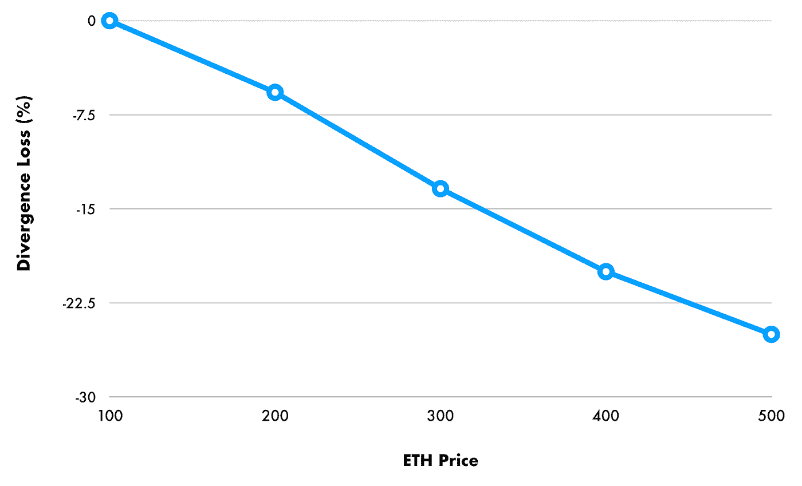

# DeFi 中的非永久性损失——提供流动性所涉及的风险

> 原文：<https://medium.datadriveninvestor.com/impermanent-loss-in-defi-the-risks-involved-in-providing-liquidity-67c54fdf1cfc?source=collection_archive---------0----------------------->


*非永久性损失*也称为*分散损失*，是当你在 AMM(自动做市商)[流动性池](https://uniswap.org/docs/v2/core-concepts/pools/)中持有代币和仅仅在区块链持有代币(即 HODLing)之间的差异。当在市场中为流动性提供代币时，它们从流动性池中向其他用户提供资金。当霍德林，代币只是持有的市场价值。

在提供流动性时，流动性池中代币的价格可以向任何方向偏离。分歧越大，用户(即流动性提供者)遭受的非永久性损失就越大。这叫做*无常*因为它只能是暂时的。当代币的价格回到用户投资的原始价值时，损失就被消除了。这在流动性池中很常见，但如果用户提取流动性并吸收损失，或者如果价格继续偏离，用户因此损失更多代币，这可能会成为永久性损失。

由于市场波动，损失可能在短期内成为永久性的。当它导致负回报时，这严重影响用户在池中的投资。这是由于 AMM 对代币价值的定价方式造成的。如果 AMM 与外部市场没有直接联系，那么当其他交易所的价格发生变化时，它们不会自动调整定价。

## 流动性池

当用户加入流动性池(如 Uniswap 池)时，他们必须存入一个由 ETH 和另一个 50/50 比例的令牌集组成的令牌对。这遵循*恒定产品收益率*，其规定两个流动性池代币的产品在交易后应与之前相同(不包括费用)。

```
**k = x * y**
```

使用该示例，我们可以将 ETH 表示为 x，将另一个令牌表示为 y。在这种情况下，y 表示令牌对中 DAI 的数量。假设 1 ETH = 100 美元。该池提供 10 个 ETH (10 * 100)，价值 1000 美元。该池必须容纳等量的 DAI。在这种情况下，因为 1 DAI = 1 美元，所以金额为 1，000 DAI。

```
**ETH = $100****DAI = $1****1 ETH = 100 DAI**
```

当我们有以下情况时，池是平衡的:

```
**x = 10 ETH****y = 1000 DAI****k = 10 * 1000 = 10000**
```

常数 **k** ，在池中交易前后必须始终相等(减去费用)。值 **k** 是 ETH 流动性池及其令牌对流动性池的乘积。示例中的产品是 10000，如果有变化，必须*重新平衡*，以保持该值不变。

重新平衡意味着如果你失去了一定数量的 ETH，AMM 应该通过购买更多的 DAI 来平衡它，这样不变的产品就不会改变。

总池大小贡献为:

```
**LP Total = ETH(x) + DAI(y) = 100(10) + 1(1000) = 1000 + 1000 = 2000**
```

同样，每个代币在任何给定价格下的流动性池的大小是相对于 ETH 的价格给出的:

```
**LP = Liquidity Pool****pETH = Price of ETH****ETH LP = √ (k / pETH)****DAI LP = √ (k * pETH)**
```

对于 ETH LP:

```
**= √ ( 10000 / 100)****= 10****For DAI LP:****= √ (10000 * 100)****= 1000**
```

**pETH** 与 **P1** 的**相同，是 ETH 的原价 100。**

现在假设 P2 的新价格涨到了 110，这使得资产价值增加了 10%。

```
**∆ P = ( P2 — P1 ) / P1****∆ P = ( 110–100 ) / 100 = 0.1 or 10%****P1 = 100****P2 = 110**
```

这改变了池中的平衡。现在 ETH **P2** 的值 **pETH** 是 110。

对于 ETH LP:

```
**= √ ( 10000 / 110)****= 9.534625892455923**
```

对于戴 LP:

```
**= √ (10000 * 110)****= 1048.808848170151547**
```

为了使 **k** 的值保持平衡，如果 ETH 的量减少，DAI 的量必须增加:

```
**x = 9.534625892455923 ETH****y = 1048.808848170151547 DAI****k = 9.534625892455923 * 1048.808848170151547 = 10000**
```

这创造了一个套利机会，P2 ETH 的价格上涨了 10%。被称为套利者的交易员可以从 AMM 以更低的价格购买 ETH，如果它不更新的话。套利者也受到激励，通过出售戴来平衡资金池。

[](https://www.datadriveninvestor.com/2020/10/22/bringing-defi-speed-to-private-funds/) [## 为私募基金带来定义速度|数据驱动的投资者

### DeFi 给合作所有制的旧观念带来了新的激情。客户获得代币，赚取费用，并投票…

www.datadriveninvestor.com](https://www.datadriveninvestor.com/2020/10/22/bringing-defi-speed-to-private-funds/) 

如果用户在池中有 1%的流动性，他们只能要求 0.01(9.5346 **)** 或0.095346258924559 ETH 和 0.01(1048.8088)或 10.488088481701515 DAI，不包括费用**。**用户失去了以太，却得到了戴。

如果用户提供流动性，如果用户只是持有代币，这是价值的差异:

用 LP ( **V1** ):

```
**1048.8088 (9.5346 ETH) + 1048.8088 (1048.8088 DAI) = 2097.62**
```

持有( **V0** ):

```
**1000 (DAI) + 1100 (ETH) = 2100**
```

基于这种差异，用户损失了:

```
**L = V1 — V0****L = 2097.62 – 2100****L = -2.38**
```

卖戴赚用户 48.81 上池。套利者将从资金池中买入 ETH，然后在其他交易所以更高的价格卖出，从而获得 2.38 美元的利润。

与只持有代币而不提供代币作为流动性相比，资金池中的流动性提供者(用户)损失了 2.38 美元的流动性。这是一个负面的回报，这是一个分散的或非永久性的损失。

偏离损失可以根据最初提供流动性时和代币当前价格之间的价格比率来计算。

## 发散损失

在其最基本的形式中，不包括费用，发散损失通过以下公式计算:

```
**DL = Divergence Loss****PR = Price Ratio****DL = [ ( 2 √ PR ) / (1 + PR) ] — 1**
```

PR 是用户投入流动性池的初始金额 **P1** 与当前市场价格 **P2** 的比率。

```
**PR = P2 / P1****DL = [ ( 2 √ (P2 / P1) ) / (1 + (P2 / P1) ) ] — 1**
```

首先计算 PR(价格比):

```
**PR = 110 / 100 = 1.1**
```

现在我们有了比率的价格变化，我们可以计算离差。

```
**DL = -0.001134430314141**
```

通过向资金池提供流动性而不是持有，用户的流动性损失为-0.00113430314141 或-0.1134%。

根据量表(见下图)，我们可以观察到以下情况:

价格偏离 ETH (100)的初始量越多，用户的非永久性损失就越大。当 ETH 价格上涨 400%时，流动性提供者的价差损失更大。

**例如:**

*   价格为 100 时，0%时没有损失
*   在价格为 200(增长 100%)时，差异为-5.71%
*   在价格为 300(增加 200%)时，差异为-13.33%
*   在价格为 400 (300%增长)时，有-20%的差异
*   在价格为 500(增加 400%)时，差异为-25.46%



## 非永久性损失的解决方案

对于非永久性损失，没有绝对的解决方案，就像没有办法阻止市场价格下跌一样。这些事件超出了任何人的控制，因为它们是由市场驱动的。市场的情绪和情绪往往决定定价，因此任何一方都应该尽职调查。AMM 的主要问题是，如果他们没有来自市场的完美信息，他们就不能足够快地调整以防止非永久性的损失。

应对这种情况的一个方法是 AMM 通过使用[神谕](https://cointelegraph.com/explained/defi-oracles-explained)与外部市场建立联系。甲骨文提供的是关于市场活动的最新信息。由于 AMM 是通过智能合约实现的，它们可以插入 oracles 来获取数据，以便在市场价格发生时进行调整。这样做的好处是防止可能影响流动性池平衡的套利机会。

Bancor 引入了一个他们自己的依靠神谕来对抗非永久性损失的协议。Bancor V2 使用的池可以根据来自价格先知的外部价格自动调整其权重。这样做是为了减轻非永久性损失，即使是在资产不稳定的资产池中。

抵消非永久性损失的其他方法是通过稳定的货币作为流动性的象征。由于它们与更稳定的一篮子货币挂钩，它们往往与挂钩货币保持 1:1 的稳定关系。曲线金融通过创建稳定的资金池来做到这一点。通过使用稳定的价格，他们提供了更低的风险和更少的价格变动。一些人也可能认为这提供了更高的投资收益。

当涉及到非永久性损失时，这完全是关于风险管理的。将会有更新、更具创新性的 AMM 解决方案进入 DeFi 领域来解决这一问题。不仅仅是为了减轻非永久性损失，当然也是为了提供更高的收益。更高的收益率也意味着更多的分歧，这就是为什么开发人员总是试图找到解决这些问题的最佳方法。

*原载于 2020 年 11 月 11 日*[](https://www.datadriveninvestor.com/2020/11/11/impermanent-loss-in-defi-the-risks-involved-in-providing-liquidity/)**。**

***进入专家视角—** [**订阅 DDI 英特尔**](https://datadriveninvestor.com/ddi-intel)*