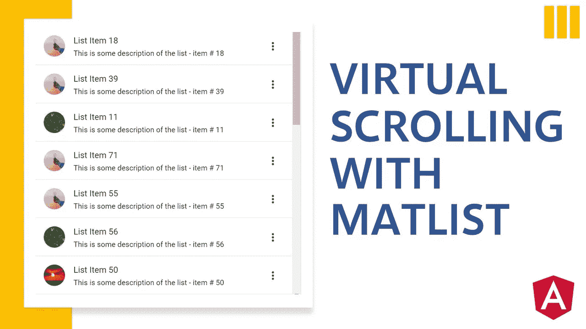

# 技术:在 Angular 中用 MatList 实现虚拟滚动

> 原文：<https://medium.datadriveninvestor.com/implement-virtual-scrolling-with-matlist-in-angular-c900dc0d489f?source=collection_archive---------5----------------------->

## 轻松处理大型项目列表



如果你从未听说过或使用过 MatList，它是 Angular Material 提供的一个容器组件，用于在 UI 上显示一个简单的项目列表。除了文本渲染，MatList 还提供了一些很酷的特性，比如导航列表、动作列表、选择列表、图标列表等等。然而，使用这个组件的主要缺点是它只是为一小部分项目设计的。如果列表非常大(> 1000 个条目)，可能会影响性能，有时会导致浏览器崩溃。幸运的是，Angular CDK 有一个名为虚拟滚动的软件包可以帮助解决这个问题。在这个循序渐进的教程中，我们将向您展示如何在 MatList 中添加虚拟滚动来处理应用程序中相对较大的数据列表。

# 建立一个简单的列表

让我们从构建一个简单的没有虚拟滚动的小列表开始本教程。在您的模块中导入 **MatListModule** 以使用 MatList 组件。

```
import {Component} from '@angular/core';@Component({
  selector: 'list-overview-example',
  templateUrl: `
    <mat-list dense role="list">
      <mat-list-item 
        *ngFor="let item of list" 
        role="listitem">   
       {{item}}
      </mat-list-item>
    </mat-list>
  `
})export class ListOverviewExample { list = Array.from(Array(10).keys());
}
```

请注意，数据数组是动态生成的，您可以使用这行代码更改列表的大小:

```
list = Array.from(Array(**10**).keys());
```

# 向列表添加虚拟滚动

通过在 mat-list 组件中添加**CDK-virtual-scroll-viewport**指令，可以很容易地用 MatList 实现虚拟滚动。确保 **ScrollingModule** 必须被导入到你的模块中。

```
<!-- html --><mat-list dense role="list">
  **<cdk-virtual-scroll-viewport 
    [itemSize]="10" 
    class="example-viewport">** **<mat-list-item
      *cdkVirtualFor="let item of list; 
                      let odd = odd;"
      [class.example-alternate]="odd"
      role="listitem">** **{{item}}
    </mat-list-item>**
 **</cdk-virtual-scroll-viewport>**
</mat-list>
```

在上面的模板中，的 ***ngFor 被替换为 ***cdkVirtualFor** ，使其与**CDK-virtual-scroll-viewport**指令兼容。**

接下来，在下面添加这些 css 样式，以使虚拟滚动列表正确显示。

```
<!-- css -->.example-viewport {
  height: 200px;
  width: 100%;
  border: 1px solid black;
}.example-alternate {
  background: rgba(127, 127, 127, 0.3);
}
```

我们还将列表的大小增加到 10，000 项，以便有效地使用虚拟滚动。

```
list = Array.from(Array(**10**).keys());
```

为了呈现虚拟滚动列表，这些都是您需要添加的步骤。点击查看完整演示[。](https://stackblitz.com/edit/virtual-scrolling-basic-list?file=src/main.ts)

# 带有选择列表的虚拟滚动

我们能按照上面的方法用选择列表实现虚拟滚动吗？答案是肯定的，也是否定的。是的，我们仍然使用**CDK-virtual-scroll-viewport**指令进行虚拟滚动，但也需要构造一个选择数据源，以便在用户对列表(尤其是多选列表)进行更改时保留所有项目的状态。这很重要，因为虚拟滚动仅显示当前视图中项目的子集，当用户滚动列表时，该数据集之前和之后的所有项目都将丢失。

## 构建选择模型

```
export class ListSelectionExample { // declare multi select model
  selection = new SelectionModel(true);  ...}
```

## 构建虚拟滚动选择列表

要将基本列表转换为选择列表，请替换:

*   带有 mat-selection-list 的 mat-list
*   带有物料清单选项的物料清单项目

```
<!-- html --><**mat-selection-list** dense>
  <cdk-virtual-scroll-viewport 
    [itemSize]="20" 
    class="example-viewport"> <**mat-list-option**
       *cdkVirtualFor="let item of list; let odd = odd;"
       [class.example-alternate]="odd"
 **[value]="item" 
       [selected]="selection.isSelected(item)"**>
       {{item}}
    </**mat-list-option**>
  </cdk-virtual-scroll-viewport>
</**mat-selection-list**>
```

在上面的模板中，我们将两个新属性绑定到 mat-list-option， **value** 和 **selected** ，以控制复选框的状态。

## 添加 SelectionChange 事件处理器

在模板中，将**选择改变**事件附加到 mat-selection-list

```
<!-- html --><mat-selection-list dense **(selectionChange)="onSelectionChange($event)"**>**...** </mat-selection-list>
```

**选择变化**的实现见下图:

```
// Component...
**onSelectionChange(selection) {** // update selection model when selection changes
  **selection.option.selected ?
    this.selection.select(selection.option.value) :
    this.selection.deselect(selection.option.value);
}**
...
```

# 带全选的 MatList

如何将“全选”或“取消全选”与上一节中的虚拟滚动列表集成在一起？这里的要点是，我们需要捕获全选的点击事件，并相应地更新选择模型。

## 添加全选按钮

```
<!-- html --><mat-checkbox
  labelPosition="before" 
  (change)="onSelectAll($event)">Select All
</mat-checkbox>
```

## 更新选择模型

```
// ComponentonSelectAll(e: MatCheckboxChange) { e.checked ?
    this.selection.select(...this.list) : 
    this.selection.clear();
}
```

## 虚拟滚动丢失选择的上下文

默认情况下，虚拟滚动使视图缓存能够更快地呈现项目。这个特性不能很好地处理选择列表，因为当用户滚动内容时，它不会更新每个复选框的状态。要暂时解决这个问题，我们需要禁用缓存，以便每个复选框的状态都可以正确更新。

```
<!-- html --><mat-selection-list dense>
  <cdk-virtual-scroll-viewport 
    [itemSize]="20" 
    class="example-viewport"> <mat-list-option
       *cdkVirtualFor="let item of list; 
                       let odd = odd;
                       **templateCacheSize: 0**"
       [class.example-alternate]="odd"
       [value]="item" 
       [selected]="selection.isSelected(item)">
       {{item}}
    </mat-list-option>
  </cdk-virtual-scroll-viewport>
</mat-selection-list>
```

点击此处查看完整的[演示](https://stackblitz.com/edit/virtual-scrolling-selection-list?file=src/app/list-selection-example.html)。

# 最终想法

我希望这个简短的教程能帮助你开始使用虚拟滚动列表。当显示一长串数据时，你的应用程序会运行得更快更流畅。欢迎在评论区提问。