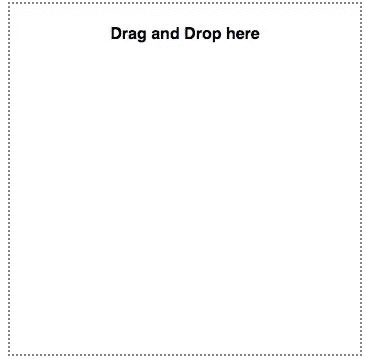
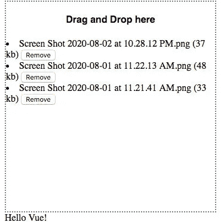
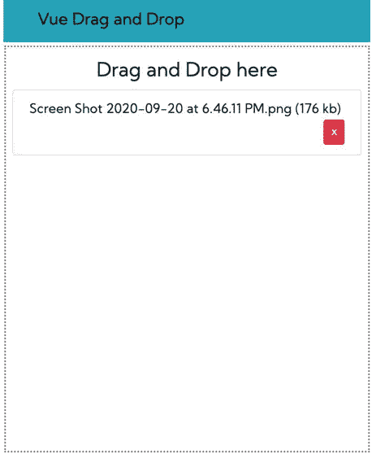

# 在 Vue 中实现拖放

> 原文：<https://medium.datadriveninvestor.com/implementing-drag-and-drop-in-vue-55bb30335ef0?source=collection_archive---------25----------------------->


在这篇文章中，我们将实现一些有趣的东西。我们将在 Vuejs 中实现拖放功能。我知道有很多库可以帮助你设置这个，但是理解它是如何工作的总是一个好主意。

由于它是一个非常小的应用程序，我们不会使用 Vue CLI，而是使用 Vuejs 脚本标签。这也为我们提供了 CLI 所能提供的所有功能。

# 准备好使用 Vue 模板

如果你在 vue 中构建 web 应用程序，我建议你下载 Vue 模板并用于你的项目。因为它们有好看的界面，而且很容易定制。他们可以节省你的大量时间，你需要花在为你的应用程序创建用户界面。检查来自 WrapPixel 的最佳 vue 模板。众所周知，WrapPixel 在 Vue、Angular、React 和 Bootstrap 框架中提供高质量的管理仪表板。

我们将从设置项目目录开始，我们将在桌面目录中创建一个文件夹，这是我们将设置应用程序的位置。

基本上我们只需要两个文件，一个`index.html`文件和一个`main.js`文件。我们所有的模板代码都将进入`index.html`文件，我们所有的 Vuejs 代码都将进入`main.js`文件。

# Vue 拖放图像上传

为此，请打开您的终端并键入以下内容:

```
cd desktop && mkdir vuedragndrop && cd vuedragndrop
touch index.html && touch main.js
code .
```

这个命令将在我们的目录中创建这个文件，并在 VS 代码中打开这个目录。

我们将通过添加自定义 html 5 样板文件来修改我们的 index.html 文件，然后添加 Vue 脚本标记:

```
<!DOCTYPE html>
    <html lang="en">
    <head>
        <meta charset="UTF-8">
        <meta name="viewport" content="width=device-width, initial-scale=1.0">
        <title>Document</title>
        <script src="https://cdn.jsdelivr.net/npm/vue"></script>
    </head>
    <body>
        <div id="app">
            {{message}}
        </div>
        <script src="main.js"></script>
    </body>
    </html>
```

我们首先定义 HTML 5 样板文件，并在 head 标签中添加 Vuejs 脚本标签，这将在页面加载时立即初始化 Vuejs。然后我们创建一个 id 为`app`的`div`，我们将在这里编写所有的 Vuejs 代码。你必须在实时服务器上运行你的应用程序。你可以使用 NPM 安装任何你选择的直播服务。

[](https://www.datadriveninvestor.com/2020/07/29/how-working-from-home-increased-my-productivity/) [## 在家工作如何提高我的工作效率|数据驱动型投资者

### 在家工作确实激发了我最大的潜能，让我更有效率。因为在家工作给了我…

www.datadriveninvestor.com](https://www.datadriveninvestor.com/2020/07/29/how-working-from-home-increased-my-productivity/) 

这样做之后，我们需要在我们的`main.js`文件中创建 Vuejs 实例:

```
var app = new Vue({
    el: '#app',
    data: {
        message: 'Hello Vue!'
    }
})
```

我们使用`new Vue()`方法创建 Vuejs 的一个实例，并定义我们在`index.html`文件中引用的`message`数据属性。

我们将创建一个简单的用户界面来显示拖放点。在 id 为`app`的 div 中添加以下标记:

```
<div id="app">
            <div class="container">
                <h4>Drag and Drop here</h4>
            </div>
            {{message}}
        </div>And then add this styles in the head tag: <style>
            .container {
                width: 350px;
                height: 350px;
                border: 2px dotted gray
            }
            .container h4 {
                text-align: center;
                font-family: sans-serif;
            }
        </style>
```

完成此操作后，您将获得以下结果:



# 添加数据属性

我们现在必须添加一个数据属性来保存已经放在盒子上的文件。要执行此操作，请将以下内容添加到 Vue 实例中数据属性:

```
files: [],
```

之后我们将添加一个`@drop`事件来选择我们的文件，还有一个`v-cloak`属性用来在应用程序加载前隐藏`{{tags}}`。

现在我们的 div 应该看起来像这样:

```
<div class="container" v-cloak @drop.prevent="addFile" @dragover.prevent>
    <h4>Drag and Drop here</h4>
 </div>
```

我们需要在我们的 Vue 实例中定义`addFile`方法。为此，我们将在 Vue 实例中创建一个方法对象，它将保存我们所有的 Vuejs 方法:

```
addFile(e) {
      let files = e.dataTransfer.files;
      [...files].forEach(file => {
        this.files.push(file);
        console.log(this.files)
      });
    }
```

这样做之后，打开你的控制台，试着在盒子里拖放一个文件。这样做会将文件详细信息记录在框内。

我们可以做的是使用`<li>`标签在盒子里显示选中的图片。让我们通过修改代码来添加这个特性:

```
<div class="container" v-cloak @drop.prevent="addFile" @dragover.prevent>
        <h4>Drag and Drop here</h4>
        <li v-for="(file,id) in files" :key="id" class="list-group-item mb-3 border-top">
        {{ file.name }} ({{ file.size }} kb)
        <button>Remove</button>
     </div>
```

现在，如果您拖放一个文件，您将获得文件名和文件大小。

# 从 Vuejs 拖放中移除图像

我们还可以添加一个方法，通过向 remove 按钮添加一个方法来从`files`数组中删除一个文件:

```
<button @click="removeFile(file)">Remove</button>
```

然后在方法对象中创建`removeFile`方法:

```
removeFile(file) {
      this.files = this.files.filter(f => {
        return f != file;
      });
    },
```

这样，您现在可以从`files`数组中删除任何文件。

让我们更进一步，创建一个 Vuejs 过滤器来格式化每个文件的侧面。创建一个过滤器对象并添加此方法:

```
filters: {
    kb(val) {
      return Math.floor(val / 1024);
    }
  },
```

基本上，这样做的目的是将文件的大小除以 1024，得到实际大小。要使用 Vuejs 过滤器，您必须通过管道来使用它，方法如下:

```
{{ file.name }} ({{ file.size | kb }} kb)
```



# 用 Bootstrap 设计我们的 Vue 拖放

为了让我们的用户界面看起来更好，我们可以在应用程序中添加引导 CSS CDN 和 google 字体。让我们将 HTML 标题修改为:

```
<head>
    <meta charset="UTF-8" />
    <meta name="viewport" content="width=device-width, initial-scale=1.0" />
    <title>Drag and Drop</title>
    <link
      href="https://fonts.googleapis.com/css2?family=Kumbh+Sans&display=swap"
      rel="stylesheet"
    />
    <link
      rel="stylesheet"
      href="https://stackpath.bootstrapcdn.com/bootstrap/4.5.2/css/bootstrap.min.css"
      integrity="sha384-JcKb8q3iqJ61gNV9KGb8thSsNjpSL0n8PARn9HuZOnIxN0hoP+VmmDGMN5t9UJ0Z"
      crossorigin="anonymous"
    />
    <script src="https://cdn.jsdelivr.net/npm/vue"></script>
    <style>
      * {
        font-family: "Kumbh Sans", sans-serif;
      }
      .wrapper {
        width: 350px;
        height: 350px;
        border: 2px dotted gray;
      }
    </style>
  </head>
```

添加后，我们现在可以将标记修改为:

```
<body>
        <div id="app">
          <nav class="navbar navbar-light bg-info">
            <div class="container">
              <a class="navbar-brand" href="#">Vue Drag and Drop</a>
            </div>
          </nav>
          <div class="container">
            <div class="row mt-4">
              <div class="col-md-6 offset-md-3">
                <div
                  class="wrapper px-2"
                  v-cloak
                  @drop.prevent="addFile"
                  @dragover.prevent
                >
                  <h4 class="mt-3 text-center">Drag and Drop here</h4>
                  <ul class="list-group">
                    <li class="list-group-item" v-for="(file,id) in files">
                      {{ file.name }} ({{ file.size | kb }} kb)
                      <button
                        class="btn btn-danger btn-sm float-right"
                        @click="removeFile(file)"
                      >
                        x
                      </button>
                    </li>
                  </ul>
                </div>
              </div>
            </div>
          </div>
        </div>
        <script src=" main.js"></script>
      </body>
```

现在，您的应用程序应该如下所示:



## 访问专家视图— [订阅 DDI 英特尔](https://datadriveninvestor.com/ddi-intel)