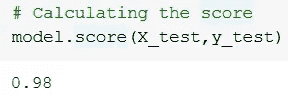

# 实现 kNN 分类器

> 原文：<https://medium.datadriveninvestor.com/implementing-knn-classifier-fb07eff18302?source=collection_archive---------3----------------------->

我解释了如何在虹膜数据集上实现 k 近邻分类器。


Image by author

```
from sklearn.datasets import load_iris
iris = load_iris()
# Storing the data and labels into "X" and "y" varaibles
X = iris.data
y = iris.target
```

这里我使用了从 SciKit learn 导入的虹膜数据集。IRIS 数据集是由 R.A.Fisher(现代统计学之父)提出的一种多元数据集，用于展示线性判别分析。这可以说是特征选择文献中最著名的数据集。

数据集包含 3 类，每类 50 个实例，其中每类涉及一种鸢尾植物。一个类与另一个类是线性可分的；后者彼此不是线性可分的。

[](https://www.datadriveninvestor.com/2019/07/02/best-resources-to-learn-machine-learning-and-apply-it-to-finance-books-courses-and-youtube-2019/) [## 学习机器学习并将其应用于金融的最佳资源:书籍、课程和 YouTube…

### 在当今科技发达的世界，我们开始求助于我们创造的机器来帮助我们。算法…

www.datadriveninvestor.com](https://www.datadriveninvestor.com/2019/07/02/best-resources-to-learn-machine-learning-and-apply-it-to-finance-books-courses-and-youtube-2019/) 

Iris 数据集由 150 个数据实例组成。有 3 类(杂色鸢尾、刚毛鸢尾和海滨鸢尾)各有 50 个实例。

对于每朵花，我们有以下数据属性

*   萼片长度，单位为厘米
*   萼片宽度，单位为厘米
*   花瓣长度(厘米)
*   花瓣宽度(厘米)

为了使我们的实验简单，我们用数字重命名这些类:

*   “0”:setosa
*   【1】:云芝
*   “2”:海滨

数据加载后，我使用 Scikit learn 中的 train_test_split 将数据分为训练集和测试集。

```
from sklearn.model_selection import train_test_split#
X_train, X_test, y_train, y_test = train_test_split(X, y, test_size=0.33, random_state=42)
```

现在，数据被分割，我们现在可以训练 kNN 分类器，并使用它进行相应的预测:

```
from sklearn.neighbors import KNeighborsClassifier
```

kNN 分类器:

这可能是最简单的机器学习算法。如上所述，由于其 effectiveness.，它仍然被广泛使用 k-NN 算法之所以得名，是因为它使用关于一个实例的最近邻居的信息来对其进行分类。我们识别训练数据中相似性“最接近”的 k 个记录。未标记的测试实例被分配给大多数 k 个最近邻居的类。

```
# We “assumed” k(the number of neighbors i.e. n_neighbors)  = 3\. It can also be 5, 7 … 10
model = KNeighborsClassifier(n_neighbors=3)
# Training or fitting the model with the train data
model.fit(X_train,y_train)
```

现在，我们已经用训练数据训练并拟合了模型，我们可以开始使用它进行预测了:

```
model.predict(X_test)
```

这会给你一个相关预测的输出，就像这样:


Image by author

您还可以检查给定测试数据和标签的平均准确度:

```
model.score(X_test,y_test)
```

我得了 0.98 分。



Image by Author

由于数据是公开的，您可以进一步利用它。您可以尝试更改训练数据与测试数据的比率，或者更改 k 值，看看会发生什么。您应该始终确保不要让模型过度适应您的数据。

**进入专家视角—** [**订阅 DDI 英特尔**](https://datadriveninvestor.com/ddi-intel)