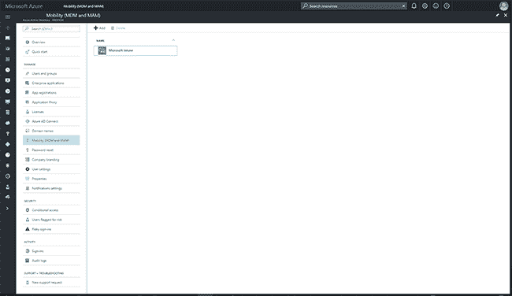
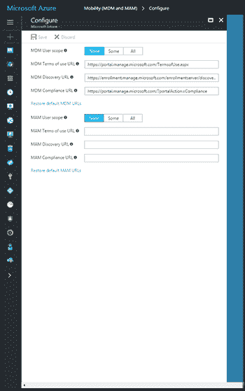
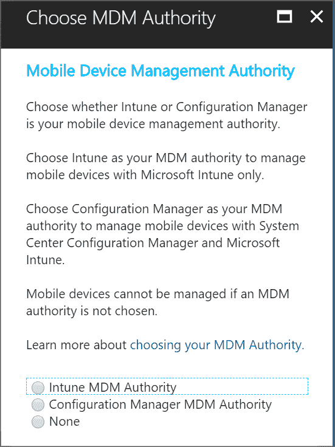
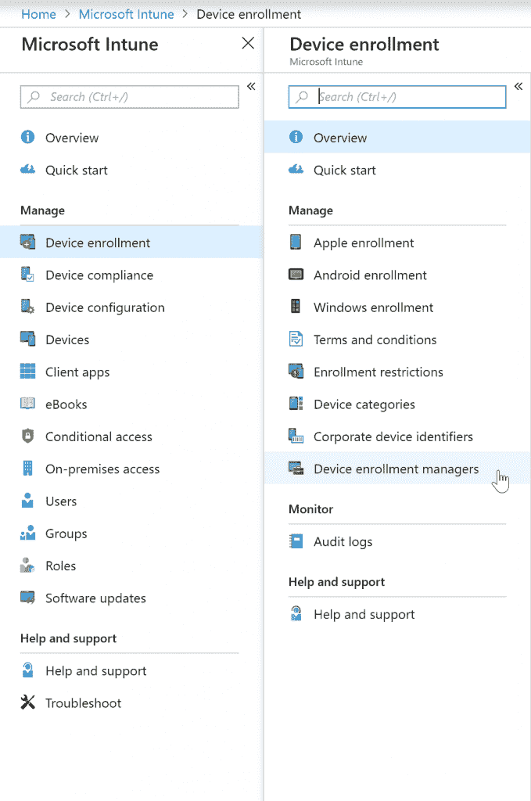
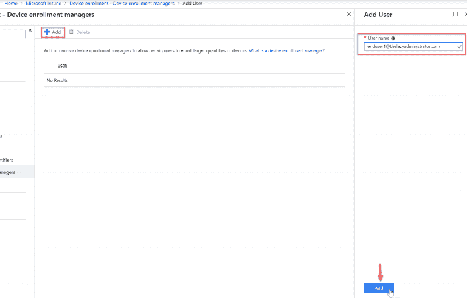
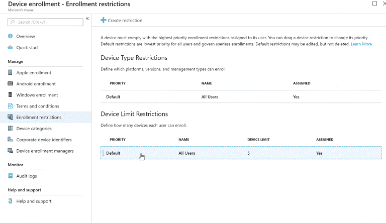
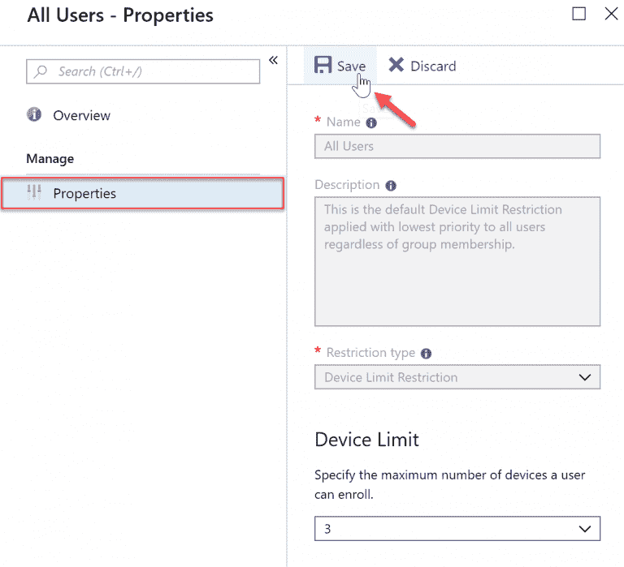
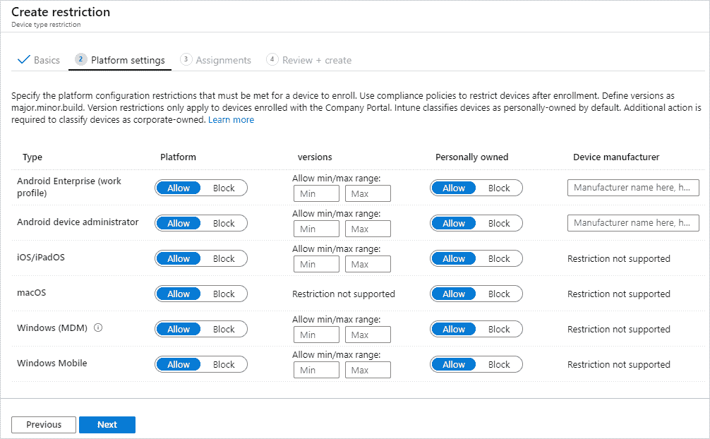

# 为 Microsoft 365 实施 MDM

> 原文：<https://medium.datadriveninvestor.com/implementing-mdm-for-microsoft-365-bebd3e3738d0?source=collection_archive---------9----------------------->

# 概观

Microsoft 365 包括企业移动增强安全性(EMS)，其中包括将访问您的资源的移动设备管理和移动应用程序管理。Microsoft 365 EMS 包括 Microsoft Intune，可帮助管理企业设备(COD)和个人设备(BYOD)的设备和应用程序。在这篇文章中，我们将讨论和探讨

*   如何规划 MDM 和 MAM
*   MDM 与 Azure AD 和配置的集成
*   设置 MDM 权限
*   配置注册限制

在这篇文章的最后，你将知道如何在微软 365 中规划、实现和配置 MDM 相关的服务。

# 介绍

微软 365 是企业可以订阅的 Windows 10、Office 365 和企业移动+安全的 SaaS 捆绑包。微软 365 有三个版本。

*   微软 365 教育，教育提供商的解决方案。
*   Microsoft 365 Business，适用于多达 300 名用户的小型企业的解决方案。
*   微软 365 企业版，是大型组织的完整解决方案。

微软 365 还包括微软企业移动和安全(EMS)，这是一套产品，包括提供基于云的身份和访问服务的 Azure Active Directory，提供文档标记、分类、保护和安全的 Azure Information Protection，以及提供实时监控和针对恶意软件威胁的保护的微软高级威胁分析。微软 365 设备管理，使用 Intune 提供移动设备和应用程序管理解决方案。微软 365 设备管理使用 Intune 来管理多个平台上的设备和应用程序，包括 Windows 10、Android 和 iOS 设备，允许设备访问公司资源，如数据和应用程序，确保设备在访问资源之前合规，通过管理访问限制来保护公司信息，并控制用户如何使用和共享数据以及管理设备上的应用程序，包括应用程序部署、访问和使用。

微软 Intune 提供了几项功能。它能够保护和监控数据访问，管理每个人的多个设备(IOS、Android、macOS 或 Windows)。Intune into 与 Windows Defender 集成。Intune 还利用 Azure AD 条件接收策略、移动设备管理(MDM)和移动应用程序调用(MAM)。因此，让我们看看 MDM 和 MAM 之间的区别。在 MDM 中，强制用户“注册”设备，使用证书与 Intune 通信。它将应用程序推送到设备，限制操作系统类型，并可以远程擦除设备。MDM 用于强制注册用户的设备，这将允许用户获得与 Intune 通信的证书。然后它可以将应用程序推送到设备上。我们可以限制操作系统的类型。我们甚至可以远程擦除设备。因此，如果设备被盗，我们可以选择删除该设备和公司信息。在移动应用管理(MAM)中，用户通过个人设备访问公司资源。打开应用程序时，需要额外的身份验证。如果设备丢失，它可以删除公司信息。MAM 适用于使用个人设备访问公司资源的用户。当他们从个人设备上打开应用程序时，需要提供额外的身份验证。它可以远程删除该个人设备上的公司信息。因此，MDM 是管理公司设备的主要工具。MAM 是用于管理包含公司信息的个人设备的主要工具。现在，当谈到使用这些设备并通过 MDM 管理这些设备时，有几个想法需要考虑。

*   设备所有权:谁拥有设备。MDM 用于管理公司设备，MAM 用于管理个人设备。我们需要了解不同的设备以及这些设备的所有者。
*   用户类型或设备角色:那么我们将允许用户在微软 365 中执行什么呢？设备平台，IOS，windows，android，macOS。
*   计划:计划过程中有三种类型的计划。首次展示计划。沟通计划和支持计划。它们将有助于确定我们将如何向我们的用户推出这一产品，更重要的是，在推出这一信息后，与这些设备进行沟通并为其提供支持。
*   与 Azure AD 集成。
*   指定 MGM 权限，这允许您决定如何管理您的用户设备，以及您的用户如何注册他们的设备，以便我们可以远程管理他们。
*   注册限制，配置注册限制，并确保不是任何人都将其个人设备注册到我们的 Microsoft 365。

# 规划移动设备管理

# Microsoft Intune 和 MDM Authority 解决方案

让我们深入探讨一下移动设备管理的规划流程，因为这是一个相当复杂的话题，需要考虑许多不同的因素。因此，我们将重点关注四个关键领域，

1.  MDM Authority 解决方案或可以实施和管理设备的解决方案。
2.  微软 365 Intune。管理这些设备的关键组件。
3.  MDM 部署注意事项
4.  设备注册限制，我们可以限制用户使用设备的权限、设备类型，甚至操作系统以及他们可以使用这些设备访问的应用程序。

# MDM 权威解决方案

您可以实现 4 种可能 MDM Authority 解决方案。

1.  **Intune Standalone** :纯云管理，使用 Azure 门户进行配置。包括 Intune 提供的全套功能。
2.  **Intune 共同管理**:将 Intune 云解决方案与 Windows 10 设备的 Configuration Manager 相集成。您可以使用配置管理器控制台来配置 Intune。
3.  [**用于 Office 365 的 MDM**](https://www.microsoft.com/en-us/microsoft-365/blog/2015/03/30/announcing-general-availability-of-built-in-mobile-device-management-for-office-365/):Office 365 与 Intune 云解决方案的集成。您可以从 Microsoft 365 管理中心配置 Intune。包括 Intune 独立版可用功能的子集。在微软 365 管理中心设置 MDM 权限。
4.  **Office 365 MDM 共存**:您可以在您的租户上同时激活和使用 MDM for Office 365 和 Intune，并为每个用户设置 Intune 或 MDM for Office 365 的管理权限，以决定使用哪种服务来管理他们的移动设备。用户的管理权限是根据分配给用户的许可证定义的。

所以只要确保我们完全理解，让我们看看*微软 Intune 提供什么*。

*   我们使用 Microsoft Intune 来保护和监控来自移动设备(公司设备(COD)或个人设备(BYOD))的所有数据访问，并且我们可以管理不同的设备平台(Android、IOS、macOS 和 Windows(移动、surface 和桌面))。
*   Intune 与 Windows Defenders 集成，有助于保护通信。
*   利用 Azure AD 条件访问策略，Azure AD 条件访问策略允许您创建一个策略来控制和管理不同的设备。
*   移动设备管理(MDM)主要用于管理企业设备。
*   移动应用程序管理主要用于管理自带设备(BYOD)。

所以只要确保我们完全理解，让我们看一看 ***MDM vs MAM***

**MDM** 主要用于企业设备

*   与 Azure AD 集成，以便我们可以部署条件访问策略来强制用户注册设备。使用这些条件访问策略，如配置 WiFi 或 VPN、向设备交付应用程序、强制执行监管要求
*   与 Intune 通信所需的证书。MDM 协助确保用户定期获得证书并更新证书
*   IT 管理员远程管理和擦除设备

MAM 主要用于个人设备(BYOD)

*   访问公司资源时控制身份验证
*   从设备中删除公司数据
*   使用条件访问策略要求额外的更强的身份验证，如强制 pin 以访问 outlook mobile

# MDM 部署

让我们看看 ***MDM 部署注意事项***

**设备类型**:部署是设备在访问公司资源时将拥有的角色或用户中的一种设备类型

*   企业设备(COD)或个人设备(BYOD)
*   用户类型(例如高管、知识工作者)或设备角色(信息亭、移动设备、笔记本电脑)

**组织团体**

识别每个用例以及子用例甚至可以深入到平台和应用。

*   用例，子用例，组织单元(组)
*   公司、高管、人力资源、财务

**带有平台&应用**的移动设备用例

*   企业→高管→人力资源、财务→ IOS
*   企业→高管→人力资源、财务→ IOS →电子邮件、应用程序、个人资料

让我举一个组织团体的例子，用例是公司。一个子用例是公司内部的管理人员，一个国际组织是人力资源、财务部门的管理人员。因此，我们将基于组织组创建策略。

让我们针对移动设备使用案例以及平台和应用程序进一步细分。像上面这样的公司。人力资源和财务等部门或组织团体中的企业级高管，现在我们深入到人力资源和财务部门的高管，他们正在使用 IOS。。我们可以为使用 IOS 的人力资源和财务主管进一步完善这一点，我们希望控制电子邮件、个人资料和应用程序。我们可以通过 MDM 获得非常精细的粒度。

# MDM 部署规划

**选择 MDM 解决方案**根据您将要用来管理 MDM 部署的工具，选择合适的 MDM authority 解决方案。

**规划 MDM 基础架构**规划 MGM 基础架构需要考虑一些事项。

外部沟通:我们如何与外部用户沟通我们的期望？

带宽要求:用户经常访问、下载和更新应用程序。

*   缓存代理:兑现从多个设备冗余下载的某些类型的内容
*   Windows 10 的交付优化:利用 P2P 兑现技术，在每次部署的设备之间共享包内容。

**规划设备策略**

*   策略冲突解决:设备注册到 MDM 后，我们可以创建和分配多个策略来管理设备。其中一些策略可能会重叠，因此我们必须设置这些策略的优先级，以确保我们实现管理该设备的目标。
*   统一管理:这些策略在 MDM for Office 365 和 Microsoft Intune 中提供，为管理您的设备提供了额外的控制。他们的政策是不断变化的，所以变化相当频繁。因此，在部署 MDM 时，您需要确保始终熟悉最新的可用策略。

**MDM 部署计划**有三种主要的 MDM 部署计划:

展示计划:展示的目标组

*   试点小组:对超级用户进行测试，以确保部署过程按预期进行
*   生产组:它不一定是一个单一的生产推广组。按部门、平台或地理位置创建生产推广团队

沟通计划:解释和沟通推广计划的细节

*   信息交流的内容和方式
*   谁以及何时交流信息

支持计划:支持新功能并解决问题、事件和请求

*   谁参与了支持流程
*   支持流程是什么
*   谁、何时以及由谁为用户提供培训和支持

**设备注册和注册限制**设备注册允许管理设备、应用以及它们访问公司数据的方式。在 BYOD 场景中，用户在设备上有他们的个人信息，他们也可能有一些公司数据。我们该如何应对呢？

设备必须在 Intune 中注册，并且必须具有用于通信的 MDM 证书。为了开始使用移动设备管理(MDM ),请确保设备已在 Intune 中注册，并且拥有 MDM 证书。

设备注册有一些依赖关系:

*   设备所有权(个人或公司)
*   设备类型(IOS、Android、macOS、Windows，包括 Wondows for Mobile)
*   管理要求(注册前重置以擦除设备，锁定以防止用户取消注册，以及将设备关联到特定用户的关联)

默认情况下，允许所有设备注册，但我们可以按设备类型限制注册。这称为注册限制，通过 Endpoint Manager 管理中心进行管理。它允许您指定注册限制

*   按设备的数量和类型
*   按操作系统和版本(操作系统的最低和最高版本)

我们可以创建多个限制，并在将这些限制应用到用户组之前设置优先级顺序。有一些可用的默认限制，默认情况下，它们适用于所有用户和无用户注册，如 kiosk 机器。但是可以使用具有更高优先级的自定义限制来覆盖它。因此，我们必须考虑违约限制。如果我们想调整这些限制，我们需要创建自定义限制，并确保它们比默认限制优先级更高。

# 在 Microsoft 365 中管理移动设备管理

我们将专注于管理微软 365 的移动设备管理(MDM)。在 Microsoft 365 中管理 MDM 有 3 个主题:

*   MDM 与 Azure AD 的集成
*   设置 MDM 权限
*   配置设备注册限制

# MDM 与 Azure AD 的集成

那么我们来谈谈 MDM 与 Azure AD 的集成。我们有公司设备(COD)和个人设备(BYOD)。

**公司设备**

*   将 Windows 加入公司 Active Directory
*   将 Windows 加入 Azure AD

我们正在讨论与 Azure AD 的集成，我们可以将 windows 加入传统的活动目录环境。然而，为了允许注册过程发生，我们必须配置混合 Azure AD 域加入。另一个选择是，如果我们没有传统的 onpremise AD 环境，可以直接将 Windows 加入 Azure AD。

**个人设备(BYOD)**

*   将 Microsoft 工作帐户添加到 Windows
*   访问组织应用程序和资源
*   可以在 MDM 中注册设备

我们的个人设备。我们可以在 Windows 中添加一个 Microsoft 工作帐户。通过这样做，我们可以访问组织应用和资源，并为用户提供在 MDM 中注册其设备的机会。但是，关键字为他们提供了拒绝在 MDM 中自动注册设备的机会。因此，这就是沟通培训的必要性所在，这样用户就知道对他们的期望是什么。如果他们打算使用个人设备访问公司资源。

**管理设备**

*   组策略
*   系统中心配置管理器
*   Azure AD Join —由 MDM 管理

我们有几个不同的选项来管理这些设备。如果我们使用传统的 active directory 域，我们将使用组策略来管理设备。我们还可以将 system center 配置管理器用于传统的 active directory 域环境。然而，我们将使用 MDM 来管理我们的 Azure AD join 设备，因为它提供了所有的功能。包括自动注册和管理这些设备的限制。

**Azure AD 与 MDM 的集成需求**MDM 与 Azure AD 的集成有一些先决条件。

活动 MDM 订阅

*   默认为 Intune
*   Azure 广告应用库中提供的第三方解决方案

我们需要一个有效的 MDM 订阅。默认情况下，我们使用 Intune，但我们并不局限于使用 Intune。我们可以去 Azure AD App Gallery 看看有没有可以代替 Intune 使用的第三方工具。

**配置 MDM 设置**

*   使用 URL 的 MDM 项目
*   MDM 发现和合规性
*   设备范围

另一个需求是配置 MDM 设置。这包括 MDM 使用条款的 URL，因此用户必须查看它们，并理解在使用 MDM 时对用户的期望。还有一些用于 MDM 发现和合规性的配置设置。最后，在配置 MDM 设置时，我们可以配置设备的范围。如果我们想要使用自动设备注册，将需要 Azure AD premium P1 或更高版本，还有 Azure AD premium P2。如果您有 onpremise AD，并且希望能够使用域加入，您不能只使用 onpremise active directory，您需要配置带有 Azure AD 的混合。之后，您可以使用组策略为混合 Azur AD 域加入配置设备。因此，可以通过实现 hybride Azur AD 来配置 onpremise active directory 的域加入。

让我们看看 azure 广告集成的配置选项。在 portal.azure.com“让视图管理 Azure Active directory”中，确保您是全局管理员，这是要求之一。现在，在左侧，向下滚动，您会看到一个名为“移动性”的选项(MDM 和 MAM)。

如果您想引入另一个应用程序，只需点击添加应用程序。它将显示您拥有的可用应用程序，包括本地 MDM 应用程序。您可以使用 Microsoft Azure AD 使用户能够访问本地 MDM 应用程序。它需要现有的本地 MDM 应用程序订阅。您可以更改名称、徽标等。

在微软 Intune 中，我们在左侧有两个类别。我们有 MDM 用户范围、使用条款、发现和合规性 URL。在此之下，我们有主要的用户范围、使用条款、发现和合规性 URL。

MDM 中的用户范围可以设置为“无”,有些仅适用于特定的组，有些则适用于所有人，以便能够自动注册。如果您有几个组，当您为一些组启用 MDM 时，您可以搜索它们。顺便说一下，这些 URL 是默认设置。并且您可以恢复默认的 MDM 和 MAM URLs。如果您想拥有特定于您的组织的东西，这是您可以定制它们的地方。

这就是我们配置 MDM 与 Azure AD 集成的位置和方式。

# 设置 MDM 权限

移动设备管理(MDM)权限设置决定了您管理设备的方式。作为 IT 管理员，您必须设置 MDM 权限，用户才能注册设备进行管理。

可能的配置有:

**Intune Standalone** —纯云管理，使用 Azure 门户进行配置。包括 Intune 提供的全套功能。[在 Intune 控制台设置 MDM 权限](https://docs.microsoft.com/en-us/mem/intune/fundamentals/mdm-authority-set#set-mdm-authority-to-intune)

**Intune 共同管理** —将 Intune 云解决方案与用于 Windows 10 设备的 Configuration Manager 相集成。您可以使用配置管理器控制台来配置 Intune。[将设备的自动注册配置为插入](https://docs.microsoft.com/configmgr/comanage/tutorial-co-manage-clients#configure-auto-enrollment-of-devices-to-intune)

**Office 365 的移动设备管理**—Office 365 与 Intune 云解决方案的集成。您可以从 Microsoft 365 管理中心配置 Intune。包括 Intune 独立版可用功能的子集。在微软 365 管理中心设置 MDM 权限。

**Office 365 MDM 共存**您可以在您的租户上同时激活和使用 MDM for Office 365 和 Intune，并为每个用户设置 Intune 或 MDM for Office 365 的管理权限，以决定使用哪种服务来管理他们的移动设备。用户的管理权限是根据分配给用户的许可证定义的。 [Microsoft Intune 与 MDM for Office 365 共存](https://blogs.technet.microsoft.com/configmgrdogs/2016/01/04/microsoft-intune-co-existence-with-mdm-for-office-365)

因此，现在我们来看看与更改 MDM 权限选项相关的一些概念。

**选择 MDM 权限选项**

如果你换到 MD 权威，可能需要长达 8 个小时，人们才会意识到或看到已经发生的改变。该设备实际上必须向权威机构登记以实现改变，然后必须与新服务同步并从新服务获取信息。现在有一些被称为基本设置的设置，包括个人资料等内容。您的配置文件包括电子邮件、WiFi VPN、证书、配置文件等配置选项。这些马上就会消失。他们可以在设备上停留长达七天。或者，如果设备一直处于离线状态，并且尚未与新服务进行登记和同步，则可能需要更长时间。因此，MDM 权限发生变化，设备检入，然后发生同步。您将根据新的 MDM 授权机构配置您的设置，但是如果您在一段时间内没有连接该授权机构，它将不会同步，直到您连接到该新服务。如果设备被擦除或无法通信，您的 MDM 证书将不会续订。在证书过期后的 180 天内，它不会从 Azure AD portal 中删除。有些设备没有关联的用户。这些人包括 IOS 设备注册计划的任何人或任何类型的批量注册场景。您需要做的是致电支持人员寻求帮助，将他们转移到新的 MDM 授权机构。MDM 权限不能更改为 unknown。你不可能变成未知。它必须与四大权威之一相关联。

**将 MDM 权限设置为 Intune** 如果您尚未设置 MDM 权限，请遵循以下步骤。

在[微软端点管理器管理中心](https://go.microsoft.com/fwlink/?linkid=2109431)，选择橙色横幅打开移动设备管理权限设置。只有当您尚未设置 MDM 权限时，才会显示橙色横幅。

在移动设备管理权限下，从以下选项中选择您的 MDM 权限:

*   Intune MDM 权威
*   没有人

一条消息表明您已经成功地将 MDM 权限设置为 Intune。以上是更改 MDM 权限的步骤和位置。

**配置设备注册限制**

有几个设备注册限制选项需要考虑。

*   设备平台
*   设备操作系统和版本
*   每个用户的最大设备数量
*   阻止个人设备
*   需要 MFA

这些是我们在 Microsoft 365 中处理注册限制时可以配置的一些项目。

我们需要了解一些设备注册配置选项

*   限制:默认情况下，用户可以注册 5 台设备。如果我们愿意，我们可以把它改成 3。
*   操作系统和版本:也许我们希望操作系统总是最新的(IOS、Android、MacOS、Windows)。我们可以对其进行更改，以反映最新版本操作系统的需求。
*   我们还可以创建多个限制。我们可以创建多个限制，然后将它们应用到不同用户组。并设置这些限制的优先级(1>2 或 2>4 ),以确保在必要时应用最严格的限制。它们不会影响任何已注册的设备。这些仅适用于正在注册的新设备。但是，这不适用于 Intune PC 代理设备，它们不会被阻止。

您可以委派管理所有这些设备的责任。我们可以向个人提供适当的权限来管理我们的设备。这称为设备注册管理器(DEM)。全局管理员或内部管理员管理 DEM 组的成员。Intune 权限可以应用于任何 Azure AD 用户。最多有 150 个 DEM，每个 DEM 最多可以注册 1000 个设备。

**使用 DEM 帐户注册的设备的限制** DEM 用户帐户和使用 DEM 用户帐户注册的设备有以下限制:

*   必须为 DEM 帐户用户分配 Intune 许可证。
*   无法从公司门户进行擦除。可以从 Azure 门户中的 Intune 擦除由 DEM 用户帐户注册的设备。
*   只有本地设备出现在公司门户应用程序或网站中。
*   DEM 用户帐户不能使用具有 Apple VPP 用户许可证的 Apple 批量购买计划(VPP)应用程序，因为应用程序管理需要每个用户的 Apple ID。
*   通过 Apple 的自动设备注册(ADE)注册设备时，不能使用 DEM 帐户。
*   如果设备拥有 Apple VPP 设备许可证，则可以安装 VPP 应用程序。
*   除 Windows 10 1803+之外，设备被阻止进行条件接收
*   使用 DEM 帐户注册的每台设备都需要获得适当的许可，才能由 Intune 管理。许可证可以是 Intune 用户许可证或 Intune 设备许可证。
*   如果您使用 DEM 帐户注册 Android Enterprise work profile 设备，则每个帐户最多只能注册 10 台设备。
*   不支持使用 DEM 帐户注册 Android Enterprise 完全管理的设备。

**添加设备注册管理器**登录[微软端点管理器管理中心](https://go.microsoft.com/fwlink/?linkid=2109431)，选择设备>注册设备>设备注册管理器。

选择添加。

在添加用户刀片上，输入 DEM 用户的用户主体名称，然后选择添加。DEM 用户将被添加到 DEM 用户列表中。

**DEM**全局管理员或 Intune 服务管理员 Azure AD 角色的权限需要

*   向 Azure AD 用户帐户分配 DEM 权限
*   查看所有 DEM 用户

如果没有为用户分配全局管理员或 Intune 服务管理员角色，但为其分配了设备注册管理员角色的读取权限，则用户只能看到自己创建的 DEM 用户。

**删除设备注册管理器权限**删除设备注册管理器不会影响已注册的设备。

要删除设备注册管理器

登录到[微软终端管理器管理中心](https://go.microsoft.com/fwlink/?linkid=2109431)，选择设备>注册设备>设备注册管理器。在设备注册管理器刀片上，选择 DEM 用户，然后选择删除。

**要配置设备注册限制限制**登录 Azure 门户并选择 Intune 刀片选择“设备注册”,然后单击“注册限制”

在这里，我将设备限制从默认的 5 更改为 3，然后保存我的更改

**要配置设备注册类型限制**登录到 [Microsoft Endpoint Manager 管理中心](https://go.microsoft.com/fwlink/?linkid=2109431) >设备>注册限制>创建限制>设备类型限制。

在“基本”页面上，为限制提供一个名称和可选描述。

选择“下一步”转到“平台设置”页面。

在“平台”下，为您希望此限制允许的平台选择“允许”。

为 Microsoft 365 实施移动设备管理

设置移动设备管理权限[https://docs . Microsoft . com/en-us/int une/fundamentals/MDM-authority-set](https://docs.microsoft.com/en-us/intune/fundamentals/mdm-authority-set)什么是设备管理 Microsoft int une[https://docs . Microsoft . com/en-us/int une/fundamentals/What-is-device-management # Microsoft-int une](https://docs.microsoft.com/en-us/intune/fundamentals/what-is-device-management#microsoft-intune)

确定移动设备管理用例场景[https://docs . Microsoft . com/en-us/int une/fundamentals/planning-guide-scenarios](https://docs.microsoft.com/en-us/intune/fundamentals/planning-guide-scenarios)

制定推广计划[https://docs . Microsoft . com/en-us/int une/fundamentals/planning-guide-rollout-plan](https://docs.microsoft.com/en-us/intune/fundamentals/planning-guide-rollout-plan)

制定沟通计划[https://docs . Microsoft . com/en-us/int une/fundamentals/planning-guide-communication-plan](https://docs.microsoft.com/en-us/intune/fundamentals/planning-guide-communication-plan)

制定支持计划[https://docs . Microsoft . com/en-us/int une/fundamentals/planning-guide-support-plan](https://docs.microsoft.com/en-us/intune/fundamentals/planning-guide-support-plan)

什么是设备注册？[https://docs . Microsoft . com/en-us/int une/enrollment/device-enrollment](https://docs.microsoft.com/en-us/intune/enrollment/device-enrollment)

设置报名限制[https://docs . Microsoft . com/en-us/int une/enrollment/enrollment-restrictions-set](https://docs.microsoft.com/en-us/intune/enrollment/enrollment-restrictions-set)

Azure Active Directory 与 MDM 的集成[https://docs . Microsoft . com/en-us/windows/client-management/MDM/azure-Active-Directory-integration-with-MDM](https://docs.microsoft.com/en-us/windows/client-management/mdm/azure-active-directory-integration-with-mdm)

将设备的自动注册配置为插入[https://docs . Microsoft . com/en-us/config mgr/comanage/tutorial-co-manage-clients # configure-auto-enrollment-of-devices-to-int une](https://docs.microsoft.com/en-us/configmgr/comanage/tutorial-co-manage-clients#configure-auto-enrollment-of-devices-to-intune)

设置移动设备管理权限[https://docs . Microsoft . com/en-us/int une/fundamentals/MDM-authority-set](https://docs.microsoft.com/en-us/intune/fundamentals/mdm-authority-set)

创建设备类型限制[https://docs . Microsoft . com/en-us/int une/enrollment/enrollment-restrictions-set # Create-a-device-type-restriction](https://docs.microsoft.com/en-us/intune/enrollment/enrollment-restrictions-set#create-a-device-type-restriction)创建设备限制限制[https://docs . Microsoft . com/en-us/int une/enrollment/enrollment-restrictions-set # Create-a-device-limit-restriction](https://docs.microsoft.com/en-us/intune/enrollment/enrollment-restrictions-set#create-a-device-limit-restriction)

添加设备注册管理器[https://docs . Microsoft . com/en-us/int une/enrollment/device-enrollment-manager-enroll # add-a-device-enrollment-manager](https://docs.microsoft.com/en-us/intune/enrollment/device-enrollment-manager-enroll#add-a-device-enrollment-manager)

*原载于 https://github.com***。**