# 股票多重分形模型对期权定价的影响

> 原文：<https://medium.datadriveninvestor.com/implications-of-a-multifractal-model-of-stocks-on-options-pricing-741ca1a9eb8e?source=collection_archive---------0----------------------->

Section of the Mandelbrot Set

在这篇文章中，我研究了伯努瓦·曼德尔布罗的资产收益多重分形模型对股票期权的影响。我鼓励读者看看我从随机漫步开始推导这个模型的第一篇文章:[分形之父能教给我们什么关于金融的知识](https://medium.com/swlh/what-the-father-of-fractals-can-teach-us-about-finance-e3752fe3fc32)。

## 模型概述

简单回顾一下，几何布朗运动作为股票运动的模型，在捕捉给定一天的涨跌波动中可能出现的随机性方面做得不错…

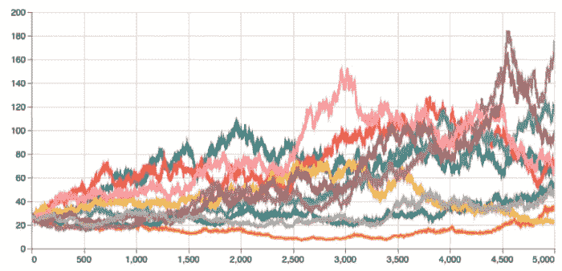

10 runs of Geometric Brownian motion

但它在捕捉我们所知道的波动性如何在特定时期聚集方面做得很糟糕:

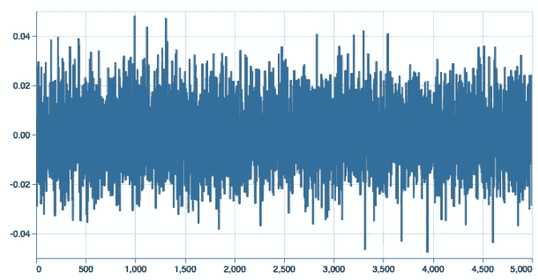

Daily variances under Geometric Brownian Motion.

我们看到的是，Mandelbrot 的资产回报多重分形模型在“交易时间”中加入了拉伸和压缩日历/时钟时间的元素，使其更好地代表了现实世界的市场。

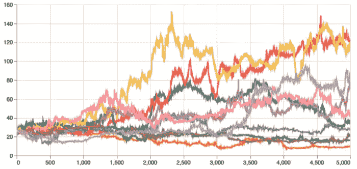

10 runs of Mandelbrot’s Multifractal Model for Asset Returns

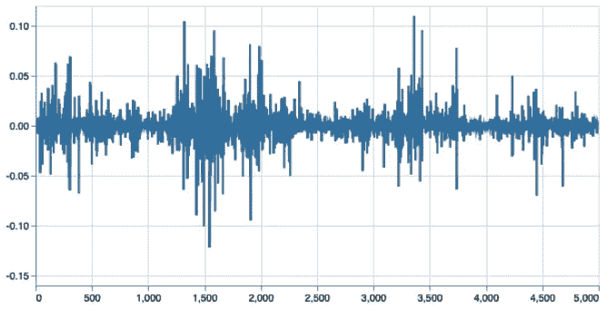

Daily variances

因为我们是从简单的公式和选择的输入中推导出这些运动的，所以在足够的模拟运行中，随机因素不会影响股票的预期价值。在几何布朗运动中，股票随时间漂移，平均值可以按照我们最初的公式选择的值来计算。

这种模拟的目的不是更好地估计股票的最终价值，而是更真实地模拟股票如何随着时间的推移而移动。下面，我使用蒙特卡罗模拟来估计股票的期权价格，这些股票要么遵循几何布朗运动，要么遵循 Mandelbrot 的资产回报多重分形模型(我将简称为 Mandelbrot 的未来模型)。

## 蒙特卡洛模拟

我们给这两个模型的起点都是 100 美元，σ是 20%，μ是 5%(都是年度)，超过 252 个交易日，大约 1 年。我们给出曼德尔布罗模型的α为 0.75，最小间隔为 1 天(这些变量在[之前的文章](https://medium.com/@jordanshimabuku/what-the-father-of-fractals-can-teach-us-about-finance-e3752fe3fc32)中有进一步解释)。我们每次运行模拟 10，000 次，得到以下最终价格分布:

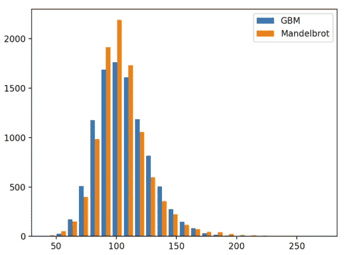

正如所料，我们可以看到曼德尔布洛特的模型是如何产生一个更高的峰值和更厚的尾部的。超过 10，000 次运行，GBM 模型全年平均为 105.68 美元，Mandelbrot 模型平均为 105.28 美元。我们知道，假设输入μ = 5%，我们运行的试验越多，平均值就越接近 105 美元。

通过这些模拟，我们可以根据他们的行为对看涨期权的价值进行定价。

## 欧式期权

对欧式期权进行估值相当简单，我们只需获取每条路径的最终价值 *S* 并减去执行价格 *K* ，然后获取最大值(0，S-K)，因为如果 *K > S* 期权价值为 0 美元。我们只能在到期时行使欧式期权，所以我们只在最后计算。下面是起始价格和执行价格的模拟图 *K* 都是 100 美元。

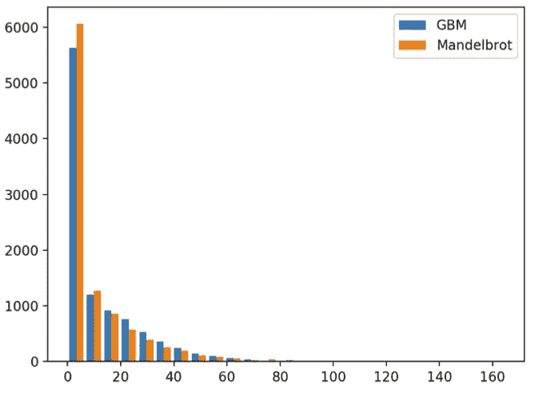

给定我们的输入参数，我们的蒙特卡罗模拟告诉我们，这支股票的欧式看涨期权在 GBM 下应该值 10.84 美元，在 Mandelbrot 模型下应该值 10.15 美元。使用 Black-Scholes 公式，看涨期权的价值为 10.45 美元，如果我们运行 GBM 模拟更多次，我们就会得到这个值。

因此，即使我们知道 Mandelbrot 的模型允许更大的偏差，我们的蒙特卡罗模拟告诉我们期权的价值低于 GBM(美式看涨期权也是如此)，为什么会这样呢？

如果我们回头看看期末价格的分布，我们可以看到 Mandelbrot 模型的分布是尖峰的，它比 GBM 模型假设的正态/高斯分布具有更大的峰度。

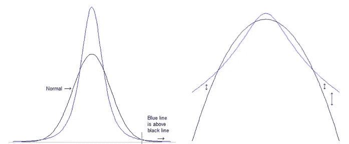

从上图我们可以看到，轻子态分布有一个更高的峰值 ***和*** 更宽的尾部。右侧显示了相同的分布，但通过双对数轴。可以更清楚地看到，你越往尾部走，相对差异越来越大。

这意味着，在 Mandelbrot 的模型下，一只股票的路径保持在-σ和+σ之间的概率实际上高于 GBM。当我们给执行价等于起始价的期权定价时，我们计算了所有那些拉低平均价格的小差异。我们可以从分布中看到，当我们在最终价格中走得足够远时，在 Mandelbrot 模型中出现的次数比 GBM 多。在上图中，它应该是尾部中蓝线在黑线之上的地方，但是它们很少，所以当我们对这些期权定价时，它们很容易被

## 价外期权

如果我们将执行价格设得更高，达到 2σ或 140 美元，我们应该会看到曼德尔布洛特模型的看涨期权的估计价格高于 GBM。

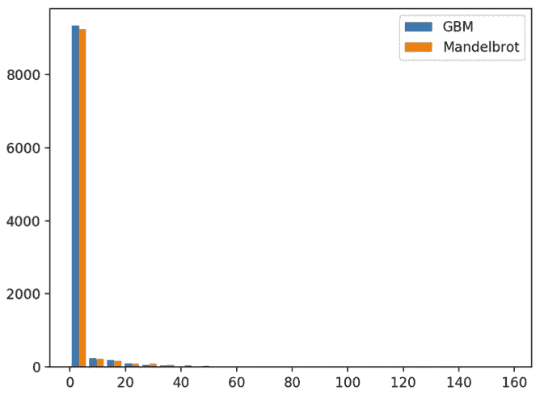

由于仓位大小的原因，分布看起来很尴尬，其中第一个仓位是$0-$ 7 之间的任何值，这几乎是所有的期权价值，因为最终价格很可能小于$140，使期权价值为$ 0。

好消息是隐含期权价格和我们假设的一样。GBM 看涨期权的平均价值为 0.79 美元，而 Mandelbrot 看涨期权的平均价值为 1.36 美元。相对而言，这是一个比以前更大的差异，这也是意料之中的，因为我们在尾部走得更远。

因此，我们知道，在 Mandelbrot 的模型下，GBM 的价内期权价值更高，140 美元(2σ)的价外期权价值更高。中间发生了什么，它们在哪里相交？

## 十字路口

下面是 GBM 和 Mandelbrot 模型欧式看涨期权价值在 x 轴上的图表。

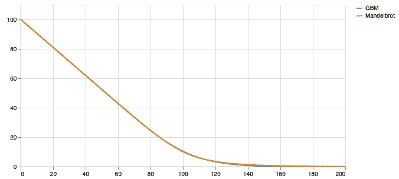

这些线非常接近，但是我们可以看到隐含的看涨期权价值在 120 美元之前相交，此后 GBM 模型仍然低于 Mandelbrot。

下面是 GBM 看涨期权价格相对于 Mandelbrot 看涨期权(GMB/Mandelbrot -1)在同一 x 轴上的曲线图，因此，每当该线高于 0 时，GBM 期权的价格就较高。

我们可以看到，在 K = 100 美元时，GMB 看涨期权相对于曼德尔布洛特的模型更“昂贵”，峰值约为 105 美元(模拟股票的预期价值)，然后随着罢工的上升，相对价格变得“便宜”。

更仔细地观察驼峰，我们可以看到，在这个峰值之前的某个时间点，GBM 看涨期权也比 Mandelbrot 看涨期权便宜，事实上，它从 0 美元开始，价差越来越大，局部最小值约为 74 美元。

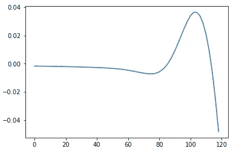

该线在 *K* = ~$85 和~$113 处穿过 0(当两个呼叫相等时),尽管在这个例子中获得精确并不重要，因为我们可以容易地调整几何布朗运动模型中的任何输入因子或我们的时间再分配因子α，并得到不同的结果。

## **战略**

如果我们相信 Mandelbrot 的模型更接近股票在现实世界中的实际走势，这意味着 **Black-Scholes 公式倾向于高估近价期权或价内期权，大大低估价外期权，略微低估价内期权。**

有了这些知识，人们可以制定一个策略，买入定价过低的期权，同时卖出定价过高的期权，如果股票波动很小*或*很大，持有人就可以获利，如果股票波动“预期”的量，持有人就可以获利。

现在是坏消息…

现实世界中的期权不遵循布莱克-斯科尔斯(哎哟，对不起)。

## 隐含波动率“微笑”

如果我们将现实世界的期权价格及其执行价格作为输入，我们可以推导出隐含波动率(σ), Black-Scholes 公式将需要该波动率来产生给定的期权价格。

下面是 SPY(截至 2020 年 8 月 2 日)的当前选项图，其中每条线代表不同的到期日期。隐含波动率在 y 轴上，执行价格在 x 轴上:

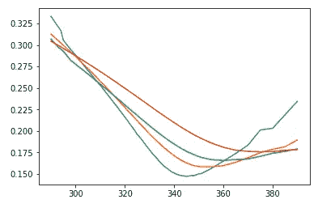

Implied Volatility for SPY calls

如果布莱克-斯科尔斯公式实际上是这些期权合约的定价方式(或者更具体地说，是交易方式)，我们应该会看到一幅非常乏味的画面，因为它是相同的基础股票。所有的线可能不会重叠，因为不同的到期日可能意味着给定时间段内更高或更低的预期波动性，但 Black-Scholes 会告诉我们每条线应该是平的。

我们可以在大多数股票期权中看到这种模式，一种类似微笑的形状，这就是它们的名字的由来。

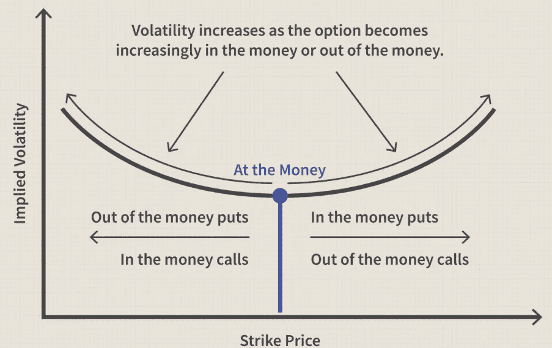

Image from Investopedia

这些波动微笑的出现告诉我们，期权价格通常已经反映了比正态分布更高的尾部事件概率。在 1987 年股市崩盘之前，这种笑容并不常见，因为那种规模的尾部事件以前从未发生过(单日下跌 22.6%)。当我们使用蒙特卡洛模拟的看涨期权价值作为输入并求解隐含波动率时，Mandelbrot 的模型会产生类似的结果。

## 结论

我会问我在上一篇文章最后问的同样的问题:我们能用这些知识做什么？有什么帮助？

我们现在已经测试了 Mandelbrot 的模型，将其作为针对更标准的几何布朗运动的股票模拟器，并展示了它如何能够更真实地反映现实世界中股票运动和期权定价的情况。

虽然我们看到当假设不同的股票运动模型时，期权价格会有很大的不同，但我们也看到期权实际上并不遵循布莱克-斯科尔斯模型。在现实世界中，交易者意识到了较厚的尾部，波动性“微笑”的存在就是证明，但现在我们有了一个模型，可以重现这些极端事件，并让期权价格也反映它们。

当我们了解到这些波动微笑在 1987 年崩盘后变得司空见惯时，或许我们应该吸取的教训是，我们永远不要忘记这种低概率尾部事件的可能性和规模。那么，我们的一个机会是找到那些大型的、重要的“黑天鹅”被遗忘或忽视的情况。

这是关于资产回报的多重分形模型的两部分系列，我鼓励读者查看伯努瓦·曼德尔布罗的*《市场的(错误)行为》*了解更多分形几何及其在金融市场中的应用，以及纳西姆·塔勒布的*《黑天鹅》*(及其他)了解更多风险和尾部事件。感谢阅读！