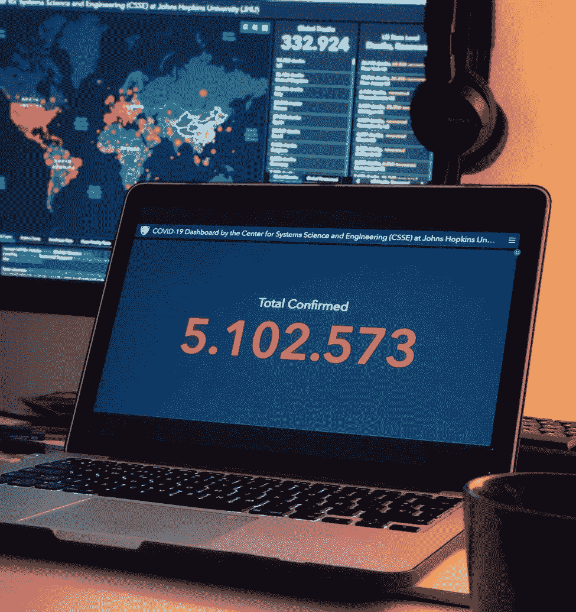
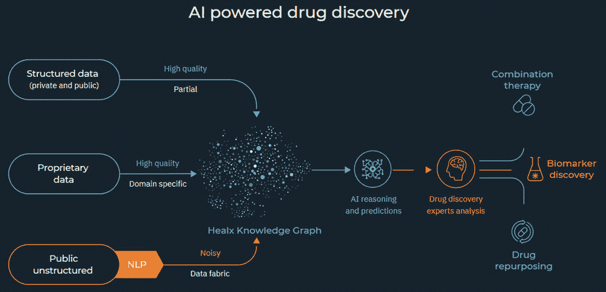
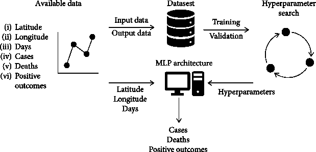

# 人工智能和新冠肺炎

> 原文：<https://medium.datadriveninvestor.com/implications-of-ai-in-combating-covid-19-8ba94e6b14a2?source=collection_archive---------29----------------------->

继新冠肺炎之后，必须利用人工智能来推动变革。

> 注意:这篇文章也发表在 [UTMIST](https://utorontomist.medium.com/implications-of-ai-in-combating-covid-19-b93386035ed0) 上，我目前是那里的一名技术作家。

由于[新冠肺炎](https://www.who.int/emergencies/diseases/novel-coronavirus-2019)的爆发，世界正面临一场生死存亡的全球健康危机。随着技术日益融入医疗保健的结构，新的数字技术成为监测、检测、预防和减轻新型冠状病毒造成的损害的希望灯塔。

Photo by Isaac Quesada on [Unsplash](https://unsplash.com/photos/z5k5vWGh7Nk)

# **利用人工智能进行药物研发**

人工智能技术可以应用的最大领域之一是加速用于对抗新冠肺炎的药物发现。研究人员目前正在研究用于类似冠状病毒疾病的药物的分子设置，利用人工智能潜在地重新利用此类药物来对抗新冠肺炎疫情。

BenevolentAI 是许多试图实现这一目标的公司之一。他们正在使用人工智能驱动的知识图表浏览研究和科学文献，努力寻找疾病的遗传特性与药物的开发和作用之间的相互联系。BenevolentAI 专注于增加知识和推理，新的目标识别，患者特异性治疗和分子设计。

在过去的几年里，在特定生物分子上训练的机器学习模型使我们能够发现有效的病毒疗法。对于 SARS-COV-2，[科学家已经确定了](https://www.frontiersin.org/articles/10.3389/frai.2020.00065/full)新冠肺炎的多个分子靶点，当这些靶点被抑制时，可能会提高患者的存活率。 [CoronaDB-AI](https://www.frontiersin.org/articles/10.3389/frai.2020.00065/full) 是一个在计算机上或体外发现的化合物、肽和表位的数据集，可用于训练机器学习模型，以帮助开发新冠肺炎治疗方法。

Photo courtesy of [Healx](https://www.hospimedica.com/covid-19/articles/294781616/artificial-intelligence-platform-helps-find-combination-drug-treatments-for-covid-19.html)

# **模拟和预测新冠肺炎在各国的传播**

除了药物发现，模拟新冠肺炎在预测其影响方面也起着至关重要的作用。尽管经典和统计建模未能突出数据中的复杂性，但多层感知器人工神经网络允许我们在每个时间单位的所有位置建立患者的全局模型。

在克罗地亚里耶卡大学进行的一项研究中，作者使用了包含 2020 年 1 月 22 日至 2020 年 3 月 12 日期间 406 个地点的感染、康复和死亡患者信息的数据集。该数据集被转换成回归数据集以训练多层感知器人工神经网络。

Overview of AI modelling, courtesy of [Hindawi Journal](https://www.hindawi.com/journals/cmmm/2020/5714714/#acknowledgments)

该模型对意外变化(感染数量的突然增加)的跟踪较差，但对整体模型变化的跟踪较好。如果有时间调整的话，即使在数量出现意想不到的跳跃之后，它也能产生有效的预测。已实现的模型表明，使用人工智能驱动的技术，以地理和时间数据作为输入，确实有可能获得新型病毒感染的质量模型。代码和模型可以在[的公共存储库](https://github.com/RitehAIandRobot/COVID-19-MLP)获得。

# **当前项目使用人工智能对抗新冠肺炎**

新冠肺炎对人们的健康和安全产生了破坏性影响。从不得不练习社交距离到省级紧急关闭令呆在家里，人们想知道我们最终将如何以安全的方式恢复正常。为了推动解决方案的发展，应对新冠肺炎带来的挑战，多个组织通过赠款资助项目。

Photo by Brian McGowan on [Unsplash](https://unsplash.com/photos/-9_6ymUJvPU)

值得注意的是，CIFAR 的人工智能和新冠肺炎催化剂赠款计划资助了 14 个新的人工智能研究项目，以应对冠状病毒的爆发。[一些成功的资助获得者包括:](https://www.cifar.ca/cifarnews/2020/05/12/fourteen-ai-research-projects-join-the-fight-against-covid-19)

[**COVIDEX**](https://covidex.ai/) **—高级临床和学术文献信息检索**

*   合作者:赵京贤(CIFAR 研究员，纽约大学机器与大脑项目学习)，林志颖(滑铁卢大学矢量研究所)
*   使用艾伦人工智能研究所提供的新冠肺炎开放研究数据集(CORD-19 ),使用神经网络来回答问题

[**COVID-Net**](https://arxiv.org/abs/2003.09871)**:新冠肺炎检测和风险分层的开源深度学习平台**

*   合作者:Alexander Wong(滑铁卢大学)、、Linda Wang 和 Desmond Lin(滑铁卢大学)
*   为从胸部 X 射线(CXR)图像中检测新冠肺炎病例而定制的深度卷积神经网络设计

[**my trace/MaTrace**](https://www.utoronto.ca/news/u-t-researcher-aims-improve-accuracy-covid-19-contact-tracing-mytrace-app)**:一款隐私兼容的新冠肺炎联系人追踪手机应用**

*   合作者:Alán Aspuru-Guzik(加拿大国际农业研究中心人工智能主席，国际农业研究中心研究员，生物太阳能项目，矢量研究所)，Maryzeh Ghassemi(加拿大国际农业研究中心人工智能主席，多伦多大学矢量研究所)

[**机器学习对抗新冠肺炎**](https://mila.quebec/en/covid-19/) **:加速小分子药物发现**

*   合作者:萨拉特·钱达尔(加拿大国际研究中心 AI 主席，米兰，蒙特利尔理工大学)，马修·泰勒(阿尔伯达大学 Amii)，赛·克里希纳(99 和贝永德)，卡拉姆·托马斯(99 和贝永德)

# **TL；博士**

*   人工智能等技术不仅对于减轻新冠肺炎病毒造成的损害至关重要，对于预防未来的大流行和传染病也是如此
*   尽管人工智能已经让我们在医疗保健领域取得了重大突破，但我们才刚刚开始了解其潜在影响的程度
*   技术和医疗保健交叉领域的项目(如当前项目中提到的 14 个项目)正在全球范围内进行，但需要额外的资金才能取得实质性进展和突破