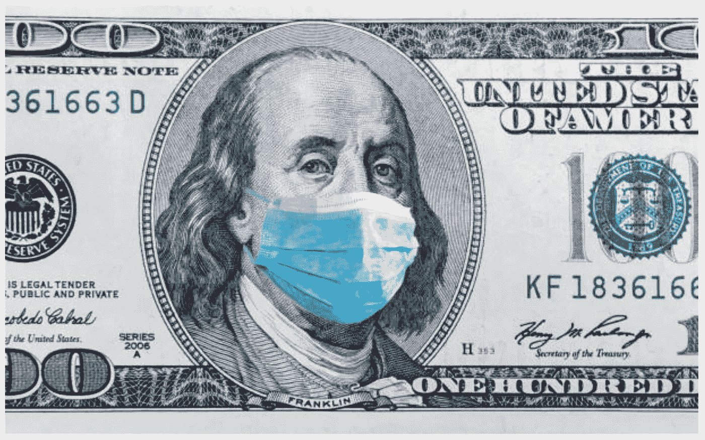
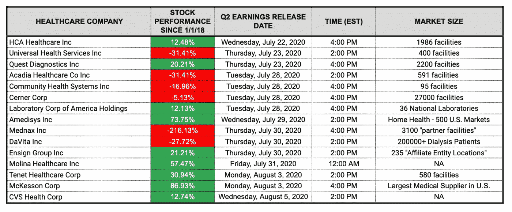

# 内爆的美国医疗保健系统:一个预先存在的条件，而不是任何病毒

> 原文：<https://medium.datadriveninvestor.com/imploding-u-s-healthcare-system-a-pre-existing-condition-not-any-virus-66a43c60c243?source=collection_archive---------3----------------------->

**Source: Getty Images.**

## 早在新冠肺炎之前，银行和高风险贷款就已经威胁到了医疗保健

两年前，我写了一个关于 Forbes.com 的[四集系列](https://www.forbes.com/sites/forbesfinancecouncil/people/pennlittle/)，讨论潜伏在当时光芒万丈的美国经济下的一座冰山。我预测到了

> "根据我的专业判断，医疗保健可能是下一次衰退的焦点。"

它，

> “……可能会让我们付出与 2008 年崩盘数万亿美元一样多的代价……供应短缺可能会导致无数人丧生。”

让我们来探讨一下为什么这种说法在当时是正确的，现在甚至更加准确。

## 地基上的裂缝

当我们面对一个只有我们十亿分之一大小的没有灵魂的敌人时，人们关注的焦点是新冠肺炎是如何“不知从哪里冒出来”对 T4 的医疗体系造成破坏的。也许*病毒*不知从哪里冒出来，但系统的漏洞没有。两年前，它们是完全可见的。

特别是，我在第三篇文章和第四篇文章中描述了这些裂缝，这些文章批评了医疗保健领域更广泛的问题，医疗保健占我们国内生产总值的近五分之一。例如，我认为

> "我们可能已经准备好迎接一场挑战性的解开。"

就像 2008 年的房主一样，今天的医疗保健提供商在偿还贷款方面也有困难。然而，与 2008 年的危机不同，目前的危机涉及到公司——而不是消费者——支付贷款，使得即将到来的危机更加难以识别。 ) *明确地*，我声明

> “在我看来，这些医疗贷款往往是高息的，在许多方面，对寻求资金的(政党)来说是掠夺性的。”

此外，我补充说

> “负债累累的公共服务提供商中有一家最终走上破产法庭，这只是时间问题。”

正如 2020 年 4 月 29 日金融时报[的一篇文章解释的那样](https://www.ft.com/content/3bbb4f7c-890e-11ea-a01c-a28a3e3fbd33)，“破产律师正在为申请数量的激增做准备。当美国第一季度的国内生产总值数据公布时，医疗保健支出的下降是美国经济的最大拖累之一——约占整体消费下降的 40%。”这是*美国所有的消费*，不仅仅是医疗保健行业。

关于以新冠肺炎形式出现的(当时不为人知的)催化剂，我说过:

> “……医疗保健公司可能已经受到损害，但在这种情况下，他们会喘不过气来。”

然后，是我对终极事件的描述:

> “这可能意味着医疗保健市场正面临债务资金大量外流的风险，在我看来，这是医疗保健成本预计飙升的部分原因……”

最后一点:

> “我预计，其影响将远比 2008 年贷款危机的影响更为有害，供应短缺可能会让患者面临风险。”

## 新冠肺炎（新型冠状病毒肺炎）

催化剂现在抬起了它丑陋的头。毫无疑问，这个疫情重塑了世界。在这些预测两年后，这一事件带来的负面供需冲击比我最初预期的要严重得多。

2020 年 1 月 21 日，美国报告了首例新冠肺炎病例。

到 2020 年 3 月 17 日，大多数美国州长都实施了“留在家中的命令”，以遏制新冠肺炎的传播，这已经正式达到了“疫情”的地位。经济基本上冻结了；企业被迫关门，到 2020 年 4 月，美国失业率飙升至 14.7%的峰值。报告显示，如果没有“状态报告错误”，这个数字可能是 19.7%—6700 万失业美国人。

相比之下，2008 年全球金融危机时，失业率“仅”达到 10.6%的峰值。

在美国出现第一例病例后大约 99 天，我们已经发现了 100 万例病例。在第 142 天，病例数翻了一番，达到 200 万。本周，标志着第一次诊断后的六个月，我们已经看到了 122，000 例死亡[和*统计*](https://coronavirus.jhu.edu/map.html%20as%20of%207/8/2020) ***。***

## 危机中的医院

6 月 3 日，贝克尔的[医院评论报道了](https://www.beckershospitalreview.com/finance/29-hospital-bankruptcies-in-2020.html) 29 家美国医院破产。这份报告发出 19 天后，[同一家媒体称](https://www.beckershospitalreview.com/finance/42-hospitals-closed-filed-for-bankruptcy-this-year.html#:~:text=From%20reimbursement%20landscape%20challenges%20to,down%20or%20file%20for%20bankruptcy.&text=They're%20estimated%20to%20lose,from%20the%20American%20Hospital%20Association.)死亡人数已达 42 人。美国医院协会(A.H.A .)的一份报告估计，截至 2020 年 6 月底，[的美国医院已经损失了超过 2000 亿美元](https://www.aha.org/system/files/media/file/2020/05/aha-covid19-financial-impact-0520-FINAL.pdf)，自 3 月份以来，每月损失 500 亿美元。

根据哈奇研究所的一份报告，2000 家乡村医院中大约有 453 家面临关闭的危险。

## 供应短缺

新冠肺炎造成了供应冲击，耗尽了医院的药品和设备，从而迫使他们为必要的供应支付高昂的价格，同时严重损害了他们的主要收入来源:选择性手术。此类手术占医院收入的 48%。这些都是事先安排好的手术，而不是拯救生命的紧急程序。关节置换、肿瘤切除、心脏手术、鼻整形和吸脂都属于这一类。许多著名的连锁医院，包括著名的梅奥诊所，已经取消了择期手术和门诊。

 [## 医疗保健行业的精益项目管理|数据驱动的投资者

### 有一个分类的项目管理程序制定了许多业务，可以属于一个…

www.datadriveninvestor.com](https://www.datadriveninvestor.com/2020/07/02/lean-project-management-in-healthcare/) 

前面提到的日期为 2020 年 6 月 11 日的 [Hatch Institute 报告](https://thehatchinstitute.org/all-stories/2020/6/11/clobbered-by-coronavirus-us-hospitals-set-to-lose-200-billion-in-revenue)还引用了马萨诸塞州牛顿市非营利性医疗保健优化研究所的创始人 Eugene Litvak 博士的话。根据 Litvak 的说法，“……在病毒爆发之前，大多数美国医院在管理病人激增和人员配备方面做得很差。Litvak 补充道:“美国医院甚至在发生慢性阻塞性肺疾病之前就已经经历了低效率的疫情时期……那场危机只是凸显了现有的弱点。”利特瓦克的评论与我的观点不谋而合。

当我说“无数生命可能会因供应短缺而丧生”时，我指的是医疗保健公司可能会因债务增加和报销减少而无法负担供应。

我没有预见到的是近乎总需求的*停滞*。由于害怕感染新冠肺炎病毒，人们对去医院、急诊室、紧急护理诊所，甚至疗养院都非常偏执。这种不愿与医疗提供者合作的态度是前所未有的。

## 美联储来救援了

美国美联储银行(Fed)和美国财政部在 2008 年金融危机期间进行了干预，通过问题资产救助计划(T.A.R.P .)和多轮“量化宽松”(Q.E .)挽救了金融系统。后者是一个花哨的术语，通过削减政府支票凭空创造货币——这些措施使美联储的资产负债表膨胀到 4.6 万亿美元的峰值。实质上，美联储向金融和信贷市场注入了“希望”,将股市推至新高。这一注入使得僵尸公司(正如我在《T4》最后一篇福布斯文章中所称的那样)得以存活并茁壮成长。私募股权泛滥，[杠杆收购](https://www.youtube.com/watch?v=YN5XoQpMEfE) (L.B.O .)策略使得医疗保健公司的估值超过公司价值的三十倍。

## 私人股本狂欢

绝大多数银行和投资公司认为患者保护与平价医疗法案将确保巨大的收益。因此，自 2010 年以来，仅私人医疗服务提供商就花费了约 9000 亿美元的借款本金。此外，在公开股票市场交易的供应商欠贷款人 4320 亿美元。甚至非营利组织也在收购医疗保健公司以提升价值。

所有这些买家的一个共同主题在于他们对 L.B.O .债务的使用。这种债务通常由收购方担保，用被收购公司的资产作为抵押品。这很像消费者购买汽车。然而，我们在购买大众汽车时不会得到“只收利息”的条款。此外，我们从来不指望一辆车比我们买的时候更值钱。此外，当医疗保健公司在 2010 年至 2015 年的 AC . a 繁荣期时，我们当然从未想到医疗保健提供商会失去价值，或者在许多情况下，被认为完全一文不值。

## 政治经济学与复兴

仔细想想。一个费用/减记激增、收入/利润暴跌的行业(医疗保健)如何生存？如果你回答了**债务和补贴**，答对了！2018 年 10 月，[我概述了美联储的](https://www.forbes.com/sites/forbesfinancecouncil/2018/10/17/from-zombie-corps-to-questionable-revenue-trends-to-watch-for-as-a-health-care-investor/#16b51fe53b86)表现

> “……缩减 4.5 万亿美元的资产负债表，以实现软着陆”。

快进近两年后，美联储(再次)出手相救，通过仓促行动注入数万亿流动性，为我们走出近乎致命的经济事件铺平了道路。“刺激”导致美国股市恢复到 COVID 之前的水平，让许多分析师对股市和经济之间公然的“脱节”感到抓耳挠腮。

你会问，这个“希望”的成本是多少？到 2020 年 7 月 1 日，美联储的资产负债表已经从 2008 年危机后的低点 3.8 万亿美元膨胀到超过 7 万亿美元，并且还在上升！

**你可能想坐下来听听这个……**

2020 年 6 月(是的，仅仅一个月)的联邦赤字(税收收入减去支出)已经膨胀到惊人的 8640 亿美元，比 2019 年 6 月的 80 亿美元高出 100 倍。

根据会计教授兼俄克拉荷马大学普莱斯商学院临时院长韦恩·托马斯博士的说法，

> “我们开始看到更多来自医疗保健提供商的收益报告，显示由于无法提供选择性手术，利润大幅下降。这是疫情的另一个迷人之处。”

Thomas 博士关于收益的观点将使人们对 Q2 2020 即将发布的收益报告和经审计的季度报表(10q)感到好奇。不可避免的是，这些报告将增加已经增加的医院破产指标。

**A flurry of newly announced facility closings (and accompanying job cuts) could reach the public eye in the coming weeks (Data as of 07/19/2020).**

鉴于最近的复苏引发了经济重启计划的倒退，迈阿密的医院已经确认所有重症监护病房(I.C.U .)的床位都将被占用。2020 年 7 月 13 日，加州州长纽瑟姆宣布，该州所有县必须(再次)停止人群挑衅活动，影响到餐馆、酒厂、动物园/博物馆和酒吧。纽瑟姆还下令关闭 30 个县的健身房、发廊、教堂、办公室和商场。

内华达州州长史蒂夫·西索拉克下令关闭酒吧(赌场除外——在那里顾客只能享受餐桌服务)。事实上，在全国的赌场里，工作人员只让你摘下面具…喝成人饮料或抽烟。

说到俄克拉荷马州，这个“更早的州”是第一个重新开放(它是部落的)赌场的州，其中之一是全国最大的赌场。此外，截至 7 月 15 日，该州州长凯文·斯蒂特被诊断患有新冠肺炎病毒。根据 7 月 18 日的推特消息，尽管他还没有表现出症状，但州长已经被隔离。

**Governor Stitt (R-OK) tested positive for COVID-19 last week. Source: Twitter.**

## 迫近的现实

随着政府报告将在未来几个月公布，美国是否陷入衰退将是毫无疑问的，这直接源于我两年前警告过的医疗保健问题。导火索是一只新冠肺炎形式的黑天鹅，但美国医疗保健的基础裂缝已经形成，放大了疫情的影响。美联储通过增加印钞进行干预，类似于用大猩猩胶和胶带来暂时封堵胡佛大坝上形成的裂缝。大坝溃决会发生什么？**大量的破产。**

两年前，当我这么说的时候

> “也许我们可以看到早期的破产事件……转变成一种被宣传和政治化的大规模破产现象……”

…我以为法庭会开门。

我估计利率上升会发挥作用。然而，40%的下降和关闭的法院肯定会比美联储加息 0.25%产生更大的问题。

尽管如此，*数万亿*的本金和利息仍未偿还，应支付，而且——当法院重新开庭时——很可能到期！[经济和政策研究中心](https://cepr.org/)联合主任艾琳·阿普尔鲍姆博士合著的一篇文章称。

> “…如果[私募股权拥有的]提供商破产，员工、患者、投资者和债权人都会损失，但 P.E .普通合伙人会退出，因为债务在提供商身上产生了杠杆效应，P.E .合伙人的投资通常不到总购买价格的 1-2%。”

阿普勒鲍姆博士看起来很准确。2014 年，我将毕生积蓄投资于一项小型(主要由卖方融资的)医疗收购战略。这主要是希望改善我们对待行为保健的方式。2017 年，当我出售给一家主要的全球私人股本公司时，我的净回报远远超过了预期——我的原始投资与四次收购的合并支出: **1.6%。**

我投票反对出售，因为我认为它好得不真实，完全是浪费我们的时间。然而，我有三个合作伙伴，值得称赞的是，*交易完成了！*当然，那种深不可测的回报帮助我认识到*这个问题*。也就是说，这种策略给迅速增长的煤油浸泡的医疗债务仓库添加了更多的燃料，而新冠肺炎是没有人看到的火花。

## 现在是解决问题的时候了

总之，这不是众所周知的“早就说过”的胜利圈。这仅仅是为了解释为什么当时和现在的声明是正确的，希望表达我们的美国医疗保健系统在未来几个月可能会失败这一不可避免的现实——提供一个解决方案的途径。当我说“失败”时，我指的是大规模的医院破产和为其提供资金的机构的失败，这实际上是整个全球金融体系，不包括中国。

为了实现这一目标，我们必须认识到这个问题，随着纽约、旧金山和芝加哥等金融中心的联邦破产法庭重新开庭，这个问题可能会很快出现。一旦发生这种情况，对每个人来说都很难。然而，当面对美国的重建任务时，我们往往非常成功。

## 作者的披露

*我/我们在提及的任何股票中没有头寸，并且没有计划在未来 72 小时内建立任何头寸。我自己写了这篇文章，虽然它可能是由 Medium 的编辑策划的，但它表达了我自己的观点和可证实的事实。我没有收到任何报酬(除了来自 Medium)。我和这篇文章中提到的股票的任何公司都没有业务关系。*

## DDI 的披露:

*本文及其分析仅代表作者观点，与《数据驱动投资者》( DDI)编委会的立场无关。我们鼓励读者对这一主题和相关主题进行自己的尽职调查和研究。DDI 也没有以任何方式与此话题相关的交易头寸或财务利益。*

**访问专家视图—** [**订阅 DDI 英特尔**](https://datadriveninvestor.com/ddi-intel)