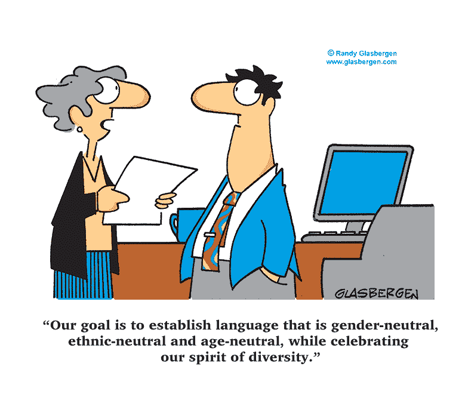

# 文化能力在医疗保健中的重要性…

> 原文：<https://medium.datadriveninvestor.com/importance-of-cultural-competence-in-workplace-9c2d3ac65430?source=collection_archive---------12----------------------->

> 文化是一群人一起做事的方式。它暗指共同的语言、价值观、习俗、标准、风俗、表达方式、历史或个人聚会的基础。它是一个种族的、严格的或社会的聚会的标准信念、社会结构和物质属性。

文化能力被描述为一种独特的程序，它将怀疑、信息和来自另一个人的与我们自己的经历不完全相同的经历的暗示包围起来，并超越“作为种族的文化”来研究个体社会人格的复杂性。如果没有意识到文化问题可能在起作用，提供者可能会对患者的抵制、缺乏依从性或似乎对提供护理不感兴趣感到困惑。这是熟练与来自不同文化背景的人合作的第一步，可以提高护理服务的效率，增加组织的市场份额，减少阻碍进步的障碍，帮助满足法律和监管准则，并融入不同的信息技术。这是了解我们的社会信念、品质和习俗，以及了解它们如何影响我们的选择和行为的能力。它期望我们退后一步，像通过别人的眼睛一样审视自己，并让我们的大脑接受各种各样的做事方法。在医疗保健领域，它意味着有能力认识和理解文化和社会实践、信念和习惯治疗实践对一个人康复的影响。文化意识是持续实践和观点的结果，是一个持续的过程，而不是终点，因为患者的需求在不断变化。

在医疗保健机构中具备文化能力是很重要的，这样我们才能获得更深刻的自我认识，并理解我们自己的信念、行动和对他人的反应的基础，而且我们生活在一个有众多不同文化影响他人的信念和行为的世界中。这是熟练与来自不同文化背景的人合作的第一步。它提高了护理服务的效率，增加了组织的市场份额，减少了阻碍进步的障碍，有助于满足法律和监管准则，并将不同的观点、想法和策略纳入决策过程。除了减少住院病人的护理差异，加强预防性护理，改善病人数据的收集，以及减少医疗错误、治疗和医疗访问的数量。它还加强了数据收集，改善了患者的预防保健。一个具有文化意识的医疗保健系统可以建立相互尊重和理解，从而建立持久的信任，推进日益全面的福祉义务，并扩大社会层面的融合。它有助于促进包容和平等，并使患者感到安全和平等，因为他们自己的习俗和信仰被纳入主流实践，从而使他们的护理服务在文化上具有竞争力。如果没有意识到文化问题可能在起作用，提供者可能会对患者的抵制、缺乏依从性或似乎对提供护理不感兴趣感到困惑。在卫生保健环境中，文化意识、敏感性和能力行为至关重要，因为健康、疾病、痛苦和护理的概念因人、文化和社会而异。

**对文化习俗的了解使卫生保健提供者能够获得如下各种福利:**
1 .提高护理质量和患者满意度
2。有助于避免员工和住院医生/患者之间的误解，
3。更少的诊断错误。
4。更合适的测试和筛选
5。避免药物并发症
6。扩大选择范围，接触高质量的临床医生。
7。增加就医行为
8。提高工作满意度并有助于留住员工
9。增进患者和医护人员之间的信任
10。导致更高的诊断接受率
11。提高治疗依从性

**文化偏见** 文化偏见发生在有文化的人对约定俗成做出假设的时候，包括语言、符号、证明和证据的约定。然后，他们被指责将这些假设误认为逻辑或自然法则，这很重要，因为组织环境是由消除获取障碍和实施变革的战略过程组成的，其基础是接受许多人由于社会和系统因素而不是个人缺陷而无法获得服务、工作和领导职位。这一过程包括反映不同群体的人积极和有意义的参与。

**文化对健康的影响**
健康被认为是一个文化概念，因为它是塑造一个人如何感知世界和经历的文化。它影响对健康、疾病和死亡的印象，对疾病原因的信念，处理健康促进的方式，如何体验和表达疾病和疼痛，患者在哪里寻求帮助，以及患者喜欢的治疗类型。不同文化信仰的人对卫生保健提供者推荐的治疗方案的理解和依从程度各不相同。例如，一些患者认为不注射的医生可能没有认真对待他们的症状。医护人员和病人都受到他们所在社会的影响。因此，不管服务和可用系统的质量如何，没有意识到这些文化差异会导致不良的患者结果，降低患者的依从性，并增加健康差异。

**多样性和包容性**

多样性指的是个人用来向他人肯定自己的属性，“那个人和我不一样。”这些特征包含了细分因素(例如，种族、性别和年龄)，就像品质和社会标准一样。在加拿大，各种各样的人超越了过去的种族和民族，然而却涵盖了语言、性别、严格的隶属关系、性取向、能力和金钱地位。加拿大人民团体从众多社团和基金会的融合中获益，从个人带来的创新和专业知识中获益，从我们将来自广泛地点的思想和心态融合在一起时产生的合作中获益。合并的标准包括明确承认社会不是同质的，并抓住体面的多样性作为改善而不是“问题”的印象。它需要承认，完全依赖于或遵循主流社会或社会标准的思想和实践通常会带来拒绝、分离和阻碍。组织环境由消除获取障碍和实施变革的战略过程组成，其基础是接受许多人无法获得服务、工作和领导职位是由于社会和系统因素而非个人缺陷。

*医疗保健提供组织中的系统方法* :
管理繁荣的系统方法是一种应用逻辑知识来掌握影响健康模型结果的组件以及这些组件之间的联系的方法；以及设计、方法或行动过程的变化，依赖于由此产生的信息，以更低的成本实现更好的繁荣。

**多元化战略**是一种在医疗保健组织层面实现多元化和文化竞争力的系统方法，这是行政领导对多元化的敏感取向。经理或主管在很大程度上被称为 C-suite 级别的主管，因为他们的头衔通常以字母 C 开头，并承认员工和患者的多样性是阐明系统的基础，这不会逃脱。

全球化彻底改变了世界各地的社会。移民带来了巨大的变化，并导致患者的多样性，使文化一致的医疗保健成为一项势在必行的义务。根据**加拿大卫生部(2001 年)**的说法，文化上胜任的护理是“提供有效满足患者及其家人需求的医疗保健，承认社区内的种族、文化、语言、教育和社会经济背景。”

文化上胜任的护理是一个复杂的概念，它包含了各种观点，例如，社会情感或对学习、信息、例子的接受能力，提供社会技能考虑的适当程序，以及利用翻译或调查同化水平的能力。许多理论解释了它的重要性，但跨文化理论是旨在为不同或相似文化的客户提供文化一致、安全和有意义的护理的主要理论。

**文化主管保健的重要组成部分**

我们需要新的富有想象力的教学方法来建立一种工作能力，对来自各种社会基础、方言和观点的个人的不同需求做出反应。此外，还需要整合网络和医疗诊所管理，以及**西方和东方的住院护理方法**，以保证考虑到社会能力。此外，医疗服务协会应该促进和支持员工的心态、实践、信息和能力，使他们在各种社会工作场所中，像彼此一样，恭顺地、可行地与病人、家庭和网络打交道。此外，关于不同社会的更多信息填补了基于文化、种族和族裔的人类服务提供者和受益者之间存在的社会差异造成的漏洞。

**文化知识**

关于其他文化的价值观、信念、生活方式、护理需求和健康排演的信息有助于护理人员与患者一起做出重要选择(Leininger，2007)。社会信息可以帮助父母远离社会不便和种族优越感，或确信自己的方式是普遍的。此外，社会信息提高了医疗服务提供者的正念。

这些能力包括收集关于患者状况的重要社会信息，以社会可接受的方式进行评估，以及做出通常适当的护理安排。此外，它是对人、家庭、聚会和网络的社会品质和信念的精确评估，并根据需要进行调解(Leininger，2001 年)，可以通过协调智慧、方便的信息和细心的学术特征进行升级。

**文化正念**

文化正念是自我评估，是对自己的社会和精通基础的调查。这个过程包括承认个人对不同社会的假设和倾向。熟悉这些假设的需要会导致人类服务专家将他们的信念、品质和行为范例强加给来自另一种文化的个体(Leininger，2002)。

**文化欲望**

文化需求的特征是护士在被证明是有社交能力而不是必须参与的时间里需要参与的灵感。它包含了认证的能量，并保证具有适应性，对他人开放，扩展相似性，并随时准备从他人那里获益。谦虚是实现一个人社交愿望的关键因素。正念、爱、苦修、社会公平、同情和神圣相遇是文化欲望的结构方块。

**文化邂逅**

保健遭遇包括联合三个世界:个人及其家庭的生活方式、医疗服务供应商的文化和保健系统(Spector，2004)。社会经验同样包括对患者语音需求的评估。官方准备的调解人可能是重要的，以鼓励在评估和护理安排，包括保证知情同意的方式通信。偶尔，破译的亲属和同伴对临床措辞缺乏经验，这可能导致在建立护理安排时出现偏离基础的数据和误解。

Leininger 的模型实现了社会一致的护理行为。她的考试提供了上升到护理跨文化能力的想法。Giger 和 Davidhizar 关注的是个人，而不仅仅是社交聚会，从六个衡量标准来看，他们认为每个人在社交方面都是卓越的。珀内尔制作了一个包含 12 个社会空间的图解描绘，这些空间决定了一个人的社会遗产的品质、信念和实践的多样性。Campanha-Bacote 将社会适应描述为一个过程，而不仅仅是一个终点。该模型的五个部分可用于加强提供者的社会能力，所有部分的适当组合可用于实现定制护理的最佳提供。

NCCC 将文化意识定义为认识、观察和意识到不同文化群体之间的相似性和差异性(Goode，2001)。这是一种看到我们的社会信念、品质和习俗，以及看到它们如何塑造我们的选择和行为的能力。它期望我们退后一步，以一个陌生人的眼光审视自己，并让我们的大脑接受各种各样的做事方法。在医疗保健领域，它意味着有能力认识和理解文化和社会实践、信念和习惯治疗实践对一个人康复的影响。文化意识是一致的实践、观点和方法的结果，这些实践、观点和方法在一个框架中相遇，在多面的环境中赋予令人信服的工作以力量。这是一个持续的过程，而不是终点，因为患者的需求在不断变化。

**目前场景:**

全球化彻底改变了世界各地的社会。移民带来了巨大的变化，并导致患者的多样性，使文化上一致的医疗保健成为一项势在必行的义务，在世界各地文化多样性人口日益多样化的环境中，医疗保健提供者必须有文化意识，同时将文化标准与实践相融合并加以采用，因为文化意识是必不可少的，因为它有助于承认和尊重客户的健康信念和实践，并放大积极的健康成果。

**文化意识的重要性:**

在医疗保健机构中保持文化意识是很重要的，这样我们才能获得更深刻的自我认识，并理解我们自己的信念、行为和对他人的反应的基础，而且我们生活在一个有众多不同文化影响他人的信念和行为的世界中。文化意识是熟练与来自不同文化背景的人合作的第一步。它提高了护理服务的效率，增加了组织的市场份额，减少了阻碍进步的障碍，有助于满足法律和监管准则，并将不同的观点、想法和策略纳入决策过程。除了减少住院病人的护理差异，加强预防性护理，改善病人数据的收集，以及减少医疗错误、治疗和医疗访问的数量。它还加强了数据收集，改善了患者的预防保健。一个具有文化意识的医疗保健系统可以建立相互尊重和理解，从而建立持久的信任，推进日益全面的福祉义务，并扩大社会层面的融合。它有助于促进包容和平等，并使患者感到安全和平等，因为他们自己的习俗和信仰被纳入主流实践，从而使他们的护理服务在文化上具有竞争力。如果没有意识到文化问题可能在起作用，提供者可能会对患者的抵制、缺乏依从性或似乎对提供护理不感兴趣感到困惑。

**结论:**

有无数的文化是不同的和独特的，通过理解我们自己和他人的信仰和行为的文化起源，并保持开放的思想，即其他人的文化以我们的文化指导我们的方式指导他们，我们作为卫生专业人员和人类将有更好的机会与不同文化背景的人积极互动，并为他们提供适当的服务。它允许我们分析自己和病人的信念，并接受不同观点的教育。这种理解特别重要，因为文化视角和信仰深刻影响着人们健康和福祉行为的各个方面。它有助于促进包容和平等，并使患者感到安全和平等，因为他们自己的习俗和信仰被纳入主流实践，从而使他们的护理服务在文化上具有竞争力。