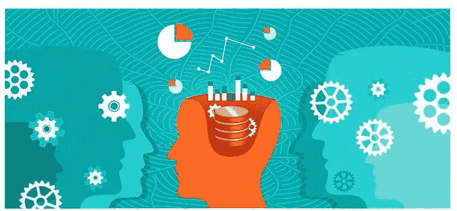
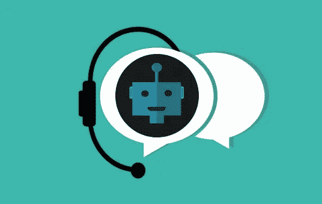

# 数据科学的重要性！

> 原文：<https://medium.datadriveninvestor.com/importance-of-data-science-cb4308258b4d?source=collection_archive---------37----------------------->



我们已经听到太多关于人工智能、机器学习和深度学习如何改变世界，以及这些东西如何让每个人的生活变得更容易。数据科学是分析数据的研究，从数据中提取有用的见解，以找到解决方案或预测问题陈述的结果。

通过使用数据科学，我们可以帮助公司使其业务更加智能，并帮助做出更好的营销决策。由于数据科学领域的巨大发展，我们看到了当今世界的显著变化。公司有能力建立成功的预测模型，像 Alexa，Siri，Google Home 这样的数字援助，在线欺诈检测，疾病的早期检测等。应用程序数不胜数，在不久的将来，在数据科学的帮助下，我们将看到许多如此惊人的变化。



在早期，数据存储在 excel 表格中，因为数据非常少，而且是结构化的，易于管理。使用简单的业务工具很容易分析和处理这些少量的数据。但是现在时代变了，每天产生的数据量非常巨大，而且这个数字还会在很大程度上增加。因此，我们需要做好准备，使用更复杂、更有效的算法来管理如此庞大的数据。

数据科学涵盖人工智能、机器学习和深度学习的许多领域，以便分析数据并从数据中提取有用的知识见解:


为了更好地理解数据科学，让我们在脸书页面上看一个如何使用信息来改善用户体验的例子。我们看到了帖子、图片、视频、好友建议、好友邀请等的闪回记忆。

以下是数据科学项目涉及的阶段:

***阶段 1:业务需求阶段***

*   在这个初始阶段，数据科学总是从理解业务需求或我们试图解决的问题开始。理解项目的主要目的是很重要的。

***阶段 2:数据采集阶段***

*   下一步是从不同来源收集所有相关数据。这个过程也称为数据挖掘或数据收集。

***阶段 3:数据预处理阶段***

*   有时会收集不必要的数据，这些数据只会增加问题的复杂性。因此，这种不相关和不一致的数据不需要分析，必须在这个阶段删除/修复。大约 50–80%的时间用于数据清理。这个阶段也被称为数据处理。需要将来自各种来源的数据转换成所需的格式。这一阶段被认为是最耗时的任务之一。这是一项繁琐的任务，因为我们需要找到相关的数据并处理缺失的值。

***阶段 4:数据探索分析阶段***

*   数据探索阶段就像是数据分析的头脑风暴。我们需要问正确的问题来探索数据。这是一个关键阶段，我们需要理解数据中的模式，并尝试检索有用的见解。这些信息被用来发展业务。

***阶段 5:数据建模阶段***

*   这个阶段主要包括建立一个预测解决我们需求的机器学习模型。这个模型是通过使用探索阶段收集的所有见解和趋势构建的。该模型通过输入数以千计的客户记录进行训练，以便它可以学习更准确地预测结果。数据建模阶段包括实现机器学习模型，步骤如下:

*第一步:* ***导入数据*** - *导入所需的库，我们在前面阶段收集的数据需要以机器学习过程中可读的格式导入。考虑学生成绩信息的一个例子:*

```
# Import required libraries
import pandas as pd
import numpy as np
import seaborn as sb
from sklearn import linear_model# Read the dataset
data = pd.read_csv("../input/students-performance-in-exams/StudentsPerformance.csv")
data
```

*第二步:* ***数据清理*** — *我们在前期已经进行了数据预处理和数据探索，但是数据清理不可能一次完成，数据清理是一个迭代和重复的过程。重复值、缺失值或空值可能会导致预测错误，因此任何不一致的地方都需要在这个阶段进行处理。*

```
# Checking the total null values in each column
data.isnull().sum()
```

*第三步:* ***建立模型*** - *这里将数据集拆分成两组，一组用于训练模型，另一组用于测试模型。之后，我们通过使用训练数据集来建立模型。这些模型不过是线性回归、支持向量机、决策树等机器学习算法。*

```
# Creating linear regression object
model_LR = linear_model.LinearRegression()
```

*第四步:* ***训练模型*** — *在训练数据集上训练机器学习模型。数据集的大部分用于训练，以便模型可以学习从一组不同的值将输入映射到输出。*

```
# Creating X and y
X = student.drop('math score', axis='columns')
y = student['math score']# Train the LinearRegression model using the dataset
model_LR.fit(X,y)
```

*第五步:* ***测试模型****——模型训练完成后，再使用该阶段的测试数据集进行评估。在这个阶段，模型被输入新的数据点，它必须通过在机器学习模型上运行新的数据点来预测结果。*

```
# Predicting math_score (y_pred) with values [0,1,50,40]
y_pred = model_LR.predict([[0,1,50,40]])print("The predicted math score is: ", y_pred)
```

*第六步:* ***提高效率*** *—建立模型并用测试数据评估后，计算其精度。可以使用不同的方法来提高模型的效率和准确性。*

***阶段 6:数据验证阶段***

*   在这一阶段，检查是否有任何新数据表现异常或任何错误预测正在发生。如果检测到任何此类异常，就会向数据科学家发送通知以解决问题。

***阶段 7:部署和优化阶段***

*   数据科学的最后阶段是部署和优化。因此，在测试该模型并提高其效率之后，它被部署在生产环境中供所有用户使用。生产部署后，必须检查模型的性能。如果用户面临任何问题，他们会在此级别得到解决。

**总结:**

对数据科学的需求正在增加，以拥有更好的决策机器，解决复杂问题，通过早期预测疾病来改善医疗保健和服务，情绪分析，情绪识别，更好的想法将使生活变得更容易，所有乏味的工作都可以由机器完成，机器可以被训练以有效地完成工作，减少人为错误，精确的自动驾驶汽车将在很大程度上减少每年的车祸，在这个领域可以取得更多成就。数据科学将有助于提高所有操作的效率。

数据科学、人工智能、机器学习和深度学习还有很多。所以让我们继续学习吧！

感谢阅读！

*原载于 2021 年 1 月 11 日 https://www.numpyninja.com**[*。*](https://www.numpyninja.com/post/importance-of-data-science)*