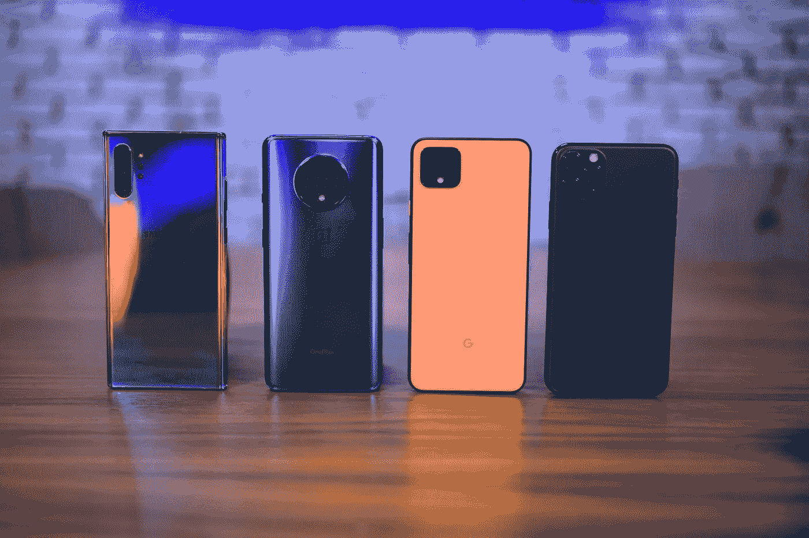

# 购买智能手机时需要注意的重要功能

> 原文：<https://medium.datadriveninvestor.com/important-features-to-look-for-while-buying-a-smartphone-a7fbbf2cf80a?source=collection_archive---------35----------------------->

## 以简单的方式解释智能手机的功能，以便您下次购买时有一个清晰的概念。

image source:google

在购买智能手机时，除了对手机摄像头提供的百万像素感到恼火之外，还有很多功能值得关注。这里有一个循序渐进的指南，让你为自己选择合适的智能手机。所以让我们开始吧

# 预算:

买手机时首先要做的是了解你的预算。智能手机的价格区间从 10000 印度卢比(134.6 美元)到 150000 印度卢比(2019.11 美元)甚至更多。虽然不同的预算适合不同的人，但价格区间较大的智能手机并不一定就比价格区间较低的智能手机好。选择一个你满意的预算。现在让我们继续前进。

# 存储:

如果你需要购买一部智能手机用于日常大量使用，并持续使用数年，这样你就不会在一年内用完你的存储空间，选择 256 或 512GB 的型号。这种存储是通过手机管理大部分工作(如经营企业)的人的首选。**但是**如果你需要日常使用，比如**普通用户**的需要，就选 64-128GB 的。它非常合适，可以为你服务很长一段时间。现在，如果你打算买一部二手智能手机作为第二用途，或者想买一部 16- 64GB 的。

# **闸板**:

现在大多数人把 ram 搞混了，刻板印象是“多多益善”。但是，如果用简单的话来解释，ram 是你的智能手机流畅运行，没有故障或挂起，并能够同时运行许多应用程序所必需的。如果你是一个游戏玩家，8GB 或以上的 ram 就可以了。如果你不是一个游戏玩家，并且需要日常使用，4-6gb 的 ram 将适合你，这取决于你对手机的平均使用情况。

# 处理器:

处理器会直接影响智能手机的运行速度。它决定了您的智能手机在拍摄照片、播放视频、浏览网页、玩游戏等方面的性能。它对于你的手机就像 CPU 对于电脑一样。那么目前最好的处理器是什么呢？

1.  同样，如果你是游戏玩家，2.5-3.5 GHz 的处理器是合适的。
2.  非游戏重度用户以及中度用户的时钟速度在 2–2.6 GHz 范围内。
3.  以下是根据时钟速度排序的顶级处理器的链接([https://www.phonecurry.com/benchmarks](https://www.phonecurry.com/benchmarks))

# 显示:

接下来是展示。随着新智能手机配备 infinity u 显示屏和穿孔设计，给智能手机带来了 chiche 外观，显示屏是真正的玩家。随着三星等品牌寻求 super amoled 显示屏提供明亮的色彩和丰富的观看体验，小米选择在其最新的智能手机中满足于 IPS LCD。事实上，super Amoled 提供了良好的观看体验，并具有非凡的色彩、深黑色和令人目眩的对比度，IPS **LCD** 显示器具有更柔和的色彩(尽管有人会说更准确)，**更好的离轴视角，通常情况下整体画面更明亮。但是根据经验，我的建议是 super amoled 显示屏。**

**现在，我们首先寻找的功能是相机。**

# 照相机

我们都对我们的智能手机摄像头有着特殊的爱，我相信我们都对此有很多了解。但是为了实现这篇文章的灵魂目的，我想在文章中提到它。现在，对于那些喜欢拍摄 YouTube 视频的人来说，vlogging 需要一个智能手机摄像头，大约 6400 万像素的 android 后置摄像头。对于日常使用，我们可以使用 25 到 48 MP 的摄像头。此外，对于前置摄像头，16-32MP 摄像头对于 android 的普通用户来说也是可行的。*但是摄像头像素可以根据用户的意愿变化*；)