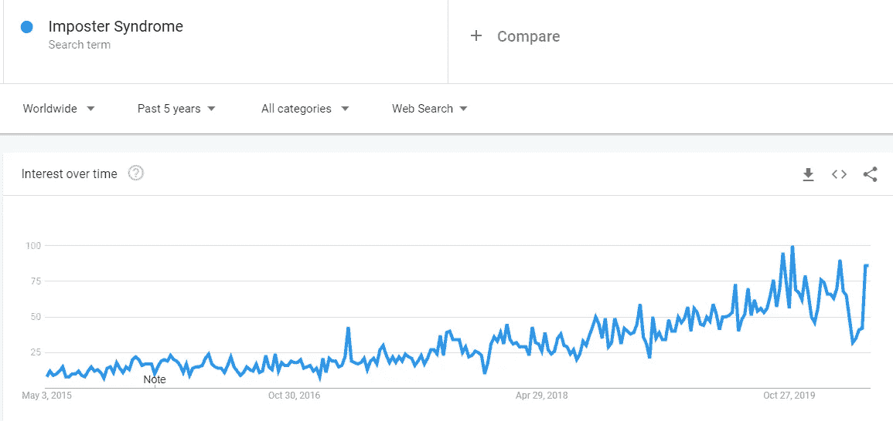

# 高管中的骗子综合症

> 原文：<https://medium.datadriveninvestor.com/imposter-syndrome-in-executives-d591fe66b7dd?source=collection_archive---------9----------------------->

## 越来越多的高管正遭受这种痛苦，为什么？

Photo by [engin akyurt](https://unsplash.com/@enginakyurt?utm_source=medium&utm_medium=referral) on [Unsplash](https://unsplash.com?utm_source=medium&utm_medium=referral)

1978 年在一项关于成功女性的研究中首次发现，冒名顶替综合征已经影响了 70%的员工(根据《行为科学杂志》)，在高管中尤为普遍。

Source: Google Trends

在过去的几年里，对冒名顶替综合症的搜索激增。

这可能与我们对地位、资历和成就的痴迷有关吗？

毫无疑问。

在最近的过去，我们通常将自己与我们认识和遇到的同行进行比较，今天，我们将自己与那些完美策划和完善人物角色的全球超级明星进行比较。

我们都明白年轻人是如何通过将自己与成名的生活方式相比较而变得抑郁的。

 [## 数据驱动始于数据素养|数据驱动的投资者

### 光是听到“数据”这个词就令人生畏。老实说，只有 21%的全球员工对自己的工作充满信心

www.datadriveninvestor.com](https://www.datadriveninvestor.com/2020/03/22/data-driven-starts-with-data-literacy/) 

同样的情况也发生在高管层，经理们将自己与摇滚明星 CxO 相提并论，同时承认自己的个人品牌充其量只能算平庸。这种感觉挥之不去，总有一天这些超级巨星中的一员会出现在他们的公司里，把他们推回到原来的位置(他们觉得自己应该留在原来的位置，因为他们一开始就很幸运地得到了这个职位)。

此外，在网络媒体上，错误失控的风险越来越大，因此，越来越多的高管开始因不属于自己的位置而感到麻痹，这并不奇怪。

**什么是冒名顶替综合症？**

冒名顶替综合征几乎与[邓宁-克鲁格效应](https://en.wikipedia.org/wiki/Dunning%E2%80%93Kruger_effect)相反，即人们估计自己的能力高于平均水平，而实际上他们的能力可能低于平均水平。

另一方面，冒名顶替综合征被定义为有两个明显的部分:

1.  认为自己的成就不值得的感觉
2.  害怕被揭穿是个骗子

它被归类为一种“心理模式”，而不是任何形式的疾病。

尽管人们取得了明显的成功，但他们很容易将其归因于“运气”，这是一个比综合症本身更缺乏证据的概念。

**“冒名顶替者”有哪些类型？**

根据各种研究，有五种明显的“冒名顶替者”。

1.  完美主义者——我们可能都认识这样的人。这些人因为犯了哪怕是很小的错误而自责。
2.  超人(或女人)——这些人急于证明他们不是冒牌货，所以他们从不休假，工作太辛苦，通常会给自己压力。
3.  天才——那些天生擅长大部分事情的人，他们在感受到挑战时会努力奋斗。
4.  独奏者——这些骗子从不寻求帮助。永远不会。
5.  专家——这些人通过寻求更高水平的培训和资格来过度补偿他们的冒名顶替综合症。

有你熟悉的吗？

我遇到过一些这样的人。

超人(女性)通常不仅会让自己感到压力，也会让他们的直接下属感到压力。午夜过后收到邮件并在第二天早上 7 点就该主题召开后续会议的情况并不少见。

如果你碰巧被其中的一个领导，那就有必要指出他们目前对团队的影响。你会对这种积极的影响感到惊讶，因为他们专注于为公司做正确的事情，所以他们不会感到受到攻击，但会试图找到保护团队免受其行为影响的方法，他们仍然认为这是证明他们的地位是“赢得”而不是给予的必要手段。

完美主义者和专家对执行委员会来说也不陌生，但他们似乎更纠结于“不应得的幸运”的感觉。他们看到相当一部分表现同样出色(或在他们看来更好)的同事，却因为外部事件、与上级不合时宜的争吵或健康问题而退出了竞争。

使他们更难完全接受自己目前的角色。他们似乎总是在背后寻找过去的同行再次进入，揭露他们是欺诈者。

我向最近我认为是完美主义者的人提到了冒名顶替综合症，这有助于创造一个开放的氛围来讨论这些感受。对于那些和他们的高级管理人员一起研究帕特里克·兰西奥尼金字塔的人来说，谈论这些话题有助于通过脆弱性建立信任。

比做另一个密室，速配或者让人们接住对方摔倒的动作要好的多…

**这些感觉正常吗？**

他们绝对是。

社交媒体的兴起——包括 LinkedIn 以及 Instagram 等其他社交媒体——让我们能够不断地将自己与更成功(有时不太成功)的同行进行比较。

尤其是 Instagram 和脸书已经影响了年轻一代，而“假装直到你成功”这样的格言困扰着那些在职场阶梯上攀登的人。

[哈佛商业评论](https://hbr.org/2015/02/what-ceos-are-afraid-of)2015 年的一篇文章引用了一项对 100 多名首席执行官的调查，解释说——有点令人惊讶——高管的头号恐惧是被认为无能和被曝光。

当高管们变得“害羞”时，这种恐惧会继续阻止他们尽可能有效地领导。

“冒名顶替综合症”对高管打击如此之大的一个主要原因是，克服它的主要方法是谈论它。

在商业上，的确是高处不胜寒。人们可能不会像对同事那样对首席执行官敞开心扉，反之亦然。

对此能做些什么？

Photo by [Jason Hogan](https://unsplash.com/@jasonhogan?utm_source=medium&utm_medium=referral) on [Unsplash](https://unsplash.com?utm_source=medium&utm_medium=referral)

有希望。

对于高管来说，克服冒名顶替综合症的第一步是公开承认存在问题，并承认它，而不是回避它。

以同样的方式，寻找一个导师，并实际上充当其他痛苦者的导师，可以是克服这个问题的一个极好的工具。

在无数的文章中，高管们讨论了如何克服冒名顶替综合症，他们的建议听起来大致是这样的:

*   不要拿自己和别人比较
*   用事实衡量你的感受
*   专注于你的愿景
*   接受哪怕是微小的胜利
*   心怀感激，表达这份感激
*   请求帮助
*   强化弱点，承认优势

重要的是，有这种感觉的高管值得将自己与过去的成功调和起来，并提醒自己他们最初设定的目标是什么，以及为什么。

总会有一些挑战需要克服，所以为什么要用内在的冲突和自我怀疑去创造更多呢？