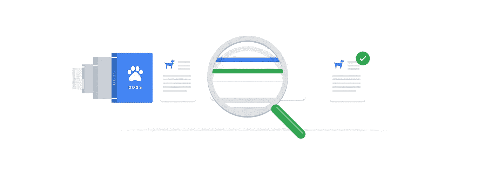
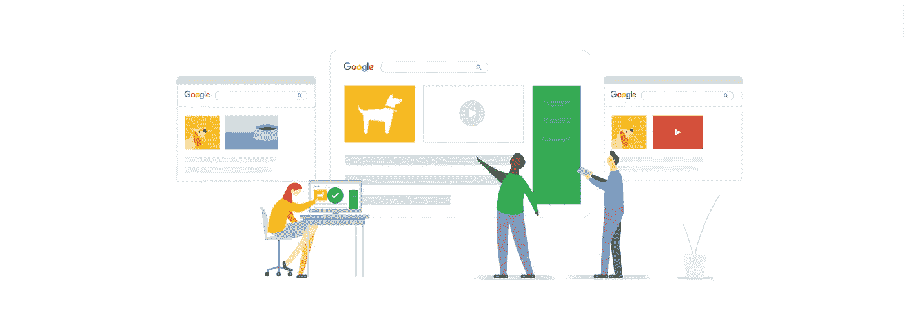
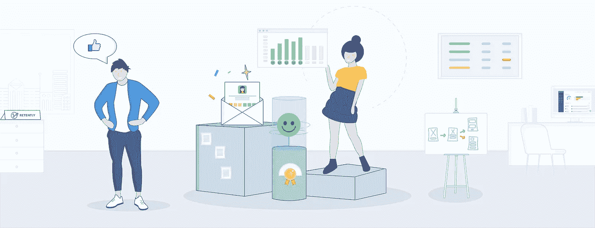

# 使用购物应用改善客户体验。

> 原文：<https://medium.datadriveninvestor.com/improve-customer-experience-with-shopping-apps-ea771ecd1536?source=collection_archive---------5----------------------->

零售商如何利用移动购物应用改善客户体验。这篇文章解释了零售商如何利用移动购物应用改善客户体验。

随着电子商务行业和移动使用的快速增长，移动在大多数零售购物中发挥着至关重要的作用。手机改变了购物者的整个购物体验。随着购物者对他们喜爱的品牌的期望与日俱增，零售商需要不辜负他们对他们喜爱的品牌的期望。

看到 50%以上的实体公司的零售额都是通过手机 app 做出来的。随着人们使用零售移动应用进行店内购物，零售商在使用应用时找到提供无缝客户体验的方法变得极其重要。

以下是改善移动客户体验的重要策略，这些策略让移动购物应用获得了成功:

 [## AI 可以帮助电商。

### 人工智能是一个先进的概念，可以用另一种方式重新定义在线商业标准。使用人工智能…

medium.com](https://medium.com/@tejmaddimsetty/ai-can-help-e-commerce-7ee27cf5a8c6)  [## 反馈是企业的生命线。

### 在 20 世纪，顾客面对许多彼此相似的产品。但是他们获得的经验…

medium.com](https://medium.com/@tejmaddimsetty/feedback-is-lifeline-for-business-a3d5af571508) 

# 减少购买过程中的摩擦

由于零售商的主要目标是增加销售额，因此减少购买过程中的摩擦非常重要。当你通过手机应用成功做到这一点时，你就能让你的客户在几乎不受干扰的情况下随时获得他们想要的东西。零售商可以通过采用以下策略来确保他们的移动应用无摩擦—

 [## 使用 Stripe 在 100 秒内完成支付。

### Stripe:这是一个工具包，他们几乎可以将任何在线商业模式货币化。它是像低级构建块一样的 APIs

medium.com](https://medium.com/@tejmaddimsetty/get-payments-done-with-stripe-in-100-seconds-f970810103d6) 

## 拥有实用的应用内搜索

减少对购买路径的摩擦，不必引入复杂的流程。在移动应用中包含简单的功能会带来很大的不同。您可以通过向用户提供一次性密码来简化应用程序的登录过程。借助 touch ID 身份验证功能，用户可以即时登录移动应用，无需记住用户 ID 和密码。

## 使用一次性密码功能

减少对购买路径的摩擦，不必引入复杂的流程。在移动应用中包含简单的功能会带来很大的不同。您可以通过向用户提供一次性密码来简化应用程序的登录过程。借助 touch ID 身份验证功能，用户可以即时登录移动应用，无需记住用户 ID 和密码。

# 方便顾客的购物体验

当人们发现新技术使用起来简单方便时，他们就会欣然接受。零售商应该确保他们的移动应用程序易于使用，让顾客享受购物体验。当客户觉得使用应用程序很方便时，应用程序的采用率和客户参与度可能会增加。以下策略可以帮助你方便顾客的购物体验

## 让购物过程变得简单快捷

顾客不喜欢把时间花在他们觉得复杂的事情上。当他们打开一个应用程序时，他们一定会发现购物过程变得更容易。如今，在移动应用程序中轻松支付购物的能力非常重要。在移动应用程序的帮助下，你应该确保顾客可以通过移动支付、优惠券等快速高效地购物。结账过程应该非常简单；复杂的结帐过程会导致购物车被放弃。

## 将应用程序与忠诚度计划同步

当人们在购物时获得额外利益时，转向其他人的可能性更高。有了移动应用，整合创意忠诚度计划变得更加容易。当顾客因所购物品获得奖励积分并可在下次购物时轻松使用时，他们会返回你的应用程序进行下一次购物。有了 Revalsys Technologies 提供的忠诚度解决方案，您不仅可以留住老客户，还可以吸引新客户。它可以与任何支付网关和第三方供应商工具无缝集成，以获得更好的客户体验。可扩展性功能是您业务增长的催化剂。

# 提供无缝的全渠道客户体验

在不同渠道创造无缝的客户体验对于留住你的客户是非常必要的。随着人们使用不同的设备沉迷于网上购物，你应该确保你在所有渠道提供良好的体验。以下是一些让顾客体验更好的方法

## 打造全渠道购物袋

想象一下，如果你在桌面浏览的时候整理了购物袋里的一些物品，决定以后再买。但当你稍后使用手机应用程序返回购物袋，发现购物袋是空的时，你可能会感到沮丧，并确保不会再回到那家购物店。因此，有必要创建一个全渠道购物袋，并确保无论顾客通过哪种渠道购物，都能找到相同的购物袋。它降低了顾客弃包不归的风险。

## 巩固数字体验

在不同的数字频道上使用不同的用户界面可能会给用户带来困惑。当你采用全渠道的用户界面时，顾客在通过应用程序访问你的商店时，不必浪费宝贵的时间去弄清楚如何导航。

# 感谢您阅读这篇文章。随时欢迎反馈。如果你喜欢它，请点击拍手按钮，并分享这篇文章。

你可以在[Github](https://github.com/tejamaddimsetty)&[LinkedIn](http://www.linkedin.com/in/tejmaddimsetty)上联系我

[Tej Maddimsetty](https://medium.com/@tejmaddimsetty)