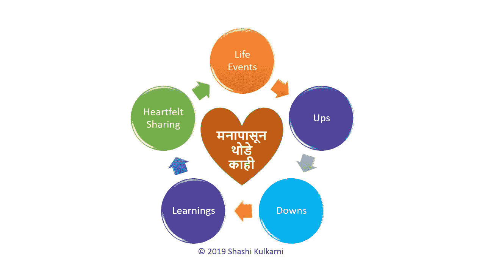

# 如何令人难以置信地改善你肺部的健康

> 原文：<https://medium.datadriveninvestor.com/improve-your-respiratory-system-do-pranayama-every-day-ac5bf497d4b4?source=collection_archive---------1----------------------->

## 通过呼吸练习来锻炼我们一生中经常用到的器官

Photo by [Le Minh Phuong](https://unsplash.com/@leeminfu?utm_source=unsplash&utm_medium=referral&utm_content=creditCopyText) on [Unsplash](https://unsplash.com/s/photos/breathing?utm_source=unsplash&utm_medium=referral&utm_content=creditCopyText)

你知道我们肺部有 6 亿个气囊(称为肺泡)吗？这些气囊被毛细血管包围着，将吸入空气中的氧气输送到血液中。如果它们在功能上退化会发生什么？

我们都在经历一场流行病，这是我们一生中从未遇到过的。电晕病毒在全世界造成了巨大的破坏。

我们中的许多人一直呆在家里远程工作。书签栏充满了关键链接，如 [CDC 页面](https://www.cdc.gov/coronavirus/2019-nCoV/index.html)、CSSE 的[新冠肺炎全球病例仪表板，以及许多其他链接。](https://gisanddata.maps.arcgis.com/apps/opsdashboard/index.html#/bda7594740fd40299423467b48e9ecf6)

风险最大的是那些患有前期疾病的人，正如 CDC 为“[患有严重疾病的风险更高的人](https://www.cdc.gov/coronavirus/2019-ncov/need-extra-precautions/people-at-higher-risk.html)所概述的那样，危急病例是那些对呼吸系统和肺部有影响的人。

WebMD 有一个简洁的页面是关于“[新冠肺炎对你的肺有什么影响？它提到“这是一种呼吸系统疾病，特别是进入你的呼吸道，包括你的肺。”](https://www.webmd.com/lung/what-does-covid-do-to-your-lungs#1)

我们当中有多少人非常了解我们的呼吸系统？我认为现在是我们认真研究这个问题的时候了。它包括我们的:鼻子和鼻腔、鼻窦、嘴、喉咙(咽)、声带(喉)、气管(气管)、隔膜、肺、支气管/支气管、细支气管、气囊(肺泡)和毛细血管。

Credit: Shutterstock — by [solar22](https://www.shutterstock.com/g/solar22) — Royalty-free [stock vector](https://www.shutterstock.com/vectors) ID: 422267053 Respiratory system of humans. This is an illustration of anatomy and physiology.

我们善于照顾我们的身体，通过体育锻炼；包括去健身房、户外活动以及做瑜伽练习。

许多人也练习冥想来平静我们的头脑。

但是我们当中有多少人做呼吸练习直接有益于我们的呼吸系统呢？

 [## 跑步摆脱疯狂:锻炼如何提高你的生产力|数据驱动的投资者

### 没有比锻炼更好的方式来开始一天的工作了。我试着一周至少做四天，在…

www.datadriveninvestor.com](https://www.datadriveninvestor.com/2018/10/23/running-to-get-rid-of-the-crazy-how-working-out-increases-your-productivity/) 

根据今日医学新闻的文章，健康成年人的正常呼吸频率在每分钟 12 到 20 次之间。

即使我们考虑每分钟 16 次呼吸，这意味着每分钟使用的气囊总数是惊人的 96 亿个。

整个呼吸系统，最重要的是从吸入的空气中真正提取氧气的地方，气囊(肺泡)和毛细血管——值得我们更好地关注，以保持它们正常工作。

当我们有健康的肺时，呼吸是自然和容易的。我们吸气和呼气，我们的横膈膜做了大约 80%的工作，使我们的肺充满氧气和其他气体的混合物，然后将废气排出。

然而，随着时间的推移，我们的肺失去了弹性。它们不会恢复到我们开始呼吸时的水平，空气会滞留在我们的肺部。

随着时间的推移，这种陈旧的空气越来越多，留给隔膜收缩和带入新鲜氧气的空间越来越少。由于横膈膜没有充分发挥作用，身体开始使用颈部、背部和胸部的其他肌肉进行呼吸。

这意味着氧气水平降低，锻炼和活动的储备减少。如果经常练习，呼吸练习可以帮助清除肺部积聚的污浊空气，增加氧气水平，并让横膈膜恢复其帮助我们呼吸的工作。

回到我们的小气球——肺泡。

大的表面积，加上薄膜，使气体很容易扩散到肺泡壁。吸入空气中的氧气通过肺泡壁和毛细血管扩散到红细胞中。

身体组织产生的二氧化碳通过血液返回肺泡。然后它扩散穿过毛细血管和呼吸膜。进入空气空间，通过呼气排出。

Credit — with thanks to www.enotes.com

大家都非常清楚，呼吸系统需要保持良好运行，为此，我们需要坚持锻炼。

这就是调息法——在印度沿袭了几千年的呼吸练习——的用处。

> ranayama 是正确的呼吸科学，深呼吸，有规律的，有节奏的呼吸和精神净化一起进行。它的实践不仅在身体疾病的治疗中，而且在道德和精神进步中发挥着重要作用——维尔昌德·甘地(一位耆那教学者，在 1893 年第一次世界宗教议会上代表耆那教)

*‘普拉纳’*意为呼吸，赋予生命的力量。在梵语中，氧气的名称是 *Prana-Vayu。*

调息法的练习通常包括吸气(称为 *Puraka* )、保持(称为 *Kumbhaka* )和呼气(称为 *Rechaka* )。

## 重要的是要注意，那些有任何先存疾病的人和孕妇应该在练习任何呼吸练习之前咨询医生。

有多种类型的调息法——呼吸练习，可以从训练有素的瑜伽老师那里学到，比如生活的艺术和许多其他类似的组织。

我个人一直保持着做这些练习的习惯，这是一些基本的练习。即使每天各做 5 分钟——每天花 15 到 30 分钟，它们也给我带来了很大的好处。一些众所周知的好处是:

*   给身体和精神注入活力。
*   提高我们的肺活量，同时，呼吸控制法有助于清除毒素和杂质。
*   有助于鼻窦，支气管炎和其他呼吸系统问题。
*   提高意识，感官的感知能力。

著名的有 8 到 12 种不同类型的调息练习。

以下是我一直关注的三种类型的一些信息。

# 1.Anulom Vilom 调息法

这是被称为 Anulom Vilom 的瑜伽中最广泛使用和最基本的呼吸技术之一。

Anulom Vilom 也称为交替呼吸技术，对呼吸问题和哮喘非常有效。它有助于肺部的正常运作，减轻压力，提升你的情绪，远离压力。

它包括从一个鼻孔吸气，同时关闭另一个鼻孔，然后通过关闭你吸气的那个鼻孔从另一个鼻孔呼气。然后通过交替鼻孔吸气和呼气来继续这个过程。

做这个调息法有很多好处:

1.  非常适合哮喘和过敏等呼吸系统问题
2.  有助于平衡和放松神经系统
3.  清除体内毒素
4.  增强肺部的耐力
5.  减轻压力，远离焦虑和抑郁

## 如何做 Anulom Vilom 调息:

Credit: YouTube video by Yog Sadhana

# 2.Bhastrika 调息法

[《生活的艺术》解释说，Bhastrika Pranayama](https://www.artofliving.org/in-en/yoga/breathing-technique/bhastrika-pranayam) 是快速吸气和呼气的过程，可以促进身体健康。所以，下次你觉得你的身体需要能量时，试试 Bhastrika 调息法。

你可以在文章“[如何进行 Bhastrika 调息法——步骤和益处”中了解更多关于这种调息法的好处以及如何正确进行以及谁不应该这样做。](https://food.ndtv.com/health/how-to-do-bhastrika-pranayama-the-yogic-breath-of-fire-steps-benefits-1696801)

它包括深呼吸，屏住呼吸几秒钟，然后用力呼气。

## 如何做 Bhastrika 调息:

Credit: YouTube video by Yog Sadhana

# 3.卡巴提调息法

这是一种呼吸练习，包括快速连续有力的呼气和轻柔的吸气。

Kapalabhati 这个词是由两个梵语单词组成的: *kapāla* 意思是“头骨”，而 *bhāti* 意思是“闪耀的，照亮的”它主要用于清洗鼻窦。

根据[生活艺术](https://www.artofliving.org/us-en/Kapalbhati-skull-shining-breath)，这种技术在净化、恢复和更新身心的同时，从内部清洁和调节呼吸系统的毒素。

> *“我们体内 80%的毒素都是通过呼出的气释放出来的。经常练习卡巴提呼吸控制法可以解除我们身体所有系统的毒素。”——塞加尔·沙阿，E-YRT 500，YACEP，Sri Sri 瑜伽老师。*

## 注意事项:

Kapalabhati 调息法是一种先进的呼吸技巧。因此，如果你目前有高血压、心脏病或疝气，避免练习*卡巴提*是很重要的。怀孕的女性也应该避免做这种练习。和所有呼吸练习一样，练习时要小心谨慎，尤其是如果你有呼吸系统疾病，如哮喘或肺气肿。

在没有一个合格的、知识渊博的老师的指导下，不要第一次尝试任何*调息*。永远在自己的极限和能力范围内工作。如果你有任何医学上的担忧，在练习瑜伽前和你的医生谈谈。

## 如何进行卡巴提调息:

Credit: YouTube Video by Yoga International

我一直在做这三个调息法，肯定看到了上面提到的一些好处。

我强烈建议获得专业的指导，然后在你的余生中养成定期做呼吸练习的习惯。

