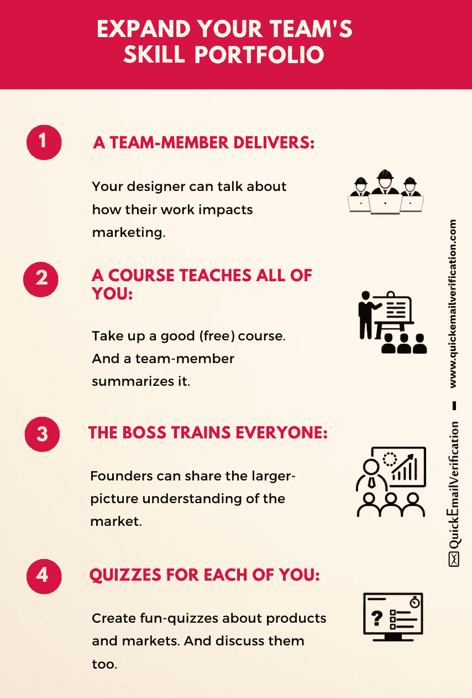
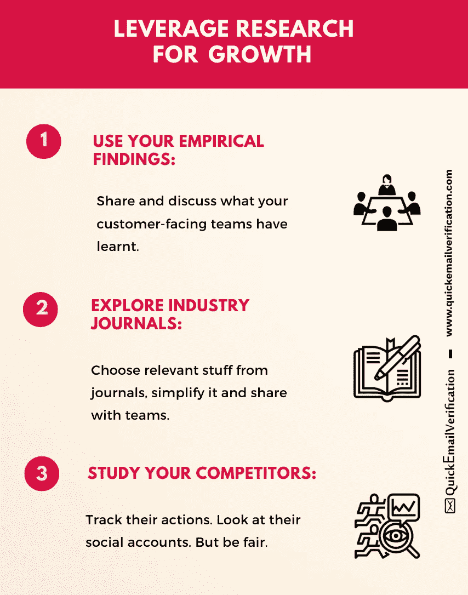
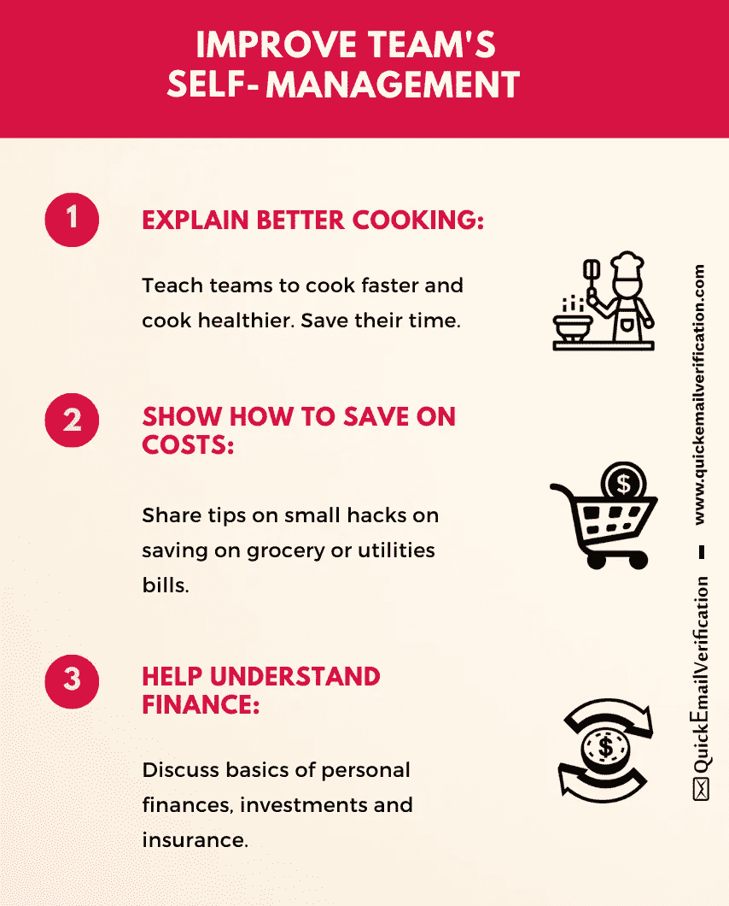
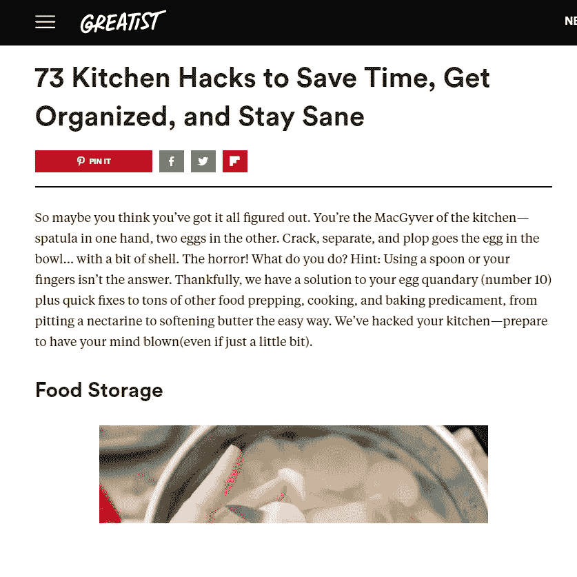
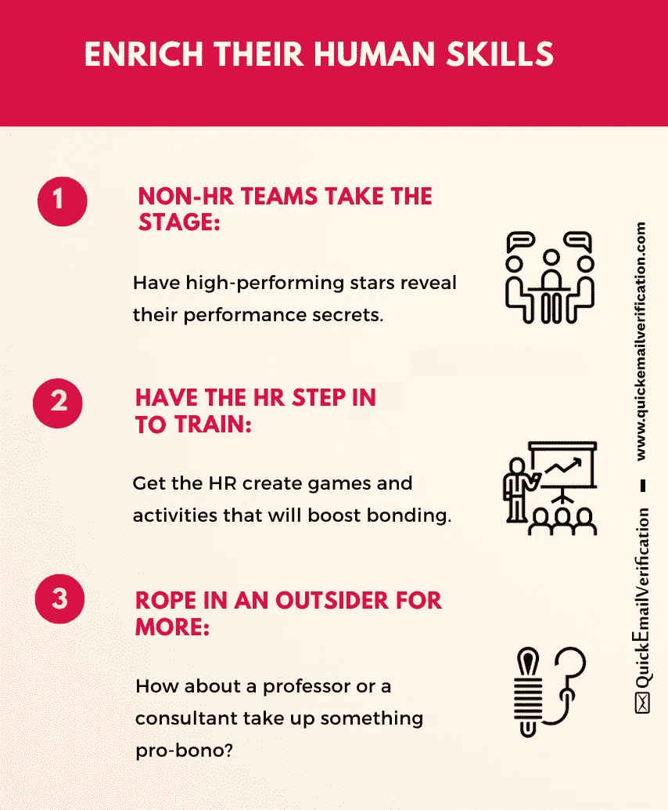

# 即使你们都在家工作，也能提高团队的绩效

> 原文：<https://medium.datadriveninvestor.com/improve-your-teams-performance-even-while-you-all-work-from-home-7f5d0215aa9f?source=collection_archive---------15----------------------->

Image Source: [Unsplash by Chris Montgomery](https://unsplash.com/photos/smgTvepind4)

停工和突然在家工作(WFH)带来了新的挑战。

这听起来可能有些重复，但事实是许多组织和许多人正在第一次体验 WFH。

报告渠道、会议、客户支持、生产、营销……每一个流程、职能和部门都在发生重大变化。

项目负责人、经理和部门主管正试图找到远程管理他们团队的方法。

> 这里最大的挑战之一就是让你的团队保持活力。

这里有 4 种方法可以提高团队绩效，因为你们都是 WFH。所有这四项活动都很简单，不贵，但却非常有效。而且都可以通过 Zoom、Google Meet 等数字会议平台完成。

我们开始吧！

# 1.扩展您团队的技能组合

## 它是什么:

这项活动有助于团队成员学习非日常活动核心的技能。

例如，生产部门的一些人可能非常精通他们自己的领域，但是他们可能对市场营销的运作方式知之甚少。

## 如何做:

有四种方法可以实现这一点:

**1。让一个团队成员来做:**也许你可以让一个设计师来解释排版的细节。电子邮件营销人员可以讨论[电子邮件关键绩效指标](https://quickemailverification.com/blog/all-email-marketing-metrics-marketers-should-know/) …利用每个团队成员的技能。

当你这么做的时候，不要忘记鼓励害羞的人站出来做一个展示。他们会获得新的信心，你的团队也会学到新的东西。

**2。参加课程:**在任何一个数字学习平台订阅免费课程，比如文案 101 或者设计 101。《华尔街日报》编辑妮莎·拉贾的免费写作教程是一个很好的起点。

> 鼓励团队真诚地完成课程。然后让两三名成员总结课程。让它互动。

**3。让老板去做:**如果你是一个小组织，你可以更容易地找到一个创始人来做这件事。

让老板提供一些培训，比如说，他们如何看待新技术。创始人通常了解大局，所以你的团队可以从中受益匪浅。

**除此之外，他们最能注入那种承诺的精神，就像书中描述的** [***极度所有权***](https://www.amazon.com/Extreme-Ownership-U-S-Navy-SEALs/dp/1250067057) **(非附属链接)。**

**4。利用测验:**设计一些测验，以多项选择或开放式问题的形式。(用有趣的方式来做，而不是用学校或大学里那种无聊的方式！)

谁答对了，谁就可以被邀请简要地解释一下这个想法。

> 用测验来提高技能是不寻常的，因为训练是在短时间内进行的:答对的人会简单解释一下。

这意味着在每个测验中会有很多人做解释，给整个活动增加了多样性。

 [## 在家工作如何提高我的工作效率|数据驱动型投资者

### 在家工作确实激发了我最大的潜能，让我更有效率。因为在家工作给了我…

www.datadriveninvestor.com](https://www.datadriveninvestor.com/2020/07/29/how-working-from-home-increased-my-productivity/) 

## 收益是什么:

以下是您的收获:

**1。团队变得更有同理心:**例如，你的设计团队需要理解为什么某个看起来很棒的设计不适合你的营销策略。**这里有一篇很好的** [**文章**](https://www.entrepreneur.com/article/311091) **解释了为什么移情会产生影响。**

**2。团队结合得更好:**通过更好地理解其他视点，不同的团队可以更好地集成。它打开了更顺畅的沟通渠道。

**3。团队可以引入一个新的视角:**例如，一个编码人员可以为 SEO(搜索引擎优化)提供有用的输入。

> 这是因为一个程序员并不了解关于 SEO 的一切，因此会带来一个局外人的观点，这种观点有时是有创造性和可操作性的。

# 2.利用研究结果更好地了解产品和市场

## 事实真相

你会承认，尽管研究很重要，但在许多企业中并没有得到很好的应用。

> 因为研究为一个理论或问题提供了一个系统的、科学的方法，企业可以通过更加关注它而受益。

## 怎么做

以下是从研究中获得最佳收益的三种方式:

**1。记录并分享你的经验发现:**经验研究有时并不完全可靠，因为它是基于观察，而观察可能会有偏差。

尽管如此，适当地记录和分享你的团队在一段时间内收集到的东西是一个好主意。当你分享时，你的团队就会明白，例如，你的产品可以增加什么功能。

**2。使用行业期刊:**这是一个显而易见的问题，然而许多企业似乎忘记了这一点。

获取行业研究文献，让您的一些团队成员简化并在您的团队中分享。

**3。跟踪竞争对手的行动:**

> 只要你不越界从事不道德的间谍活动，研究你的竞争对手是改善你自己业务的一种完全合法的方式。

不要把你的竞争分析局限在他们的网站或宣传册上。梳理他们的社交媒体账户，研究他们与观众互动的方式。HubSpot 有一个很好的[指南](https://blog.hubspot.com/marketing/competitive-analysis-kit)。

## 收益是什么

**1。您了解小痛点:**客户并不总是努力阐明他们的痛点。这就是为什么你需要更仔细地研究它们，以便更好地理解它们。研究可以帮助你更有效地做到这一点。

**2。你发现更小的利基:**通过找出小的痛点，你有可能找到其他公司不知道或发现太小而无法进入的利基。也许它与蓝海战略一起敲响了警钟？

# 3.帮助团队更好地管理自己

## 事实真相

在家工作带来了新的挑战和新的干扰。例如，一对双职工夫妇可以在他们需要的任何时候雇佣一个临时保姆。今天，保姆可能不在，但这对夫妇仍然工作同样的时间，尽管是在家里。

这对夫妇增加了更多的要求(阅读压力),你的目标是帮助你的团队在新常态下更好地管理自己。

## 怎么做

这里有三种方法:

**1。分享更好、更快烹饪的小技巧:烹饪仍然要花大量的时间做各种家务。**

把喜欢烹饪的友好的社区老人带进来。让他们分享烹饪更好更快的秘诀，尤其是从他们的“美好旧时光”。

> 目的是让你的团队有更多的时间练习他们喜欢的东西。不要试图把它转换成“这样，你可以有更多的工作时间”。

**2。建议降低家庭成本的方法:**企业并没有面临一个丰收年，你也没有能力给你的团队发放丰厚的绩效奖金。

然而，你可以向他们展示如何削减成本。

这里有一个例子:你的设计师 Neha 和她的丈夫、一个蹒跚学步的小孩以及她的婆婆住在一起。早些时候，他们曾经运行两个 AC。现在，如果这四个人可以在一天的大部分时间里呆在同一个房间里，并且只使用一台空调，他们就可以大幅削减电费。

**3。让他们评估一下自己的个人财务状况:**在今天的情况下，你的团队进行新的投资几乎是不可能的。然而，这不应妨碍他们理解投资的基本原理。

你可以引入一位私人投资顾问，他将带领你的团队了解所有投资的基本知识。例如，让顾问解释保险和投资的区别。

*Hacks to store and cook foods can result in great time-saving (*[*Link*](https://greatist.com/health/kitchen-tips-hacks) *to the article)*

## 收益是什么

**1。你的团队看到生产力的提高:**当你的团队变得更有组织、更整洁时，你会自然而然地看到他们的生产力提高了。

**2。它给你的团队减压:**当你帮助你的团队在厨房或扫帚上变得更有效率时，你就让他们每次都有更好的心情。

**3。你的团队学习长期观点:**当你的团队以新的眼光看待金钱和投资时，他们开始以长期的眼光看待资源。谁知道呢，这可能会影响到他们正在做的项目。

# 4.提高他们的人际交往技能

## 事实真相

在这个世界上，员工花大量时间呆在他们的小隔间里，粘在他们的电脑上，一些有价值的人际交往技能已经消失了。这是恢复这些技能的好时机。

## 怎么做

这里有三个你可以进行的活动。可以自行添加更多。

**1。让一个非人力资源团队成员培训你们其余的人:**也许 Pia 在压力下保持冷静很棒。或者在处理愤怒的顾客时，Hameed 是最好的。也许 Stella 在消除客户异议和促成交易方面是无与伦比的。鼓励——或者温和地强迫——这些明星分享他们的技能。

**2。让人力资源部门介入:**对于你的人力资源部门来说，这是一个创造一些有趣活动的好时机，这些活动可以通过数字方式完成，同时也能在你的团队中建立更好的联系。**这里有一个有趣的** [**参考**](https://www.fastcompany.com/90506101/12-road-tested-team-building-activities-that-work-for-real-life-remote-teams) **为您的远程团队提供活动。**

**3。邀请外人:**请求当地教授或顾问参与一些公益活动*。*

> *一张新面孔，一个局外人不仅会带来新鲜的视角，而且通常也更受欢迎！*

## *收益是什么*

***1。你的团队获得了一些重要的软技能:**你的团队不会在一夜之间发展这些技能。但是如果你能让他们走上自我完善的道路，你就达到了你的目标。*

***2。你的团队从产品-市场-业务互动中得到休息:**无论你的团队对你的组织做什么或卖什么有多么热情，主流业务活动的改变总是有帮助的。*

***3。你会发现你的团队性格中一些隐藏的方面:**随着你继续这些活动，你会开始发现一些你以前没有意识到的关于你的团队的事情。*

> *将它们记录下来，并确保在未来合适的时候运用这些技能。*

# *总结*

*让你的员工在家工作时保持积极性和主动性并不容易。*

*然而，作为创始人、经理、团队领导、人力资源主管甚至顾问，你可以找到许多活动来保持团队的参与和联系。上面列出了一系列的活动(几乎所有的活动都是免费的)，你可以利用它们来确保你的团队是活跃的、警觉的和专注的。*

*这些活动包括扩大他们的技能组合，分享研究成果，帮助他们提高在家工作时的自我管理技能，并将他们的人际交往技能提升到一个新的水平。*

*你并不总是需要昂贵的工具或昂贵的培训项目来实现团队的目标。一点点努力加上一点点创造性的思考应该很容易带你度过当前的场景。让你的团队和你成为更好的表演者，更好的人。*

**信息图礼貌*[*quickmail 验证*](https://quickemailverification.com/) *。**

***访问专家视图—** [**订阅 DDI 英特尔**](https://datadriveninvestor.com/ddi-intel)*