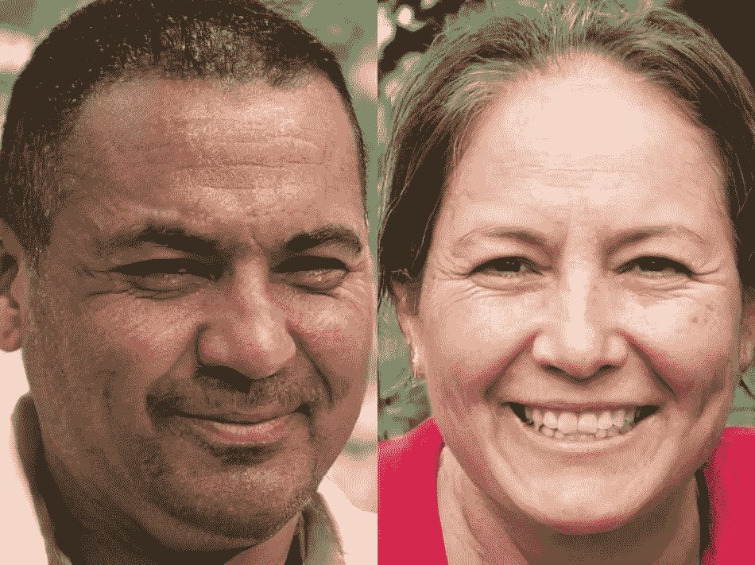
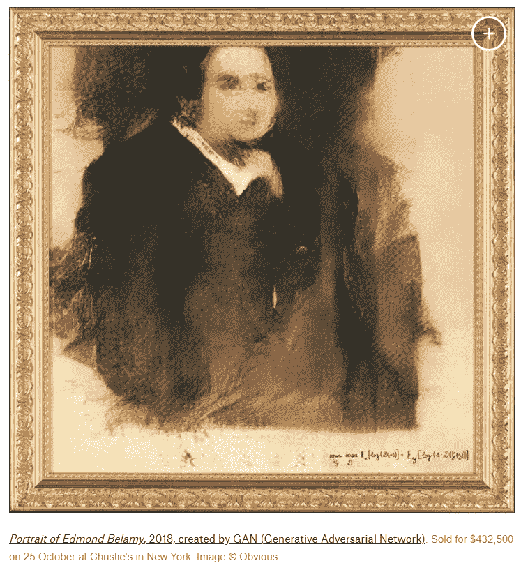
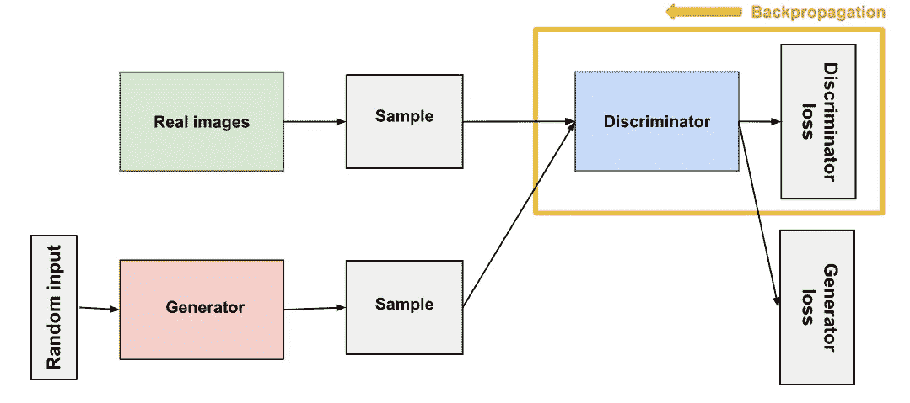
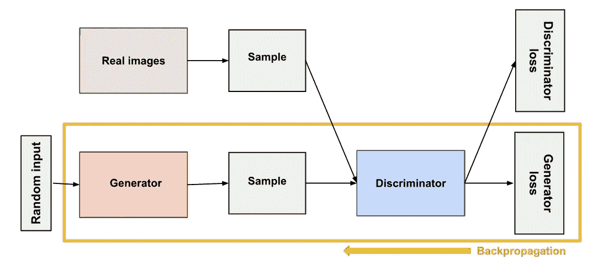

# 在真实与虚假之间:生成性对抗网络(GANs)

> 原文：<https://medium.datadriveninvestor.com/in-between-real-or-fake-generative-adversarial-networks-gans-f46f64577fb5?source=collection_archive---------2----------------------->

> ***当你已经开始阅读这篇帖子的时候，你只是看了看上面两张脸。你能猜出这两个人的脸是否真的存在于这个世界上吗？***

***如果你的答案是肯定的，而你认为其实际上比你在地球某个地方的两个人都错了。这些面孔是由人工智能的力量创造的，即由生成性对抗网络(GANs)创造的。***

**它们广泛用于图像生成、视频生成和语音生成。**

***甘斯*** 是 2014 年蒙特利尔大学的伊恩·古德菲勒(Ian Goodfellow)和其他研究人员，包括约舒阿·本吉奥(Yoshua Bengio)在一篇论文中介绍的。提到甘斯，脸书的人工智能研究主任扬·勒村称对抗性训练是“过去 10 年中最有趣的想法”

GANs 的善恶潜力是巨大的，因为他们可以学习模仿任何数据分布。也就是说，甘人可以被训练创造出与我们的世界在任何领域都极其相似的世界:图像、音乐、演讲、散文。从某种意义上说，他们是机器人艺术家，他们的作品令人印象深刻——甚至令人心酸。但它们也可以用来生成虚假的媒体内容，并且是支撑 Deepfakes 的技术。

 [## 人工智能和监督资本主义|数据驱动的投资者

### 大科技，总是现在:人工智能推动的大科技，已经使购物，搜索，在你的…

www.datadriveninvestor.com](https://www.datadriveninvestor.com/2020/03/04/on-artificial-intelligence-and-surveillance-capitalism/) 

一个超现实的转变是，佳士得以 43.2 万美元的价格出售了一幅由 GAN 基于斯坦福大学的 Robbie Barrat 编写的开源代码生成的肖像。像大多数真正的艺术家一样，他没有看到任何钱，而是去了法国公司，显而易见。

## 生成性对抗网络(GAN)有两个部分:

*   ***生成器*** 学习生成似是而非的数据。生成的实例成为鉴别器的负训练样本。
*   ***鉴别器*** 学习区分发电机的假数据和真实数据。鉴别器惩罚产生不可信结果的发生器。

# 鉴别器

GAN 中的鉴别器只是一个分类器。它试图区分真实数据和生成器创建的数据。它可以使用任何适合其分类数据类型的网络架构。

鉴别器的训练数据来自两个来源:

*   **真实数据**实例，比如人的真实照片。鉴别器在训练中使用这些实例作为正面例子。
*   **假数据**实例由生成器创建。鉴别器在训练中使用这些实例作为反面例子。

# 发电机

GAN 的发生器部分通过结合来自鉴别器的反馈来学习创建假数据。它学习使鉴别器将其输出分类为真实的。发生器训练要求发生器和鉴别器之间的集成比鉴别器训练要求的更紧密。训练发电机的 GAN 部分包括:

*   随机输入
*   生成器网络，将随机输入转换为数据实例
*   鉴别器网络，对生成的数据进行分类
*   鉴频器输出
*   发电机损耗，惩罚发电机未能欺骗鉴别器

# 甘培训

由于 GAN 包含两个单独训练的网络，其训练算法必须解决两个复杂问题:

*   GANs 必须兼顾两种不同的训练(生成器和鉴别器)。
*   GAN 聚合很难识别。

# 损失函数

甘斯试图复制一个概率分布。因此，他们应该使用损失函数来反映 GAN 产生的数据分布与实际数据分布之间的距离。如何捕捉 GAN 损耗函数中两种分布的差异？这个问题是一个活跃的研究领域，已经提出了许多方法。这里我们将讨论两种常见的 GAN 损耗函数。GAN 可以有两个损失函数:一个用于发生器训练，一个用于鉴别器训练。两个损失函数如何共同反映概率分布之间的距离度量？

在损耗方案中，我们将在这里看到，发生器和鉴频器损耗来源于概率分布之间距离的单一度量。然而，在这两种方案中，生成器只能影响距离度量中的一项:反映虚假数据分布的项。因此，在生成器训练期间，我们去掉了另一项，它反映了真实数据的分布。

发生器和鉴频器损耗最终看起来不同，尽管它们来自同一个公式。

# 最小最大损失

在介绍 GANs 的论文中，生成器试图最小化以下函数，而鉴别器试图最大化它:

ex[log(D(x))]+Ez[log(1D(G(z))]]

在此功能中:

*   D(x)是鉴别器对真实数据实例 x 是真实的概率的估计。
*   Ex 是所有真实数据实例的期望值。
*   G(z)是给定噪声 z 时发电机的输出。
*   D(G(z))是鉴别者对假实例为真的概率的估计。
*   Ez 是对生成器的所有随机输入的期望值(实际上，是对所有生成的伪实例 G(z)的期望值)。
*   该公式源自真实分布和生成分布之间的[交叉熵](https://developers.google.com/machine-learning/glossary#cross-entropy)。

发生器不能直接影响函数中的 log(D(x))项，所以，对于发生器来说，最小化损耗等价于最小化 log(1 — D(G(z))。

# 瓦瑟斯坦损失

默认情况下，TF-GAN 使用 Wasserstein 损失。

这个损失函数依赖于 GAN 方案的修改(称为“Wasserstein GAN”或“WGAN”)，其中鉴别器实际上不分类实例。对于每个实例，它输出一个数字。这个数字不一定要小于 1 或者大于 0，所以我们不能用 0.5 作为阈值来决定一个实例是真的还是假的。鉴别器训练只是试图使真实实例的输出大于虚假实例的输出。

由于不能真正辨别真假，WGAN 鉴别器实际上被称为“批评家”，而不是“鉴别器”。这种区别具有理论上的重要性，但出于实际目的，我们可以将其视为承认损失函数的输入不一定是概率。

损失函数本身看似简单:

**评论家损失:** D(x) — D(G(z))

鉴别器试图最大化这个函数。换句话说，它试图最大化真实实例上的输出和虚假实例上的输出之间的差异。

**发电机损耗:** D(G(z))

生成器试图最大化该功能。换句话说，它试图最大化伪实例的鉴别器输出。

在这些功能中:

*   D(x)是评论家对真实实例的输出。
*   G(z)是给定噪声 z 时发电机的输出。
*   D(G(z))是批评家对一个假实例的输出。
*   评论家 D 的输出不需要在 1 和 0 之间。
*   从实际分布和生成分布之间的[推土机距离](https://wikipedia.org/wiki/Earth_mover%27s_distance)推导出的公式。

*“训练鉴频器时，保持发电机值不变；当你训练发电机时，保持鉴别器不变。每个人都应该针对静态的对手进行训练。例如，这使生成器能够更好地读取它必须学习的坡度。”*

你可以把甘想象成猫捉老鼠游戏中伪钞制造者和警察的对立，伪钞制造者在学习传递假钞，警察在学习检测假钞。两者都是动态的；也就是说，警察也在接受训练(打个比方，也许央行正在标记那些溜走的法案)，双方都在不断升级中学习对方的方法。

对于 MNIST 来说，鉴别器网络是一个标准的卷积网络，可以对输入的图像进行分类，这是一个二项式分类器，可以标记图像的真伪。在某种意义上，生成器是一个逆卷积网络:标准卷积分类器获取图像并对其进行下采样以产生概率，而生成器获取随机噪声向量并对其进行上采样以生成图像。第一个通过最大池等缩减采样技术丢弃数据，第二个生成新数据。

两个网都试图优化一个不同的，相反的目标函数，或损失函数，在一个零 zum 游戏。这本质上是一个演员兼评论家的模式。当鉴别器改变其行为时，生成器也会改变，反之亦然。他们的损失互相推诿。

来源:【https://developers.google.com/machine-learning/gan】，[https://path mind . com/wiki/generative-adversarial-network-gan](https://pathmind.com/wiki/generative-adversarial-network-gan)

带给你

经过

COE-AI(CET-BBSR)-由 CET-BBSR、Tech Mahindra 和 BPUT 发起，旨在通过 ML 和 IOT 提供现实世界问题的解决方案

www.coeaibbsr.in

https://coeai19.wixsite.com/

 [## 欧洲委员会大赦国际

### 随着 COVID19 疫情困扰着整个世界，专家们认为社交距离是对抗…

www.facebook.com](https://www.facebook.com/CoEAIBBSR/)