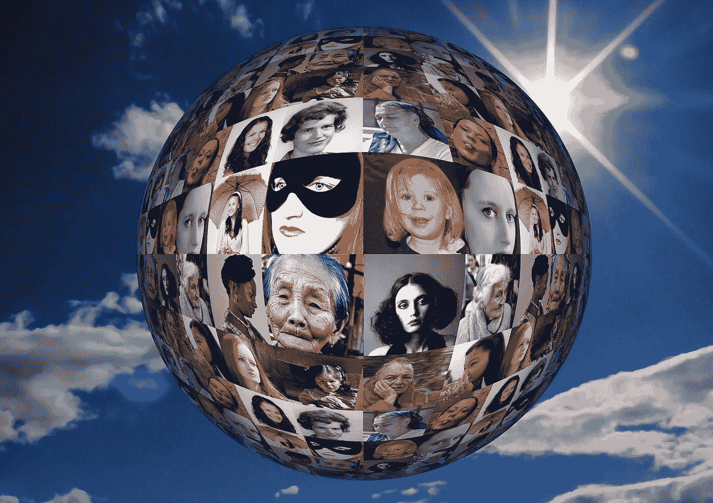
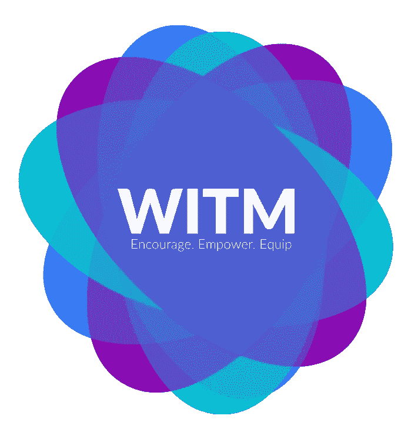
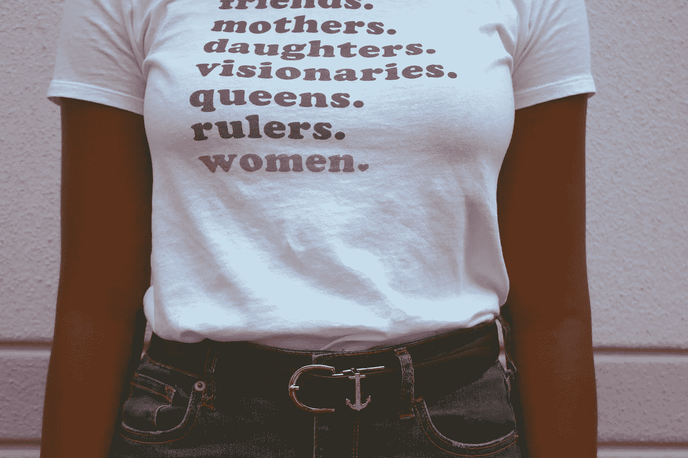
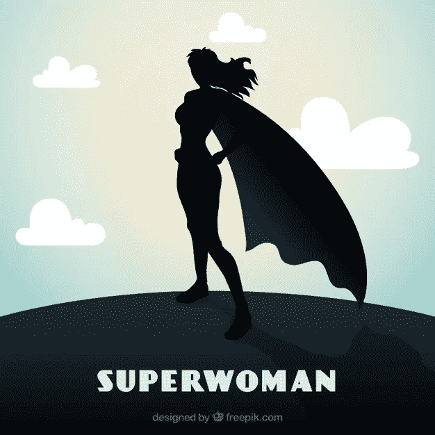

# 庆祝国际妇女节:宝贝，我们走过了漫长的道路

> 原文：<https://medium.datadriveninvestor.com/in-celebration-of-international-womens-day-we-ve-come-a-long-way-baby-48764c706ea7?source=collection_archive---------13----------------------->

## 玻璃天花板出现了裂缝。让我们庆祝我们已经走了多远，即使我们还有很长的路要走，那些帮助我们打好这场仗的男男女女们。

*国际妇女节是每年的 3 月 8 日*

International Women’s Day Image Image by [Gerd Altmann](https://pixabay.com/users/geralt-9301/?utm_source=link-attribution&utm_medium=referral&utm_campaign=image&utm_content=281473) from [Pixabay](https://pixabay.com/?utm_source=link-attribution&utm_medium=referral&utm_campaign=image&utm_content=281473)

最近，我在多伦多[瑞尔森大学](https://www.ryerson.ca/)的黑客马拉松期间，为[WITM——科技管理领域的女性](https://www.witm.ca/)讲授了一个研讨会。在一个充满热情的年轻男女的房间里，这是非常鼓舞人心的，他们的目标是创造和设计一个可持续的解决方案，促进积极的全球影响。当问答开始时，一个年轻的学生问我关于闯入“男生俱乐部”的问题，这只是一个瞬间的事情。我很惊讶它会出现。不是因为它不存在了而是因为它存在了。我只是想，在加拿大，比我年轻得多的一代人至少不会见证这一切。我们付出了巨大的努力来建立多元化的团队，然而我们还是在这里。

我不知道如何回答她。我在一些男性主导的领域取得了令人难以置信的成功，但在另一些领域，我仍在努力证明自己。

International Women’s Day [https://www.witm.ca/](https://www.witm.ca/)

珍妮，这是我的答案:

它正在发生。随着开拓性的女性向前迈进，男孩专用的标志正在消失。仔细观察，你会发现古老的“玻璃天花板”开始出现一些明显的裂缝。更令人兴奋的是，这不仅仅发生在一个领域，而是发生在几个领域，甚至是一些历史上特别难以突破的领域，如金融科技、金融、音乐、电影和电视。

**形象的力量&榜样**

艺术模仿生活还是生活模仿艺术？就像问先有鸡还是先有蛋一样，这是一个我们无法明确回答的问题。然而，当如此多的日常对话集中在电影、电视、书籍和音乐上时，很难否认艺术的影响。这就是为什么电影公司开始用女性超级英雄填满屏幕，虚构和现实生活中的女英雄，如政治活动家和废奴主义者英雄哈丽雅特·塔布曼，是如此重要。随着年轻女孩越来越多地接触到这些令人惊叹的女英雄，看到非传统角色中的榜样，她们会受到启发，去追求类似的目标。

女性变得越来越足智多谋，想方设法打入传统上由男性主导的行业，然后从内部改变文化。例如，妇女正在进入建筑工地，从事各种行业。在加拿大，加拿大学徒论坛成立了一个特别工作组，负责监督行业妇女国家战略的制定。在过去的两年里，他们在加拿大各地举办了全国性的支持行业妇女活动。现在，女性比以往任何时候都更被鼓励和支持进入科学、技术、工程和数学(STEM)领域。

在缩小性别差距和实现同工同酬方面走在前列的是冰岛。在[世界经济论坛的排名中，冰岛已经连续十年位居第一。得分基于政治权力、教育程度和妇女经济参与的改善。证据就在布丁中，可以说截至 2018 年，88%的工作年龄女性就业，65%的大学生是女性，41%的议员是女性，包括一名女总理。](https://www.weforum.org/reports/gender-gap-2020-report-100-years-pay-equality)

虽然距离我们真正看到平等还有很长的路要走，但变化正在发生，有一些策略似乎可以帮助女性获得成功。向其他打破障碍的女性学习，有助于理解如何更容易地导航新形成的道路。另一个工具是足智多谋，要么寻找一个踏脚石，让你进入这个行业的大门，要么通过创造一些独特的东西来占领这个行业的角落。

女性仍在使用的一个刻板印象是“婊子”这个词。开辟一条人迹罕至的道路需要勇气，这意味着即使不舒服也要说出来。当瞄准玻璃天花板时，采取措施学习如何不退缩或畏缩地挖掘自己自信的一面会有很大的帮助。它还会增强消除恐惧和疑虑的内部肌肉。

走上一条新的道路也意味着获得永无止境的坚持。是那些不放弃的人让事情发生！

International Women’s Day Photo by [Chelsi Peter](https://www.pexels.com/@chelsi-peter-723363?utm_content=attributionCopyText&utm_medium=referral&utm_source=pexels) from [Pexels](https://www.pexels.com/photo/woman-wearing-white-t-shirt-and-blue-denim-bottoms-1564149/?utm_content=attributionCopyText&utm_medium=referral&utm_source=pexels)

“我对未来女性领导者的不断进步充满热情，我相信，如果女性不申请典型的男性主导领域的职位，我们就有责任去寻找她们。安大略教师养老金计划(Ontario Teachers' Pension Plan )项目交付董事总经理 Michelle Joliat 表示:“在领导加拿大一家顶级银行财富管理部门的多元化委员会时，我们制定了一项政策，所有职位的最终候选人名单上都必须有一名女性——即使这意味着在我们在市场上寻找女性并积极争取她们的同时，要暂停一个职位。“一旦妇女进入组织，也有必要让人们承担责任，以确保她们得到保留和晋升。当内部招聘没有为夏季实习提供有才华的候选人时，我在一次大学商业会议上举办了案例竞赛，并邀请两个获胜团队的领导者(一男一女)申请这个职位。

我们能从像米歇尔这样无畏的先驱身上学到什么，为我们自己和我们的姐妹们做些什么来促进性别平等？

*   如果你在领导岗位上，通过透明的薪酬结构确保同工同酬，减少工资差距。
*   为你的组织创建一个领导力项目，并鼓励女性和男性成为其中的一部分。
*   寻找赞助、指导和与男性和女性领导者建立关系网的机会(我有幸被两者包围)。
*   拥有它！当你取得一些伟大的成就时，拍拍自己的背，不要为你的糟糕时刻感到内疚。

在庆祝国际妇女节之际，我询问了其他在各个行业打破壁垒的无畏姐妹，请她们就此话题发表智慧之言，以下是她们的看法…

> *“作为一名职业女性和女性领导者，我非常认真地承担起推动工作场所平等的责任，并根据每个团队成员的成功来衡量自己的成功。我真诚地相信，为了让我们所有人都发挥出自己的潜力——无论我们的性别、种族、性别认同和表达方式或性取向如何——所有的领导，无论男女，都必须认真对待这一责任。“我们必须确保为所有值得的人提供指导和真正的成长机会，并切实鼓励包容。成年人，就像操场上的孩子一样，会无意中或以其他方式形成小团体。如果我们每个人都更加意识到这一点，并为推动平等承担更多责任，我们将为每个人创造一个基于天赋的更加公平的竞争环境。因此，让我们开始对自己负责，确保我们领导包容性团队，庆祝我们的集体成功，而不仅仅是我们个人的成功。”*

International Women’s Day Picture by Freepix

> “为自己而做，因为你想要它和/或爱它。**[**oth alia Doe-Bruce，**](https://www.linkedin.com/in/othalia-doe-bruce-m-95585316/)**InnovFin 咨询公司首席执行官&创新金融家总裁，**非营利组织说。"一旦你决定跳下去，记得要继续相信自己。"**

> **“挑战自己，获得新的、多样的技能和品质，以平衡你的能力。不断学习将有助于你找到独一无二的自我。”— [纽莎·帕亚米，](https://www.linkedin.com/in/niushapayami/)future vault 公司的开发工程师**

**最后，一个年轻的，有才华的女人开始谈话的伟大报价…**

> **“我们都想充分发挥自己的潜力，我希望我能为我之后的年轻女性开辟一条道路，这样她们就不必问如何进入男孩俱乐部，这只是一个包容的俱乐部，在这里有才华和奉献精神的人可以最大限度地发挥他们的才华。”— [**珍妮·b·葛**](https://www.linkedin.com/in/gejenny/) **，安大略省经济发展、创造就业和贸易部高级部门顾问****

**是的，还有很长的路要走，但是我们已经走了很长的路，宝贝！**

**奥黛丽·奈斯比特**

**Linkedin 上的奥黛丽·奈斯比特**

**[@ audreynesbit 11 在推特上](https://twitter.com/AudreyNesbitt11)**

**[螺旋营销&公关](http://www.spinspirational.com/)**