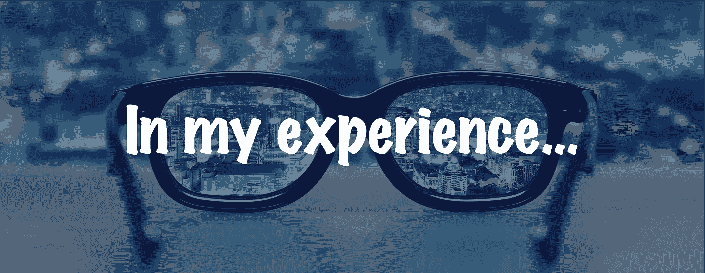

# 以我的经验…我希望我能早点做

> 原文：<https://medium.datadriveninvestor.com/in-my-experience-i-wish-i-had-done-it-sooner-6ae16ef24fb1?source=collection_archive---------29----------------------->

我妻子曾经有一台彩色半透明的 iMacs(她的是蓝绿色的)，上面有一个手柄。它摸上去和看上去更像一个保龄球，而不是一台电脑。当时我并不喜欢 Mac OS，而是更喜欢 Windows，当我们最终把它卖给她的一个朋友时，我激动不已。从那天起，我只使用 Windows 笔记本电脑，尽管偶尔会出现蓝屏死机，但我对此感到很舒服，因为这是我的雇主发放的。

那段时间，朋友、同事、杂志广告和电视广告不断告诉我，MAC 电脑比 Windows 电脑好得多。我不相信他们。然后买了个 iPhone。我对苹果的蔑视阻止了我购买最初几个版本中的一个，所以不用说，我是在那条采用曲线的背面。此后不久，我买了一台 iPad。拿着我的 iPhone 和 iPad，我决定在 2012 年 10 月跨越到总技术互操作性。我卖掉了我的戴尔笔记本电脑，买了一台 MacBook Air。我对这个决定感到焦虑，担心我会再次讨厌这个操作系统，浪费我的钱。

当我现在在我一岁的 MacBook Pro 上写这个故事时，我有了一个顿悟。以我的经验来看，我希望我能早点这么做。现在是 MacBooks 的两倍。这不是苹果产品的广告，尽管它们可以无缝地配合工作。更确切地说，这里的重点是我后悔没有早点做出改变。你说过多少次了？它不必像电脑一样愚蠢。

我已经记不清有多少次谈话中，对方说了这样的话，“我希望我能早点这么做。”场景包括但不限于:

*   换工作/雇主
*   雇用/解雇某人
*   学习/尝试新事物
*   冒险
*   进入/退出关系
*   开始/终止一项业务
*   购买
*   开始锻炼
*   读书

**暂停原因**

我已经完成了上面列出的每一项，我相信大多数人也一样。乍一看，我似乎是一个决策迟缓的人。在某些情况下，这可能是真的，但更多的时候，犹豫是由于对与每个场景相关的实际或感知风险的厌恶。不确定的结果让我有理由犹豫。

我遇到这种情况越多，我对风险的容忍度就越高，因为这关系到我的决策。请注意，我没有说做出“艰难”的决定。虽然有些决定很难，但随着时间的推移，它们会变得容易，因为它们是正确的决定。此外，决策者对所做的决策及其处理各种潜在结果的能力变得更加自信。

**浮雕中的结果**

根据不同的决定，转换成本可能会很高。例如，决定换工作比决定读书更让人惊愕。正因为如此，我们让自己陷入了对每一种可能结果的成本效益的无休止的探索中。一旦做了决定，有人说，“我希望我能早点做”，这是因为结果会让你松一口气。

当结果达到或超过预期时，结论是做出了正确的决定。通常，这种认识会伴随着对自己的无声承诺，“下次我不会让自己经历那种分析地狱。”挑战在于，具有相同优缺点的完全相同的场景很少出现不止一次，所以决定可能不像我们希望的那么容易，但至少我们知道我们可以做出决定。

我发现，我越是将自己置于需要我做出改变决定的情境中(即使是很小的改变)，我就越能轻松地做出这些决定。我期待并希望这件事的结果是我不会经常说“我希望我能早点做这件事”。

*特别感谢*[*Jorge Cadenas*](https://www.linkedin.com/in/jorge-cadenas-6a8437/)*，我尊敬他将新机遇转化为成功现实的才能，并感谢*[*Chris Goode*](https://www.linkedin.com/in/christopher-goode-07529423/)*，他评估业务地点的可行性并做出坚持到底或继续前进的决定的能力令人钦佩。*