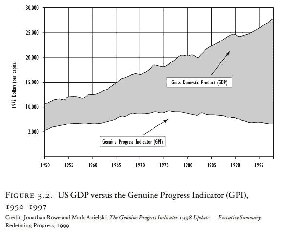
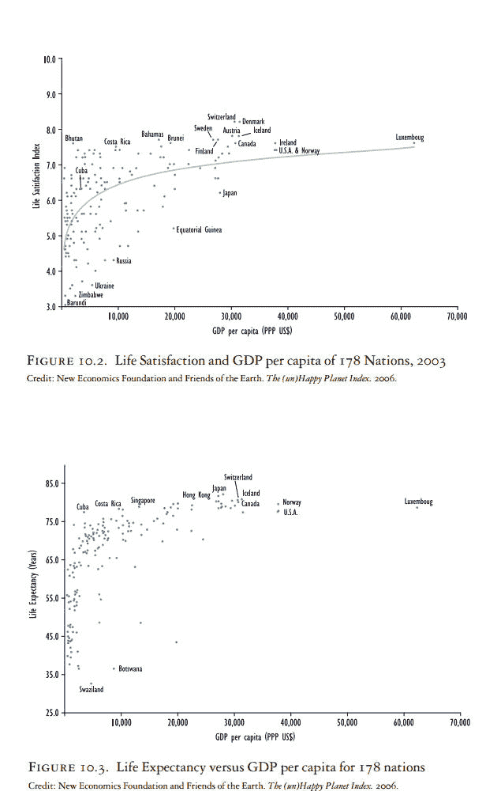
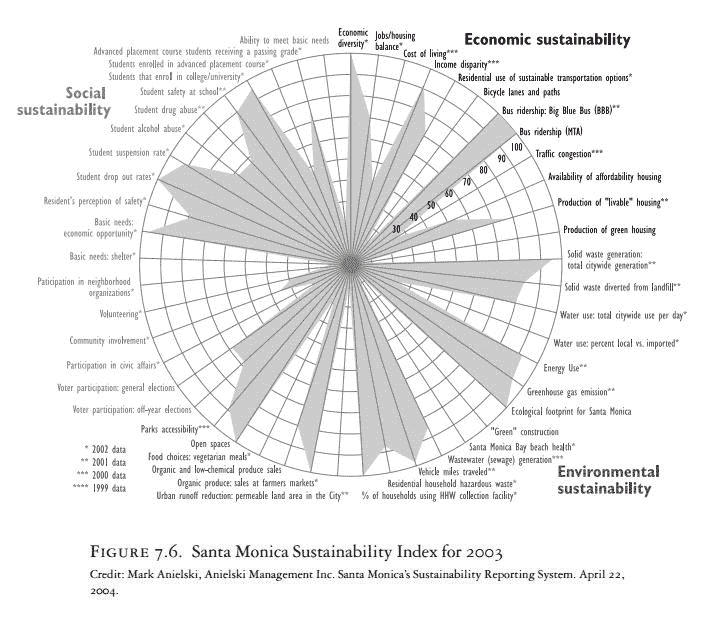
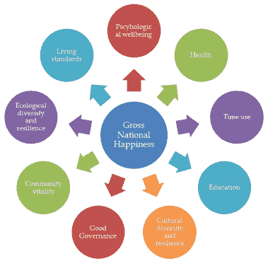
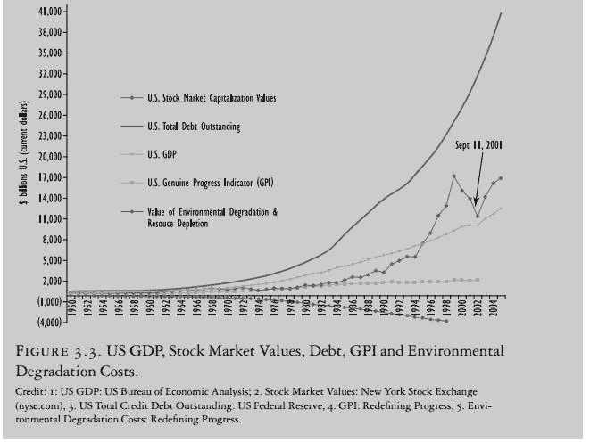
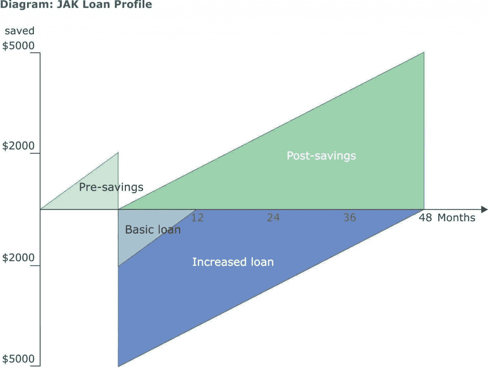
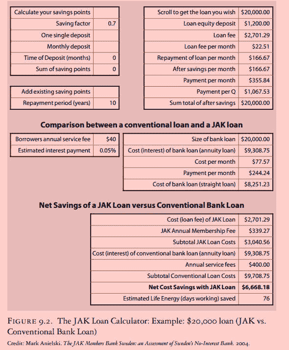

# 追求幸福而不是 GDP

> 原文：<https://medium.datadriveninvestor.com/in-pursuit-of-happiness-not-gdp-e98e35ee21c8?source=collection_archive---------17----------------------->

USD

在阅读了马克·阿尼尔斯基(Mark Anielski)的《幸福经济学》(The Economics of Happiness)后，我意识到幸福作为政府主要政策目标的重要性，因为福利只是部分取决于 GDP，而质量特征才是最重要的。

**国内生产总值作为衡量标准**

尽管大多数国家的国内生产总值都在增长，但人们并不比 20 世纪 50 年代更幸福。

无止境的增长会带来更多福利的假设从根本上来说是有缺陷的。

GDP 增加了诸如香烟销售之类的东西，而这些东西并不推动福利。一个新的指数可以调整国内生产总值中未说明的利益(如无偿工作-志愿服务)，减去令人遗憾的支出，并调整人力、社会和自然资本的折旧成本，因为它们的消费。我们应该采用一个完整的成本会计系统来考虑上述成本&对我们的五项资本资产进行分类账。

经济学家艾伦·克鲁格和丹尼尔·卡内曼研究了更多的收入是否能买到更多的幸福。他们发现，最富有的家庭(收入≥10 万美元)比最贫穷的家庭(收入≤2 万美元)感到“非常幸福”的两倍，但在每时每刻的体验中，他们并不比其他人更幸福，往往更紧张，不会花时间参加愉快的活动(其他人-没有与贫困作斗争的人)。"

图 10.2 显示了 178 个国家的 GDP 和生活满意度之间的关系。它表明，收入和生活满意度之间存在关系，但在达到显著较低的 GDPPC 水平后，生活满意度的增加是微不足道的。像美国这样的国家享受着最高的 GDPPC，但是和不丹的普通人一样对生活满意。

丹麦和瑞士的生活满意度最高，为 8.2/10，国内生产总值相对较高，而布隆迪和津巴布韦的生活满意度和国内生产总值都较低。

将 LEX 与 GDP 进行比较表明，富人往往比穷人长寿，稍微富裕一点的人可能比富人长寿(图 10.3)。但在这里我们也看到回报率递减。例如，一个瑞士人可能活到 80.5 岁，人均国内生产总值为 30，677 美元，而古巴人的平均寿命为 77.3 岁，人均国内生产总值只有瑞士的十分之一。

 [## 国内生产总值下降，国债飙升，新技术可以创造一个强大的新…

### 新冠肺炎危机留下的金融残骸将是毁灭性的，而且会持续很久。已经经济学家…

www.datadriveninvestor.com](https://www.datadriveninvestor.com/2020/04/27/declining-gdp-skyrocketing-national-debt-and-a-new-technology-that-can-create-a-robust-new-economy/) 

根据联合国人类发展指数，丹麦和瑞士在生活满意度方面排名第一和第二&享有高 GDPPC 和长寿，但比不丹有更高的生态足迹。如果考虑每一美元 GDP 的“生活满意度回报”,我们可能会选择像不丹人一样生活:只有 1696 美元的 GDP，生活满意度指数为 7.6 /10.0，平均寿命为 62.9 年，人均生态足迹为 3.2 英亩。

**圣莫尼卡可持续发展指数**

该指数结合了圣莫尼卡可持续城市计划的目标和 5 项资本资产(人力、社会、自然、建筑和金融)(图 7.6)

通过将原始数据转换为共同的计量单位或指数，具有不同计量单位的指标可以相互比较。

福利也可以用基准来比较，比如 Leduc 的福利与加拿大全国平均水平进行比较。(大多数定性数据是通过各种工具收集的——在线调查、个人采访和与社会团体的交谈。)

**不丹 GNH**

不丹将 GNH 作为衡量发展的 GDP 替代指标。个人和不丹的 GNH 水平是通过 9 个同等权重的领域来衡量的。

领域内的 33 个变量通过 1.5 小时的个人访谈进行测试。

定义域中变量的权重是不相等的。主观指标的权重低于客观指标。

**修复资本主义**

政府支出和税收政策应该从目前的企业补贴和企业福利制度转向长期社会投资，以建立和维持社会和人力资本。

改变需要首先从社区和公司开始，然后扩展到更大的范围。公司应该采纳 CSR &应该发展他们自己的可持续发展计划。像宜家这样的公司在推动可持续发展和积极减少生态足迹方面做得非常出色。

**债务型经济**

**美国的例子:**

美国债务，包括政府、家庭、商业和外债:

从 1950 年到 2005 年，未偿债务总额(美国美联储统计)上升了 7，935%，到 2005 年达到 38.3 万亿美元。总债务的增长如此惊人，以至于达到了抛物线的高度，从长期来看，这似乎是不可持续的

这张图表证实了债务和国内生产总值之间有直接的关系。该图暗示，经济最终将走向死亡，因为未偿债务永远无法从当前产量中偿还。我们可以看到美国无法偿还的债务负担如何对经济施加压力，使其保持无限增长。

**债务经济的可能改革**

1.  **无息贷款:**

利息导致失业、通货膨胀和环境破坏。利率的提高意味着企业必须支付更多的钱来偿还贷款。为了消除这种财政压力，他们必须削减劳动力成本，从而加剧失业；或者提高价格，造成通货膨胀；或者重新设计工作以增加产出，从而增加自然资源的使用。

一些人认为，将利率设定在接近零的水平会导致次贷市场无限制的借贷，通过可能永远无法偿还的贷款鼓励消费，消耗储蓄&耗尽资本&让银行业暴露在利率和信贷风险之下。

JAK 模式在很大程度上消除了这种风险，因为它要求成员在获得贷款时承诺定期偿还贷款期内摊销的本金。(JAK 是一个合作组织，成员们将储蓄集中起来，然后向成员们提供无息贷款，只收取小额贷款费)。此外，成员获得贷款的权利取决于还款期内的定期储蓄，直到总储蓄点数等于贷款消耗的点数。这意味着，当贷款全部偿还时，债务也已经偿还了&也有了与额外贷款相等的额外储蓄。

马克比较了 JAK 成员银行贷款和传统的 10 年期抵押贷款(加拿大抵押贷款利率为 8.05%)。他发现一个 JAK 银行的会员借同样多的钱可以节省 6668.18 美元的利息和其他成本。Mark 将这些节省的成本转换为平均生活工资(满足四口之家需求的全职工人的小时工资)为每小时 11.00 美元时，普通工人必须工作的天数。一个从 JAK 借款的工人节省了 76 个工作日来支付传统贷款的利息。(美元)

JAK 对失业有积极影响。随着 JAK 将更多的人从利息支出中解放出来，更多的钱被用来购买商品和服务。这刺激了企业，使他们能够雇用更多的人。失业也是不幸福的一个主要原因。

马克建议创建真正的财富合作银行，这些银行将获得合法许可，以社区的最大利益运营。它们将像 JAK 银行一样运作，并有可能成为客户的理财教练。他们还可以使用真正的财富核算系统&由市政府维护的福利清单，来确定有助于支持社区可持续发展的银行贷款政策。

1.  **采用全额准备金制度:**

100%的储备银行帮助一个国家建立长期的金融稳定。

过度的债务导致投机泡沫、通货膨胀、低储蓄、投资不当、生产和出口下降、投资和增长减少——因为债务必须偿还，政府将从经济中提取更多的钱来偿还，留给支出、投资和储蓄的钱就少了。

部分准备金银行创造了:

(I)频繁的银行倒闭、银行挤兑(2008 年金融危机后，全面储备银行值得认真考虑)。

(ii)货币供应的广泛扩张和收缩，造成投机泡沫、崩溃、深度衰退、产出损失和失业。

㈢通过有利于借款人和投机者的虚构信贷进行不公正的财富再分配。

**总结思路**

分析表明，资本主义值得高度赞扬，因为它创造了物质繁荣&美好生活的条件。GDP 可能在一定程度上提供了美好生活的手段，但还有几个其他因素需要关注。富裕国家可以从那些消费较少但幸福指数和预期寿命相当的国家那里学到很多东西。

上述银行改革将通过提供一个建立在信任基础上的更稳定的金融体系来提高人们的幸福感，在这个体系中，最低限度的利息有助于人们减少工作，将更多的时间花在与家人和朋友的愉快活动上。

像圣莫尼卡指数这样的指数可以在全国范围内发展，并有助于政府预算和政策的制定。可持续性指数使决策者、公民和媒体能够确定积极和消极的成就领域，并采取改革措施，提高公民的生活质量。

衡量幸福被认为是不可靠的。然而，有一些方法可以将犯罪率、生态足迹等因素考虑在内，这些因素有助于幸福&是客观的；以及个人和社区福利访谈。

政府需要将幸福作为其主要政策目标，利用指数数据改善人们的福祉，让他们的生活真正值得过。

**词汇**

1.  **GDPPC-** 人均 GDP
2.  **LEX-** 预期寿命

**访问专家视图—** [**订阅 DDI 英特尔**](https://datadriveninvestor.com/ddi-intel)