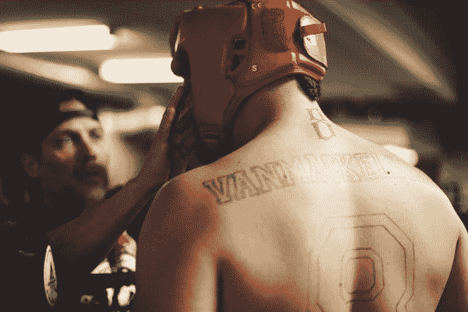

# 在新冠肺炎时代:体育运动的巨大转变

> 原文：<https://medium.datadriveninvestor.com/in-the-age-of-covid-19-a-seismic-shift-in-sports-data-driven-investor-8c0916b7d1d2?source=collection_archive---------21----------------------->

# 像 UFC 这样的体育组织长期以来一直迎合现场观众。随着新冠肺炎的爆发，这种情况可能很快就会改变。

昨晚在朋友的办公空间看了 UFC 战夜 170。在一个充满活力的氛围中，公共工作区出奇的安静。在新冠肺炎病毒爆发之前，我会很高兴听到这场令人振奋的比赛的评论和观众的反应，并感到宽慰。

然而，一个也没有。

鉴于疫情疫情爆发，UFC 仍然是少数几个继续举办广受关注的赛事的大型体育组织之一。考虑到 NBA 和 MLB 等联盟已经取消了本赛季剩余时间的赛事，这就更加令人印象深刻了。关于终极格斗锦标赛，警告是现场观众将不被允许参加，因为害怕传播高度传染性的病毒。因此，周六晚上，当查尔斯·奥利维拉在第三轮击败李凯文，为这位冉冉升起的新星的 now 7 连胜增添了一个响亮的名字时，竞技场上保持了诡异的沉默。

 [## 在医疗保健中使用人工智能的伦理|数据驱动的投资者

### 人工智能(AI)正被应用于任何管理大量数据的行业，并且在一个…

www.datadriveninvestor.com](https://www.datadriveninvestor.com/2020/03/21/the-ethics-of-using-ai-in-healthcare/) 

奥利维拉的球迷在家里庆祝，我敢肯定，但这种充满激情的气氛让这样的活动变得生动起来。我觉得我好像在训练营中看到过两个拳击手。整场比赛中，竞技场上最大的噪音是他们角球队员的喊叫，混乱的建议，否则会被适当的观众反应淹没。

对于像我这样的混合武术爱好者来说，这种体验糟透了。

像成千上万的临时工一样，我看体育比赛主要是为了发泄。八角形是我的竞技场。战士是我的化身。对于大多数不精通武术技术的粉丝来说，气氛是我们体验的重要组成部分。没有它，事件的积累就没有适当的释放；期望落空，留下一个不满意的顾客。

终极格斗锦标赛和其他体育组织做出了负责任的选择，正确的选择。现在，他们将不得不面对这一选择的财务现实。

2013 年 12 月，UFC 推出了基于订阅的流媒体服务 Fight Pass，UFC 总裁白大拿称之为“格斗迷的网飞”此外，通过与 ESPN 的合作，UFC 出售 ESPN+上活动的按次付费(PPV)访问权限。

体育联盟长期以来一直寻求通过直播赛事增加收入。战略合作伙伴关系使他们能够推出服务，让球迷在舒适的沙发上重温旧比赛，观看新比赛。

事实上，根据 Yougov 2017 年的一项调查，59%的美国人更喜欢在家观看体育比赛。这听起来很有希望，尽管同一调查得出结论，与不同年龄组相比，千禧一代(体育赛事的大量观众)对体验的价值远远高于这些体验的成本。

体育联盟和推广公司必须为他们的观众量身定制产品。适应当前形势将决定长期的成功。在很长一段时间里，组织活动都是为了让现场观众满意。现在，组织必须首先关注远程观众的需求。

我不知道那会是什么样子。观众互动把平庸的事件变成好的事件，把伟大的事件变成历史事件。替代现场观众的体验将是艰难的，尽管我确信 UFC 和其他联盟将会发现让他们的观众兴奋的新方法。

像其他数百万 MMA 粉丝一样，我将等待备受期待的 UFC 249，它将于 4 月 18 日举行。虽然不会有现场观众，但世界各地的 MMA 粉丝对不败冠军 Khabib Nurmagomedov 和临时冠军 Tony Ferguson 之间最后一场比赛的兴奋几乎是显而易见的。为了未来的体育观众，让我们希望终极格斗锦标赛能够抓住这一点。

*原载于 2020 年 3 月 27 日 https://www.datadriveninvestor.com***。**