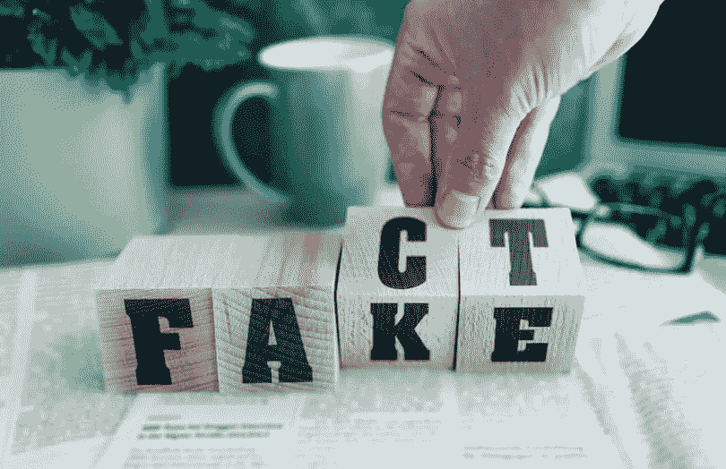
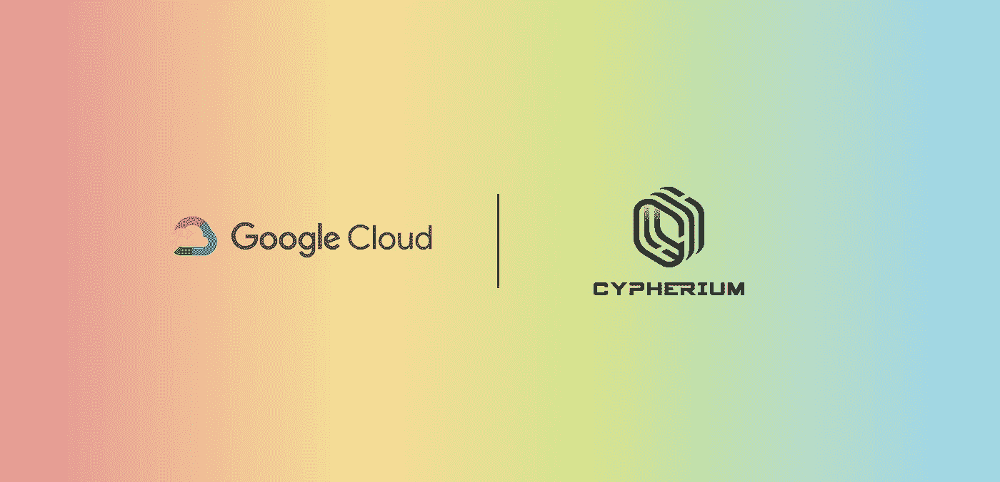

# 在伪区块链合作伙伴的世界里，Cypherium 脱颖而出！！！

> 原文：<https://medium.datadriveninvestor.com/in-the-world-of-fake-blockchain-partnerships-cypherium-stands-out-e5dcadaa48ee?source=collection_archive---------0----------------------->

区块链技术被认为是第四次工业革命和下一个大的颠覆者，真正能够对数百万人的生活产生重大的积极影响。虽然仍处于起步阶段，但区块链技术可以减少文书工作，简化流程，提高生活质量。尽管有这些优点和积极的一面，但也有很少人意识到的黑暗面。

在加密领域，你会听说过像比特币、以太坊、密码、Aelf 等项目，这些项目中的大多数都确保为社会增加许多积极的价值，帮助人们过上更好、更有意义的生活。

另一方面，我们有像 Centra、Pincoin 和 Arisebank 这样的项目，它们诈骗了数以千计的投资者数以亿计的美元，破坏了信任，并在整体上造成了对加密的负面看法。

 [## 数字货币、区块链和货币的未来|数据驱动的投资者

### “区块链”、“加密货币”、“令牌化”，以及现在的“央行数字货币”已经成为…

www.datadriveninvestor.com](https://www.datadriveninvestor.com/2020/02/18/digital-currencies-blockchain-and-the-future-of-money/) 

所有这些死硬币在消失或消亡之前都遵循着相似的模式。通过各种方法操纵硬币价格，然后执行泵和转储计划。许多容易受骗的投资者涌向这些油泵，以为轻松赚钱，过了一点，价格暴跌，让他们身无分文。

这些都是死的故事或骗局项目。但是，一些现有的项目试图人为地抬高代币的价格，给那些仅从交易角度评估代币的交易者一种虚假的希望感。其中一些技巧包括**洗盘交易**、**抽送**、**恒定先令、硬币燃烧和最重要的假合伙。**

# 虚假的合作关系

众所周知，大多数散户投资者仍然认为加密是“快速致富型”投资途径的捷径。他们不断涌向他们认为制造新闻的项目。提高项目商誉的最有机的方法之一是通过伙伴关系公告。越大越好。

从价格行为的角度来看，合作公告也很重要。通过官方渠道发布的任何合作公告，无论大小，价格都会立即从 10-20%的点飙升至 500-600%的大规模价格反弹。

虽然大多数合作公告都是真实的，但一些项目故意发布虚假的合作公告，甚至开始将积极的会议描绘成成功的合作协议，以推高其价格。

在过去，我们已经看到了大量这类不良行为的例子。2018 年，一个 ICO 项目 **carVertical** 传出了他们与宝马合作的消息。这一消息使得 T2 的游戏币上涨了 200%。然而，宝马解释说没有官方合作关系，T4 汽车公司只是使用了宝马的软件，任何第三方都可以广泛使用该软件。

另一个是由**爱因斯坦-EMC2**(2017 年 11 月)开始建立一个巨大的悬念活动，他们将在下个月发布一个“令人兴奋的公告”。由于这场运动，爱因斯坦的价格在短短几天内上涨了 500%,所谓的“令人震惊的公告”只是改变了他们的采矿算法，使其具有 ASIC 抗性。价格像往常一样暴跌。

另一个经典案例是创。有传言称(由创的支持者自己传播)，创将与阿里巴巴合作。Tron 的首席执行官 Justin Sun 也在推特上谈论一个巨大的合作伙伴关系，这开始推动 Tron 的价格上涨。后来那个消息也被发现是假的。

这些是 2017 年和 2018 年的故事，当时大多数散户投资者都很天真。随着投资者开始获得更多信息，并开始理解所有这些虚假噪音，发生了很多变化。如果你认为这些不良行为减少了，那你就错了，

2020 年 5 月 27 日， **Theta Labs** 宣布 **Google** 与 Theta Labs 合作，成为 Theta Mainnet 2.0 的验证节点和发布伙伴。后来，谷歌与 Theta Labs 合作，通过各种社交媒体渠道大力宣传这一点，旨在通过谷歌云帮助视频交付网络，车载用户。

根据谷歌新闻，Theta Tokens 和 TFuel 都开始加油，几天内跑了 10 圈。

这并没有持续多久。著名的区块链研究人员，如 Larry Cermak(Block 的研究主任)通过一系列的推特称这是虚张声势。

像往常一样，这个假新闻一叫出来，价格就开始狂跌。

# 好人啊！！！

这并不意味着所有宣布的合作关系都是捏造的。在区块链世界仍然有努力工作的项目，甚至与谷歌、亚马逊等公司建立了真正的合作伙伴关系，最近最好的例子之一是**谷歌云**和企业区块链平台 **Cypherium** 之间的[合作伙伴关系。](https://medium.com/cypherium/google-makes-another-move-towards-blockchain-as-cloud-wing-partners-with-cypherium-f854209509a4)

Cypherium 是一个企业级的区块链项目，其设计具有高度的可伸缩性和健壮性，利用了一种混合设计，该设计具有联合工作证明(PoW)和 HotStuff(也被脸书的 [Libra](https://www.forbes.com/sites/francescoppola/2019/06/30/the-real-threat-from-facebooks-libra-coin/) 采用)共识机制，据称可以在不牺牲去中心化的情况下实现每秒数千个事务。

2019 年 8 月，谷歌云宣布他们与 Cypherium 合作，为谷歌云客户使用其产品 Cypherium Enterprise。

与 Theta 所谓的仅使用谷歌云服务的合作伙伴关系不同，Cypherium 合作伙伴关系是不同的，因为谷歌云客户将可以访问各种 Cypherium 的区块链解决方案，其中包括 Cypherium Enterprise。

# 结论

任何加密货币投资，都是你的钱，也是你的责任。对所有事情都要持怀疑态度，调查事情，做你的研究，直到事情得到证实。不要匆忙进入另一个不存在的伙伴关系，或者不那么令人兴奋的公告，这会让你赔钱。