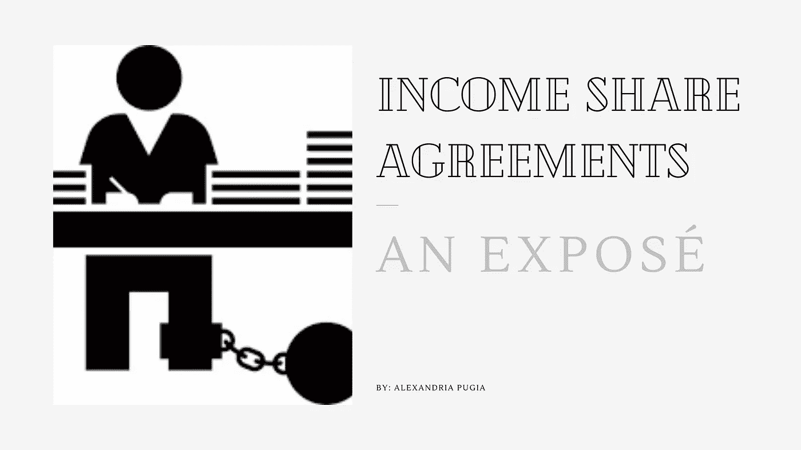
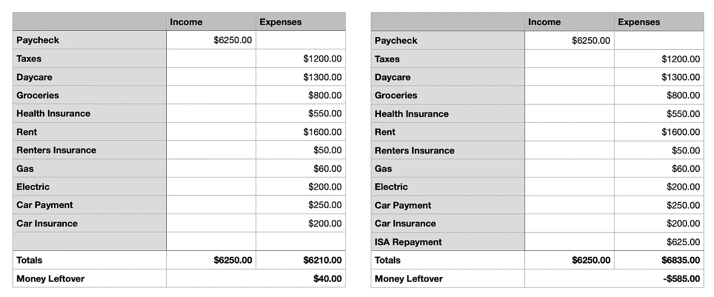

# 收入分享协议:一个曝光

> 原文：<https://medium.datadriveninvestor.com/income-share-agreements-an-expos%C3%A9-adc5757133b?source=collection_archive---------3----------------------->

我一直在纠结这个该怎么写，或者说该不该写。我试图尽可能平等包容地帮助每一个人——不仅仅是在软件工程领域——我知道收入分成协议是大学和训练营的一种融资选择。

为了尽可能保持客观，我不会写或回顾我参加的软件工程训练营的个人经历，也不会讨论我的收入分享协议(ISA)的细节，而是会提到我的 ISA 的财务方面，以巩固我的论点，并希望阻止**永远**签署 ISA。

如果你已经被 ISA 套牢，并且正在经历和我一样的挣扎，我建议向美国联邦贸易委员会(FTC)举报有问题的公司，因为 ISA 不属于“贷款”类别，不能向消费者金融保护局举报。

**我敦促你读完整本书。这非常重要。**

# 什么是收入分成协议？

> [收入分享协议](https://en.wikipedia.org/wiki/Income_share_agreement)是一种金融结构，类似于贷款，其中个人或组织向接受者提供有价值的东西(通常是固定金额)，作为交换，接受者同意在固定年限内偿还他们收入的一定比例。

我想指出的是，尽管声明“这不是贷款或信贷”，收入分成协议**实际上是*、*、**、*、*一种信贷额度。

ISA 贷方声称他们不会向学生借款人提供贷款，这并没有改变这一分析。在消费者法的背景下，法院一贯着眼于协议的实质而不是当事人的结论性主张，以确定一项安排是否是信贷的扩展。当面对声称不是“信用”的合同时，法院将“在剥去这些交易的标签后”解释当事人协议的性质。 *(* [*来源*](https://protectborrowers.org/wp-content/uploads/2020/07/Pearl.Shearer_Credit-By-Any-Other-Name.pdf) *)*

从表面上看，ISA 听起来像是学生贷款的解决方案。这听起来像是下一代的理想主义融资放在银盘子里递给你。我不能代表每一个独立审计机构，但在很大程度上，我真的相信，除了为它们提供资金的企业或学校之外，它们不符合任何人的最佳利益。如果你有任何购买房子、新车、生孩子、结婚、把孩子送进日托所、支付医疗账单、在你的储蓄账户里存一点钱，或者其他普通人想(或不得不)做的无数事情的打算，在你的个人退休协议的还款期限内，你不会在经济上或情感上成功。

此外，根据您的 ISA 条款，您可能需要偿还高达 250%的原始融资金额。这意味着 15，000 美元变成了必须偿还的 37，500 美元的余额。如果你想，“哦，我就在达到支付上限之前早点还清吧！”你运气不好。支付金额是支付上限金额。

作为一个有商业和金融背景的人，这听起来不太对劲。

# 这在财务上看起来像什么？

训练营毕业生的平均年龄是 30 岁。
让我们设定场景，进入一个普通的 30 岁的训练营毕业生的世界，一个 680 分的学分。你融资了 12，000 美元，现在必须偿还 150%的贷款，这样你的贷款总额就达到了 18，000 美元。

恭喜你。你刚刚在纽约找到了一份年薪 75，000 美元的初级软件工程师的工作，你的个人退休账户规定你必须每月偿还你总收入的 10%。你的 ISA 付款是 625 美元/月。

由于你每月收入 6，250 美元，你处于较高的税级，所以你必须支付 18-25%的收入给联邦税。我没有包括州税，但在纽约，他们是非常高的。再见 1200 美元/月。

你有一个儿子，名叫马克斯，今年 3 岁，去了你所在城市最便宜的日托所，每周 300 美元。如果不把他送到托儿所，你就不能去工作。这是一笔[必要的费用](https://www.law.cornell.edu/cfr/text/22/17.6)。

食品杂货大约 800 美元/月。这包括当你上班快迟到的时候，你会去麦当劳吃早餐和喝咖啡，因为人无完人。

既然你因为没有健康保险而在纽约被罚款，那么你和你儿子的中途保险将会花费你大约 550 美元。

你找到了一个便宜的地方，租金是 1600 美元/月。这是两间卧室，有狗的味道。楼上的邻居不停地争吵和吹喇叭。法律要求你必须有租房保险。50 美元/月。幸运的是，水已经包括在你的房租里了，但是煤气和电费每个月还要 260 美元。你的公寓付不起网费，但你不介意。

既然你有一个儿子，你就有一辆车(让我们假设停车费包括在你的房租里……你真幸运，真幸运)。你的汽车付款和汽车保险每月约为 450 美元，因为你从未有过罚单或出过事故。

On the left: Finances without ISA; On the Right: Finances with ISA

没有 ISA，你每个月可以节省 40 美元，但是有了 ISA，你每个月会有 ***负*** $585 美元。这是如何可持续的？这怎么合法？我们甚至没有考虑医疗账单、信用卡债务，或者紧急/非紧急情况，比如摔断胳膊或者需要换轮胎。此外，为了偿还你所欠的 18，000 美元，你将在 29 个月内每月负 525 美元(-$15，225)。

值得注意的是，我们没有将之前的债务计算在内，尽管 **41.2%的家庭**都有某种形式的[信用卡债务](https://www.valuepenguin.com/average-credit-card-debt)，东北部和西海岸的平均信用卡债务最高——两者的平均债务都超过了**、8000 美元**。

# 这是什么意思？

在我们上面的例子中，你可以很快看到 ISA 如何在财务上毁掉你，如果你付不起，还可能毁掉你的信用。他们不提供“困难融资选项”，因为他们不是贷款，你不能摆脱你的法律义务，如果你宣布破产。据我所知，根据破产法，独立审计员不能被免除责任。贷款也好不到哪里去，但是有保护你的法律，比如利率上限。相比之下，我的个人退休账户会一直跟着我，直到我要么全额付清，要么失业 8 年。

这确实揭示了我们社会的一个叠加问题，但不幸的是，我不知道如何解决生活成本。是的，你可能会说，我们 30 岁的普通人或许应该找一份挣钱更多的工作。我们也可以说，他需要加薪，或者他应该找一家公司支付他的食物/旅行/健康保险，因为纽约的许多公司都这样做，但我们不能假设每个人都有特权或一出门就找到完美的工作。有些人，像我们的普通人乔(顺便说一下，他被认为是中产阶级，没有资格获得政府帮助)，不得不尽快开始工作并支付账单。

在我看来，收入分成协议是现代契约奴役和剥削那些银行存款少的人的精炼、美化、合法的版本。

> 如果 ISAs 是为那些无力支付大学学费的学生设计的，那么学生将被迫选择一个对投资方有利的专业，而不是学生。在某种程度上，这是对下层阶级的剥削，因为那些投资者将使用经济效用作为资助学生完成大学生涯的衡量标准。— [杰克·格肯](https://www.purdueexponent.org/opinion/article_a1ab734e-fe61-536f-b5c7-9d05667aa17e.html)

# 谁应该获得 ISA？

我明白收入分享协议对于没有债务、没有依靠、没有开销的年轻人来说是多么完美。AKA 仍然住在家里的 18 岁年轻人。

为我们这些有账单的人？在维持基本需求的同时支付 ISA 的费用在经济上是不可行的。

# 我们能做什么？

我真的没有这个问题的答案。如果我有，我保证我会分享它，但我不是律师，我没有获得有关国际审计准则的法律。我*确实*知道，尽管拿走某人总收入的 10%，让他们为此纳税，然后向他们开账单应该是非法的，未来的 ISA 签署人应该得到更好的通知。

到目前为止，我建议避免像瘟疫一样的国际审计准则，除非你非常清楚条款是什么和/或有律师审查它。

一个更好的选择是重整旗鼓，试图改变围绕 ISAs 的法律，但我现在没有时间、资金或能力去做这件事。你看，我的财务状况和普通人差不多，乔和我(T4)在虚线上签了字，这意味着我每个月都是负数。如果你不知道这是什么意思，这意味着我每月支付的比我挣的多，并且在接下来的三年里我会这样做，直到我的 ISA 还清。

如果我想复制我的 ISA 作为贷款，我的贷款利率将为 **~14.5%** (是的，我算过了)。平均学生贷款利率为 **5.8%** ，但**由于 Covid 的原因，它们一直为 0%** 。联邦学生贷款的最高利率为 7.08%。

这就很清楚为什么我认为收入分成协议应该是非法的，为什么他们针对的是下层阶级！你最终要支付比传统联邦贷款多得多的钱。如果你仍然不相信我，你需要读一下塞缪尔·维姆斯船长关于社会经济不公平的“靴子”理论。

如果我能回到过去，我会用不同的方式去做，我只是不想让你犯和我一样的错误。

# 继续阅读关于 ISAs 的内容

[*ISAs 可能意味着利率超过 18%*](https://www.cnbc.com/2019/08/25/income-sharing-agreements-could-cost-students-more-than-loans.html) *—美国消费者新闻与商业频道*

小心 ISAs —福布斯

学生在 ISA 费用问题上被误导了——Money.com

# 在 ISAs 上观看 6 分钟的视频

编码训练营令人发指，ISA 的更糟糕|如果你负担不起就不要加入训练营

如果你愿意，随时可以在 LinkedIn 上联系我，并在下面留下你的回复！我总是回答问题，并感谢你的时间。