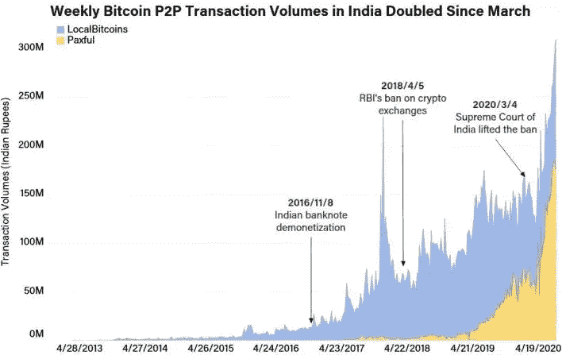
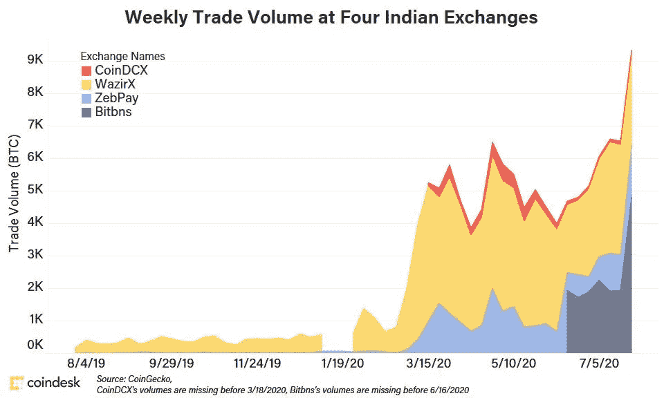
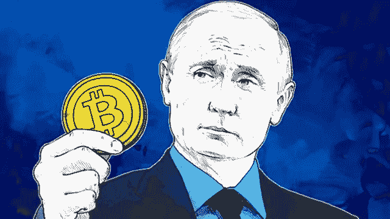
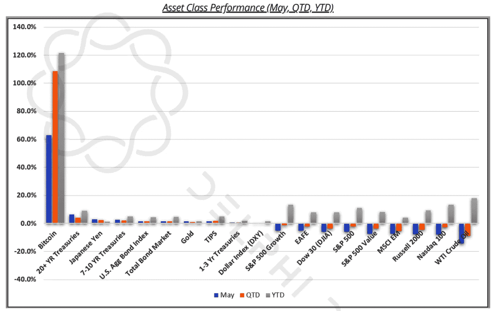

# 印度和俄罗斯放松对加密的限制

> 原文：<https://medium.datadriveninvestor.com/india-and-russia-ease-up-on-crypto-973094bb0664?source=collection_archive---------22----------------------->

# 印度

印度的 P2P 交易量在 7 月份达到了历史最高水平。从图表中我们可以看出，印度人的兴趣在他们的货币停止流通后开始高涨。在此期间，印度人民开始寻找不受任何政府或机构控制的替代资产。

他们的旧钞票开始失去价值，比特币作为一种遵循自由市场原则的去中心化资产，变得有吸引力。在去货币化后的 18 天内，比特币的价格从 757 美元上涨到 1020 美元，而美国的价格却停滞不前。当时，考虑到去货币化和可能的黄金禁令，比特币是一种安全的投资。

当 2018 年印度储备银行(RBI)规定金融机构与加密交易所合作是非法的时，印度的加密市场放缓。3 月 1 日，这些限制被取消，向公众开放了大门。

这张图表显示了禁令取消后，印度交易所的市场参与度有所提高。我们看到印度人民继续从政府控制的货币中寻找避风港。他们非常清楚黄金可以被没收，因此比特币可以成为他们需要的不可触摸的资产。

# **俄罗斯**

俄罗斯一直热衷于这项技术，但不热衷于加密。他们试图利用技术来加强中央集权和对员工的控制。像中国一样，他们很难通过集中交易购买密码。他们有着相同的观点:区块链很棒，但加密货币是犯罪。

俄罗斯最近改变了他们对本国加密市场的控制水平。虽然仍然受到严格监管，但从 2021 年 1 月 1 日开始，crypto 将可以合法开采，在交易所用加密货币交易其他加密货币，并拥有加密货币而不发行。密码**将不会被允许用于商品和服务的交易。这将有助于他们控制自己的货币和购买活动。**

俄罗斯银行将被允许开放加密货币交易所，并发行新的加密货币，当然，所有这些都是在央行的监督下进行的。

# 价值储存手段

加密货币和分散金融(DeFi)生态系统是反脆弱的。天性坚韧，并受到激励尽可能做到最好。世界各国政府继续试图压制该系统，但没有成功。这总是被那些寻求摆脱现状的人们的大量采用所抵制。像俄罗斯和印度这样的例子在世界各地都可以看到，在那里，他们不是打击创新，而是与创新同行。随着越来越多的人加入进来，我们可以开始看到政府首先试图控制它，然后全力支持。

 [## 为什么参与正确的加密交换至关重要|数据驱动型投资者

### 到目前为止，与黄金和美元相比，加密货币，尤其是比特币，已经显示出巨大的增长

www.datadriveninvestor.com](https://www.datadriveninvestor.com/2020/07/16/why-engaging-with-right-crypto-exchange-matters/) 

在美国，采用继续发生在中央集权的世界。8 月 11 日，MicroStrategy 宣布将收购 **21，454 比特币**，他们称之为“资本分配策略”该公司声明，

> “投资加密货币不仅能提供合理的通胀对冲，还能获得比其他投资更高的回报。”

是时候改变对加密货币的看法了。是的，它们是投机资产，但这并不意味着它不提供价值。技术背后的价值，在人们了解它的能力之前，他们不应该立即放弃它。加密仍然是性能最好的资产，随着人们从中找到安全保障，它将继续繁荣发展。

**访问专家视图—** [**订阅 DDI 英特尔**](https://datadriveninvestor.com/ddi-intel)