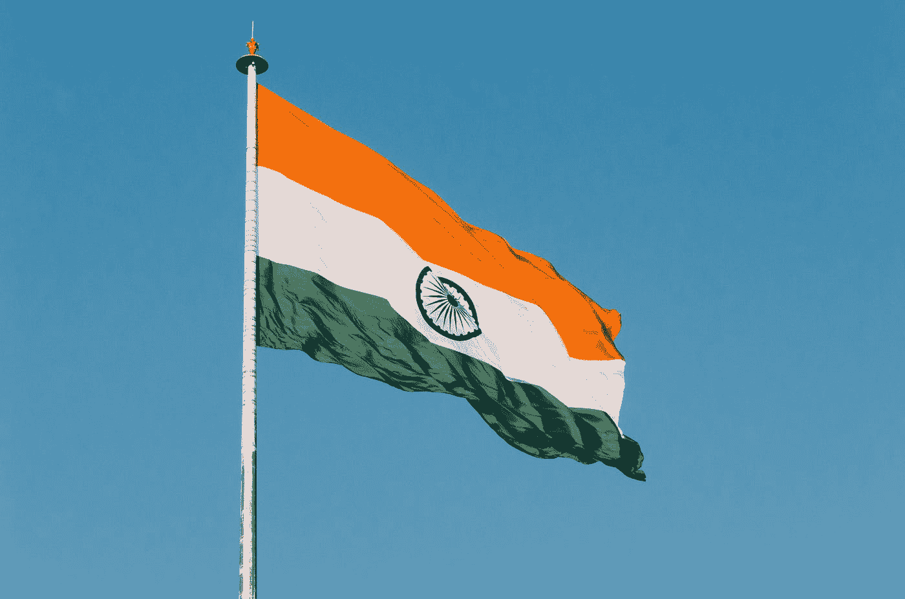
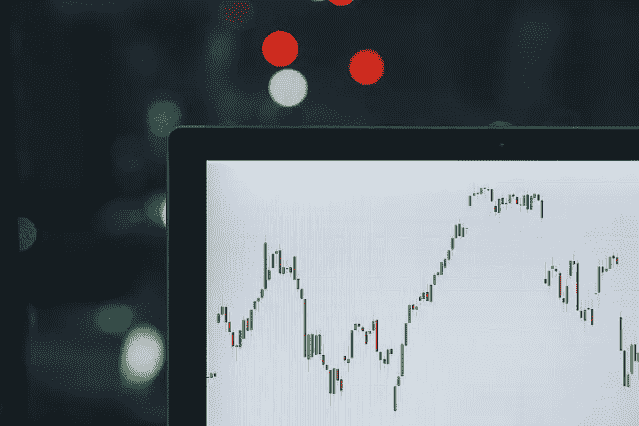
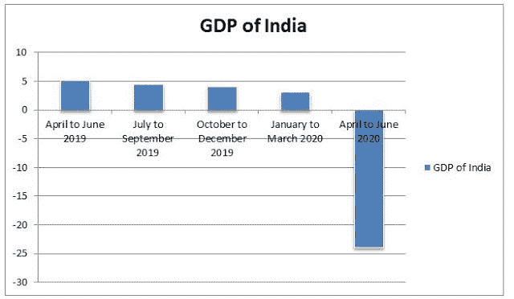
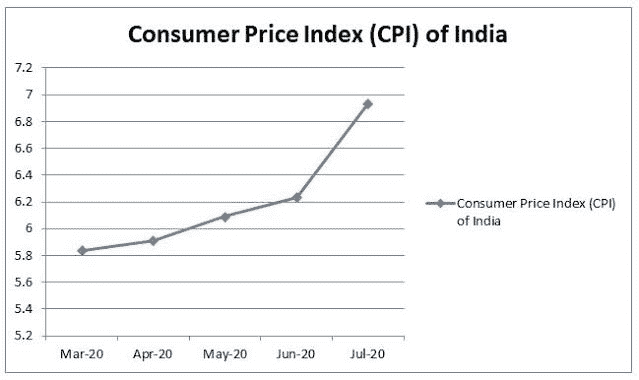
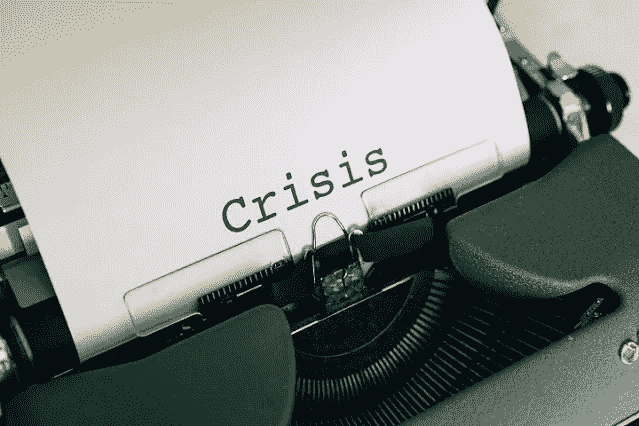

# 印度在衰退中面临通货膨胀？

> 原文：<https://medium.datadriveninvestor.com/india-is-facing-inflation-at-recession-89e5d915508a?source=collection_archive---------24----------------------->

*通货膨胀率为 6.93%，即使国内生产总值达到创纪录的-23.9%*

T2 印度是一个第三世界国家。它不拥有全球其他国家所拥有的资金或资源。然后印度经济在过去蓬勃发展，目前是世界前 6 大经济体。世界期望印度经济在半个世纪或更短的时间内成为世界前三大经济体。

新冠肺炎在 2019 年底出现，并像野火一样蔓延到全球。它不仅影响了发展中国家，也影响了发达国家。许多国家已经实施封锁以阻止病毒的传播，但它已经显示出对这些国家的经济活动的不利影响。

印度实施的限制也显示了同样的效果。很少有人被允许旅行或工作。结果，需求合同和那些没有足够劳动力输出的企业也出现萎缩。所有这些活动构成了经济衰退的闲置处方，这一点已被国内生产总值数据证实为-23.9%

作为一名经济学家，我预料到了。正如我在早先的[博客](https://medium.com/@onkarjadhavv/covid-19-the-world-economy-8a19a959440f)中所说，我预计印度经济将会下降 10%到 15%以上。但据推测，我并不认为这是一个重大因素，这个因素被称为“通货膨胀”。

在前新冠肺炎时代，印度经济就面临着通货膨胀。我预计冠状病毒的减速可能无法掩盖它，但至少会产生相当大的影响。现在的问题是，印度 GDP 在下降，而通胀却在上升。大家讨论一下。

(本博客分享的数据是我自己研究收集的。我收集了孟买和孟买郊区的数据。我从 50 个家庭、7 个零售商、2 个批发商和 5 个办公室收集了数据。我花了几个月的时间来收集和处理数据)

在开始之前，让我们先试着理解什么是衰退。

# 衰退定义

*“暂时的经济衰退时期，在此期间贸易和工业活动减少，通常表现为连续两个季度的国内生产总值下降。”*

简单来说，衰退是指一个经济体在一段时间内的经济活动减少，而这段时间决定了衰退的严重程度。

我们通常不认为一个经济体会减缓衰退，直到它连续 6 个月持续衰退。

——[www.Tradingeconomics.com](http://www.Tradingeconomics.com)

从上图中可以看出，印度经济面临衰退已经超过一年了。因此，我们可以得出结论，印度经济正处于衰退之中。

理论上，当一个经济体经历衰退时，商品和服务的价格会下降。有不同的因素，但主要原因是市场需求低。由于需求减少，供应商降低价格来吸引更多的顾客。

在当前的经济形势下，印度的通货膨胀率正在上升。

Tradingeconomics.com

CPI 指数显示，即使在新德里实施全国封锁后，通货膨胀仍在持续上升。现在让我们讨论一下印度在经济衰退时是如何面对通货膨胀的。

# 1.抢购——

需求决定商品和服务的价格。需求增加会导致商品和服务价格上涨，反之亦然。在当前的封锁形势下，许多印度家庭进入了抢购模式，购买了比平时更多的商品。这导致需求突然激增。

发生这种情况是因为对封锁的实际时间框架了解较少。我接触过的 50 个家庭中，有 50 个对封锁一无所知或知之甚少。这些家庭中没有人经历过这种程度的禁闭。

50 个家庭中有 48 个购买了足够他们一个多月的食品杂货，48 个家庭中有 10 个购买了超过四分之一的食品杂货。由于封锁，餐馆和商店关门，因此家庭购买了他们通常不购买或购买量较少的商品。

这种抢购给了供应商信心，人们会以任何价格大量购买这些商品。因此，商品价格没有下降。由于劳动力和车辆的减少，有限的供应已经升值。

# 2.封锁的不确定性-

当我与批发商交谈时，他们预计封锁将在第一个月或即将到来的月份结束，因此他们拒绝降低价格。新德里对全国实施封锁，通常在当前封锁结束前几天通知延长封锁。

在这种情况下，批发商的眼光非常有限，即最多一个月，需求没有减少，批发商没有理由降价。

# 3.坚持——

印度经济已经面临衰退一年多了；如此多的企业已经处于亏损状态。当我与在办公室工作的人交谈时，他们接受了这样的观点:如果商品不是易腐的，那么除了少量出售之外，他们喜欢持有资产，在价格较高时出售。

我们用一个例子来理解。

在孟买的纳胡尔，在新冠肺炎时代之前，1BHK 公寓的平均价格约为 1 亿卢比(136，022 美元)，但即使在经济衰退之后，同样商品的平均价格也在 950 万卢比(129，220 美元)左右

这一降幅非常低，尤其是当建筑业是该国受影响最严重的行业，预计收入将下降 15%至 20%

这只是一个行业，很多行业都在发生同样的事情。

印度经济的进口大于出口。在进口中，清单包括许多必需品以及原材料等。当进口开始暴跌时，这些商品的数量也会减少，这给国内制造的商品带来了额外的压力。

必要的原材料供应也受到限制的影响，这也导致产出收缩。当印度和中国之间的紧张局势开始出现时，这种情况更加严重。

新德里对许多中国制造的商品施加了限制。所有这些都会影响市场上的数量，并最终影响商品的价格。

CPI 由超过 70%的消费品组成，衰退对其他行业的影响比这些行业更大，因此 CPI 没有下降。

这是少数几个因素。可能还有更多，但我提到了几个。

# 结论

冠状病毒衰退是一种完全新型的衰退。这将需要一种新的技术来对抗衰退。我觉得这次衰退的影响被当前的世界形势放大了。

我觉得印度政府采取的措施可能还不够，需要更多创新的方法来应对。印度经济的不同部门受到了不同的影响，需要一种独特的方式来应对。我希望印度政府能提出一个新的策略来对抗经济衰退。

*原载于 2020 年 10 月 6 日*[*【https://onkarjadhavv.blogspot.com】*](https://onkarjadhavv.blogspot.com/2020/10/india-is-facing-inflation-at-recession.html)*。*