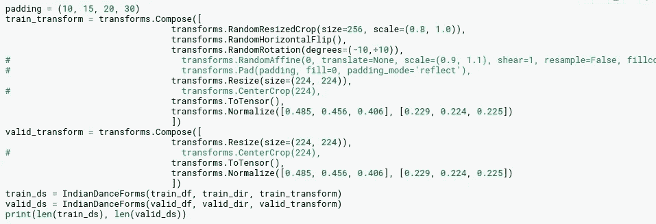

# 印度舞蹈形式(黑客地球)-使用迁移学习和 Pytorch 调谐的图像分类

> 原文：<https://medium.datadriveninvestor.com/indian-dance-forms-hacker-earth-image-classification-using-transfer-learning-and-tuning-with-b6cbe7a0fc78?source=collection_archive---------5----------------------->

这个故事将解释如何使用 pytorch 以较少的数据量提高图像分类。

我想解释一下我是如何在由[hackere earth](https://medium.com/u/32ad5f537fbc?source=post_page-----b6cbe7a0fc78--------------------------------)主办的比赛中一步步登上排行榜榜首的。我要感谢他们的数据集和比赛。

Hacker Earth — [Source](https://www.hackerearth.com/challenges/competitive/hackerearth-deep-learning-challenge-identify-dance-form/)

我是先看排行榜开始比赛的。令人惊讶的是，我看到了 100/100 分的人。我的第一个结论是数据集将会非常小。人们想出了弊端，或者可能正在为自己创建一个适当的验证数据(后来我使用了同样的技术)。

## 问题陈述:

Hacker Earth — [Source](https://www.hackerearth.com/challenges/competitive/hackerearth-deep-learning-challenge-identify-dance-form/machine-learning/identify-the-dance-form-deea77f8/)

火车目录中有一组不同的`Indian Dance forms`的`364 images`，并附有一个包含图像 id 和图像标签的`.csv` 文件。测试目录中还有`157 images`和一个 csv 文件。我们的提交文件应该和`imageid`和他们的`labels`在一起。这些类别描述如下。

 [## 机器学习和 NLP 能预测石油的崩溃吗？答案是肯定的。|数据驱动…

### 2020 年 4 月 20 日，WTI 原油期货(美国原油基准)历史上首次达到负…

www.datadriveninvestor.com](https://www.datadriveninvestor.com/2020/05/04/could-machine-learning-and-nlp-have-predicted-oils-crash-the-answer-is-yes/) 

## 第一想法:

1.  图像分类问题的少量数据。
2.  我不得不在这么小的范围内使用迁移学习。(寻找最佳预训练模型)
3.  必须使用数据增强技术。
4.  可以尝试各种提高精度的方法。

让我们来看一下我最后一个笔记本的每一步，我会试着解释我是如何一步一步地到达那里的。

> 如果你想跳过这个博客看笔记本，就去查看我的 Github。

## 加载数据

在这里，图像可以在一个名为 train 的文件夹中找到，它的标签和图像名称一起放在一个 csv 文件中。我已经提到过你的数据扩充。因此，当加载数据集用于训练或测试或任何处理(如比较图像、查看增强图像等)时，可以通过使用`Pytorch`创建自定义数据集来调用。

下面我将向你展示它是如何做到的？

Generated By Author

这里我们通过扩展 Pytorch 数据集类来定义一个自定义数据集。让我们看看如何使用 Pytorch 数据集类。

在 Pytorch 数据集中，你必须覆盖两个子类函数。

*   `__len__`:函数返回数据集的大小。
*   `__getitem__`:函数返回给定索引的数据，我们也可以添加转换(动态数据扩充，这样每当通过类加载每个图像时，它将转换它并返回。

Generated By Author

我们得到一个输出`364 156`。它表示训练和测试数据的计数。这里我们描述 pytorch 中不同的转换技术，这些技术可以用作数据扩充。例如`RandomHorizontalFlip()`将水平翻转图像。您可以查看各种转换并选择最适合您的转换。在处检查[转换](https://pytorch.org/docs/stable/torchvision/transforms.html)和[。](https://pytorch.org/docs/stable/torchvision/transforms.html)

现在`train_ds`和`valid_ds`可以用来调用我们的数据集。我们有了数据集，现在我们需要为我前面提到的每个案例批量加载数据。对训练、测试、预处理、比较等。为此我们使用`Dataloader`类。在 Dataloader 类中，我们可以指定`batch size, shuffle, workers etc.`作为参数。

Generated By Author

Generated By Author

这里我还使用了一个`show_batch`函数来显示转换后的图片，这样我就可以更容易地比较各种转换。

> 创建了数据集，创建了数据加载器，接下来呢？

我们需要创建模型。

但是在创建模型之前，让我们编写一些用于训练和验证的函数。

Generated By Author

这里我们通过 nn.Module 创建了一个名为`MulticlassClassifierBase`的类。

*   `training_step`:此取一批图像和标签- >用模型预测- >用给定的损失函数计算损失- >求精度- >返回 acc 和 loss。
*   `validation_step`:同上。
*   `validation_epoch_ends`和`epoch_end`用于计算和叠加每批和每个时期后的损失和精度。

现在我们可以创建一个模型。

这里我们通过扩展`MulticlassClassifierBase`类来创建一个模型。

在这里，您可以看到有 4 个函数是准确的，并且该类是从 MuliclassClassifierBase 派生的。我用`wide_resnet50_2.`创建了迁移学习模型，当我阅读博客时，我总是怀疑人们如何知道从哪个预先训练的模型中选择。我能说的是了解每个型号，例如 Resnet 是`residual networks`，它们很小。对于较小的数据集，这可能不会过拟合。除此之外，我尝试了几乎所有的预训练模型，并最终在这里得出结论。我`removed`最后一层加了一个`sequential layer`。有`Linear`、`Dropout`和`LogSoftmax`三层。这有利于多类图像分类器。然后是`forward`函数，当我们对模型进行处理时，它会将每批数据发送到网络并返回输出。

然后是`freeze`和`unfreeze`功能，用于冻结除最后一个连续层(微调)之外的所有层进行训练。解冻使所有层可训练(但这在我的例子中太多了)。

因此，我们创建了我们的模型。现在，如果你想使用 GPU，你可以加载你的数据和模型到 GPU。在我的`notebook`中有描述，但我不打算在这里描述。

> 就像我之前说的，因为数据集很小，所以我也做了些手脚。我为提交数据创建了准确的测试标签，并使用它进行验证，并使用整个训练数据进行训练。这其实对我帮助很大。

我们都做了些什么？

*   我们使用数据集类创建了数据集
*   使用 torch Dataloader 加载了数据以及增强数据
*   创建了带有训练和验证步骤的分类器类。
*   已创建模型。

现在，我们需要拟合和评估，并可视化的结果。

Generated By Author

这里我们创建 evaluate 函数，将模型置于评估模式，并将模型和 valid_loader 作为输入，并调用`validation_epoch_ends`函数返回一批数据的损失和准确性。

Generated By Author

上图显示了给出定义变量的模型拟合函数。使用具有定义的学习率和权重衰减的优化器函数。和学习速率调度器(后来我删除了它，因为它对我的情况没有太大用处)。然后，我们以训练加载器作为输入开始每个时期，并将模型置于训练模式。使用`training_step`我们得到模型预测的精度和损失，使用`loss.backward`我们得到梯度。我们使用 optimizer 针对给定的损失优化模型的权重。

在这里，如果你想你也可以使用调度学习率，这有助于更大的方式有时。它所做的就像这里提到的`ReduceLROnPlateau`一样，当分数没有变化时，它减少`lr`。结果是更多的优化。这里我还使用了防止爆炸和渐变消失的`gradient_clipping`。这导致每个梯度具有大于阈值的范数。

Generated By Author

这是模型拟合功能的延续。这里我使用了 3 种技术。

*   因为我已经将提交数据集作为我的验证数据集。我将准确性作为一个标准，每次都以最佳准确性保存模型。
*   每当验证损失较少时，我也使用相同的技术来保存模型。从而只保存最一般化的数据。
*   提前停车。如果作为参数提及的周期数没有改善。它会停止训练。

优点:我可以给我喜欢的纪元大小。如果没有改进，它将停止运行，只保存好的模型。

Generated By Author

这里没什么东西。我定义参数并开始训练，然后等待它结束。

## `Visualizing Training`

Generated By Author

这让你知道你的训练时间。因为我没有使用`learning rate scheduler`，否则你可能已经看到了 lr 的变化。

现在怎么办？

## 预测和提交

Generated By Author

在这里，我们做同样的事情，创建测试数据集、测试数据加载器、预测并将其转换为所需的 csv 格式。

Generated By Author

`Point to Note`:为了获得预期的准确性，您必须对验证数据集和测试数据集进行任何转换或数据扩充。

如何提高准确率？

*   我尝试了不同的预训练模型。如果你找到了最好的一个与适当的图像处理，你会得到很好的准确性。
*   我选择的预训练模型来自 ImageNet 竞赛。所以我选择了这样的标准化。(你可以在数据扩充部分看到)。
*   适当的数据建议
*   学习率调度程序
*   渐变剪辑
*   提前停止
*   保存验证损失分数最低的最佳一般化模型。
*   获取适当的验证集。
*   添加更多数据
*   选择正确的优化器。
*   选择正确的损失函数。
*   其他超参数。
*   冻结和解冻模型。
*   选择正确的激活层，辍学和正规化。

还有更多..

[此处为代码检查](https://github.com/raoofnaushad/IndianDanceForms)。

> 如果我犯了错误请纠正我，如果内容对你有帮助请鼓掌感谢我。非常感谢你的时间。事业有成，生活美满。

Follow me to read tech simplified contents

> *帮我接通*[*linkedIn*](https://www.linkedin.com/in/raoof-naushad-378432106/)*|*[*Github*](https://github.com/raoofnaushad)*。让我知道评论*

**访问专家视图—** [**订阅 DDI 英特尔**](https://datadriveninvestor.com/ddi-intel)